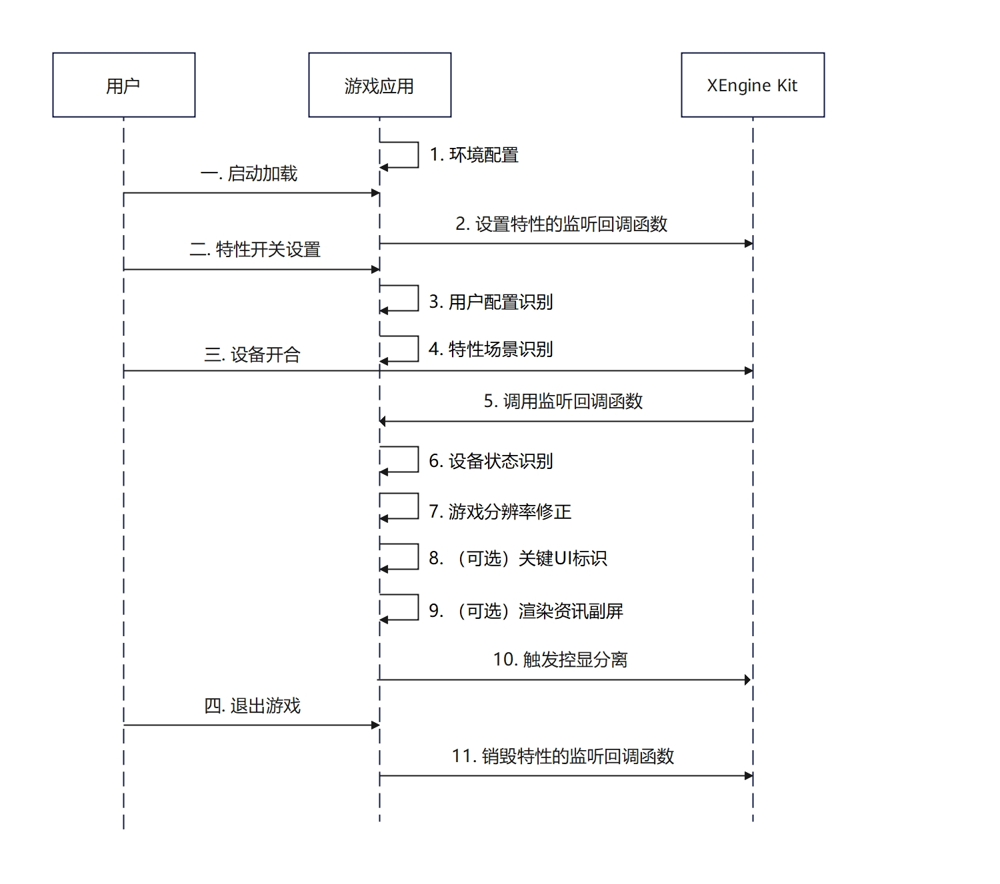

# 控显分离

更新时间：2026-07-28 11:23:46

来源：https://developer.huawei.com/consumer/cn/doc/harmonyos-guides/xengine-kit-control-display-separation

从API版本26.0.0开始，新增控显分离特性。

XEngine Kit针对折叠屏设备推出“控显分离”创新方案。在设备展开态下，该方案通过将屏幕划分为两个对称的独立区域，深度还原复古掌机的交互逻辑：上半屏承载核心渲染画面，下半屏集中交互触控。


#### 约束与限制

 - 支持的设备类型：仅支持部分折叠屏设备。
 - 可通过以下方式查询相关扩展特性是否支持：

  目前仅支持基于Vulkan API开发的游戏，使用[HMS_XEG_SetControlDisplaySeparationStatusListener](https://developer.huawei.com/consumer/cn/doc/harmonyos-references/xengine-kit-xengine#hms_xeg_setcontroldisplayseparationstatuslistener)接口进行查询，若函数返回结果为true，则表示当前硬件系统支持该特性，游戏侧可显式展示特性开关并允许启用该特性，若返回false，则表示不支持，游戏侧须隐藏该特性开关并禁止启用该特性。


#### 接口说明

以下接口为使用控显分离特性需要使用的接口，关于这些接口的详细说明见[接口文档](https://developer.huawei.com/consumer/cn/doc/harmonyos-references/xengine-kit-xengine)。

| 接口名 | 描述 |
| --- | --- |
| bool HMS_XEG_SetControlDisplaySeparationStatusListener(PFN_HMS_XEG_ControlDisplaySeparationStatusCallback callback) | 设置控显分离特性全局唯一监听函数。 |
| void HMS_XEG_RemoveControlDisplaySeparationStatusListener() | 移除控显分离特性全局唯一监听函数。 |
| bool HMS_XEG_SetControlDisplaySeparationActive(bool flag) | 设置控显分离特性使能开关。 |


#### 业务流程




1. 环境配置：游戏应用需首先在module.json5配置文件中声明控显分离特性，以启用系统级的适配能力。
2. 设置特性的监听回调函数：用户点击启动游戏后，应用调用[HMS_XEG_SetControlDisplaySeparationStatusListener](https://developer.huawei.com/consumer/cn/doc/harmonyos-references/xengine-kit-xengine#hms_xeg_setcontroldisplayseparationstatuslistener)设置控显分离特性监听函数，返回值为true时，展示特性开关；否则不展示特性开关。
3. 用户配置识别：用户可以选择打开或关闭特性开关，当用户打开特性开关时，游戏应用将用户配置开关设置（isFeatureOn）为true；当用户关闭特性开关时，游戏应用将用户配置开关设置为false。
4. 特性场景识别：游戏应用识别当前游戏场景，根据识别结果，开发者可自行配置场景配置开关（isActive）为true或false。
5. 调用监听回调函数：用户可以选择打开或折叠设备，当用户选择折叠或打开设备，XEngine Kit调用监听回调函数通知游戏应用。
6. 设备状态识别：游戏应用根据回调函数的入参设置设备状态（status）。
7. 游戏分辨率修正：当用户配置开关（isFeatureOn）为true、场景配置开关（isActive）为true并且设备状态（status）为AVAILABLE时，控显分离特性使能，游戏应用将游戏分辨率的高度修改为原来的一半，否则游戏分辨率的高度和折叠屏展开态的高度保持一致。
8. （可选）关键UI标识：当控显分离特性使能时，XEngine Kit默认将游戏主画面布局在上半屏，其余UI布局（例如：操作按键）在下半屏。若需将特定UI置于上半屏显示，需对其进行关键标记，详见开发步骤7。
9. （可选）渲染资讯副屏：游戏应用如果想在控显分离特性使能时，在下半屏额外渲染其他内容，则直接在当前场景下渲染即可。
10. 触发控显分离特性：当用户配置开关（isFeatureOn）为true、场景配置开关（isActive）为true并且设备状态（status）为AVAILABLE时，游戏应用调用[HMS_XEG_SetControlDisplaySeparationActive(true)](https://developer.huawei.com/consumer/cn/doc/harmonyos-references/xengine-kit-xengine#hms_xeg_setcontroldisplayseparationactive)设置开启控显分离；否则游戏应用调用[HMS_XEG_SetControlDisplaySeparationActive(false)](https://developer.huawei.com/consumer/cn/doc/harmonyos-references/xengine-kit-xengine#hms_xeg_setcontroldisplayseparationactive)设置关闭控显分离。
11. 销毁特性的监听回调函数：当用户退出应用或不再使用该功能时，调用[HMS_XEG_RemoveControlDisplaySeparationStatusListener](https://developer.huawei.com/consumer/cn/doc/harmonyos-references/xengine-kit-xengine#hms_xeg_removecontroldisplayseparationstatuslistener)注销监听，释放相关资源。


#### 开发步骤

本章以在Vulkan应用程序中集成为例，说明XEngine Kit集成操作过程。


#### 配置项目

编译HAP包时，Native层so编译需要依赖NDK中的libxengine.so。

 - 头文件引用

  
```text
#include "xengine/xeg_control_display_separation.h"
```

 - 编写CMakeLists.txt

  CMakeLists.txt部分示例代码如下：

  
```text
find_library(
    # 设置路径变量的名称。
    xengine-lib
    # 指定希望CMake定位的NDK库的名称。
    xengine
)

target_link_libraries(nativerender PUBLIC
    # ...
    ${xengine-lib}
)
```


#### 集成XEngine控显分离特性（Vulkan）

使用Vulkan图形API搭建图像渲染管线，并集成控显分离代码需要在Native层实现，渲染结果通过[XComponent](https://developer.huawei.com/consumer/cn/doc/harmonyos-references/ts-basic-components-xcomponent)组件显示到屏幕。
1. 在调用XEngine Kit的控显分离能力前，开发者须首先在游戏应用的module.json5配置文件中声明该特性。详细配置方案参考[module.json5配置metadata字段](https://gitcode.com/HarmonyOS_Samples/adaptive-buffer-resolution-samplecode-clientdemo-cpp/blob/master/entry/src/main/module.json5)。

  
```json
"metadata": [
  {
    "name": "XEngineKit_ControlDisplaySeparation",
    "value": "true"
  }
],
```

2. 初始化控显分离所需的控制变量。

  
```text
// 当前硬件系统是否支持该特性
static bool isSystemSupport = false;
// 设备状态，用于描述当前状态是否允许启用该特性（例如折叠机展开态允许，折叠态不允许）
static XEG_ControlDisplaySeparationStatus status = XEG_ControlDisplaySeparationStatus::UNAVAILABLE;
// 用户配置开关，用于描述用户或者游戏本身是否打开该特性（目前默认打开，实际使用根据用户）
static bool isFeatureOn = false;
// 特性使能开关，用于描述当前场景是否使能控显分离（例如：游戏大厅场景不使能，游戏对局内使能）
static bool isActive = false;
```

3. 在游戏启动后，调用[HMS_XEG_SetControlDisplaySeparationStatusListener](https://developer.huawei.com/consumer/cn/doc/harmonyos-references/xengine-kit-xengine#hms_xeg_setcontroldisplayseparationstatuslistener)注册状态监听回调。根据接口本身的返回值（状态记录至isSystemSupport）确认当前硬件系统是否支持控显分离。若支持，XEngine Kit将实时监测设备屏幕的物理形态，并通过注册的回调函数返回当前状态是否允许启用该特性（例如：折叠屏展开态允许，折叠态不允许），状态记录至status。

  
```text
// 状态回调函数
void ControlDisplaySeparationHandler(XEG_ControlDisplaySeparationStatus controlDisplaySeparationStatus)
{
    status = controlDisplaySeparationStatus;
    // 刷新控显分离特性状态
    UpdateControlDisplaySeparation();
}

void setCallBack()
{
    // 注册控显分离状态监听，注册成功表示当前设备支持控显分离特性，否则不支持
    isSystemSupport = HMS_XEG_SetControlDisplaySeparationStatusListener(ControlDisplaySeparationHandler);
}
```

4. 特性开关设置：游戏应用可以在用户点击设置页面时，如果设备支持该特性，则可以提供特性开关选项。并将特性开关结果赋值给isFeatureOn。
5. 特性场景识别：当设备状态允许且用户已开启功能时，游戏应用需识别当前业务场景（如对局中）是否需触发该特性，状态记录至isActive。
6. 刷新控显分离特性状态：当status、isFeatureOn或isActive中任一状态发生变化时，需触发状态刷新逻辑。仅当status为AVAILABLE且isFeatureOn与isActive均为true时，应用需调用[HMS_XEG_SetControlDisplaySeparationActive](https://developer.huawei.com/consumer/cn/doc/harmonyos-references/xengine-kit-xengine#hms_xeg_setcontroldisplayseparationactive)以开启特性，此时系统将执行画面与UI的上下分离。开启后，游戏侧须将渲染分辨率设置为全屏高度的一半以确保画面正常显示。若需在上半屏保留特定UI或在下半屏渲染额外资讯，请分别参考步骤7与步骤8。

  
```text
void UpdateControlDisplaySeparation()
{
    // 需要开启控显分离
    if (isFeatureOn == true && status == XEG_ControlDisplaySeparationStatus::AVAILABLE && isActive == true) {
        if (HMS_XEG_SetControlDisplaySeparationActive(true)) {
            // 开启成功
            // 调用游戏引擎分辨率设置接口，将渲染分辨率的高度设为原来的一半
            // 关键UI标识（可选），标识后关键UI可以渲染到上半屏
            // 渲染额外的资讯副屏（可选）， 和其他UI在同一个render pass渲染即可
            updateResolution();
        } else {
            // 开启失败
            isActive = false;
        }
    } else {
        // 需要关闭控显分离
        if (HMS_XEG_SetControlDisplaySeparationActive(false)) {
            // 调用游戏引擎分辨率设置接口，将渲染分辨率的高度设为全屏高度
            updateResolution();
        } else {
            // 关闭失败，需要进一步定位原因。
        }
    }
}
```

7. 关键UI标识（可选）：控显分离特性默认将主画面渲染至上半屏，其余UI渲染至下半屏。若需将血条、角色名等特定UI保留在上半屏，须在特性开启时对其进行标识。开发者可采用模板值标记方案，通过预先为目标UI设置统一的标签，并在特性生效时，将这些UI对应的模板值设置为大于等于128，系统底层即可识别并将其渲染至上半屏。
8. 资讯副屏（可选）：在控显分离模式下，原本为避开中心画面而设计在屏幕两侧的UI布局，会导致下半屏中心区域出现大量空白。应用可利用该空间展示游戏计分板、实时战报等额外资讯内容以丰富交互体验。新增资讯内容的实现方式与常规UI一致，直接在当前场景下执行渲染即可。
9. 用户退出控显分离适用的游戏场景，则调用[HMS_XEG_RemoveControlDisplaySeparationStatusListener](https://developer.huawei.com/consumer/cn/doc/harmonyos-references/xengine-kit-xengine#hms_xeg_removecontroldisplayseparationstatuslistener)，取消控显分离注册监听。

  
```text
HMS_XEG_RemoveControlDisplaySeparationStatusListener();
```
