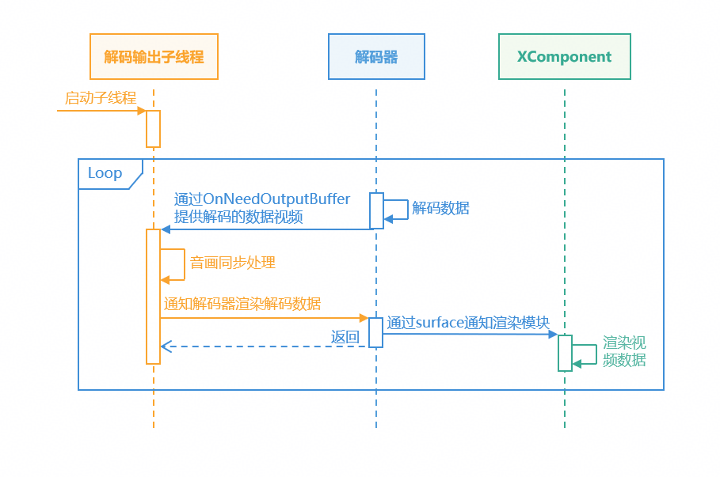
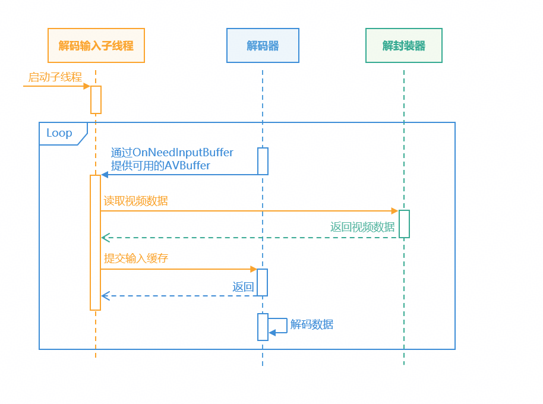
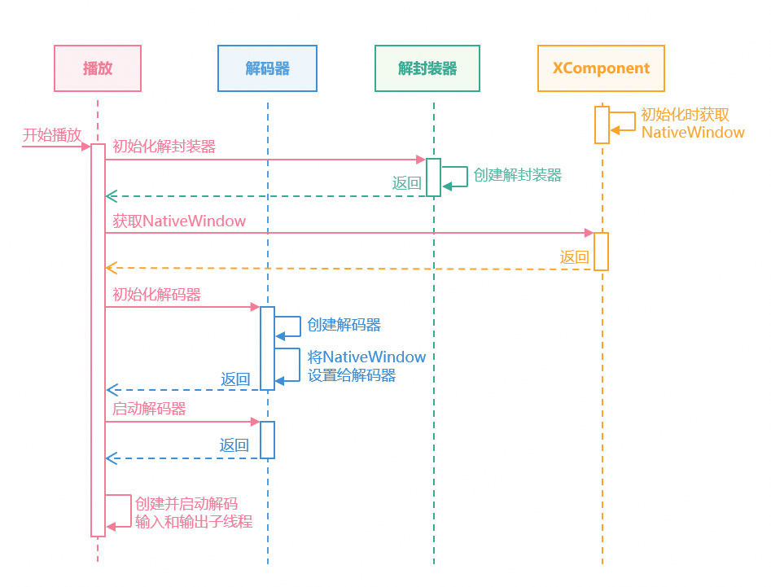
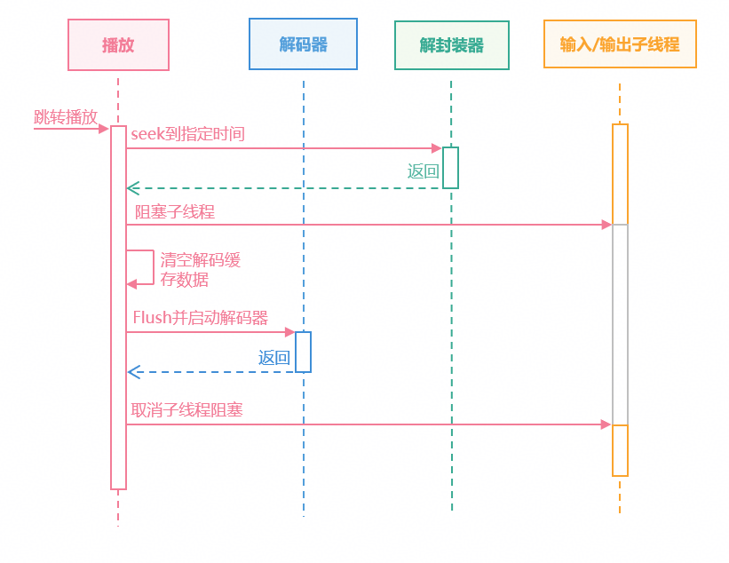
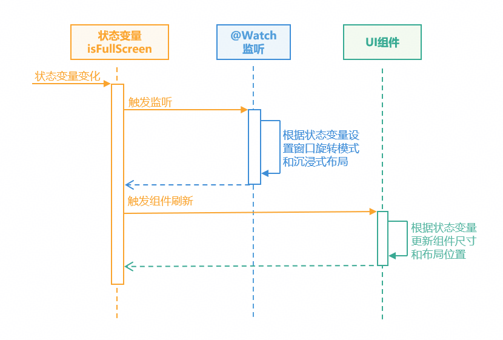
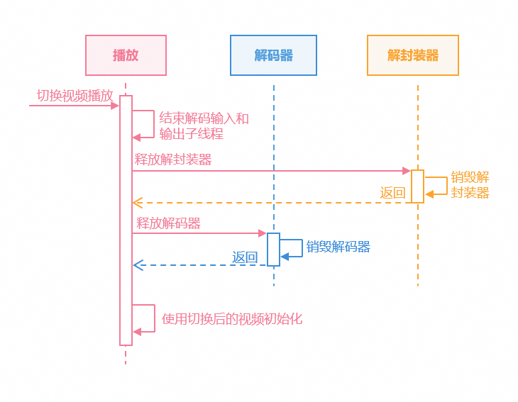

# Surface模式解码视频的播放控制

更新时间：2026-07-17 09:35:24

来源：https://developer.huawei.com/consumer/cn/doc/harmonyos-guides/video-decoding-play-remote

#### 概述

开发者在开发影视、会议和直播等应用时，通常需要使用视频解码能力实现高性能的播放和视频处理功能。
 
本文中视频播控功能采用[Surface模式](https://developer.huawei.com/consumer/cn/doc/harmonyos-guides/video-decoding#surface模式)解码能力实现，Surface模式是指在视频解码的过程中，用[NativeWindow](https://developer.huawei.com/consumer/cn/doc/harmonyos-references/capi-nativewindow)来传递输出数据，直接与XComponent组件对接，实现视频播放。与[Buffer模式](https://developer.huawei.com/consumer/cn/doc/harmonyos-guides/video-decoding#buffer模式)相比，开发者不需要处理解码后的视频数据与播放组件的对接。具体区别可参考[视频解码](https://developer.huawei.com/consumer/cn/doc/harmonyos-guides/video-decoding)。
 
在阅读本文之前，建议开发者先了解[音视频编解码](https://developer.huawei.com/consumer/cn/doc/harmonyos-guides/audio-video-codec)相关知识，同时建议IDE环境中的SDK版本不低于6.0.2(22)。
 
本文主要内容如下：
 
- [视频播放](#视频播放)：使用Surface模式解码视频并播放。
- [全屏播放](#全屏播放)：实现视频在设备上全屏播放。
- [暂停与继续播放](#暂停与继续播放)：暂停或者恢复视频播放。
- [跳转播放](#跳转播放)：视频在播放过程中跳转到其它进度播放。
- [循环播放](#循环播放)：循环播放同一个视频。
- [倍速播放](#倍速播放)：调整视频播放速度。
- [切换视频播放](#切换视频播放)：播放过程中切换其它视频播放。

 
  

#### 视频播放

  

#### 场景描述

视频解码播放是将视频文件内压缩的数据通过解码还原为可视的图像，并进行渲染显示。视频解码常用于高清播放和低延时播放，也是视频编辑播放（如添加滤镜、水印）、实时弹幕叠加以及高级色彩处理等操作的基础。相较于直接使用AVPlayer进行播放（可参考[基于AVPlayer基础播控实践](https://developer.huawei.com/consumer/cn/doc/best-practices/bpta-avplayer-basic-control)），解码播放支持更多的视频格式和画面处理能力。
 
  

#### 实现原理

Surface模式视频解码播放是通过调用系统AVCodec模块的能力实现的。通过解封装视频文件，解码视频和音频数据进行送显和播放，具体流程如下：
 1. 选择视频进行播放后，使用视频文件初始化解封装器。
2. 获取在XComponent初始化时OnSurfaceCreate回调中返回的NativeWindow。
3. 初始化解码器，设置NativeWindow等参数后启动解码器。
4. 创建解码输入和输出子线程，启动解码播放流程。

  


5. 输入子线程通过[OH_AVCodecCallback](https://developer.huawei.com/consumer/cn/doc/harmonyos-references/capi-codecbase-oh-avcodeccallback)中的OnNeedInputBuffer异步回调函数指针获取可用的AVBuffer后，从解封装器中读取视频数据提交给解码器；实现向解码器输入待解码的视频数据。

  


6. 解码输出子线程通过OnNeedOutputBuffer拿到解码后的帧数据，进行[音画同步](https://developer.huawei.com/consumer/cn/doc/harmonyos-guides/audio-video-synchronization)处理后，通知解码器在Surface上完成渲染。

  


 
  

#### 开发步骤
1. 创建解封装器、解码器等解码资源。

  
```text
int32_t Player::Init(SampleInfo &info)
{
    // ...
    // Create decode sources pointer.
    videoDecoder_ = std::make_unique<VideoDecoder>();
    audioDecoder_ = std::make_unique<AudioDecoder>();
    demuxer_ = std::make_unique<Demuxer>();

    // Create demuxer by video info.
    int32_t ret = demuxer_->Create(videoInfo_);
    CHECK_AND_RETURN_RET_LOG(ret == MEDIA_ERR_OK, ret, "Create demuxer failed");
    // Create and Configure audio ande video decoder.
    ret = CreateAudioDecoder();
    CHECK_AND_RETURN_RET_LOG(ret == MEDIA_ERR_OK, ret, "Create audio decoder failed");
    ret = CreateVideoDecoder();
    CHECK_AND_RETURN_RET_LOG(ret == MEDIA_ERR_OK, ret, "Create video decoder failed");
    // ...
}
```

2. 根据视频信息设置解码参数，以视频参数为例。

  
```text
int32_t Player::CreateVideoDecoder()
{
    // Create decoder by system mime.
    int32_t ret = videoDecoder_->Create(videoInfo_.videoInfo.videoCodecMime);
    CHECK_AND_RETURN_RET_LOG(ret == MEDIA_ERR_OK, MEDIA_ERR_ERROR, "Create video decoder failed, mime:%{public}s",
                             videoInfo_.videoInfo.videoCodecMime.c_str());
    videoDecContext_ = new CodecUserData;
    // Configure nativeWindow and video info to decoder.
    videoInfo_.videoInfo.window = XComponentManager::GetInstance()->nativeWindow_;
    ret = videoDecoder_->Config(videoInfo_, videoDecContext_);
    CHECK_AND_RETURN_RET_LOG(ret == MEDIA_ERR_OK, ret, "Video Decoder config failed");
    return MEDIA_ERR_OK;
}
```

3. 启动解码器，创建解码输入、输出子线程，开始解码视频。

  
```text
int32_t Player::Start()
{
    // ...
    if (videoDecContext_) {
        // Start the video decoder.
        ret = videoDecoder_->Start();
        CHECK_AND_RETURN_RET_LOG(ret == MEDIA_ERR_OK, ret, "Video Decoder start failed");
        // Set start state.
        isStarted_ = true;
        isPause_ = false;
        // Create video decode input and output sub thread.
        videoDecInputThread_ = std::make_unique<std::thread>(&Player::VideoDecInputThread, this);
        videoDecOutputThread_ = std::make_unique<std::thread>(&Player::VideoDecOutputThread, this);
        // ...
    }
    // ...
}
```

4. 输入子线程从解封装器读取数据，送入解码器进行解码。

  
```text
void Player::VideoDecInputThread()
{
    while (isDecoding_) {
        // ...
        // Get AVBuffer and maintain the queue.
        CodecBufferInfo bufferInfo = videoDecContext_->inputBufferInfoQueue.front();
        videoDecContext_->inputBufferInfoQueue.pop();
        videoDecContext_->inputFrameCount++;
        // ...
        // read sample from demuxer.
        int32_t ret = demuxer_->ReadSample(demuxer_->GetVideoTrackId(),
                                           reinterpret_cast<OH_AVBuffer *>(bufferInfo.buffer), bufferInfo.attr);
        CHECK_AND_BREAK_LOG(ret == MEDIA_ERR_OK, "ReadSample failed, thread out");
        // ...
        // push the buffer to the decoder.
        ret = videoDecoder_->PushInputBuffer(bufferInfo);
        CHECK_AND_BREAK_LOG(ret == MEDIA_ERR_OK, "Push data failed, thread out");
    }
    MEDIA_LOGI("VideoDecInputThread out.");
}
```

5. 输出子线程从解码器拿到解码后的帧数据，处理后进行送显。

  
```text
void Player::VideoDecOutputThread()
{
    videoInfo_.videoInfo.frameInterval = MICROSECOND / videoInfo_.videoInfo.frameRate;
    while (isDecoding_) {
        // ...

        CodecBufferInfo bufferInfo = GetBufferInfo();
        // ...
        // Notify the suface to render the data and release it.
        lastPushTime = std::chrono::system_clock::now();
        ret = videoDecoder_->RenderOutputBuffer(bufferInfo.bufferIndex, !dropFrame);
        CHECK_AND_BREAK_LOG(ret == MEDIA_ERR_OK, "Decoder output thread out");
    }
    // ...
}
```

6. 调用[OH_VideoDecoder_RenderOutputBufferAtTime()](https://developer.huawei.com/consumer/cn/doc/harmonyos-references/capi-native-avcodec-videodecoder-h#oh_videodecoder_renderoutputbufferattime)接口通知解码器在指定时间内完成在输出Surface上的渲染。

  
```text
int32_t VideoDecoder::RenderOutputBuffer(uint32_t bufferIndex, bool render)
{
    CHECK_AND_RETURN_RET_LOG(decoder_ != nullptr, MEDIA_ERR_ERROR, "Decoder is null");
    int32_t ret = MEDIA_ERR_OK;
    // Check if render.
    if (render) {
        // Get timestamp for render time.
        int64_t renderTimestamp = std::chrono::duration_cast<std::chrono::nanoseconds>(
            std::chrono::high_resolution_clock::now().time_since_epoch()).count();
        // Notify video decode to render by surface.
        ret = OH_VideoDecoder_RenderOutputBufferAtTime(decoder_, bufferIndex, renderTimestamp);
    } else {
        // Free buffer that does not need to be rendered.
        ret = OH_VideoDecoder_FreeOutputBuffer(decoder_, bufferIndex);
    }
    CHECK_AND_RETURN_RET_LOG(ret == AV_ERR_OK, MEDIA_ERR_ERROR, "Render output data failed, RET = %{public}d", ret);
    return MEDIA_ERR_OK;
}
```

 
  

#### 全屏播放

  

#### 场景描述

全屏播放是指在播放视频时，应用页面仅显示视频画面和控件，隐藏其它组件。视频通常会进入横屏状态显示，提供沉浸式播放体验。
 
  

#### 实现原理

全屏播放通过UI侧的能力实现，主要流程如下。
 1. 应用切换全屏状态后，更新相应的状态变量。
2. 该状态变量的@Watch监听方法，会根据当前状态，设置窗口旋转模式和沉浸式布局。
3. UI组件调整尺寸和位置，实现全屏页面布局。

  
> [!NOTE]
> 在Native侧可通过 OH_NativeWindow_NativeWindowSetScalingModeV2() 接口设置XComponent的画面渲染缩放模式，通过设置 OHScalingModeV2 参数可选择按视频比例缩放画面播放或拉伸缩放以匹配视频窗口大小。


  


 
  

#### 开发步骤
1. 定义全屏状态的状态变量，并绑定监听方法。

  
```text
// The horizontal full-screen playback state flag.
@Watch('fullScreenSet') @Link isFullScreen: boolean;
```

2. 状态变量变化后，绑定的监听方法会根据当前状态设置窗口属性。

  
```text
fullScreenSet() {
  // Change window orientation and layout when setting full screen.
  window.getLastWindow(this.getUIContext().getHostContext()).then((topWindow) => {
    topWindow.setPreferredOrientation(this.isFullScreen ?
      window.Orientation.AUTO_ROTATION_LANDSCAPE : window.Orientation.PORTRAIT).catch((error: BusinessError) => {
      hilog.error(DOMAIN, TAG, `Failed to setPreferredOrientation. Cause: ${error.code}, message: ${error.message}`);
    });
    topWindow.setWindowLayoutFullScreen(this.isFullScreen ? true : false).catch((error: BusinessError) => {
      hilog.error(DOMAIN, TAG,
        `Failed to setWindowLayoutFullScreen. Cause: ${error.code}, message: ${error.message}`);
    });
  }).catch((error: BusinessError) => {
    hilog.error(DOMAIN, TAG, `Failed to getLastWindow. Cause: ${error.code}, message: ${error.message}`);
  });
}
```

3. 以XComponent组件为例，组件高度会根据状态变量进行调整，实现全屏播放。

  
```text
XComponent({
  id: 'playerXC',
  type: XComponentType.SURFACE,
  libraryname: 'player'
})
  .width(WIDTH_SIZE)
  .height(this.isFullScreen ? NORMAL_SIZE : FULL_SIZE)
```

 
  

#### 暂停与继续播放

  

#### 场景描述

暂停和继续播放是视频播放中的常见场景。暂停播放会使视频画面停止变化，内部解码器会停止解码数据和渲染画面。继续播放则是恢复解码器的解码流程，视频继续播放。
 
  

#### 实现原理

暂停播放通过阻塞输入和输出子线程实现。阻塞后输入子线程停止提交数据到解码器，输出子线程停止向Surface提供视频帧数据，达到暂停播放的效果。继续播放则是取消输入和输出子线程的阻塞状态，从而恢复播放状态。
 



 
  

#### 开发步骤
1. 解码输入和输出子线程均会执行条件变量 wait 操作，并在该操作内部判断当前是否处于暂停状态。

  
```text
// Use condition to wait for decoder requests for data.
std::unique_lock<std::mutex> lock(videoDecContext_->inputMutex);
videoDecContext_->inputCond.wait(
    lock, [this]() { return !isPause_ && (!isStarted_ || !videoDecContext_->inputBufferInfoQueue.empty()); });
```

2. 暂停播放时应用会同步设置暂停状态，并停止音频播放。

  
```text
int32_t Player::Pause()
{
    CHECK_AND_RETURN_RET_LOG(isStarted_, MEDIA_ERR_ERROR, "player do not start!");
    // Set pause state.
    isPause_.store(true);
    // if the audio render, pause it.
    if (audioRenderer_) {
        OH_AudioRenderer_Pause(audioRenderer_);
    }
    return MEDIA_ERR_OK;
}
```

3. 继续播放会取消暂停状态，唤醒等待在条件变量上的子线程并继续播放音频。

  
```text
int32_t Player::Resume()
{
    CHECK_AND_RETURN_RET_LOG(isStarted_, MEDIA_ERR_ERROR, "player do not start!");
    isPause_.store(false); // Cancel the pause state.
    // Notify the thread to continue work.
    if (videoDecContext_) {
        videoDecContext_->inputCond.notify_all();
        videoDecContext_->outputCond.notify_all();
    }
    if (audioDecContext_) {
        audioDecContext_->inputCond.notify_all();
        audioDecContext_->outputCond.notify_all();
    }
    if (audioRenderer_) {
        OH_AudioRenderer_Start(audioRenderer_); // if need audio to play, continue.
    }
    return MEDIA_ERR_OK;
}
```

 
  

#### 跳转播放

  

#### 场景描述

跳转播放是指在视频连续播放的过程中，跳转到进度条上的其它位置进行播放。跳转过程中，解码器会清空当前缓存数据，并在跳转位置重新读取数据进行解码。
 
  

#### 实现原理

跳转播放通过解封装器的跳转功能实现，具体步骤如下。
 1. 使用解封装器的[OH_AVDemuxer_SeekToTime()](https://developer.huawei.com/consumer/cn/doc/harmonyos-references/capi-native-avdemuxer-h#oh_avdemuxer_seektotime)方法，跳转到指定时间的上一个关键帧。

  
> [!NOTE]
> 关键帧（I帧）：是视频编码中的重要组成部分，它是一个完整的图像帧，能够独立解码。除I帧外还有前向预测帧（P帧）和双向预测帧（B帧）。 前向预测帧（P帧）：依赖前面的I帧或P帧生成图像，存储的是与前一帧相比的变化量。 双向预测帧（B帧）：参考前后的I帧或P帧生成图形，存储的是与前一帧和后一帧的相比的变化量。

2. 阻塞解码输入和输出子线程，暂停解码。
3. 清空待送入解码器的数据和已解码完成待送显的数据。
4. 使用视频解码的[OH_VideoDecoder_Flush()](https://developer.huawei.com/consumer/cn/doc/harmonyos-references/capi-native-avcodec-videodecoder-h#oh_videodecoder_flush)方法和音频解码的[OH_AudioCodec_Flush()](https://developer.huawei.com/consumer/cn/doc/harmonyos-references/capi-native-avcodec-audiocodec-h#oh_audiocodec_flush)方法，清除编码器中的缓存的输入和输出数据。
5. 取消解码子线程的阻塞，在跳转位置重新解码播放。
 
> [!NOTE]
> 除跳转到指定时间的上一个关键帧外，也可以选择其它跳转模式（例如跳转到下一个关键帧），具体可参考 OH_AVSeekMode 。

 



 
  

#### 开发步骤
1. 解封装器seek到指定时间点的前一个关键帧。

  
```text
int32_t Demuxer::Seek(int64_t position)
{
    // Select video track.
    int32_t ret = OH_AVDemuxer_SelectTrackByID(demuxer_, videoTrackId_);
    CHECK_AND_RETURN_RET_LOG(ret == AV_ERR_OK, MEDIA_ERR_ERROR, "SelectTrackByID failed");
    MEDIA_LOGI("Seek to %{public}" PRId64, position);
    // Call the system function to seek to destination.
    ret = OH_AVDemuxer_SeekToTime(demuxer_, position, SEEK_MODE_PREVIOUS_SYNC);
    CHECK_AND_RETURN_RET_LOG(ret == AV_ERR_OK, MEDIA_ERR_ERROR, "Seek failed");
    return MEDIA_ERR_OK;
}
```

2. 刷新解码器，清空缓存，再进行解码播放。

  
```text
int32_t Player::Seek(int64_t desTime)
{
    isReadRenderTime_.store(false);
    // ...
    if (videoDecoder_) {
        // Flush decoder, clear cache.
        videoDecContext_->isFlushing.store(true);
        videoDecContext_->ClearQueue();
        ret = videoDecoder_->Flush(videoDecContext_);
        CHECK_AND_RETURN_RET_LOG(ret == MEDIA_ERR_OK, MEDIA_ERR_ERROR, "video seek video flush failed");
        videoDecContext_->isFlushing.store(false);
        // Restart the decoder.
        ret = videoDecoder_->Start();
        CHECK_AND_RETURN_RET_LOG(ret == MEDIA_ERR_OK, MEDIA_ERR_ERROR, "video seek start videoDecoder failed");
    }
    // ...
}
```

3. 视频解码器flush之后需要重新传入PPS/SPS，这里解封装器seek后读取的第一份数据包含了PPS/SPS信息，传入解码器即可。

  
```text
// read sample from demuxer.
int32_t ret = demuxer_->ReadSample(demuxer_->GetVideoTrackId(),
                                   reinterpret_cast<OH_AVBuffer *>(bufferInfo.buffer), bufferInfo.attr);
CHECK_AND_BREAK_LOG(ret == MEDIA_ERR_OK, "ReadSample failed, thread out");
// ...
// push the buffer to the decoder.
ret = videoDecoder_->PushInputBuffer(bufferInfo);
CHECK_AND_BREAK_LOG(ret == MEDIA_ERR_OK, "Push data failed, thread out");
```
  
> [!NOTE]
> PPS：图像参数集 (Picture Parameter Set)，包含了一帧或多帧图像的公共编码参数。 SPS：序列参数集 (Sequence Parameter Set)，包含了一整个视频序列的全局信息。这些信息在整个序列播放期间基本不变，解码器需要用它们来初始化

 
  

#### 循环播放

  

#### 场景描述

循环播放是指当前视频播放结束后重新回到视频开头播放，以达到连续播放同一视频的效果。
 
  

#### 实现原理

循环播放需要在视频播放到最后一帧后，继续从第一帧开始播放，具体流程如下。
 1. 当输入子线程从解封装器拿到的AVBuffer的[OH_AVCodecBufferFlags](https://developer.huawei.com/consumer/cn/doc/harmonyos-references/capi-native-avbuffer-info-h#oh_avcodecbufferflags)为AVCODEC_BUFFER_FLAGS_EOS，代表该buffer数据为结束帧。
2. 使用解封装器seek到首帧，即时间点为0的位置。
3. 从解封装器中拿到首帧数据，实现循环播放。
 


 
  

#### 开发步骤
1. 解码输入子线程从解封装器拿到视频结束帧后，seek到首帧进行解码。

  
```text
// read sample from demuxer.
int32_t ret = demuxer_->ReadSample(demuxer_->GetVideoTrackId(),
                                   reinterpret_cast<OH_AVBuffer *>(bufferInfo.buffer), bufferInfo.attr);
CHECK_AND_BREAK_LOG(ret == MEDIA_ERR_OK, "ReadSample failed, thread out");
// Check if the buffer flag include eos.
if (bufferInfo.attr.flags & AVCODEC_BUFFER_FLAGS_EOS) {
    while (!isAudioWaitSeek_.load()) {
        std::this_thread::sleep_for(std::chrono::microseconds(WAIT_TIME));
    }
    ret = demuxer_->Seek(0); // Seek to the first frame.
    CHECK_AND_BREAK_LOG(ret == MEDIA_ERR_OK, "Loop failed, thread out");
    // Read first frame data from demuxer.
    ret = demuxer_->ReadSample(demuxer_->GetVideoTrackId(), reinterpret_cast<OH_AVBuffer *>(bufferInfo.buffer),
                               bufferInfo.attr);
    CHECK_AND_BREAK_LOG(ret == MEDIA_ERR_OK, "ReadSample failed, thread out");
}
```

2. 拿到音频结束帧后，等待视频解码器解帧结束后，重新读取首帧数据。

  
```text
// Read sample from demuxer.
int32_t ret = demuxer_->ReadSample(demuxer_->GetAudioTrackId(),
                                   reinterpret_cast<OH_AVBuffer *>(bufferInfo.buffer), bufferInfo.attr);
CHECK_AND_BREAK_LOG(ret == MEDIA_ERR_OK, "ReadSample failed, thread out");
// Check if the buffer flag include eos.
while (bufferInfo.attr.flags & AVCODEC_BUFFER_FLAGS_EOS) {
    // Wait the video thread seek to first frame.
    std::unique_lock<std::mutex> lock(audioDecContext_->endMutex);
    isAudioWaitSeek_.store(true);
    audioDecContext_->endCond.wait(lock);
    int32_t ret = demuxer_->ReadSample(demuxer_->GetAudioTrackId(),
                                       reinterpret_cast<OH_AVBuffer *>(bufferInfo.buffer), bufferInfo.attr);
    CHECK_AND_BREAK_LOG(ret == MEDIA_ERR_OK, "ReadSample failed, thread out");
}
isAudioWaitSeek_.store(false);
```

 
  

#### 倍速播放

  

#### 场景描述

在解码播放逻辑中，倍速功能通常基于解码数据输出模块的渲染逻辑来实现。与直接使用播放器的倍速功能相比，基于底层解码的自定义方案支持更精细的速度控制（如0.1倍速微调），满足不同的应用场景。
 
  

#### 实现原理

先设置音频播放速度，音频帧渲染速度变化后，视频帧根据[音画同步](https://developer.huawei.com/consumer/cn/doc/harmonyos-guides/audio-video-synchronization)功能，进行同步追帧，实现倍速播放效果。
 


 
  

#### 开发步骤
1. 设置音频播放速度并通过赋值传递给视频解码模块。

  
```text
void Player::SetSpeed(float speed)
{
    // ...
    // Set audio play speed.
    OH_AudioRenderer_SetSpeed(audioRenderer_, speed);
    // Set speed value for sub thread.
    speed_ = speed;
    audioDecContext_->speed = speed;
}
```

2. 输出子线程通过音画同步功能进行追帧。可参考音画同步的[开发步骤](https://developer.huawei.com/consumer/cn/doc/harmonyos-guides/audio-video-synchronization#开发步骤)。

  
```text
// video buffer is too late, drop it
if (waitTimeUs < WAIT_TIME_US_THRESHOLD_WARNING) {
    dropFrame = true;
    MEDIA_LOGW("VD buffer is too late");
} else {
    MEDIA_LOGW("VD buffer is too early waitTimeUs: %{public}ld", waitTimeUs);
    // [0, ), render it with waitTimeUs, max 1s
    // [-40,0), render it
    if (waitTimeUs > WAIT_TIME_US_THRESHOLD) {
        waitTimeUs = WAIT_TIME_US_THRESHOLD;
    }
    // per frame render time reduced by 33ms
    if (waitTimeUs > videoInfo_.videoInfo.frameInterval + PER_SINK_TIME_THRESHOLD) {
        waitTimeUs = videoInfo_.videoInfo.frameInterval + PER_SINK_TIME_THRESHOLD;
        MEDIA_LOGW("VD buffer is too early and reduced 33ms, waitTimeUs: %{public}ld", waitTimeUs);
    }
}
if (waitTimeUs > 0) {
    std::this_thread::sleep_for(std::chrono::microseconds(waitTimeUs));
}
```

 
  

#### 切换视频播放

  

#### 场景描述

切换视频是视频播放场景中一种常见的交互方式。切换视频会结束当前视频的解码流程和播放，并使用切换后的视频进行解码播放。
 
  

#### 实现原理

切换视频播放需要先释放当前视频的解码资源，再使用切换后的视频重新初始化，具体如下。
 1. 设置结束状态，结束解码输入和输出子线程，停止当前视频的解码操作。
2. 释放当前视频的解码资源，包括解码器和解封装器。
3. 使用切换后的视频重新创建解码资源和解码子线程，具体请参考视频播放章节的[实现原理](#视频播放实现原理)。
 


 
  

#### 开发步骤
1. 释放当前视频的解码器、子线程等资源。

  
```text
void Player::Release()
{
    // ...
    // Notify the sub thread continue and over.
    if (videoDecContext_) {
        videoDecContext_->inputCond.notify_all();
        videoDecContext_->outputCond.notify_all();
    }
    // ...
    ReleaseThread();
    currentRenderTime_.store(0);
    
    if (audioRenderer_ != nullptr) {
        OH_AudioRenderer_Release(audioRenderer_);
        audioRenderer_ = nullptr;
    }
    // Release decode resoure.
    if (demuxer_ != nullptr) {
        demuxer_->Release();
        demuxer_.reset();
    }
    if (videoDecoder_ != nullptr) {
        videoDecoder_->Release();
        videoDecoder_.reset();
    }
    // ...
}
```

2. 释放完成后通过切换后的视频创建资源，详见视频播放章节的[开发步骤](#视频播放开发步骤)。
 
  

#### 示例代码

[基于Surface模式进行视频播放控制](https://gitcode.com/HarmonyOS_Samples/DecodePlayControl)
