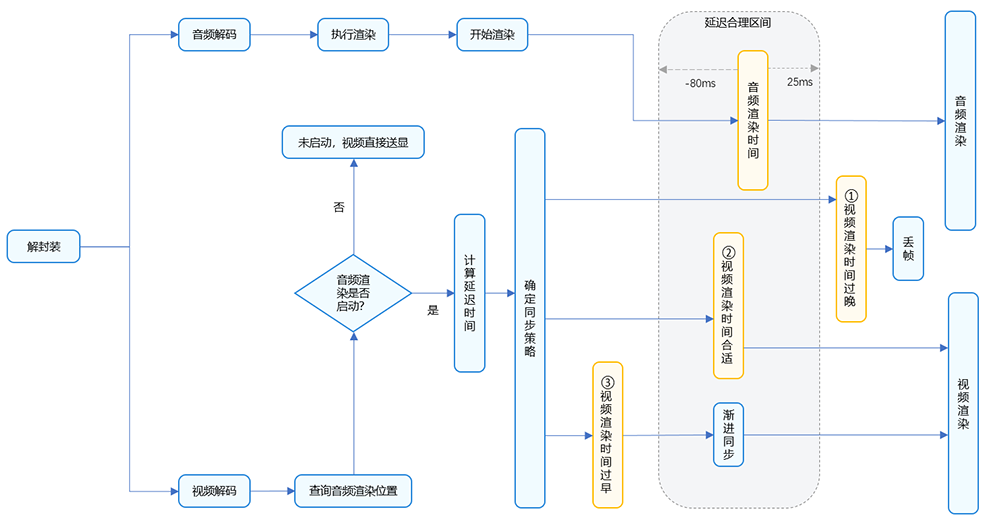

# 音画同步

更新时间：2026-06-12 06:54:11

来源：https://developer.huawei.com/consumer/cn/doc/harmonyos-guides/audio-video-synchronization

#### 概述

精确的音视频同步是媒体播放的关键体验之一。通常来说，在录制音频和视频时需要做到同步，并且录制后的视频在播放设备（例如手机、电视、媒体播放器）上播放时也需要做到同步。
 
根据当前HarmonyOS APP开发过程中遇到的音画同步业务场景，总结出如下两种典型场景：
 
- [本地视频的音画同步](#本地视频的音画同步)
- [网络视频的音画同步](#网络视频的音画同步)

 
从上述两种典型场景出发，本文旨在指导第三方视频播放应用正确获取并使用音频和视频相关信息来保证播放时的音视频同步。
 
> [!NOTE]
> 如果开发者使用自研播放器引擎而非AVPlayer，也可以参考该解决方案思路实现优化。

 
  

#### 实现原理

音视频数据的最小处理单元称为帧。音频流和视频流都被分割成帧，所有帧都被标记为需要按特定的时间戳显示。音频和视频可以独立下载和解码，具有匹配时间戳的音频和视频帧应同时呈现，以达到音画同步的效果。
 
  

#### 音画同步原理

- PTS（送显时间戳）指音视频数据在播放时应该显示给用户的时间戳。它表示解码后的音视频数据在播放时应该出现在屏幕上或传递给音视频输出设备的时间点。PTS用于控制音视频的播放顺序和时序，以确保音视频在正确的时间点进行显示或播放。
- DTS（解码时间戳）指音视频数据在解码器中开始解码的时间戳。它表示解码器应该从输入数据流中读取和解码的特定时间点。DTS用于控制解码器的解码顺序，确保音视频数据按照正确的顺序解码。

  
| 帧 | 解释 |
| --- | --- |
| I帧(I-frame) | 帧内编码帧（intra picture）或关键帧（key frame）。I帧是一个独立编码的帧，可以独立解码，不依赖其他帧数据 |
| P帧(P-frame) | 前向预测编码帧（predictive-frame）。P帧是前向预测帧，编码过程依赖了前序帧进行预测，解码过程依赖前序帧才能正确解码重建 |
| B帧(B-frame) | 双向预测编码帧（bi-directional prediction frame）。B帧也是一个压缩帧，编码过程参考了前向和后向的帧进行预测 |
 
1. **音画同步的衡量**：以视频帧与对应音频帧的实际播放时间差为指标。差值大于0ms表示视频超前，小于0ms则音频超前。考虑到采集与采样率影响，时间戳难以完全一致，差值在合理区间内即视为同步正常。
2. **同步副作用的量化**：为对齐声音而强制等待视频帧，可能导致画面暂时停滞。这种停滞在主观体验上即为“卡顿”。为客观衡量其严重程度，我们关注最坏情况，定义标准为：**单帧图像停滞时间超过100ms，视为一次卡顿；以连续测试5分钟为周期，统计该周期内的卡顿情况。**
3. **流畅度的辅助指标**：卡顿定义关注单帧极限，而**平均播放帧率**（每秒平均播放帧数）反映的是整体流畅趋势，二者互为补充。需注意，平均帧率高不代表无卡顿，瞬时停滞仍需通过上一条标准判定。
 
**时间差 = 视频播放时间 - 音频播放时间**
  
| 时间差范围 | 主观体验 |
| --- | --- |
| [-80ms, 25ms] | 无法察觉 |
| [-125ms, -80ms], [25ms, 45ms] | 能够察觉 |
| [-185ms, -125ms], [45ms, 90ms] | 无法接受 |
 
 
  

#### 音画同步方案思路

理论上，因为音频通路存在时延，要保证播放时的音视频同步，有三种解决方案可用：
 
- 连续播放音频帧：使用音频播放位置作为主时间参考，并将视频播放位置与其匹配。
- 使用系统时间作为参考：将音频和视频播放与系统时间匹配。
- 使用视频播放作为参考：使用视频播放位置作为主时间参考，并将音频播放位置与其匹配。

 
三种方案的优缺点对比如下：
  
| 方案名称 | 优点 | 缺点 |
| --- | --- | --- |
| 连续播放音频帧 | 1. 用户肉眼的敏感度较弱，不易察觉视频微小的调整。 2. 视频刷新时间的调整相对便捷。 | 如果视频帧率不稳定或渲染延迟大，可能导致视频卡顿或跳帧。 |
| 使用系统时间作为参考 | 可以最大限度的保证音频和视频都不发生跳帧行为。 | 1. 需要额外依赖系统时钟，增加了系统复杂性和维护成本。 2. 系统时钟的准确性对同步效果影响较大，如果系统时钟不准确，可能导致同步效果大打折扣。 |
| 使用视频播放位置作为参考 | 音频可根据视频帧进行调整，减少音频跳帧的情况。 | 1. 音频播放可能会出现等待或加速的情况，相较于视频会对用户的影响更为严重和明显。 2. 如果视频帧率不稳定，可能导致音频同步困难。 |
 
 
第一个方案是具有连续音频数据流的选项，其没有对音频帧的显示时间、播放速度或持续时间进行任何调整。这些参数的任何调整都很容易被人耳注意到，并导致音频干扰故障。处理这些故障需要对音频重新采样，然而重新采样会导致音调的改变。
 
因此，一般的多媒体应用多使用音频播放位置作为主时间参考。以下章节主要以此解决方案进行说明（其他两个选项不在本文档的范围内）。
 
  

#### 连续播放音频帧方案

该方案使用音频播放位置作为主时间参考，并将视频播放位置与其匹配，使音画同步指标达到用户无法察觉的[-80ms, 25ms]范围。
 
解决方案使用：
 
- 视频同步到音频（主流方案）。
- 获取音频渲染进度，动态调整视频渲染进度。

 
最终实现音画同步[-80ms, 25ms]的效果。
 
**连续播放音帧方案示意图**
 



 
音频和视频的管道必须同时以相同的时间戳呈现每帧数据。将音频播放位置用作主时间参考，而视频管道只输出与最新渲染音频帧匹配的视频帧。对于所有可能的实现，精确计算最后一次呈现的音频时间戳是至关重要的。[OH_AudioRenderer_GetTimestamp()](https://developer.huawei.com/consumer/cn/doc/harmonyos-references/capi-native-audiorenderer-h#oh_audiorenderer_gettimestamp) 接口用以查询音频管道各个阶段的音频时间戳和延迟信息，此信息可用于控制视频管道，使视频帧与音频帧匹配。
 
基于以上示意图，具体来说，在监听到视频帧的时候，首先去获取当前音频渲染位置，在获取成功的情况下计算该视频帧PTS与当前音频渲染位置的延迟时间，对延迟时间进行如下判断确定送显策略。
 
- **视频帧相较于音频渲染位置过早时，视频帧则等待一段时间再送显**。
- **延迟时间在可接受的延迟范围内该视频帧立即送显**。
- **当视频帧相较于音频渲染位置过晚时则丢弃该视频帧**。

 
  

#### 本地视频的音画同步

从本地媒体库中选择视频资源进行播放是三方视频类应用常见的场景。
 
  

#### 实现原理

系统中提供了[PhotoViewPicker()](https://developer.huawei.com/consumer/cn/doc/harmonyos-references/arkts-apis-photoaccesshelper-photoviewpicker)接口用于获取本地视频资源。三方视频播放应用可以使用[OH_AVSource_CreateWithFD()](https://developer.huawei.com/consumer/cn/doc/harmonyos-references/capi-native-avsource-h#oh_avsource_createwithfd)接口对本地视频资源进行解封装，获取和使用对应的音频和视频信息后，使用连续播放音频帧方案进行音频和视频的播放同步。具体开发步骤如下所示。
 1. 使用[PhotoViewPicker()](https://developer.huawei.com/consumer/cn/doc/harmonyos-references/arkts-apis-photoaccesshelper-photoviewpicker)获取本地视频资源。
2. 使用[OH_AVSource_CreateWithFD()](https://developer.huawei.com/consumer/cn/doc/harmonyos-references/capi-native-avsource-h#oh_avsource_createwithfd)对本地视频资源进行解封装处理，获取音频和视频信息。
3. 使用[连续播放音频帧方案](#连续播放音频帧方案)进行音画同步播放。
 
  

#### 开发步骤
1. 使用[PhotoViewPicker()](https://developer.huawei.com/consumer/cn/doc/harmonyos-references/arkts-apis-photoaccesshelper-photoviewpicker)获取本地视频资源。

  
```text
static async selectFileFromLocal(): Promise<string | undefined> {
  try {
    let result = await FileUtil.getPhotoViewPicker().select({
      MIMEType: photoAccessHelper.PhotoViewMIMETypes.VIDEO_TYPE,
      maxSelectNumber: 1
    })
    let selectFilePath = result.photoUris[0];
    if (!selectFilePath) {
      return undefined
    }
    return selectFilePath;
  } catch (e) {
    return undefined;
  }
}
```

2. 使用[OH_AVSource_CreateWithFD()](https://developer.huawei.com/consumer/cn/doc/harmonyos-references/capi-native-avsource-h#oh_avsource_createwithfd)对本地视频资源进行解封装处理，获取压缩的音频码流和视频码流。

  
```text
int32_t Demuxer::Create(SampleInfo &info) {
    if (info.isLocal) {
        source = OH_AVSource_CreateWithFD(info.inputFd, info.inputFileOffset, info.inputFileSize);
    } else {
        source = OH_AVSource_CreateWithURI(info.networkUri);
    }

    CHECK_AND_RETURN_RET_LOG(source != nullptr, AVCODEC_SAMPLE_ERR_ERROR,
                             "Create demuxer source failed, fd: %{public}d, offset: %{public}" PRId64
                             ", file size: %{public}" PRId64,
                             info.inputFd, info.inputFileOffset, info.inputFileSize);
    demuxer = OH_AVDemuxer_CreateWithSource(source);
    // ...
}
```

3. 进行音视频解码，将压缩数据转换为可播放的原始数据。

  
- 音频解码可参考 [音频解码](https://developer.huawei.com/consumer/cn/doc/harmonyos-guides/audio-decoding)，将压缩音频码流解码为PCM数据。

4. 视频解码可参考 [视频解码](https://developer.huawei.com/consumer/cn/doc/harmonyos-guides/video-decoding)，将压缩视频码流解码为YUV数据。

5. 收到视频帧的时候，通过调用[OH_AudioRenderer_GetTimestamp()](https://developer.huawei.com/consumer/cn/doc/harmonyos-references/capi-native-audiorenderer-h#oh_audiorenderer_gettimestamp)接口获取音频渲染位置等信息。

  
```text
int64_t framePosition = 0;
int64_t timeStamp = 0;
int32_t ret = OH_AudioRenderer_GetTimestamp(audioRenderer, CLOCK_MONOTONIC, &framePosition, &timeStamp);

audioTimeStamp = timeStamp;
```


6. 音频启动前，音频播放时间timestamp和音频播放位置framePosition返回结果为0。为避免出现卡顿等问题，暂不同步，视频帧直接送显。

  
```text
if (ret != AUDIOSTREAM_SUCCESS || (timeStamp == 0) || (framePosition == 0)) {
    // first frame, render without wait
    videoDecoder->FreeOutputBuffer(bufferInfo.bufferIndex, true);
    std::this_thread::sleep_until(lastPushTime + std::chrono::microseconds(sampleInfo.frameInterval));
    lastPushTime = std::chrono::system_clock::now();
    continue;
}
```


7. 根据视频帧PTS和音频渲染位置计算延迟。

  
audioPlayedTime: 音频帧期望渲染时间。

8. videoPlayedTime: 视频帧期望送显时间。

9. waitTimeUs : 视频帧相对于音频帧延迟时间。

10. 根据业务延迟做音画同步策略。

  
[40ms, +∞) 视频帧较晚时，丢弃此帧。

11. [0ms, 40ms) 视频帧直接送显。

12. (-∞, 0ms) 视频帧较早，根据业务需要选择渐进同步。

13. 进行音画渐进同步。视频帧较早时，等待一段时间送显。

  
```text
if (waitTimeUs > 0) {
    std::this_thread::sleep_for(std::chrono::microseconds(waitTimeUs));
}
lastPushTime = std::chrono::system_clock::now();
ret = videoDecoder->FreeOutputBuffer(bufferInfo.bufferIndex, !dropFrame);
```


  
> [!NOTE]
> OH_AudioRenderer_Start() 接口调用后，到音频数据真正写入硬件存在一定延迟。因此，调用后需等待一定时间才能通过 OH_AudioRenderer_Start() 获取到有效的时间戳值，期间音频未发声时建议画面帧先按照正常速度播放，后续再逐步追赶音频位置从而提升用户看到画面的起播时延。例如，可以在音频输出稳定前，让视频按标准帧率渲染；待音频时间戳可用后，根据音画差值执行慢速渲染或丢帧操作。 当framePosition和timestamp以稳定的速度前进后，建议调用 OH_AudioRenderer_GetTimestamp() 的间隔不低于 200ms（例如 200ms~1s 一次），无需更频繁查询，避免带来功耗问题。 OH_AudioRenderer_Flush() 接口执行后，framePosition返回值会重新（从0）开始计算。 OH_AudioRenderer_GetFramesWritten() 接口在Flush时候不会清空，该接口和 OH_AudioRenderer_GetTimestamp() 接口不建议配合使用。 音频设备切换过程中 OH_AudioRenderer_GetTimestamp() 接口返回的framePosition和timestamp保证不会倒退，但由于新设备写入有时延，会出现音频进度短暂停滞，建议画面帧保持流畅播放不要产生卡顿。 OH_AudioRenderer_GetTimestamp() 接口获取的是实际写到硬件的采样帧数，不受倍速影响。对AudioRenderer设置了倍速的场景下，播放进度计算需要特殊处理，系统保证应用设置完倍速接口后，新写入AudioRenderer的采样点才会做倍速处理。


  

  #### 网络视频的音画同步

  除了播放本地视频外，三方视频应用还有播放网络视频的场景。

  

  #### 实现原理

  系统提供了[OH_AVSource_CreateWithURI()](https://developer.huawei.com/consumer/cn/doc/harmonyos-references/capi-native-avsource-h#oh_avsource_createwithuri)接口，可以对网络视频资源直接进行解封装并获取对应的音频和视频信息，然后使用连续播放音频帧方案进行音频和视频的播放同步。具体开发步骤如下所示。

  
> [!NOTE]
> 使用 OH_AVSource_CreateWithURI() 接口需要先配置网络权限ohos.permission.INTERNET。


1. 使用[OH_AVSource_CreateWithURI()](https://developer.huawei.com/consumer/cn/doc/harmonyos-references/capi-native-avsource-h#oh_avsource_createwithuri)接口对网络资源进行解封装处理，获取音频和视频信息。

2. 使用[连续播放音频帧方案](#连续播放音频帧方案)进行音画同步播放。

  

  #### 开发步骤

1. 使用[OH_AVSource_CreateWithURI()](https://developer.huawei.com/consumer/cn/doc/harmonyos-references/capi-native-avsource-h#oh_avsource_createwithuri)接口对网络资源进行解封装处理，获取音频和视频信息。

  
```text
int32_t Demuxer::Create(SampleInfo &info) {
    if (info.isLocal) {
        source = OH_AVSource_CreateWithFD(info.inputFd, info.inputFileOffset, info.inputFileSize);
    } else {
        source = OH_AVSource_CreateWithURI(info.networkUri);
    }

    CHECK_AND_RETURN_RET_LOG(source != nullptr, AVCODEC_SAMPLE_ERR_ERROR,
                             "Create demuxer source failed, fd: %{public}d, offset: %{public}" PRId64
                             ", file size: %{public}" PRId64,
                             info.inputFd, info.inputFileOffset, info.inputFileSize);
    demuxer = OH_AVDemuxer_CreateWithSource(source);
    // ...
}
```


2. 解封资源得到压缩的音频码流和视频码流后，参考[音频解码](https://developer.huawei.com/consumer/cn/doc/harmonyos-guides/audio-decoding)、[视频解码](https://developer.huawei.com/consumer/cn/doc/harmonyos-guides/video-decoding)进行解码，再根据本章[本地视频的音画同步](#本地视频的音画同步)的开发步骤中第3~7步进行音画同步播放。

  

  #### 示例代码

  
[实现音画同步播放效果](https://gitcode.com/harmonyos_samples/AudioToVideoSync)
