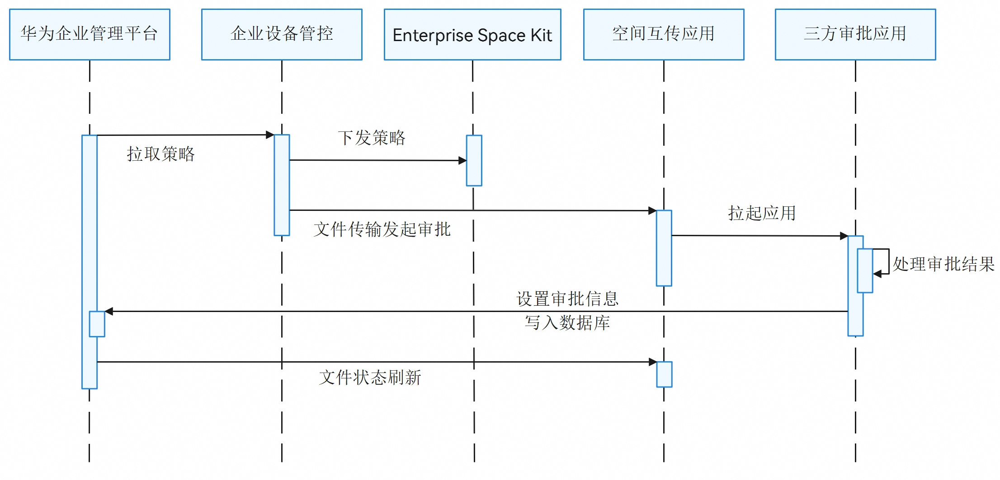

# 文件外发管控

更新时间：2026-07-28 11:23:46

来源：https://developer.huawei.com/consumer/cn/doc/harmonyos-guides/enterprisespace-file-transfer-control

从6.0.0(20)开始，支持设置和获取审批信息、配置空间互传单双通策略的能力。


#### 场景介绍





支持在文件传输场景中，通过设置空间的单通或双通策略，灵活配置应用文件在空间间的外发权限，实现安全可控的跨空间文件共享。当文件外发需纳入审批流程管控时，系统支持配置相关审批信息。同时，通过调用审批状态同步接口，实时获取审批结果，确保外发流程的安全与合规。

单通模式下，仅允许个人空间向企业空间发送文件，禁止反向传输。

双通模式则允许个人空间与企业空间双向互发文件。


#### 接口说明

详细接口说明可参考[接口文档](https://developer.huawei.com/consumer/cn/doc/harmonyos-references/enterprisespace-spacedatatransfer)。

| 接口名 | 描述 |
| --- | --- |
| policyPush(policyContext: string): void | 配置空间互传单双通策略。 |
| setAuditInfo(transactionNum: string, info: AuditInfo): number | 设置审批信息并返回结果。 |
| getAuditInfo(transactionNum: string): AuditInfo | 获取审批信息。 |


#### 开发步骤

1.导入文件外发管控API模块相关依赖。

```text
import { fileTransfer } from '@kit.EnterpriseSpaceKit';
import { ErrCode } from '../../common/ErrCode';
import { hilog } from '@kit.PerformanceAnalysisKit';
```

2.文件外发管控API接口封装。

```json
const TAG = '[Sample_SpaceManagerSample]';
const DOMAIN = 0xF811;

export enum EAuditAbilityType {
  SUBMIT = 'submit',
  QUERY = 'query'
}

export enum EAuditStatus {
  WAITING_APPROVAL = '1',
  CANCEL_APPROVAL = '2',
  REJECT_APPROVAL = '3',
  ACCEPT_APPROVAL = '4'
}

export interface FileItem {
  name: string;
  size: number;
  url: string;
  transactionNum: string;
  selected: boolean;
}


export interface FileParams {
  routerUri: string,
  fileList: FileItem[]
}


export interface ISpaceTransferParam {
  fileParams: FileParams,
  action: EAuditAbilityType,
  fileList: FileItem[]
}

export class FileTransferControlApi {
  static setAuditInfo(transactionNum: string, dstInfo: fileTransfer.AuditInfo): number {
    try {
      const ret: number = fileTransfer.setAuditInfo(transactionNum, dstInfo);
      hilog.info(DOMAIN, TAG, `Succeeded in setting audit info, number:`, ret);
      return ErrCode.OK;
    } catch (err) {
      hilog.error(DOMAIN, TAG, `Failed to set audit info. Code: ${err?.code}, message: ${err?.message}`);
      return ErrCode.ERR;
    }
  }

  static getAuditInfo(transactionNum: string): fileTransfer.AuditInfo | undefined {
    try {
      const auditInfo: fileTransfer.AuditInfo = fileTransfer.getAuditInfo(transactionNum);
      hilog.info(DOMAIN, TAG, `Succeeded in getting audit info:` + JSON.stringify(auditInfo));
      return auditInfo;
    } catch (err) {
      hilog.error(DOMAIN, TAG, `Failed to get audit info. Code: ${err.code}, message: ${err.message}`);
      return undefined;
    }
  }

  static policyPush(policyContext: string): number {
    try {
      fileTransfer.policyPush(policyContext);
      hilog.info(DOMAIN, TAG, `Succeeded in pushing policy`);
      return ErrCode.OK;
    } catch (err) {
      hilog.error(DOMAIN, TAG, `Failed to push policy. Code: ${err.code}, message: ${err.message}`);
      return ErrCode.ERR;
    }
  }
}
```

3.导入文件外发管控业务实现相关依赖。

```text
import { router } from '@kit.ArkUI';
import { EAuditAbilityType, FileItem, FileParams } from '../api/FileTransferControlApi';
import { hilog } from '@kit.PerformanceAnalysisKit';
```

4.文件外发管控业务相关实现。

```text
const TAG = '[Sample_SpaceManagerSample]';
const DOMAIN = 0xF811;

@Entry
@Component
struct FileTransferPage {
  async FileTransferControl(type: string, uri: string): Promise<void> {
    // 预设需要审批的文件及其企业应用信息，该部分数据由空间互传APP传入
    const file: FileItem = {
      name: '',
      size: 1024,
      url: '',
      transactionNum: '123',
      selected: true
    };

    // 模拟空间互传APP拉起企业应用
    const want: Want = {
      bundleName: 'com.samples.spacemanager', // 要拉起的企业应用
      abilityName: 'EntryAbility', // 要拉起企业应用的ability
      parameters: {
        fileParams: {
          routerUri: uri,
          fileList: [file]
        },
        action: EAuditAbilityType.SUBMIT,
        fileList: [file]
      }
    };

    // 实际企业应用由context.startAbility(want)拉起,仅需关注企业应用被拉起ability后的处理
    try {
      let param: FileParams | undefined;
      let action: string | undefined;
      if (want.parameters) {
        // 拉起企业应用后，获取传输的文件列表
        param = want.parameters[`fileParams`] as FileParams;
        action = want.parameters['action'] as string;
      }
      let fileList = param?.fileList ?? [];
      let routerUri = param?.routerUri;
      AppStorage.setOrCreate('fileList', fileList);
      if (action === EAuditAbilityType.SUBMIT) {
        // 提交审批信息前置处理

        // 拉起企业应用审批业务
        this.getUIContext().getRouter().pushUrl({ url: `filetransfercontrol/pages/${routerUri}` });
      } else if (action === EAuditAbilityType.QUERY) {
        // 查询审批信息前置处理

        // 拉起企业应用查询业务
        this.getUIContext().getRouter().pushUrl({ url: `filetransfercontrol/pages/${routerUri}` });
      } else {
        // 处理错误action
        hilog.error(DOMAIN, TAG, 'Invalid action type!');
      }
    } catch (err) {
      // 异常处理
      hilog.error(DOMAIN, TAG, `Failed to audit files. Code: ${err.code}, message: ${err.message}`);
    }
  }

  build() {
    Column() {
      Row() {
        Button($r('app.string.setPolicy'))
          .buttonCommonStyle()
          .onClick(() => {
            this.getUIContext().getRouter().pushUrl({ url: 'filetransfercontrol/pages/SavePolicyPage' });
          })
      }

      Row() {
        Button($r('app.string.FileTransferControl_Start_Submit'))
          .buttonCommonStyle()
          .onClick(() => {
            this.FileTransferControl(EAuditAbilityType.SUBMIT, 'SubmitPage');
          })
      }

      Row() {
        Button($r('app.string.FileTransferControl_Start_Query'))
          .buttonCommonStyle()
          .onClick(() => {
            this.FileTransferControl(EAuditAbilityType.QUERY, 'QueryPage');
          })
      }

      Row() {
        Button($r('app.string.back'))
          .buttonCommonStyle()
          .onClick(() => {
            router.back();
          })
      }
    }
  }
}

@Extend(Button)
function buttonCommonStyle() {
  .width(400)
  .height(50)
  .backgroundColor('#6366F1')
  .fontColor('#FFFFFF')
  .fontSize(14)
  .margin({ left: 20, bottom: 5 })
}
```

5.导入保存策略页面相关依赖。

```text
import { router } from '@kit.ArkUI';
import { ErrCode } from '../../common/ErrCode';
import { FileTransferControlApi } from '../api/FileTransferControlApi';
import { hilog } from '@kit.PerformanceAnalysisKit';
```

6.保存策略页面业务相关实现。

```text
const TAG = '[Sample_SpaceManagerSample]';
const DOMAIN = 0xF811;

@Entry()
@Component
struct SavePolicyPage {
  SavePolicy() {
    let policyContext =
      '{' +
        '  "config": {' +
        '    "inEnable": "1",' +
        '    "incoming_check": {' +
        '      "data_list": [' +
        '        {' +
        '          "allow": "VirusCheck.result == 0",' +
        '          "approval": "",' +
        '          "check_point": "VirusCheck",' +
        '          "check_point_name": "VirusCheck_in",' +
        '          "is_enable": "true",' +
        '          "forbidden": "VirusCheck.result == 1",' +
        '          "order": "0"' +
        '        }' +
        '      ]' +
        '    },' +
        '    "outEnable": "1",' +
        '    "outgoing_check": {' +
        '      "data_list": [' +
        '        {' +
        '          "allow": "SecurityCheck.Result == 3 or SecurityCheck.Result == 4 or SecurityCheck.Result == 6 or SecurityCheck.Result == 7",' +
        '          "approval": "SecurityCheck.Result == 10",' +
        '          "check_point": "SecurityCheck",' +
        '          "check_point_name": "SecurityCheck_out",' +
        '          "is_enable": "true",' +
        '          "forbidden": "SecurityCheck.Result == 0 or SecurityCheck.Result == 1 or SecurityCheck.Result == 12 or SecurityCheck.Result == 2 or SecurityCheck.Result == 5 or SecurityCheck.Result == 8 or SecurityCheck.Result == 9 or SecurityCheck.Result == 11",' +
        '          "order": "0"' +
        '        }' +
        '      ]' +
        '    },' +
        '    "checkpoint_config": {' +
        '      "data_list": [' +
        '        {' +
        '          "check_point_name": "SecurityCheck",' +
        '          "bundle_name": "com.example.enterprisespacekit_samplecode_clientdemo_arkts",' +
        '          "ability_name": "TestScanAbility",' +
        '          "func_code": "2",' +
        '          "type": "2"' +
        '        },' +
        '        {' +
        '          "check_point_name": "VirusCheck",' +
        '          "bundle_name": "com.example.enterprisespacekit_samplecode_clientdemo_arkts",' +
        '          "ability_name": "TestScanAbility",' +
        '          "func_code": "3",' +
        '          "type": "1"' +
        '        }' +
        '      ]' +
        '    },' +
        '    "approvalpoint_config": {' +
        '      "data_list": [' +
        '        {' +
        '          "bundle_name": "com.example.enterprisespacekit_samplecode_clientdemo_arkts",' +
        '          "ability_name": "TestApprovalAbility"' +
        '        }' +
        '      ]' +
        '    }' +
        '  }' +
        '}';
    if (FileTransferControlApi.policyPush(policyContext) !== ErrCode.OK) {
      // 异常错误处理
      hilog.error(DOMAIN, TAG, 'Failed to push policy!');
      return;
    }

    // 处理后置逻辑
  }

  build() {
    Column() {
      Row() {
        Button($r('app.string.savePolicy'))
          .buttonCommonStyle()
          .onClick(() => {
            this.SavePolicy();
          })
      }

      Row() {
        Button($r('app.string.back'))
          .buttonCommonStyle()
          .onClick(() => {
            router.back();
          })
      }
    }
  }
}

@Extend(Button)
function buttonCommonStyle() {
  .width(200)
  .height(50)
  .backgroundColor('#6366F1')
  .fontColor('#FFFFFF')
  .fontSize(14)
  .margin({ left: 20, bottom: 20 })
}
```

7.导入提交审批页面相关依赖。

```text
import { router } from '@kit.ArkUI';
import { fileTransfer } from '@kit.EnterpriseSpaceKit';
import { ErrCode } from '../../common/ErrCode';
import { EAuditStatus, FileItem, FileTransferControlApi } from '../api/FileTransferControlApi';
import { hilog } from '@kit.PerformanceAnalysisKit';
```

8.提交审批页面业务相关实现。

```text
const TAG = '[Sample_SpaceManagerSample]';
const DOMAIN = 0xF811;

@Entry
@Component
struct SubmitPage {
  private fileList: FileItem[] = AppStorage.get<FileItem[]>('fileList') || [];

  CheckAuditInfo() {
    // 企业应用做前置判断

    // 判断通过后，设置审批状态
    this.fileList?.forEach(item => {
      const transactionNum: string = item.transactionNum; // 数据库自动生成的传输编号，需要在数据库中实际存在。
      const srcName = item.name; // 审批文件名
      const srcSize = item.size; // 审批文件大小
      const srcUrl = item.url; // 审批文件url
      const srcSelected = item.selected; // 审批文件是否被选中

      // 文件过滤处理

      const dstInfo: fileTransfer.AuditInfo = {
        auditId: 'A123456', // 企业应用对审批条目的自定义唯一标识
        userId: 'userId', // 用户ID
        userName: 'userName', // 用户名称
        time: new Date().getTime(), // 审批时间戳
        comments: 'Waiting approval', // 审批评论
        status: EAuditStatus.WAITING_APPROVAL // 文件审批状态
      };

      if (FileTransferControlApi.setAuditInfo(transactionNum, dstInfo) !== ErrCode.OK) {
        // 设置失败，企业应用处理失败逻辑
        hilog.error(DOMAIN, TAG, 'Failed to set audit info!');
        return;
      }

      // 设置成功,企业应用处理后置逻辑
      return;
    })
  }

  build() {
    Column() {
      Row() {
        Button($r('app.string.submit'))
          .buttonCommonStyle()
          .onClick(() => {
            this.CheckAuditInfo();
          })
      }

      Row() {
        Button($r('app.string.back'))
          .buttonCommonStyle()
          .onClick(() => {
            router.back();
          })
      }
    }
  }
}

@Extend(Button)
function buttonCommonStyle() {
  .width(200)
  .height(50)
  .backgroundColor('#6366F1')
  .fontColor('#FFFFFF')
  .fontSize(14)
  .margin({ left: 20, bottom: 20 })
}
```

9.导入查询审批页面相关依赖。

```text
import { router } from '@kit.ArkUI';
import { fileTransfer } from '@kit.EnterpriseSpaceKit';
import { FileItem, FileTransferControlApi } from '../api/FileTransferControlApi';
import { hilog } from '@kit.PerformanceAnalysisKit';
```

10.查询审批页面业务相关实现。

```text
const TAG = '[Sample_SpaceManagerSample]';
const DOMAIN = 0xF811;

@Entry
@Component
struct QueryPage {
  private fileList: FileItem[] = AppStorage.get<FileItem[]>('fileList') || [];

  QueryAuditInfo() {
    // 企业应用做前置判断

    // ...

    // 判断通过后，获取审批信息处理其他业务
    this.fileList?.forEach(item => {
      const transactionNum: string = item.transactionNum; // 数据库自动生成的传输编号，需要在数据库中实际存在。
      const srcName = item.name; // 审批文件名
      const srcSize = item.size; // 审批文件大小
      const srcUrl = item.url; // 审批文件url
      const srcSelected = item.selected; // 审批文件是否被选中

      // 文件过滤处理

      let auditInfo: fileTransfer.AuditInfo | undefined = FileTransferControlApi.getAuditInfo(transactionNum);
      if (auditInfo === undefined) {
        // 企业应用处理错误逻辑
        hilog.error(DOMAIN, TAG, 'Failed to get audit info!');
        return;
      }

      // 企业应用使用auditInfo处理正确逻辑
    })
  }

  build() {
    Column() {
      Row() {
        Button($r('app.string.query'))
          .buttonCommonStyle()
          .onClick(() => {
            this.QueryAuditInfo();
          })
      }

      Row() {
        Button($r('app.string.back'))
          .buttonCommonStyle()
          .onClick(() => {
            router.back();
          })
      }
    }
  }
}

@Extend(Button)
function buttonCommonStyle() {
  .width(200)
  .height(50)
  .backgroundColor('#6366F1')
  .fontColor('#FFFFFF')
  .fontSize(14)
  .margin({ left: 20, bottom: 5 })
}
```
