# 其他测试服务

更新时间：2026-06-12 06:58:30

来源：https://developer.huawei.com/consumer/cn/doc/harmonyos-guides/other-test

#### UX基础质量测试

 
**UX基础质量测试：**根据应用UX建议，验证应用在基础体验、系统特性适配、控件布局等方面是否合理。
 
测试完成后，自动生成测试报告。UX基础质量测试报告如下：
 
报告包含任务信息、执行结果、检测规则。支持查看当前应用信息、任务执行时长，及详细的环境参数（配置信息及环境信息），支持导出 html 的报告文件。
 

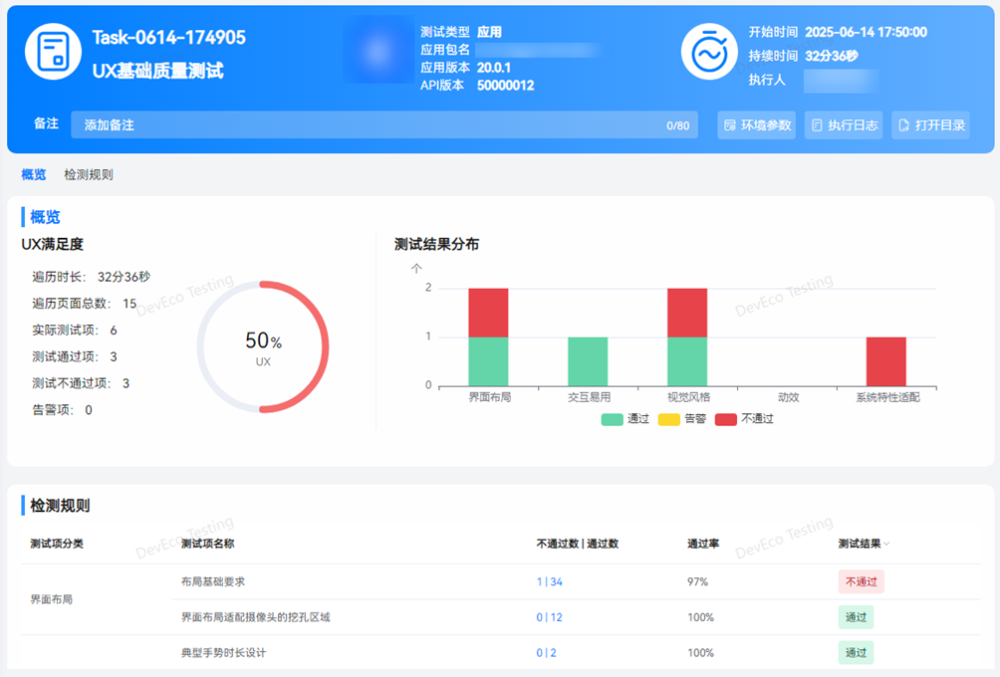

 
对于检测不通过及检测异常的规则项，点击查看详情即可查看异常问题详情，包含检测项概览、测试截图、问题列表。对于异常问题，可根据测试截图、问题描述，针对性优化异常问题。
 

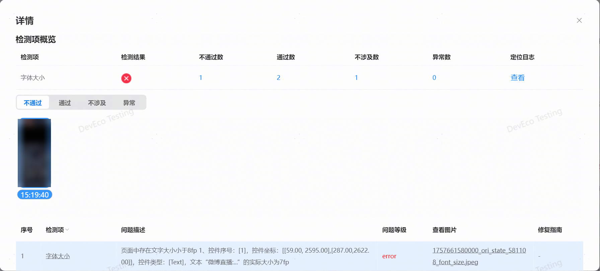

 
> [!NOTE]
> 更多检测规则详情，请前往DevEco Testing客户端 ->测试服务 ->其他 ->UX基础质量测试 ->任务创建页-测试指南中查询。

 

 

#### 安全基础质量测试

 
**安全基础质量测试：**根据应用安全测试建议，评估应用基础安全，如组件安全、存储安全、配置安全、签名安全等。
 
测试完成后，会自动生成测试报告。报告包含任务信息、执行结果、问题统计、检测规则。任务信息中，可查看当前应用信息、任务执行时长以及详细的环境参数（配置信息及环境信息），支持导出 html 的报告文件。
 
安全基础质量测试报告如下：
 

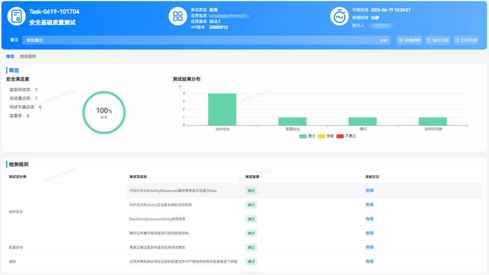

 
在测试报告中，包含执行结果、问题统计及检测规则。用户可直观查看本次任务中的测试项检测结果。
 
对于检测不通过的规则项，点击查看详情即可查看异常问题详情，包含执行设备信息、执行过程信息和问题列表；问题列表中有序号、问题描述和修复指南。
 

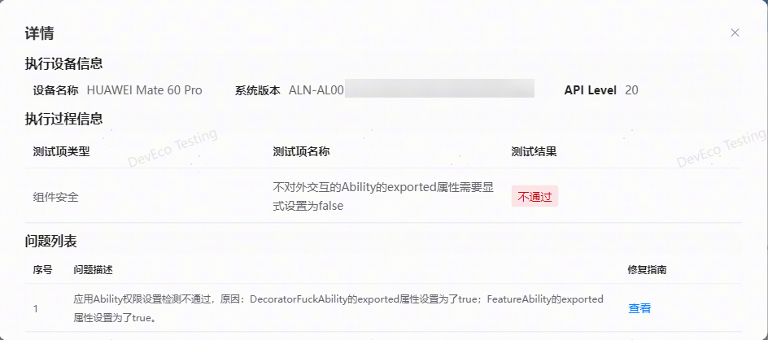

 
> [!NOTE]
> 更多测试服务详情，请前往DevEco Testing客户端->测试服务 ->其他 ->安全基础质量测试->任务创建页->测试指南中查询。

 

 

#### 功能体验基础质量测试

 
**功能体验基础质量测试：**根据应用功能体验建议，检测应用在当前系统、设备及升级场景下运行是否存在兼容性问题。
 
测试完成后，自动生成测试报告。报告包含任务信息、执行结果、问题统计、检测规则。支持查看当前应用信息、任务执行时长及详细的环境参数，点击打开目录按钮可导出 html 格式报告。
 

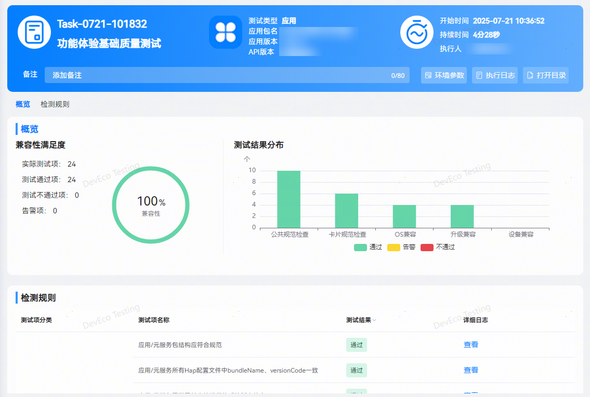

 
检测不通过的规则项，点击查看按钮查看问题详情，包含执行设备信息、执行过程信息、测试截图、问题列表等。
 

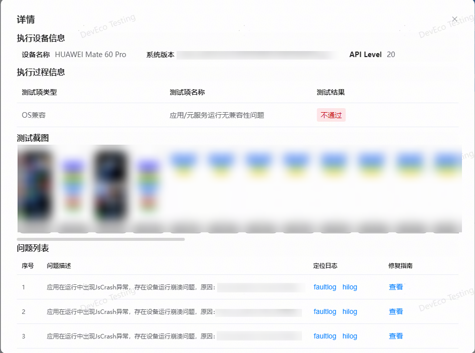

 
> [!NOTE]
> 了解更多测试服务详情，请前往DevEco Testing客户端->测试服务 ->其他 ->功能体验基础质量测试->任务创建页->测试指南中查询。

 

 

#### 功耗基础质量测试

 
**功耗基础质量测试：**根据应用功耗建议，检测应用在运行时是否出现系统资源异常占用的情况。
 
测试完成后，自动生成测试报告。报告包含任务信息、执行结果、问题统计、检测规则。支持查看当前应用信息、任务执行时长及详细的环境参数，支持导出 html 格式报告。
 

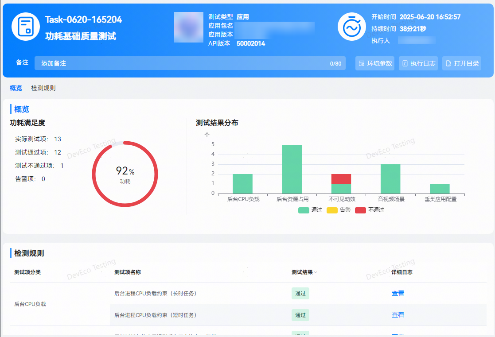

 
检测不通过的规则项，点击查看按钮查看问题详情，包含执行设备信息、执行过程信息、测试截图、问题列表等。
 

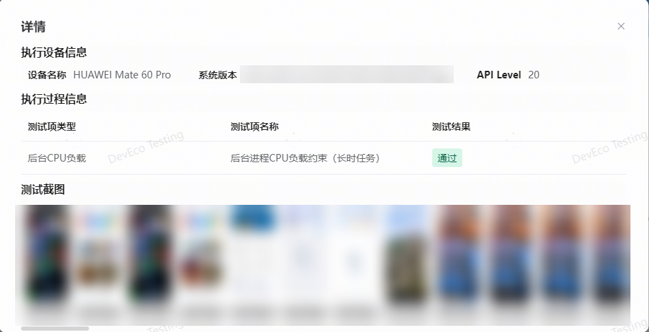

 
> [!NOTE]
> 了解更多测试服务详情，请前往DevEco Testing客户端->测试服务 ->其他 ->功耗基础质量测试->任务创建页->测试指南中查询。

 

 

 

#### 回归测试

 
**回归测试：**针对待测试应用的指定场景，支持通过构建自定义测试包，无需搭建环境即可执行测试用例。用例执行过程中提供实时投屏、步骤截图、步骤结果和测试用例执行日志展示，辅助开发者快速定位问题；此外，测试报告支持指标上报，辅助开发者了解应用的执行性能，助力开发者更高效地打造出高质量应用。
 
**测试包构建**
 
回归测试的测试对象为应用的核心功能，用户可将应用核心功能的测试用例构建成多个可执行测试包，每个测试包中仅包含单个测试用例，便于观察到核心功能的每个小功能点的质量。
 
测试执行前需先构建测试包，用户利用python的setuptools工具在工程（测试工程构建参考[应用UI测试（基于Python）](https://developer.huawei.com/consumer/cn/doc/harmonyos-guides/hypium-python-guidelines)）根目录下构建setup-regression.py、MANIFEST.in文件，setup-regression.py文件中声明用例，MANIFEST.in文件中声明脚本执行过程中需要用到的aw包、config文件夹下的配置文件及其他的资源文件。
 
为方便用户构建测试包，DevEco Testing Hypium（PyCharm插件）已发布，用户可利用插件快速生成可执行测试包。具体操作步骤如下：
 
**步骤一：**PyCharm中本地安装 DevEco Testing Hypium 插件，安装成功后重启IDE，导航栏中出现相关字样，即为安装成功。
 
**步骤二：**新建hypium工程，编写用例。以下为示例工程目录：
 
```json
HypiumTest
 |     |----aw                                       // 工程中自定义模块文件夹
 |     |     |----Utils.py                         // 示例模块文件
 |     |----config                                  // 测试工程配置文件夹
 |     |     |----user_config.xml             // 测试工程配置文件，主要是测试框架的任务配置
 |     |----resource                              // 测试资源文件夹，测试过程中用到的资源文件默认会优先从当前文件夹进行查找
|     |    |----images            // 资源文件子目录
|     |    |    |----icon_mms.png   // 资源文件，以png图片为例
 |     |----testcases                             // 测试用例文件夹，测试过程中的测试用例文件优先会从当前文件夹进行查找
 |     |    |----Example.json                  // Example测试用例配置文件，配置用例设备信息等
 |     |    |----Example.py                     // Example测试用例文件，实际的测试逻辑代码
```
 


 

在用例脚本中，请导入并使用hypium.advance.deveco_testing.step中的Step方法标记步骤(from hypium.advance.deveco_testing.step import Step)，否则回归测试过程中无法正确读取到测试步骤，并导致指标监控为空。
 

 
**步骤三：**在工程根目录下创建setup-regression.py文件和MANIFEST.in文件（用户本地环境需预先安装setuptools模块），参考python的setuptools用法编写setup-regression.py，示例如下：
 
```text
<span style="color: rgb(204,120,50);">from </span><span style="color: rgb(169,183,198);">setuptools </span><span style="color: rgb(204,120,50);">import </span><span style="color: rgb(169,183,198);">setup </span>

<span style="color: rgb(169,183,198);"> setup(</span>
       <span style="color: rgb(170,73,38);">name</span><span style="color: rgb(169,183,198);">=</span><span style="color: rgb(106,135,89);">'hypiumTest'</span><span style="color: rgb(204,120,50);">,</span>
       <span style="color: rgb(170,73,38);">version</span><span style="color: rgb(169,183,198);">=</span><span style="color: rgb(106,135,89);">'1.0.0.0'</span><span style="color: rgb(204,120,50);">,</span>
       <span style="color: rgb(170,73,38);">author</span><span style="color: rgb(169,183,198);">=</span><span style="color: rgb(106,135,89);">'xxx'</span><span style="color: rgb(204,120,50);">,</span>
       <span style="color: rgb(128,128,128);"># py_modules</span><span style="color: rgb(128,128,128);">指定需要打包的hypium用例py文件</span>
       <span style="color: rgb(170,73,38);">py_modules</span><span style="color: rgb(169,183,198);">=[</span><span style="color: rgb(106,135,89);">'testcases.Example'</span><span style="color: rgb(169,183,198);">]</span><span style="color: rgb(204,120,50);">,</span>
       <span style="color: rgb(170,73,38);">include_package_data</span><span style="color: rgb(169,183,198);">=</span><span style="color: rgb(204,120,50);">True</span>
       <span style="color: rgb(169,183,198);">)</span>
```
 


 

回归测试生成的可执行测试包中仅支持单用例（即单个json文件和json中指定的用例文件），编写setup-regression.py时需注意写法，否则会打包失败。
 

 
通过MANIFEST.in文件指定需要一起打包的文件，示例如下：
 
```json
# 与打包用例对应的json文件
 include testcases/Example.json
# 用例依赖的aw
include aw/*.py
# 用例中用到的各类配置文件
include config/*.xml
 include config/*.json
 include config/*.txt
# 用例中用到的resource
include resource/*
include resource/images/*
```
 


 

一定要确保用例所需要的 aw 和配置文件及其他资源全部都写到 MANIFEST.in 中，否则用例包无法正常执行。
 

 
**步骤四：**在根目录下右键选择“DevEco Testing Hypium”-“生成测试服务包”，出现下图弹窗，选择“回归测试”，用户需填写待测试应用的名称及测试场景，信息填写完毕后点击“OK”即可在指定目录下查看测试包。
 

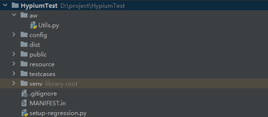

 

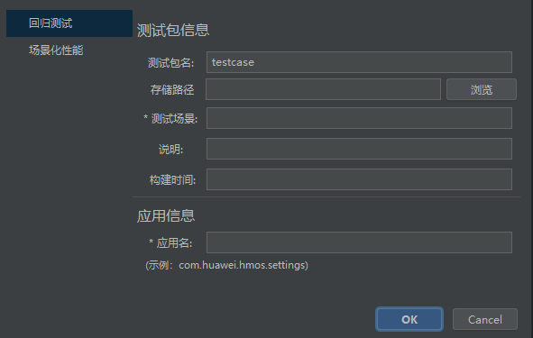

 
生成回归测试测试包，打包好的测试包支持在回归测试服务中本地执行。
 

 
**创建任务**
 
进入DevEco Testing客户端，在左侧菜单栏选择“测试服务”，点击“回归测试”服务卡片，即进入任务创建界面。按需配置任务参数，点击创建任务即开始测试。
 

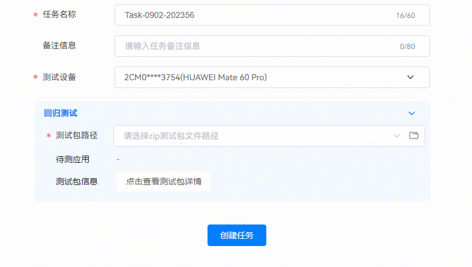

 
配置服务参数：
 
任务名称：用于标识任务，系统会根据时间生成默认任务名，支持自定义修改。
 
备注信息：按需填写任务备注信息，便于快速筛选报告。
 
测试设备：选择一个待测设备。系统版本支持 HarmonyOS 5.0及以上版本。
 
测试包路径：选择待测测试包，服务将对测试包中指定应用进行解析，并执行测试包中测试用例。
 
**测试包详情：**
 

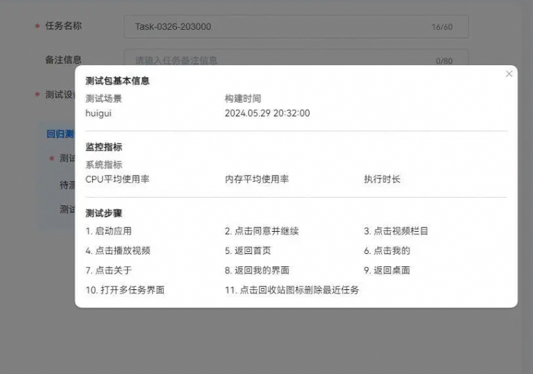

 
点击查看测试包详情，即可查看测试包基本信息。
 
参数配置完成后，点击“创建任务”即开始测试。
 

 
**测试执行**
 
任务创建后即进入测试执行页面，测试过程中，在测试页面可以看到设备实时投屏、设备截图、测试步骤结果上报以及指标数据上报。执行过程中如果脚本执行失败，任务会立刻停止，生成的报告中仅包含任务失败前的数据信息。手动停止查看报告时，报告中仅包含报告停止前的数据信息。
 

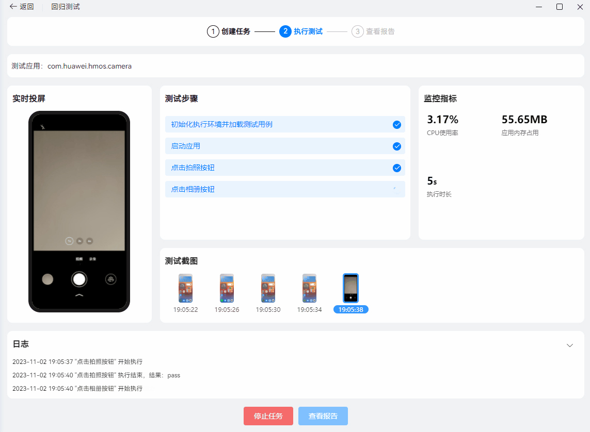

 

 
**查看报告**
 
测试完成后，将自动跳转到报告界面。
 

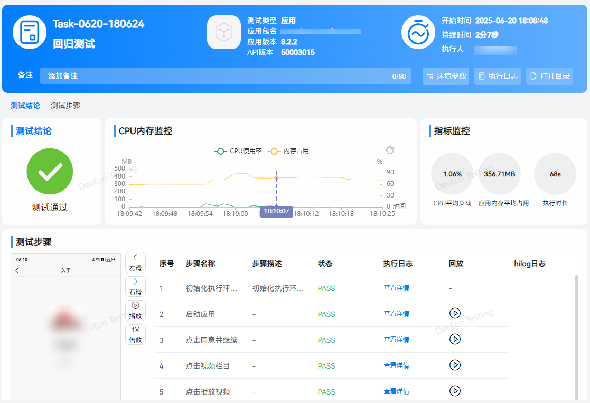

 
任务信息：在报告的最上方可查看本次任务的应用信息，运行时间，环境参数和执行日志，点击“打开目录”按钮，可以导出html格式的报告文件。
 
应用信息：基于测试包中指定的待测试应用获取设备上该应用的包名、版本、API版本。
 
环境参数：展示测试设备信息和参数配置。
 
测试结论：本次测试任务的执行结果。
 
上报指标：本次任务执行过程中CPU平均使用率、内存平均使用率以及用户在脚本中自定义指标上报，目前不支持自定义指标更新操作，若多次上报同一个指标，仅展示最后一次的指标上报结果。
 
测试截图&CPU使用率：该部分展示了任务执行过程中CPU使用率、内存使用的变化情况，同时移动指针可查看当前时间对应的截图（并非每一秒均存在截图）。
 
执行步骤&执行日志：该部分展示了测试用例执行的所有测试步骤、每一步的执行结果以及用例的执行日志，若某一步执行失败，则后续步骤不再执行。点击每一步，CPU使用率统计图中将会展示出该步骤执行过程中的CPU使用情况，同时该步骤对应的执行日志将会高亮显示。
 
> [!NOTE]
> 更多测试服务详情，请前往DevEco Testing客户端 -> 测试服务 ->其他 -> 回归测试 -> 任务创建页 -> 测试指南中查询。

 

 

#### 应用探索测试

 
**应用探索测试：**通过在测试过程中结合专家经验与AI技术，对测试数据持续学习，实现场景智能感知和控件语义分析，以不断优化遍历策略，帮助用户高效识别和定位应用中潜在异常、崩溃、泄漏等稳定性问题。
 

 
**创建任务**
 
进入DevEco Testing客户端，在左侧菜单栏选择“测试服务”，点击“应用探索测试”卡片，进入任务创建界面。按需配置任务参数，点击创建任务开始测试。
 

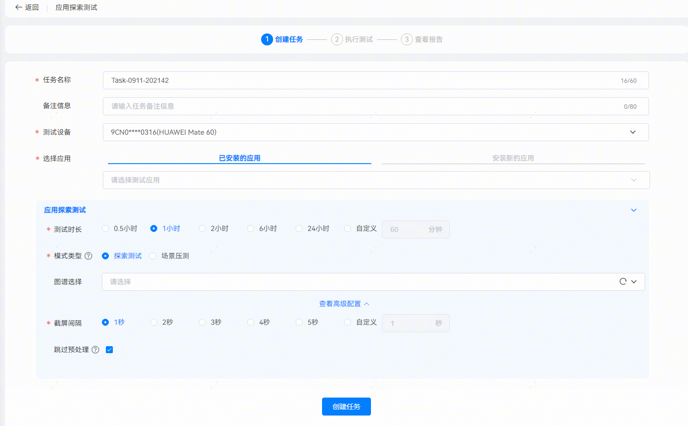

 
任务名称：用于标识任务，系统会根据时间生成默认任务名，支持用户自定义修改。
 
备注信息：填写任务备注信息，便于快速筛选报告。
 
测试设备：待测设备，支持 HarmonyOS 5.0及以上版本。
 
选择应用：选择测试设备上已安装的应用，或在测试设备上安装新的应用包。
 
测试时长：任务总时长，建议时长不低于1小时，时长过低的测试结果不具备代表性。
 
模式类型：可选探索测试模式或者场景压测模式。
 
- 探索测试 ：基于智能遍历算法，通过模拟用户的操作，对应用进行长时间、高频率操作。

 
- 场景压测 ：基于应用探索测试生成的应用图谱，在图谱管理工具中进行自定义场景，对指定页面进行压测。

 

#### **探索测试****模式**

 
图谱选择（非必选项）：选择应用后，将提供该应用在应用图谱管理工具中的图谱以供选择。
 

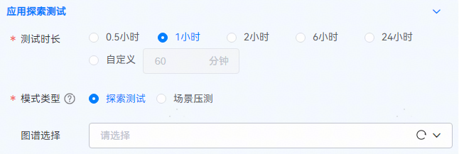

 
> [!NOTE]
> 不选择图谱文件：探索测试将进行随机遍历，在设置的时间内遍历应用页面，并生成图谱文件。 选择图谱文件：探索测试将优先遍历图谱文件中的各个节点。 关于图谱文件的介绍，可查看 应用图谱管理工具 -> 创建图谱 指导文档。

 

#### **场景压测****模式**

 
图谱选择：选择应用后，将提供该应用在应用图谱管理工具中的图谱以供选择。
 
场景选择：选择在应用图谱管理工具中创建的场景路径。
 

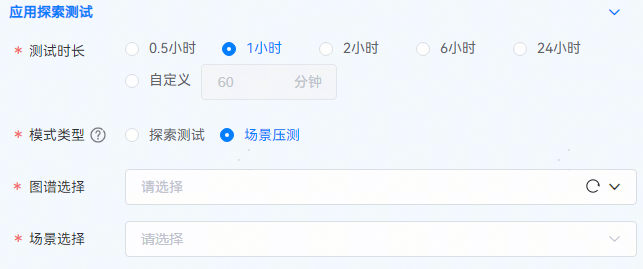

 
> [!NOTE]
> 创建场景压测任务前需要自定义创建场景路径，可查看 应用图谱工具场景路径管理 指导文档。

 
**高级配置**
 
重启切换场景：场景压测中场景切换是否通过重启应用完成。当不勾选时，正常执行需要场景的开始和结束都为首页。
 
截屏间隔：步骤执行完成操作后到页面截图的时间间隔。
 
跳过预处理：预处理流程会授予待测应用定位、通知、网络等权限，并自动跳过引导页、登录华为账号。如果前述操作未实施，建议取消勾选。
 
参数配置完成后，点击“创建任务”即开始测试。
 

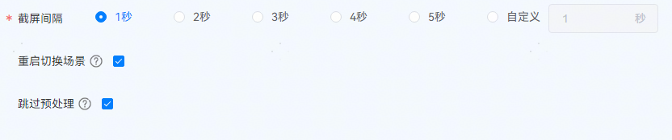

 
**测试执行**
 
任务创建后进入测试执行页面。创建任务时，如未选择跳过预处理，则会在遍历开始前，进行应用预处理，如同意隐私声明，自动授予待测应用定位、通知、网络等权限，并自动跳过引导页、登录华为账号。在测试过程中，页面显示测试进度、遍历路径地图、设备截图及语义分析过程。
 
探索测试执行页面：
 

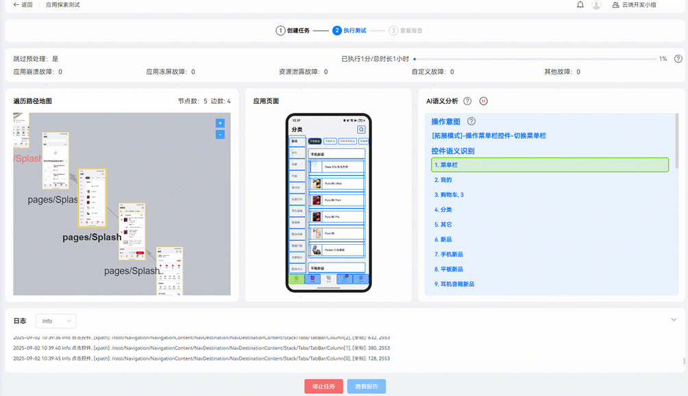

 
场景压测执行页面：
 

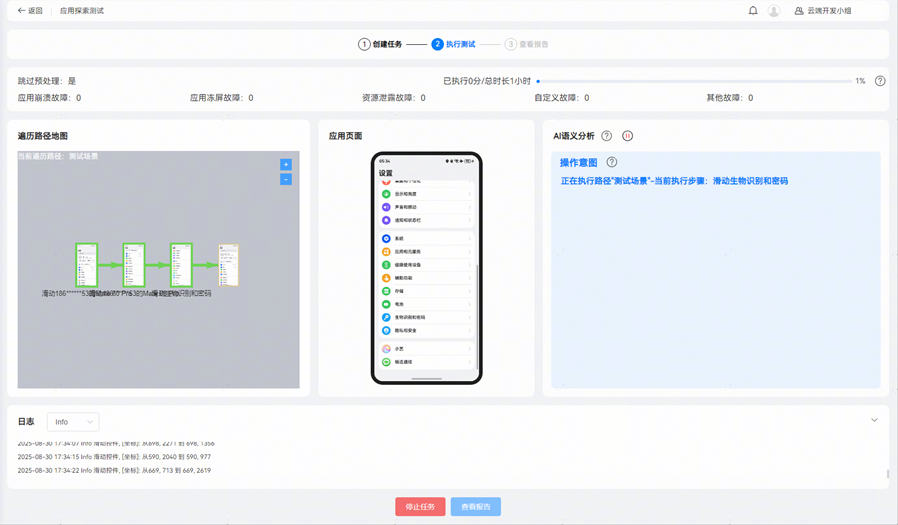

 
AI语义分析：智能AI结合用户操作习惯，为界面控件归类排序，测试过程参照排序执行。测试过程中支持用户暂停或启动语义分析，语义分析暂停时，任务会继续计时，直至任务时间结束。
 
控件色块颜色说明：
 
绿色：下一步即将操作的控件。
 
黄色：鼠标悬停在控件语义识别列表时关联的控件。
 
蓝色：已覆盖遍历的控件。
 
灰色：黑名单被屏蔽的控件。
 
测试过程中，会优先覆盖核心功能区域，如底部菜单栏、顶部频道栏、应用功能集入口等，探索出应用的主要功能页面；完成核心功能区域覆盖后执行常见的测试操作，如扫码、关注、点赞、收藏等，保障应用关键事件覆盖完全；最后补充遍历非核心功能页面和控件，补全应用图谱。
 
测试过程中可实时查看故障数据，点击页面上故障红色提示数字，查看问题列表与详细信息。
 

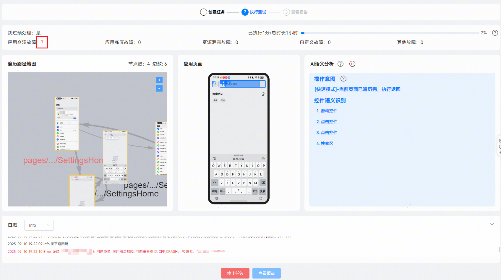

 
执行过程中如果发生设备断连、重启等情况，遍历暂停，但任务会继续计时；当设备重新连接（或重启完毕），遍历任务继续执行，断连（或重启）前的测试信息依然存在；若设备断连，且在测试任务完成前都未重新连接，则会导致生成的报告数据不完整。 
 

 
**测试报告**
 
探索测试报告页面:
 

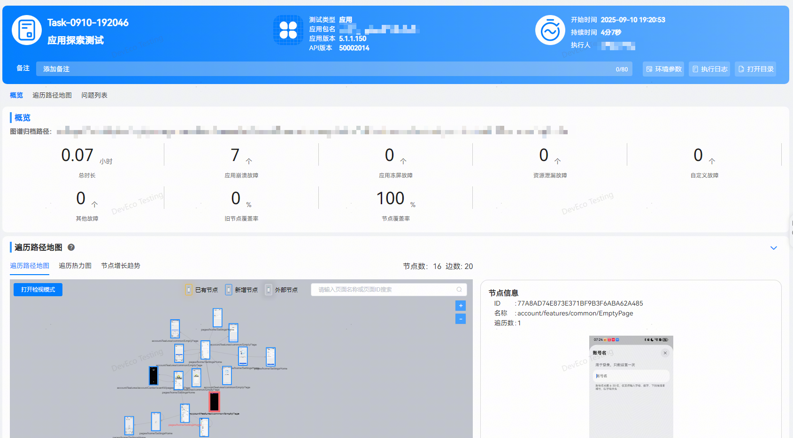

 
场景压测报告页面：
 

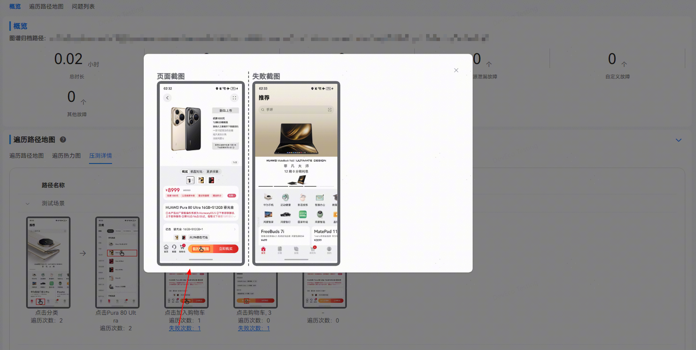

 
任务信息：在报告的最上方可查看本次任务的应用信息，运行时间，环境参数和执行日志，点击打开目录按钮可导出html格式报告。
 
应用信息：获取待测试应用的包名、版本、API版本。
 
环境参数：展示测试设备信息和参数配置。
 
概览：本次任务的主要数据概览及本次任务模型包存放路径。
 
遍历路径地图：本次任务遍历的页面地图。
 
压测详情：选择场景压测模式，压测的节点以及次数等信息可显示在报告页。点击失败次数显示失败的页面截图。
 
问题列表：对测试过程中产生问题信息的分类统计。点击列表中

符号能够对指定列的数据进行筛选，点击列表中

三角符号可以对指定列进行正序或倒序的排序，默认按照发生时间的正序排序。点击概要信息列查看按钮对应故障的概要信息，点击定位日志列查看按钮跳转到存放faultlog日志及故障发生时段hilog日志的文件夹。
 
问题详情：
 

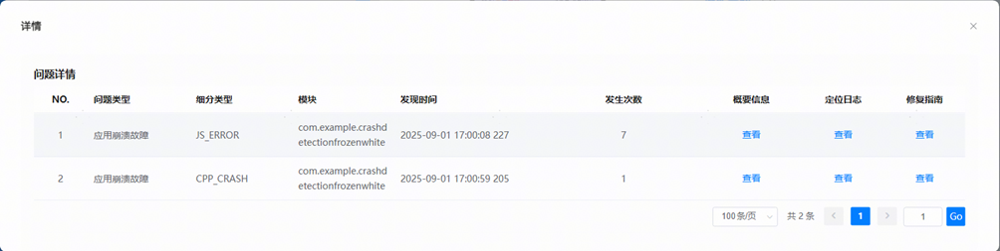

 
故障概要信息：
 

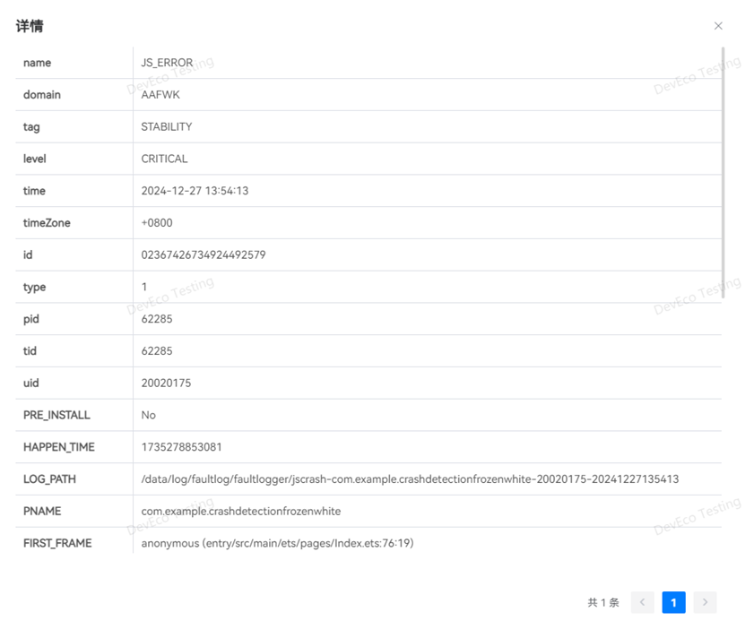

 
定位日志：
 

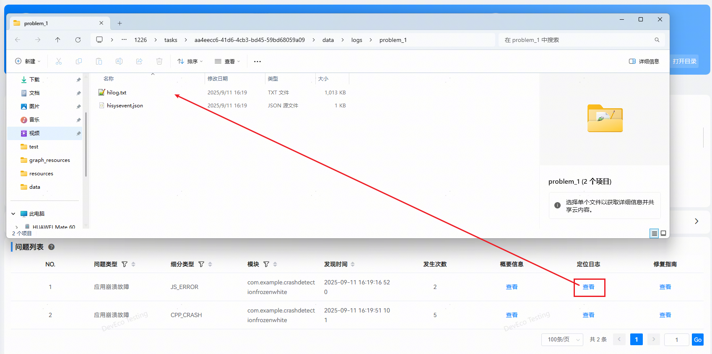

 
*更多应用稳定性体验优化建议及问题定位，请查阅：[应用稳定性体验建议](https://developer.huawei.com/consumer/cn/doc/harmonyos-guides/experience-suggestions-stability) 及 [稳定性概览](https://developer.huawei.com/consumer/cn/doc/best-practices/bpta-stability-overview)
 

 
**测试****故障说明**
 
DevEco Testing探索测试服务会发现并收集测试过程中发生的故障，故障类型包含以下几种：
 1. [JS_CRASH](https://developer.huawei.com/consumer/cn/doc/best-practices/bpta-stability-app-crash-js-way)：应用异常，应用程序在JS层发生了崩溃。
2. [APP_FREEZE](https://developer.huawei.com/consumer/cn/doc/best-practices/bpta-stability-runtime-freeze-detection)：应用无响应，前台应用无法及时响应用户操作。
3. [CPP_CRASH](https://developer.huawei.com/consumer/cn/doc/best-practices/bpta-stability-app-crash-cpp-way)：进程崩溃，C++编写的Native进程（包含c++应用进程和统服务进程）发生崩溃。
4. [FD_LEAK](https://developer.huawei.com/consumer/cn/doc/best-practices/bpta-stability-file-handle-detection)：句柄泄漏故障，是由于进程句柄数过高且持续增长，以此判定该进程可能存在句柄泄漏。
5. [THREAD_LEAK](https://developer.huawei.com/consumer/cn/doc/best-practices/bpta-stability-thread-leak-detection)：线程泄漏故障，是由于进程的线程数过高且持续增长，以此判定该进程可能存在线程泄漏。
6. [MEMORY_LEAK](https://developer.huawei.com/consumer/cn/doc/best-practices/bpta-stability-memleak-detection-overview)：内存泄漏故障，是由于进程的PSS内存大小过高且持续增长，以此判定该进程可能存在内存泄漏。
7. [HiAppEvent](https://developer.huawei.com/consumer/cn/doc/harmonyos-guides/hiappevent-intro)：HiAppEvent故障是来自应用开发者在应用内预埋的HiAppEvent故障类打点事件，每一个HiAppEvent故障类事件会生成一个对应的故障记录。
 

 
> [!NOTE]
> 更多测试服务详情，请前往DevEco Testing客户端 -> 测试服务 ->其他 -> 应用探索测试 -> 任务创建页 -> 测试指南中查询。
