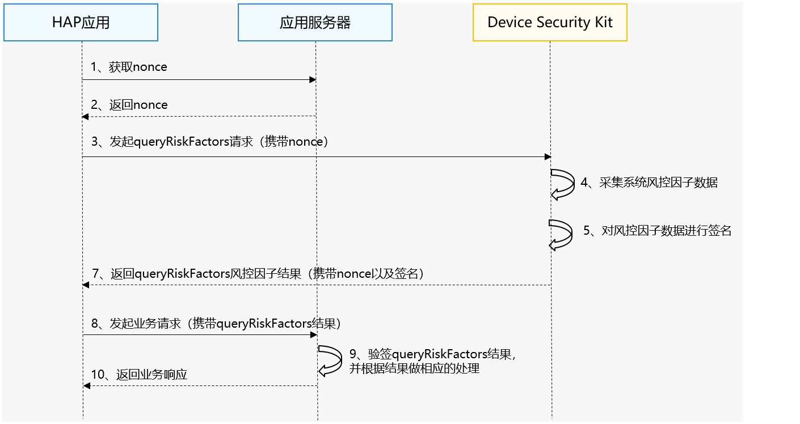

# 统一风控凭证

更新时间：2026-07-28 11:23:46

来源：https://developer.huawei.com/consumer/cn/doc/harmonyos-guides/devicesecurity-safetydetect-queryriskfactors

#### 场景介绍

从26.0.0版本开始，新增提供统一的系统风控因子查询接口。

应用通过统一风控凭证能力获取系统风控因子数据及安全证明，快速构建可靠的风控体系。应用可以根据系统风控因子数据进行适当风险提示、风险控制，谨慎进行业务决策或阻断操作。


#### 约束与限制

 - 设备风控因子查询能力支持Phone、Tablet、PC/2in1设备。
 - 每个应用在单台设备上的接口调用限制如下：       
每分钟最多可以调用5次
 - 每天最多可以调用20次

      - 单台设备整体接口调用限制如下：       
最多支持10个并发调用


#### 业务流程





**流程说明：**
1. **开发者应用获取nonce。**

  开发者应用在调用[queryRiskFactors](https://developer.huawei.com/consumer/cn/doc/harmonyos-references/devicesecurity-safetydetectenhanced-api#safetydetectqueryriskfactors)接口时，需传入随机生成的nonce值。返回的检测结果中将包含该nonce值，开发者可通过校验此值确认响应与请求的对应关系，并防范重放攻击。

  
> [!NOTE]
> nonce值必须为16至66字节之间，有效值为base64编码范围。 推荐的做法是，每次请求都从服务器随机生成新的nonce值。

2. **开发者应用发起风控因子查询请求。**

  Device Security Kit在收到请求后，会触发风控因子数据的采集，随后将数据与nonce关联并进行安全处理，最终通过[queryRiskFactors](https://developer.huawei.com/consumer/cn/doc/harmonyos-references/devicesecurity-safetydetectenhanced-api#safetydetectqueryriskfactors)接口将完整的风险检测结果返回给开发者应用。
3. **开发者应用服务器中验证检测结果。**

  当风控因子查询结果返回后，开发者应用通过解析JWS（JSON Web Signature）格式的返回值先进行签名验证，再根据Payload中的各风控因子项的结果进行相关风控处理。


#### 接口说明

以下是风控因子查询接口，返回形式为Promise。更多接口及使用方法请参见[API参考](https://developer.huawei.com/consumer/cn/doc/harmonyos-references/devicesecurity-safetydetectenhanced-api)。

| 接口名 | 描述 |
| --- | --- |
| queryRiskFactors(req: RiskFactorRequest): Promise&lt;RiskFactorResponse&gt; | 查询设备风控因子。 |


#### 开发步骤

> [!NOTE]
> 请确保已打开“ 安全检测服务 ”开关并 申请Profile 。

1. 导入Device Security Kit模块及相关公共模块。

  
```text
import { safetyDetect } from '@kit.DeviceSecurityKit';
import { BusinessError } from '@kit.BasicServicesKit';
import { hilog } from '@kit.PerformanceAnalysisKit';
```

2. 通过调用[queryRiskFactors](https://developer.huawei.com/consumer/cn/doc/harmonyos-references/devicesecurity-safetydetectenhanced-api#safetydetectqueryriskfactors)接口，获取风控因子检测结果。

  

 

  由于queryRiskFactors接口涉及多项数据采集及网络请求等耗时操作，请勿在UI线程中调用，以免阻塞UI响应。

  
```text
const TAG = 'SafetyDetectJsTest';

// 请求风控因子数据，并处理结果
const request: safetyDetect.RiskFactorRequest = {
  nonce: 'a1b2c3d4e5f6g7hfsdfxvsdae8', // 16-66字节的防重放随机数
  queries: [
    { factor: safetyDetect.RiskFactorType.HDC_DEBUG_STATE },
    { factor: safetyDetect.RiskFactorType.IS_DEVELOPER_MODE },
    { factor: safetyDetect.RiskFactorType.ODID_RESET_CNT }
  ]
};
try {
  hilog.info(0x0000, TAG, 'QueryRiskFactors begin.');
  const response: safetyDetect.RiskFactorResponse = await safetyDetect.queryRiskFactors(request);
  hilog.info(0x0000, TAG, 'Succeeded in QueryRiskFactors: %{public}s', response.result);
  // ...
} catch (err) {
  let e: BusinessError = err as BusinessError;
  hilog.error(0x0000, TAG, 'QueryRiskFactors failed: %{public}d %{public}s', e.code, e.message);
  // ...
}
```

3. 在开发者应用服务器中验证检测结果。

  

 

  为确保风控因子查询结果的完整性、防止因子数据被篡改，请严格执行下述步骤。

  
 - 通过解析JWS字符串，获取风控因子查询结果的Header、Payload和Signature。

  风控因子查询结果采用JSON Web Signature（JWS）格式，由Header、Payload和Signature三部分组成。各部分经Base64URL编码后，通过"."连接。其中，Signature是对Header与Payload拼接后的字符串，使用Header中指定算法进行签名生成的。更多JWS的相关知识请参见[JSON Web Signature](https://www.rfc-editor.org/rfc/rfc7515.html)。

  **JWS的Signature字段如下**：

  
```json
eyAgICAiYW**.**.*Jxse
eyAgICAiYW**.**.*JodHxx
```
**JWS的Header字段如下**：

  
```json
{
    "alg": "ES256",     // 签名算法名称，ES256表示使用ECDSA进行签名。
    "typ":"JWS",        // 固定值JWS。
    "x5c": ["","",""]   // Device Security Kit服务器对JWS签名的证书链，包含3级证书。x5c[0]为给JWS签名的证书，x5c[1]为华为设备二级CA，x5c[2]为华为设备ROOT CA。
}
```
**JWS的Payload字段如下**：

  以下为部分风控因子值的返回示例，完整支持的风控因子项请参考[支持的风控因子项](#支持的风控因子项)。

  
```json
{
    // 因子查询结果：每个风控因子结果值对应一个对象，包含status和result字段。
    "isDeveloperMode": {
        "status": 0,  // 0表示成功获取数据，-1表示获取数据失败。
        "result": "true"  // 风控因子的查询结果，统一以字符串格式返回，调用方需根据因子类型自行解析。
    },
    "isVpnStatus": {
        "status": 0,
        "result": "false"
    },
    "oobeCnt": {
        "status": 0,
        "result": "2"
    },
    "odidResetCnt": {
        "status": 0,
        "result": "1"
    },
    "appId": "xxx",  // 开发者应用的appId。
    "nonce": "xxx",  // 调用queryRiskFactors接口时传入的nonce字符串。
    "timestamp": 1776911534738  // 服务器生成的时间戳。
}
```


4. 从Header中获取证书链，使用[Root CA](https://pki.consumer.huawei.com/ca/cer/Huawei_CBG_ECC_Device_Attestation_Root_CA.cer)证书对其进行验证。

5. 校验证书链中是否包含3级证书，并确认证书链中的x5c[0]证书Common Name是否为Harmony OS Device Attestation Service。

6. 从Signature中获取签名并校验。

7. 校验appId是否正确。

8. 从Payload中获取风控因子结果。


#### 支持的风控因子项

以下为支持查询的[风控因子枚举](https://developer.huawei.com/consumer/cn/doc/harmonyos-references/devicesecurity-safetydetectenhanced-api#riskfactortype)及其结果说明。

| 风控因子枚举 | 因子类型 | 结果说明 |
| --- | --- | --- |
| IS_VPN_STATUS | boolean | VPN连接状态。 - true：已连接VPN - false：未连接VPN |
| IS_NET_PROXY_STATUS | boolean | 网络代理状态。 - true：已设置代理 - false：未设置代理 |
| ODID_RESET_CNT | number | 当前应用ODID重置次数。 |
| ODID | string | 当前应用的ODID值。 |
| IS_DEVELOPER_MODE | boolean | 开发者模式状态。 - true：已开启开发者模式 - false：未开启开发者模式 |
| HDC_DEBUG_STATE | number | HDC调试状态。返回值按位或运算结果： 0：未处于调试模式 1 (1 << 0)：处于USB调试模式 2 (1 << 1)：处于Wi-Fi调试模式 说明： 值为3时表示同时处于USB和Wi-Fi调试模式。 |
| OOBE_CNT | number | 当前设备OOBE操作次数。 |
| SIM_CNT | number | 当前设备插入的SIM卡数量。 |
| IS_DISPLAY_CAPTURED | boolean | 屏幕获取状态（录屏、投屏、屏幕共享）。 - true：正在被获取 - false：未被获取 |
| GLOBAL_WINDOW_STATE | number | 前台窗口模式。返回值为按位或运算结果： 1 (1 << 0)：FULLSCREEN（全屏窗口） 2 (1 << 1)：SPLIT（分屏窗口） 4 (1 << 2)：FLOAT（悬浮窗） 8 (1 << 3)：PIP（画中画） 说明： 可通过多个值按位或运算获取当前窗口模式组合，例如值为5表示同时处于全屏和悬浮窗状态。 |
| BATTERY_CHARGE_STATE | number | 电池充电状态。 0：未充电（NONE） 1：使能状态（ENABLE） 2：停止状态（DISABLE） 3：已充满（FULL） |
| BATTERY_HEALTH_STATE | number | 电池健康状态。 0：未知（UNKNOWN） 1：正常（GOOD） 2：过热（OVERHEAT） 3：过压（OVERVOLTAGE） 4：低温（COLD） 5：僵死状态（DEAD） |
| ON_CALL_STATE | number | 通话状态。 0：未通话 1：语音通话中 2：视频通话中 说明： 当前只覆盖运营商通话。 |
