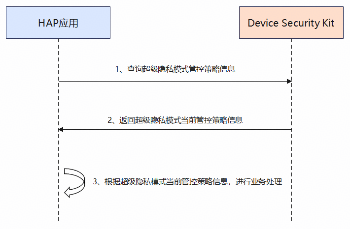

# 查询超级隐私模式管控策略场景

更新时间：2026-07-28 11:23:46

来源：https://developer.huawei.com/consumer/cn/doc/harmonyos-guides/devicesecurity-getsuperprivacypolicies

#### 场景介绍

从26.0.0开始，超级隐私模式新增查询设备当前的超级隐私管控策略信息的功能。

超级隐私模式支持一键关闭位置、相机和麦克风等敏感器件。该模式管控的器件范围将随版本更新动态调整。应用可通过Device Security Kit提供的接口获取超级隐私模式的状态及各类隐私传感器的管控策略。


#### 约束与限制

本特性需要设备上存在超级隐私模式选项。开发者可通过在设备上选择"设置 > 隐私和安全 > 超级隐私模式"查看超级隐私模式选项。


#### 业务流程





**流程说明：**
1. 开发者应用调用[getSuperPrivacyPolicies](https://developer.huawei.com/consumer/cn/doc/harmonyos-references/devicesecurity-superprivacymode-api#getsuperprivacypolicies)接口查询当前超级隐私模式状态及控制策略信息。
2. Device Security Kit收到请求后，返回当前超级隐私模式状态及各隐私传感器控制策略给开发者应用。
3. 开发者应用根据返回的超级隐私模式状态和控制策略信息进行业务处理。


#### 接口说明

以下是超级隐私管控策略查询接口，更多接口及使用方法请参见[API参考](https://developer.huawei.com/consumer/cn/doc/harmonyos-references/devicesecurity-superprivacymode-api)。

| 接口名 | 描述 |
| --- | --- |
| getSuperPrivacyPolicies() : Promise&lt;SuperPrivacyPolicyInfo&gt; | 查询当前超级隐私模式状态及控制策略信息。 |


#### 开发步骤
1. 导入超级隐私模块及相关公共模块。

  
```text
import { superPrivacyMode } from '@kit.DeviceSecurityKit';
import { hilog } from '@kit.PerformanceAnalysisKit';

const DOMAIN = 0x0000;
const TAG = 'SuperPrivacyModeTest';
```

2. 调用[getSuperPrivacyPolicies](https://developer.huawei.com/consumer/cn/doc/harmonyos-references/devicesecurity-superprivacymode-api#getsuperprivacypolicies)接口查询超级隐私模式状态及控制策略信息。

  
```json
try {
  const policyInfo = await superPrivacyMode.getSuperPrivacyPolicies();
  hilog.info(DOMAIN, TAG, `Super privacy mode = ${policyInfo.superPrivacyMode}`);
  hilog.info(DOMAIN, TAG, `Super privacy policies = ${JSON.stringify(policyInfo.superPrivacyPolicies)}`);
  // ...
} catch (err) {
  hilog.error(DOMAIN, TAG, `call getSuperPrivacyPolicies interface failed, errCode:${err?.code}, errMessage:${err?.message}`);
  // ...
}
```
