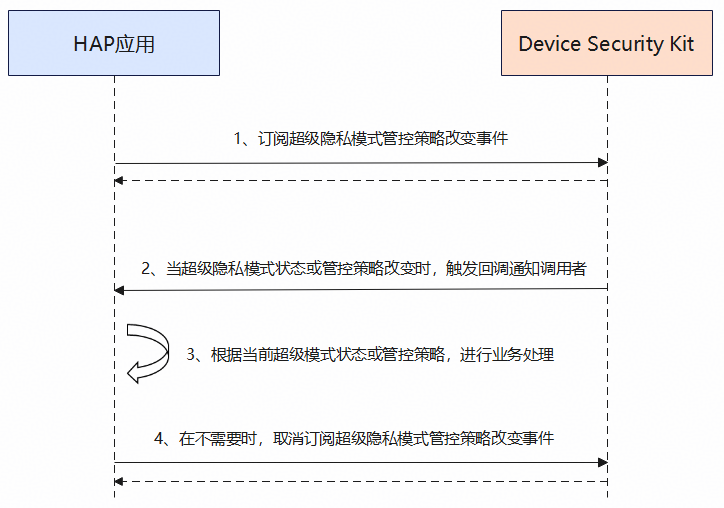

# 订阅超级隐私模式管控策略改变事件场景

更新时间：2026-07-28 11:23:46

来源：https://developer.huawei.com/consumer/cn/doc/harmonyos-guides/devicesecurity-subscribe-superprivacypolicy

#### 场景介绍

从26.0.0开始，超级隐私模式新增订阅超级隐私管控策略改变事件场景的能力。

超级隐私模式支持一键关闭位置、相机和麦克风等敏感器件。该模式管控的器件范围将随版本更新动态调整。应用可通过Device Security Kit提供的接口实时监听超级隐私模式的状态变化及各类隐私传感器的管控策略更新。


#### 约束与限制

本特性需要设备上存在超级隐私模式选项。开发者可通过在设备上选择"设置 > 隐私和安全 > 超级隐私模式"查看超级隐私模式选项。


#### 业务流程





**流程说明：**
1. 开发者应用调用[onSuperPrivacyModeOrPolicyChange](https://developer.huawei.com/consumer/cn/doc/harmonyos-references/devicesecurity-superprivacymode-api#onsuperprivacymodeorpolicychange)接口订阅超级隐私模式管控策略改变事件。
2. Device Security Kit调用回调函数通知开发者应用。
3. 开发者应用根据当前超级隐私模式的状态和控制策略信息进行业务处理。
4. 当开发者应用不需要使用超级隐私模式状态及控制策略信息时，取消订阅超级隐私模式管控策略改变事件。


#### 接口说明

以下是超级隐私模式管控策略改变事件的订阅与取消订阅接口，更多接口及使用方法请参见[API参考](https://developer.huawei.com/consumer/cn/doc/harmonyos-references/devicesecurity-superprivacymode-api)。

| 接口名 | 描述 |
| --- | --- |
| onSuperPrivacyModeOrPolicyChange(callback: Callback&lt;SuperPrivacyPolicyInfo&gt;): void | 订阅超级隐私模式或策略变化事件 |
| offSuperPrivacyModeOrPolicyChange(callback?: Callback&lt;SuperPrivacyPolicyInfo&gt;): void | 取消订阅超级隐私模式或策略变化事件 |


#### 开发步骤
1. 导入超级隐私模块及相关公共模块。

  
```text
import { superPrivacyMode } from '@kit.DeviceSecurityKit';
import { hilog } from '@kit.PerformanceAnalysisKit';

const DOMAIN = 0x0000;
const TAG = 'SuperPrivacyModeTest';
```

2. 定义超级隐私模式管控策略改变时触发的回调函数。

  
```json
const superPrivacyPolicyChangedCallback = (policyInfo: superPrivacyMode.SuperPrivacyPolicyInfo): void => {
  hilog.info(DOMAIN, TAG, `super privacy mode or policy changed`);
  hilog.info(DOMAIN, TAG, `Super privacy mode = ${policyInfo.superPrivacyMode}`);
  hilog.info(DOMAIN, TAG, `Super privacy policies = ${JSON.stringify(policyInfo.superPrivacyPolicies)}`);
  // ...
}
```

3. 调用[onSuperPrivacyModeOrPolicyChange](https://developer.huawei.com/consumer/cn/doc/harmonyos-references/devicesecurity-superprivacymode-api#onsuperprivacymodeorpolicychange)接口订阅超级隐私模式管控策略改变事件。

  
```text
hilog.info(DOMAIN, TAG, 'start register super privacy mode or policy changed listener');
try {
  superPrivacyMode.onSuperPrivacyModeOrPolicyChange(superPrivacyPolicyChangedCallback);
  hilog.info(DOMAIN, TAG, 'register super privacy mode or policy change listener success');
  // ...
} catch (err) {
  hilog.error(DOMAIN, TAG, `register super privacy mode or policy changed listener failed, errCode:${err?.code}, errMessage:${err?.message}`);
  // ...
}
```

4. 调用[offSuperPrivacyModeOrPolicyChange](https://developer.huawei.com/consumer/cn/doc/harmonyos-references/devicesecurity-superprivacymode-api#offsuperprivacymodeorpolicychange)接口取消订阅超级隐私模式管控策略改变事件。

  
```text
hilog.info(DOMAIN, TAG, 'start unregister super privacy mode or policy changed listener');
try {
  superPrivacyMode.offSuperPrivacyModeOrPolicyChange(superPrivacyPolicyChangedCallback);
  hilog.info(DOMAIN, TAG, 'unregister super privacy mode or policy changed listener success');
  // ...
} catch (err) {
  hilog.error(DOMAIN, TAG, `unregister super privacy mode or policy changed listener failed, errCode:${err?.code}, errMessage:${err?.message}`);
  // ...
}
```
