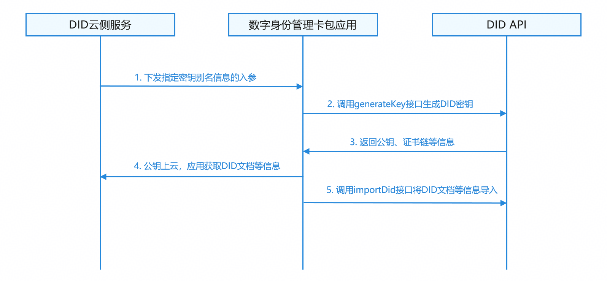
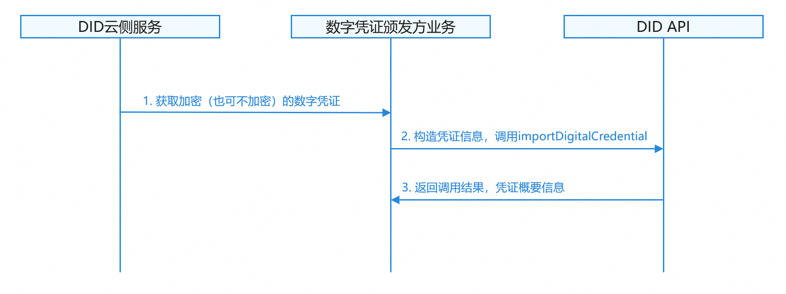
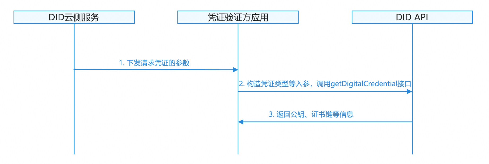

# DID数字身份服务

更新时间：2026-07-28 11:23:46

来源：https://developer.huawei.com/consumer/cn/doc/harmonyos-guides/onlineauthentication-did

从API版本26.0.0开始，新增DID（Decentralized Identifier，去中心化身份）能力。

DID提供基于W3C DID标准的身份认证和可验证凭证管理能力，支持DID密钥生成、数字凭证导入/查询/删除、数据签名等功能。


#### 场景介绍

DID模块提供去中心化身份管理和可验证凭证能力，应用可以使用这些能力实现用户身份的自主管理和可信凭证的安全存储与出示。


#### 应用场景

 - **数字身份管理**：生成和管理用户的去中心化身份（DID），支持身份的导入、查询和删除。
 - **可验证凭证管理**：导入、查询和删除可验证凭证（VC）和可验证表达（VP）。
 - **数据签名**：使用DID密钥对数据进行数字签名，确保数据的完整性和来源可信。
 - **选择性披露**：支持选择性披露凭证（SELECTIVE_DISCLOSURE_VC/VP），保护用户隐私。


#### 约束与限制

 - 开发者应用已接入DID生态，并部署符合DID标准协议的服务器。
 - 需满足以下条件，才能使用本功能。移动端设备需要支持生物特征（指纹/3D人脸），查询当前移动端设备是否支持ATL4级别的认证可信等级。

  
```text
import { BusinessError } from '@kit.BasicServicesKit';
import { userAuth } from '@kit.UserAuthenticationKit';

try {
  // 示例，查询设备人脸识别是否支持ATL4级别的认证可信等级
  userAuth.getAvailableStatus(userAuth.UserAuthType.FACE, userAuth.AuthTrustLevel.ATL4);
  console.info('current auth trust level is supported');
} catch (error) {
  const err: BusinessError = error as BusinessError;
  console.error(`current auth trust level is not supported. Code is ${err?.code}, message is ${err?.message}`);
}
```

 - 数字身份服务会将凭证信息、匿名化的指纹ID和面容ID等个人信息返回至三方应用，以提供绑定具体生物特征的免密认证能力。应用将个人信息上云前，需要向用户明示并且取得同意，详细请参考[个人数据处理说明](https://developer.huawei.com/consumer/cn/doc/harmonyos-guides/onlineauthentication-personal-data-processing-description)。


#### 业务流程


#### 启用数字身份流程





流程说明：
1. 应用构造[GenerateKeyRequest](https://developer.huawei.com/consumer/cn/doc/harmonyos-references/onlineauthentication-did-api#generatekeyrequest)，指定密钥别名、算法类型、用途等参数。
2. 应用调用[generateKey](https://developer.huawei.com/consumer/cn/doc/harmonyos-references/onlineauthentication-did-api#generatekey)接口生成DID密钥。
3. DID API返回公钥、证书链等信息。
4. 公钥上链后，应用获取DID文档等信息。
5. 应用调用[importDid](https://developer.huawei.com/consumer/cn/doc/harmonyos-references/onlineauthentication-did-api#importdid)接口将DID文档等信息导入。


#### 颁发数字凭证流程





流程说明：
1. 应用从发行方获取加密（也可不加密）的可验证凭证。
2. 构造[ImportDigitalCredentialRequest](https://developer.huawei.com/consumer/cn/doc/harmonyos-references/onlineauthentication-did-api#importdigitalcredentialrequest)，配置解密参数、显示配置等，调用[importDigitalCredential](https://developer.huawei.com/consumer/cn/doc/harmonyos-references/onlineauthentication-did-api#importdigitalcredential)接口导入凭证。
3. DID API验证凭证格式并安全存储，返回调用结果，凭证概要信息。


#### 出示数字凭证流程





流程说明：
1. 验证方云侧，云侧下发请求凭证的参数。
2. 应用构造[GetDigitalCredentialRequest](https://developer.huawei.com/consumer/cn/doc/harmonyos-references/onlineauthentication-did-api#getdigitalcredentialrequest)，指定凭证类型、验证方信息等，调用[getDigitalCredential](https://developer.huawei.com/consumer/cn/doc/harmonyos-references/onlineauthentication-did-api#getdigitalcredential)接口获取凭证。
3. DID API返回可验证表达（VP）给验证方。


#### 接口说明

业务使用DID能力进行数字身份的启用、数字凭证的导入、数字凭证的出示等。具体API说明详见[接口文档](https://developer.huawei.com/consumer/cn/doc/harmonyos-references/onlineauthentication-did-api#generatekey)。

| 接口名 | 描述 |
| --- | --- |
| generateKey | 生成DID密钥。 |
| importDid | 导入DID信息。 |
| queryDid | 查询DID信息。 |
| deleteDid | 删除DID。 |
| sign | 使用DID密钥签名数据。 |
| importDigitalCredential | 导入数字凭证。 |
| queryDigitalCredential | 查询数字凭证摘要。 |
| deleteDigitalCredential | 删除数字凭证。 |
| getDigitalCredential | 获取数字凭证。 |


#### 开发步骤


#### 启用数字身份
1. 导入did模块，构造密钥生成请求。

  
```text
import { did } from '@kit.OnlineAuthenticationKit';
import { buffer } from '@kit.ArkTS';
import { common } from '@kit.AbilityKit';
import { BusinessError } from '@kit.BasicServicesKit'; // 这些导入did等相关模块的函数放在文件最开头，后续的示例代码不再一一展示写出

// 以下获取context的代码要放进UI组件类中调用，通用的获取方法，后续的示例代码不再一一展示写出
let context: common.UIAbilityContext = this.getUIContext().getHostContext() as common.UIAbilityContext;

async function generateKey() {
  // 构造密钥生成请求
  let generateKeyRequest: did.GenerateKeyRequest = {
    keyAlias: 'myDidKey',
    keyConfig: {
      algorithm: did.KeyAlgo.SM2,
      purposeList: [did.KeyPurpose.SIGN, did.KeyPurpose.VERIFY]
    },
    authenticatorConfig: {
      authTypeList: [did.AuthType.UVM_FINGERPRINT],
      requireBioId: true
    }
  };

  try {
    let response: did.GenerateKeyResponse = await did.generateKey(context, generateKeyRequest);
    console.info('Succeeded in generating did key');
    // 处理返回的公钥、证书链等信息
  } catch (error) {
    const err: BusinessError = error as BusinessError;
    console.error(`Failed to generate did key. Code: ${err.code}, message: ${err.message}`);
  }
}
```

2. 构造DID导入请求，调用importDid接口，将DID文档等信息导入端侧。

  
```json
async function importDid() {
   let importDidRequest: did.ImportDidRequest = {
      isUpdate: false,
      did: 'did:example:123456',
      didKeyList: [{
         keyAlias: 'myDidKey',
         keyId: 'keyId123'
      }],
      didDoc: JSON.stringify({
         '@context': 'https://www.w3.org/ns/did/v1',
         id: 'did:example:123456',
         // ... 其他DID文档内容
      })
   };

   try {
      await did.importDid(context, importDidRequest);
      console.info('Succeeded in importing did');
   } catch (error) {
      const err: BusinessError = error as BusinessError;
      console.error(`Failed to import did. Code: ${err.code}, message: ${err.message}`);
   }
}
```

3. 构造查询请求，调用queryDid接口，查询端侧的did有没有导入成功。

  
```text
async function queryDid() {
   let queryDidRequest: did.QueryDidRequest = {
      did: 'did:example:123456',
      queryDidConfig: {
         requireDidKey: true,
         requireDidDoc: true,
         requireAdditionalData: true
      }
   };

   try {
      let response: did.QueryDidResponse = await did.queryDid(context, queryDidRequest);
      console.info('Succeeded in querying did');
      // 处理返回的DID密钥、DID文档等信息
   } catch (error) {
      const err: BusinessError = error as BusinessError;
      console.error(`Failed to query did. Code: ${err.code}, message: ${err.message}`);
   }
}
```

4. 如果端侧存在相关did以及did密钥，调用sign接口可以为待签名数字签名。

  
```text
async function sign() {
   let data: string = 'data to sign';
   let signRequest: did.SignRequest = {
      inData: new Uint8Array(buffer.from(data).buffer),
      keyId: 'keyId123'
   };

   try {
      let response: did.SignResponse = await did.sign(context, signRequest);
      console.info('Succeeded in signing data');
      // 处理签名结果
   } catch (error) {
      const err: BusinessError = error as BusinessError;
      console.error(`Failed to sign data. Code: ${err.code}, message: ${err.message}`);
   }
}
```

5. 调用deleteDid删除端侧对应的did信息。

  
```text
async function deleteDid() {
   try {
      await did.deleteDid(context, 'did:example:123456');
      console.info('Succeeded in deleting did');
   } catch (error) {
      const err: BusinessError = error as BusinessError;
      console.error(`Failed to delete did. Code: ${err.code}, message: ${err.message}`);
   }
}
```


#### 颁发数字凭证
1. 构造凭证导入请求，配置安全参数和显示参数。

  
```json
async function importDigitalCredential() {
   let importCredentialRequest: did.ImportDigitalCredentialRequest = {
      did: 'did:example:123456',
      credentialType: did.CredentialType.VC,
      isUpdate: false,
      credentialData: JSON.stringify({
         '@context': ['https://www.w3.org/2018/credentials/v1'],
         type: ['VerifiableCredential'],
         issuer: 'did:example:issuer',
         issuanceDate: '2024-01-01T00:00:00Z',
         credentialSubject: Object, // ... 凭证主题内容
         proof: Object, // ... 签名信息
      }),
      displayConfig: {
         credentialDisplayName: '身份证',
         issuerDisplayName: '公安部门',
         propertyDisplayName: '姓名'
      },
      securityConfig: {
         authConfig: {
            requireAuth: true
         }
      }
   };

   try {
      let response: did.ImportDigitalCredentialResponse =
         await did.importDigitalCredential(context, importCredentialRequest);
      console.info('Succeeded in importing digital credential');
   } catch (error) {
      const err: BusinessError = error as BusinessError;
      console.error(`Failed to import digital credential. Code: ${err.code}, message: ${err.message}`);
   }
}
```

2. 调用queryDigitalCredential接口查询凭证是否导入成功。

  
```text
async function queryDigitalCredential() {
   try {
      let response: did.QueryDigitalCredentialResponse =
         await did.queryDigitalCredential(context, 'did:example:123456');
      console.info('Succeeded in querying digital credential');
      // 处理凭证摘要列表
   } catch (error) {
      const err: BusinessError = error as BusinessError;
      console.error(`Failed to query digital credential. Code: ${err.code}, message: ${err.message}`);
   }
}
```

3. 调用deleteDigitalCredential接口删除端侧对应的数字凭证。

  
```text
async function deleteDigitalCredential() {
   try {
      await did.deleteDigitalCredential(context, 'did:example:123456', 'credential123');
      console.info('Succeeded in deleting digital credential');
   } catch (error) {
      const err: BusinessError = error as BusinessError;
      console.error(`Failed to delete digital credential. Code: ${err.code}, message: ${err.message}`);
   }
}
```


#### 出示数字凭证

构造凭证获取请求，调用getDigitalCredential接口。

```text
async function getDigitalCredential() {
   let getCredentialRequest: did.GetDigitalCredentialRequest = {
      credentialType: did.CredentialType.VP,
      displayConfig: {
         verifierDisplayName: '某应用',
         purpose: '身份验证'
      },
      holderConfigList: [{
         holderDid: 'did:example:123456',
         holderDidKeyId: 'keyId123'
      }],
      credentialFilterList: [{
         credentialId: 'credential123',
         issuerDid: 'did:example:issuer'
      }]
   };

   try {
      let response: did.GetDigitalCredentialResponse =
         await did.getDigitalCredential(context, getCredentialRequest);
      console.info('Succeeded in getting digital credential');
      // 处理返回的凭证数据
   } catch (error) {
      const err: BusinessError = error as BusinessError;
      console.error(`Failed to get digital credential. Code: ${err.code}, message: ${err.message}`);
   }
}
```
