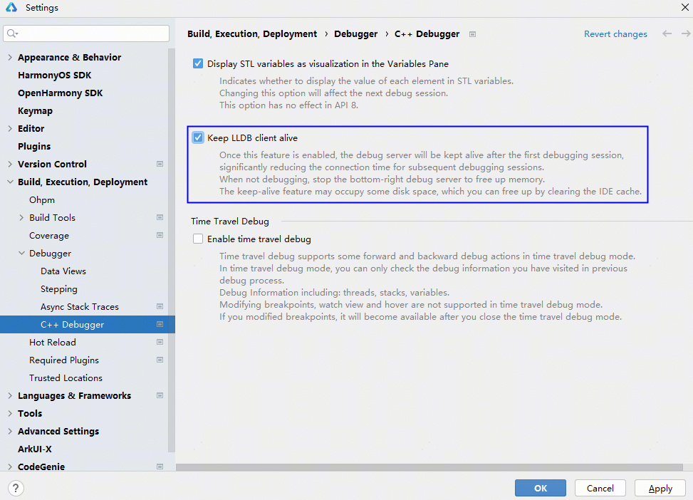
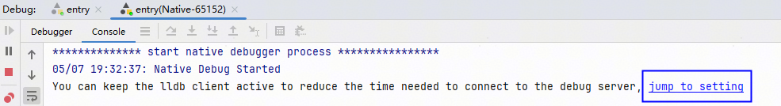
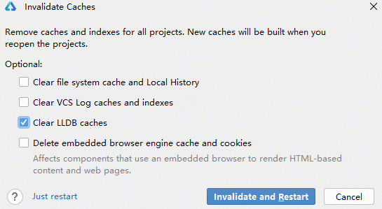

# Native调试启动加速

更新时间：2026-06-12 06:54:33

来源：https://developer.huawei.com/consumer/cn/doc/harmonyos-guides/ide-lldb-client-alive

在大型工程中，Native调试的启动耗时较长。为提升开发调试效率，从26.0.0 Beta1版本开始，新增Native调试启动加速功能。开启该功能后，首次调试完成时，调试服务器会保持活跃状态，后续再次启动调试时，可以大幅减少调试连接的耗时。
 

#### 使用约束

- 该配置是工程级配置，每个工程需要单独开启。
- 同一个工程中，同时创建多个Native调试会话，该加速功能只对第一个调试会话有效。

 
 

#### 操作步骤

在**File > Settings**（macOS为**DevEco Studio > Preferences/Settings**） **> Build, Execution, Deployment > Debugger > C++ Debugger**中，勾选**Keep LLDB client alive**开启Native调试启动加速功能。
 

 
也可以通过调试窗口控制台的超链接跳转到设置中开启。
 

 
开启开关并启动调试后，DevEco Studio底部会有调试服务器图标，调试过程中不能关闭服务器。
 

 
同时，开启开关后会占用内存和磁盘空间，在不调试时，可手动释放资源。
 
- 释放内存：点击DevEco Studio底部的调试服务器图标，关闭调试服务器释放内存。
- 释放磁盘空间：点击**File >**** Invalidate Caches**，勾选**Clear LLDB caches**，点击**Invalidate and Restart**重启DevEco Studio以清理缓存数据。

