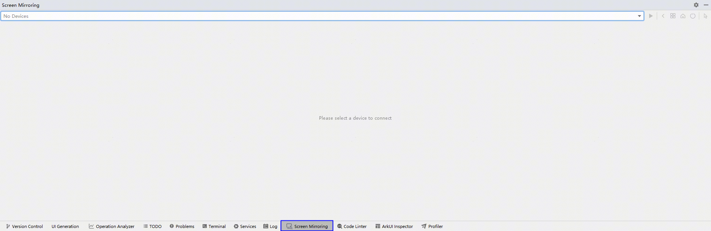
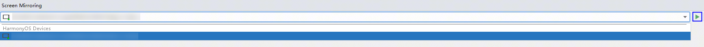

# 设备投屏

更新时间：2026-07-28 12:07:32

来源：https://developer.huawei.com/consumer/cn/doc/harmonyos-guides/ide-screen-mirroring

从26.0.0 Beta1版本开始，新增设备投屏功能，支持对已连接的设备进行投屏操作，方便查看设备屏幕内容并进行设备操控，提升开发调试效率。
 

#### 使用约束

仅支持HarmonyOS设备（穿戴设备除外），并且已通过USB或Wi-Fi连接设备。
 
 

#### 操作步骤
1. 在DevEco Studio下方点击**Screen Mirroring，**或点击菜单栏**View > Tool Windows > ****Screen Mirroring**，打开设备投屏窗口。

2. 从设备下拉列表中选择设备（设备需已连接），点击

按钮开始投屏。

3. 设备投屏后，支持对设备进行如下操作：

：停止投屏。

  

：刷新重连设备。

  

：对应设备返回键，返回上一屏幕或退出应用等。

  

：查看最近使用的应用列表。

  

：对应Home键，返回主屏幕。

  

：对应电源键，可以锁屏和亮屏。

  

：屏幕点击模式，默认为鼠标模式，点击按钮后切换为触摸屏模式，同时图标切换为

。
4. 支持使用鼠标操控屏幕、使用键盘输入等，具体参考下文介绍。
 
 

#### 操控屏幕

支持使用鼠标来模拟手指/鼠标与设备屏幕界面进行交互的场景。
  
| 常用操作 | 描述 |
| --- | --- |
| 单击屏幕 | 单击鼠标左键可以模拟点击操作，如点击应用图标等。 |
| 双击屏幕 | 双击鼠标左键可以模拟在2in1设备上的双击操作，如双击应用图标等。 |
| 单击/长按右键 | 单击/长按鼠标右键可以弹出菜单，操作方式和设备上弹出菜单的方式一致，例如设备上是通过长按弹出菜单的，在投屏中也通过长按鼠标右键弹出菜单。 |
| 拖动项目 | 长按鼠标左键可以模拟长按操作，例如长按图标进行拖动。 |
| 滑动屏幕 | 按下鼠标左键并滑动可以模拟滑动操作，鼠标模式下可用于选择文本等，触摸屏模式下可用于滚动列表、翻页等。 |
 
 
 

#### 使用键盘输入

鼠标点击输入框，可以使用计算机键盘输入字符到设备上。
 
 

#### 安装应用和上传文件

通过拖拽文件可以安装应用和上传文件到设备上。
 
- **安装应用：**拖拽HAP/HSP包会自动安装到设备上，支持一次性拖拽安装多个HAP/HSP包。
- **上传文件：**支持将本地文件上传到设备中，只需将文件拖拽到屏幕即可。支持批量上传，上传的文件存放在设备的/storage/media/100/local/files/Docs/Download/目录下，同名文件会覆盖，如果文件总大小过大（10G以上）可能会上传失败。上传文件后，可以在设备的**文件管理 > 我的手机 > 下载**中查看。
