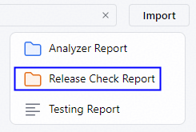
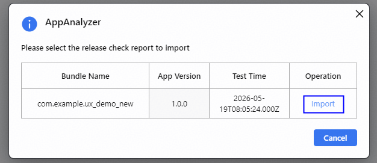
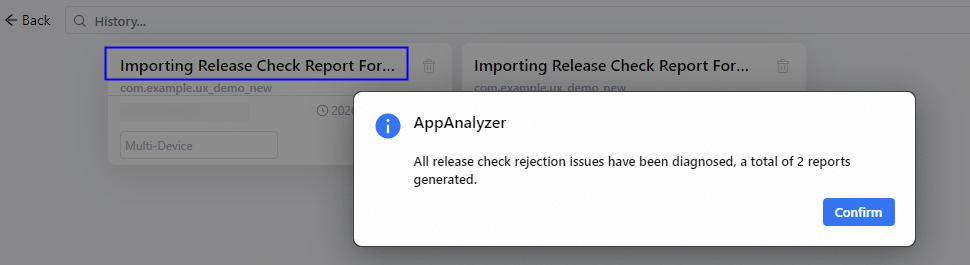

# 导入上架检测报告进行诊断

更新时间：2026-06-12 06:54:33

来源：https://developer.huawei.com/consumer/cn/doc/harmonyos-guides/ide-release-check-report

应用在AppGallery申请上架不通过时会生成报告。从26.0.0 Beta1版本开始，AppAnalyzer支持导入上架审核不通过的报告并进行诊断分析，获得可能的故障原因并生成体检报告。
 1. 点击菜单栏**Tools > ****AppAnalyzer**，打开AppAnalyzer页面，点击底部**History**打开历史报告页面，点击右上角的**Import**** > Release Check Report**。

2. 确认需要导入的上架检测报告，点击**Import**，等待AppAnalyzer导入报告并对问题进行诊断分析。

3. 诊断完成后，会提示生成的体检报告的数量，请在当前的历史报告页面中查看对应的报告。

