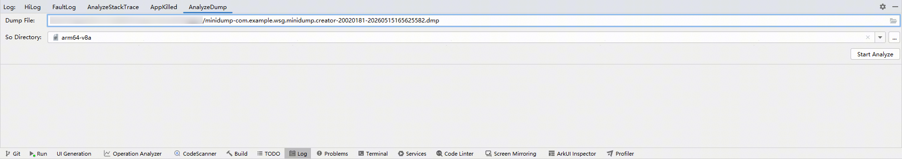
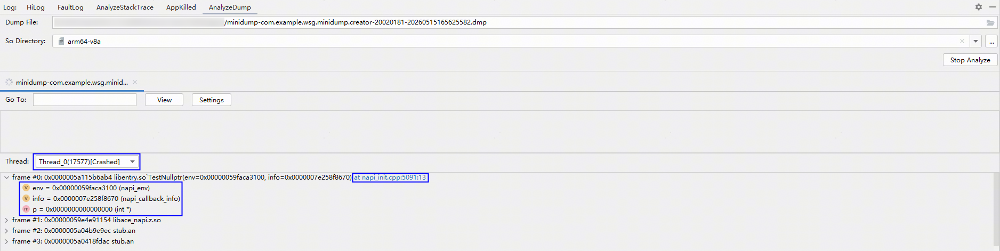
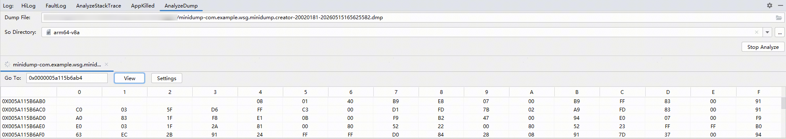
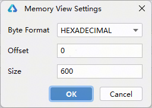

# 解析应用minidump文件

更新时间：2026-06-24 07:08:31

来源：https://developer.huawei.com/consumer/cn/doc/harmonyos-guides/ide-analyze-dump

应用崩溃时支持生成minidump文件，具体请参考[OH_HiAppEvent_SetEventConfig接口说明](https://developer.huawei.com/consumer/cn/doc/harmonyos-guides/hiappevent-watcher-crash-events#oh_hiappevent_seteventconfig接口说明)。从26.0.0版本开始，DevEco Studio支持对minidump文件进行解析，并展示异常堆栈，帮助开发者快速分析定位问题。
 

#### 操作步骤
1. 打开**Log**窗口，点击**AnalyzeDump**打开界面，选择要解析的dump文件和[带调试信息的so目录](https://developer.huawei.com/consumer/cn/doc/harmonyos-guides/ide-exception-stack-parsing-principle#section1623725511263)，点击**Start Analyze**开始解析。
> [!NOTE]
> 应用运行崩溃时产生的dump，需要借助同一次构建生成的so文件中的符号信息才能解析。因此，此处选择的so目录，必须是该应用在构建时存放so文件的原始目录。若替换为其他时间或通过其他构建生成的so目录，会因符号不一致导致无法解析。

  

2. 等待解析成功后，默认会展示异常线程和对应的堆栈，展开堆栈可查看变量信息，支持切换查看不同线程的堆栈，点击堆栈中的超链接可以跳转到对应的源码。

3. 支持查看指定地址的内存，填写内存地址，点击**View**即可查看。

  点击**Settings**，可设置进制、偏移量和内存数量。

  

