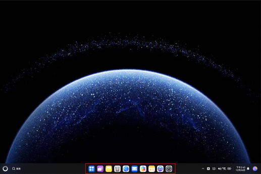
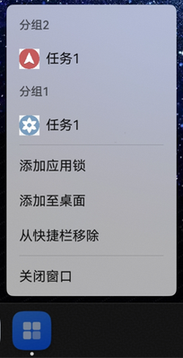

# 应用接入快捷栏

更新时间：2026-04-28 03:31:56

来源：https://developer.huawei.com/consumer/cn/doc/harmonyos-guides/desktop-quickbar-extension-guide

从6.0.2(22)开始，支持应用接入快捷栏。


##### 场景介绍

快捷栏指的是PC/2in1设备的屏幕底部的图标区域，具体如下图。





应用接入快捷栏之后，快捷栏的应用图标菜单会显示应用自定义的菜单项，应用可以添加、删除、更新、查询菜单项，具体效果如下图。





##### 接口说明

以下列出应用接入快捷栏菜单的相关API，具体API说明详见[接口文档](https://developer.huawei.com/consumer/cn/doc/harmonyos-references/desktop-quickbar-extension-manager)。

> [!NOTE]
> Desktop Extension Kit相关API仅在2in1设备上生效。


**表1** 应用接入快捷栏菜单相关功能接口介绍

| 接口名 | 描述 |
| --- | --- |
| getCustomCategories(context: common.Context): Promise<CustomCategory[]> | 获取所有在快捷栏菜单定义的分组。 |
| addCustomCategory(context: common.Context, categoryName: string): Promise&lt;CustomCategory&gt; | 添加快捷栏菜单分组。 |
| updateCustomCategory(context: common.Context, category: CustomCategory): Promise&lt;void&gt; | 更新快捷栏菜单分组。 |
| deleteCustomCategory(context: common.Context, categoryId: number): Promise&lt;void&gt; | 删除快捷栏菜单分组。 |
| getTasksFromCategory(context: common.Context, categoryId: number): Promise<QuickTask[]> | 获取某个快捷栏菜单的分组下的所有任务。 |
| addQuickTask(context: common.Context, categoryId: number, taskInfo: QuickTaskInfo): Promise&lt;QuickTask&gt; | 添加快捷栏菜单任务。 |
| updateQuickTask(context: common.Context, task: QuickTask): Promise&lt;void&gt; | 更新快捷栏菜单任务。 |
| deleteQuickTask(context: common.Context, taskId: number): Promise&lt;void&gt; | 删除快捷栏菜单任务。 |
| addQuickBarGroup(context: common.Context, group: QuickBarGroup): Promise&lt;void&gt; | 增加快捷栏分组。 |
| deleteQuickBarGroup(context: common.Context, groupKey: string): Promise&lt;void&gt; | 删除快捷栏分组。 |
| getQuickBarGroups(context: common.Context): Promise<QuickBarGroup[]> | 获取所有分组信息。 |
| setWindowToGroup(context: common.Context, windowid:string, groupKey?: string): Promise&lt;void&gt; | 给分组增加窗口。 |


##### 快捷栏菜单分组
1. 导入相关模块。

  
```text
import { quickBarManager }  from '@kit.DeskTopExtensionKit';
import { UIExtensionContentSession, Want, UIAbility } from '@kit.AbilityKit';
import { image } from '@kit.ImageKit';
import { resourceManager } from '@kit.LocalizationKit';
```

2. 新建一个TestAbility.ets文件（例如在entry/src/main/ets/entryability文件夹下），同时新建一个TestIndex的页面（例如在entry/src/main/ets/pages目录下），点击图标菜单任务后可跳转到该页面。

  
```text
let TAG = 'TestAbility';
export default class TestAbility extends UIAbility {
  onCreate() {
    console.info(TAG, `onCreate`);
  }

  onSessionCreate(want: Want, session: UIExtensionContentSession) {
    console.info(TAG, `onSessionCreate, want: ${want.abilityName}`);
    // pages/TestIndex为点击菜单任务拉起的页面
    session.loadContent('pages/TestIndex');
  }

  onForeground() {
    console.info(TAG, `onForeground`);
  }

  onBackground() {
    console.info(TAG, `onBackground`);
  }

  onSessionDestroy(session: UIExtensionContentSession) {
    console.info(TAG, `onSessionDestroy`);
  }

  onDestroy() {
    console.info(TAG, `onDestroy`);
  }
}
```

3. 在TestAbility所在模块下的module.json5文件中配置的Ability的信息。

  
```ArkTS
{
  "name": "TestAbility",
  "srcEntry": "./ets/entryability/TestAbility.ets",
  "description": "$string:EntryAbility_desc",
  "icon": "$media:layered_image",
  "label": "$string:EntryAbility_label",
  "startWindowIcon": "$media:startIcon",
  "startWindowBackground": "$color:start_window_background",
  "exported": true,
  "skills": [
    {
      "entities": [
        "entity.system.home"
      ],
      "actions": [
        "action.system.home"
      ]
    }
  ],
}
```

4. 在页面组件内(如：TestIndex.ets)中调用接口完成如下步骤。调用[addCustomCategory](https://developer.huawei.com/consumer/cn/doc/harmonyos-references/desktop-quickbar-extension-manager#quickbarmanageraddcustomcategory)接口添加一个快捷栏菜单分组，添加分组后才可以往分组里添加任务。

  
```json
let context: Context | undefined = this.getUIContext().getHostContext();
if (context === undefined) {
  return;
}
try {
  const res = await quickBarManager.addCustomCategory(context, '最近任务');
  console.info(`customCategory info: ${JSON.stringify(res)}`);
} catch (error) {
  console.error(`addCustomCategory failed. error code: ${error.code}, error message: ${error.message}`);
}
```

5. 添加分组后可以调用[addQuickTask](https://developer.huawei.com/consumer/cn/doc/harmonyos-references/desktop-quickbar-extension-manager#quickbarmanageraddquicktask)接口在分组中添加快捷栏菜单任务。打开应用图标在快捷栏的右键菜单，即可看到添加后对应的菜单项。

  
```json
let context: Context | undefined = this.getUIContext().getHostContext();
if (context === undefined) {
  return;
}
// 获取resourceManager资源管理器
const resourceMgr: resourceManager.ResourceManager = context.resourceManager;
// 创建任务的pixelMap，需在资源rawfile文件夹中预置testImage.png图片
const fileData = resourceMgr.getRawFileContentSync('testImage.png');
const imageSource = image.createImageSource(fileData.buffer);
const imagePixelMap = await imageSource.createPixelMap();
let parameters: quickBarManager.ParameterItem = {
  key: 'testKey',
  value: 'testValue'
}
// 构建task任务信息
const task: quickBarManager.QuickTaskInfo = {
  taskName: '测试任务名称',
  abilityName: 'TestAbility',
  // 参数可选
  moduleName: 'entry',
  // 参数可选
  taskIcon: imagePixelMap,
  // 参数可选
  taskDetail: '任务的描述',
  // 参数可选
  parameters: [parameters]
}

try {
  // 获取所有的分组信息，将任务添加到想要的分组中
  const categoryList = await quickBarManager.getCustomCategories(context);
  // 选择添加任务到第一个分组中
  const res = await quickBarManager.addQuickTask(context, categoryList[0].categoryId, task);
  console.info(`quickTask info: ${JSON.stringify(res)}`);
} catch (error) {
  console.error(`addQuickTask failed. error code: ${error.code}, error message: ${error.message}`);
}
```

6. 调用[getCustomCategories](https://developer.huawei.com/consumer/cn/doc/harmonyos-references/desktop-quickbar-extension-manager#quickbarmanagergetcustomcategories)接口获取定义所有分组信息。

  
```json
let context: Context | undefined = this.getUIContext().getHostContext();
if (context === undefined) {
  return;
}
try {
  const res = await quickBarManager.getCustomCategories(context);
  console.info(`customCategoryList info: ${JSON.stringify(res)}`);
} catch (error) {
  console.error(`getCustomCategories failed. error code: ${error.code}, error message: ${error.message}`);
}
```

7. 调用[getTasksFromCategory](https://developer.huawei.com/consumer/cn/doc/harmonyos-references/desktop-quickbar-extension-manager#quickbarmanagergettasksfromcategory)接口获取分组下的所有任务信息，此处获取了第一个分组下的所有任务。

  
```json
let context: Context | undefined = this.getUIContext().getHostContext();
if (context === undefined) {
  return;
}
try {
  // 获取所有的分组信息，用于获取分组下所有的任务
  const category = await quickBarManager.getCustomCategories(context);
  // 选择获取第一个分组下的所有任务
  const res = await quickBarManager.getTasksFromCategory(context, category[0].categoryId);
  console.info(`quickTaskList info: ${JSON.stringify(res)}`);
} catch (error) {
  console.error(`getTasksFromCategory failed. error code: ${error.code}, error message: ${error.message}`);
}
```

8. 调用[updateCustomCategory](https://developer.huawei.com/consumer/cn/doc/harmonyos-references/desktop-quickbar-extension-manager#quickbarmanagerupdatecustomcategory)接口更新快捷栏菜单分组信息，此处更新了分组的名称。

  
```text
let context: Context | undefined = this.getUIContext().getHostContext();
if (context === undefined) {
  return;
}
const category: quickBarManager.CustomCategory = {
  categoryId: 1,
  categoryName: 'demo'
}
try {
  await quickBarManager.updateCustomCategory(context, category);
} catch (error) {
  console.error(`updateCustomCategory failed. error code: ${error.code}, error message: ${error.message}`);
}
```

9. 调用[updateQuickTask](https://developer.huawei.com/consumer/cn/doc/harmonyos-references/desktop-quickbar-extension-manager#quickbarmanagerupdatequicktask)接口更新快捷栏菜单任务信息。以下示例代码以更新任务的图标信息为例。

  
```text
let context: Context | undefined = this.getUIContext().getHostContext();
if (context === undefined) {
  return;
}
// 获取resourceManager资源管理器
const resourceMgr: resourceManager.ResourceManager = context.resourceManager;
// 创建任务的pixelMap，需在资源rawfile文件夹中预置testUpdateImage.png图片
const fileData = resourceMgr.getRawFileContentSync('testUpdateImage.png');
const imageSource = image.createImageSource(fileData.buffer);
const imagePixelMap = await imageSource.createPixelMap();
let parameters: quickBarManager.ParameterItem = {
  key: 'testKey',
  value: 'testValue'
}
// 构建task任务信息
const taskInfo: quickBarManager.QuickTaskInfo = {
  taskName: '测试任务名称',
  abilityName: 'TestAbility',
  // 参数可选
  moduleName: 'entry',
  // 参数可选
  taskIcon: imagePixelMap,
  // 参数可选
  taskDetail: '任务的描述',
  // 参数可选
  parameters: [parameters]
}

const task: quickBarManager.QuickTask = {
  taskId: 1,
  categoryId: 1,
  taskInfo: taskInfo
}

try {
  await quickBarManager.updateQuickTask(context,task);
} catch (error) {
  console.error(`updateQuickTask failed. error code: ${error.code}, error message: ${error.message}`);
}
```

10. 调用[deleteQuickTask](https://developer.huawei.com/consumer/cn/doc/harmonyos-references/desktop-quickbar-extension-manager#quickbarmanagerdeletequicktask)接口删除不需要的快捷栏菜单任务，此处删除了taskId为1的任务。

  
```text
let context: Context | undefined = this.getUIContext().getHostContext();
if (context === undefined) {
  return;
}
try {
  // 删除taskId为1的任务
  await quickBarManager.deleteQuickTask(context, 1);
} catch (error) {
  console.error(`deleteQuickTask failed. error code: ${error.code}, error message: ${error.message}`);
}
```

11. 调用[deleteCustomCategory](https://developer.huawei.com/consumer/cn/doc/harmonyos-references/desktop-quickbar-extension-manager#quickbarmanagerdeletecustomcategory)接口删除不需要的快捷栏菜单分组，此处删除了categoryId为1的分组，它的所有任务也会被一起删除。

  
```text
let context: Context | undefined = this.getUIContext().getHostContext();
if (context === undefined) {
  return;
}
try {
  // 删除categoryId为1的分组
  await quickBarManager.deleteCustomCategory(context, 1);
} catch (error) {
  console.error(`deleteCustomCategory failed. error code: ${error.code}, error message: ${error.message}`);
}
```


##### 快捷栏自定义窗口分组
1. 在entry/src/main/ets/pages目录下创建一个空页面文件，并增加一个按钮控件。

  
```text
@Entry
@Component
struct Index {
  build() {
    Button('button')
      .onClick(e => {
        // 处理点击事件
      })
  }
}
```

2. 在按钮控件的onClick方法中调用[addQuickBarGroup](https://developer.huawei.com/consumer/cn/doc/harmonyos-references/desktop-quickbar-extension-manager#quickbarmanageraddquickbargroup)接口，增加快捷栏分组。

  
```text
import { quickBarManager } from '@kit.DeskTopExtensionKit';
import { image } from '@kit.ImageKit';
import { resourceManager } from '@kit.LocalizationKit';

// 获取资源管理器
const resourceMgr: resourceManager.ResourceManager = getContext().resourceManager;
// 从rawfile目录中获取图片
const whiteFileData = resourceMgr.getRawFileContentSync('icon.png');
const whiteImageSource = image.createImageSource(whiteFileData.buffer);
const imagePixelMap = await whiteImageSource.createPixelMap();
 try {
   // 增加分组
   await quickBarManager.addQuickBarGroup(getContext(), {
     groupKey: 'group_one', // 分组名
     groupIcon: imagePixelMap // 分组图标
   });
 } catch (error) {
   console.error(`error code: ${error.code}, error message: ${error.message}`);
 }
```

3. 新增加一个按钮控件，并在onClick方法中调用[getQuickBarGroups](https://developer.huawei.com/consumer/cn/doc/harmonyos-references/desktop-quickbar-extension-manager#quickbarmanagergetquickbargroups)接口，获取所有分组信息。

  
```text
import { quickBarManager } from '@kit.DeskTopExtensionKit';

try {
  // 获取所有分组
  const groups = await quickBarManager.getQuickBarGroups(getContext());
} catch (error) {
  console.error(`error code: ${error.code}, error message: ${error.message}`);
}
```

4. 新增加一个按钮控件，并在onClick方法中调用[setWindowToGroup](https://developer.huawei.com/consumer/cn/doc/harmonyos-references/desktop-quickbar-extension-manager#quickbarmanagersetwindowtogroup)接口，给分组增加窗口信息。

  
```text
import { quickBarManager } from '@kit.DeskTopExtensionKit';

try {
  // 将id为80的窗口，增加到分组名为 group_one 的分组
  await quickBarManager.setWindowToGroup(getContext(), '80', 'group_one');
} catch (error) {
  console.error(`deleteCustomCategory failed. error code: ${error.code}, error message: ${error.message}`);
}
```

5. 新增加一个按钮控件，并在onClick方法中调用[deleteQuickBarGroup](https://developer.huawei.com/consumer/cn/doc/harmonyos-references/desktop-quickbar-extension-manager#quickbarmanagerdeletequickbargroup)接口，删除快捷栏分组。

  
```text
import { quickBarManager } from '@kit.DeskTopExtensionKit';

try {
  // 删除分组名为group_one的分组
  await quickBarManager.deleteQuickBarGroup(getContext(), 'group_one');
} catch (error) {
  console.error(`error code: ${error.code}, error message: ${error.message}`);
}
```
