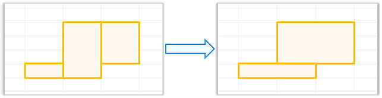

# 使用RectPartition求解矩形划分

更新时间：2026-04-30 02:41:24

来源：https://developer.huawei.com/consumer/cn/doc/harmonyos-guides/fast-rect-partition

矩形划分求解器（Rectangular Partition Solver）用于解决矩形划分问题。其接收若干个彼此不相交的矩形作为输入（主要关注这些矩形共同定义的区域的并集），计算出覆盖相同区域的矩形划分方案，并使输出的矩形数量尽可能少（但不保证最优）。形如下方示意图。





其相关定义如下：一个矩形

为二维网格内横纵坐标满足

的所有单元矩形构成的集合（坐标系说明：X轴从左到右递增，Y轴从上到下递增）。两个矩形相交，当且仅当它们共享至少一个公共的单元矩形。

在矩形划分问题（Rectangular Partition Problem）中，给定N个彼此不相交的矩形，要求输出M个矩形，使其满足如下几点：

 - 输出的M个矩形彼此不相交。
 - 输出的M个矩形的并集与输入的N个矩形的并集完全相同。
 - 输出的矩形数量M尽可能少。


矩形划分求解器运行的时间复杂度为 

，可以高效处理大规模输入数据。在网格数据处理和空间几何计算等优化场景中，可以使用矩形划分求解器提升区域处理效率，减少冗余空间。


##### 接口说明

具体API说明详见[接口文档](https://developer.huawei.com/consumer/cn/doc/harmonyos-references/fast-kit-fast)。

| 名称 | 描述 |
| --- | --- |
| FAST_EXPORT FAST_ErrorCode HMS_FAST_RectPartition_CreateConfig (FAST_RectPartitionConfig **config) | 创建矩形划分求解器的不透明配置。 |
| FAST_EXPORT void HMS_FAST_RectPartition_DestroyConfig (FAST_RectPartitionConfig *config) | 销毁矩形划分求解器的不透明配置。 |
| FAST_EXPORT FAST_ErrorCode HMS_FAST_RectPartition_SetAlgo (FAST_RectPartitionConfig *config, const char *name) | 设置矩形划分求解器使用的算法。目前仅支持扫描线算法“SweepLineAlgo”，输出数量尽可能少（不保证最优性）的不相交矩形集合，复杂度为。 |
| FAST_EXPORT FAST_ErrorCode HMS_FAST_RectPartition_Solve (FAST_RectPartitionConfig *config, size_t size, const FAST_Rect *origin, FAST_Rect *result, size_t *resultSize) | 在指定不透明配置下解决矩形划分问题。函数接收若干个彼此不相交的矩形作为输入，计算出覆盖相同区域的矩形划分方案，并使输出的矩形数量尽可能少。 说明： 1. 输入须保证矩形两两不相交（即任意两个矩形满足： 或 或或 ），否则函数返回FAST_ERROR_CODE_ILLEGAL_INPUT。 2. 函数能保证输出矩形的数量小于等于输入矩形的数量。 |


##### 开发步骤
1. 在CMake脚本中链接相关动态库。

  
```text
target_link_libraries(entry PUBLIC libfast_ads.so)
```

2. 调用HMS_FAST_RectPartition_CreateConfig生成矩形划分求解器配置实例（FAST_RectPartitionConfig）。
3. 调用HMS_FAST_RectPartition_SetAlgo设置求解算法为“SweepLineAlgo”（扫描线算法）。
4. 调用HMS_FAST_RectPartition_Solve计算矩形划分方案。
5. 调用HMS_FAST_RectPartition_DestroyConfig销毁矩形划分求解器配置实例。

```text
#include <cstdio>
#include <cstdlib>
#include "FASTKit/fast_solver_rect_partition.h"

// 定义一个函数来打印矩形
void print_rect(const FAST_Rect* rect) {
    printf("Rect: left=%d, top=%d, right=%d, bottom=%d\n",
           rect->left, rect->top, rect->right, rect->bottom);
}

FAST_ErrorCode rect_partition_demo() {
    // 定义输入矩形
    FAST_Rect origin[] = {
        {1, 4, 1, 6},
        {2, 1, 2, 6},
        {3, 1, 3, 3}
    };
    size_t size = sizeof(origin) / sizeof(FAST_Rect);

    // 定义输出矩形
    FAST_Rect* result = (FAST_Rect*)malloc(size * sizeof(FAST_Rect));
    size_t result_size = 0;

    FAST_RectPartitionConfig* config = nullptr;
    FAST_ErrorCode ret;

    do {
        // 创建配置
        ret = HMS_FAST_RectPartition_CreateConfig(&config);
        if (ret != FAST_ERROR_CODE_SUCCESS) {
            printf("Failed to create config: %d\n", ret);
            break;
        }

        // 设置算法
        ret = HMS_FAST_RectPartition_SetAlgo(config, "SweepLineAlgo");
        if (ret != FAST_ERROR_CODE_SUCCESS) {
            printf("Failed to set algorithm: %d\n", ret);
            break;
        }

        // 计算矩形划分方案
        ret = HMS_FAST_RectPartition_Solve(config, size, origin, result, &result_size);
        if (ret != FAST_ERROR_CODE_SUCCESS) {
            printf("Failed to solve: %d\n", ret);
            break;
        }

        // 打印结果
        printf("Resulting rectangles(result_size=%ld):\n", result_size);
        for (size_t i = 0; i < result_size; ++i) {
            print_rect(&result[i]);
        }
        /*
            Resulting rectangles(result_size=2):
            Rect: left=1, top=4, right=2, bottom=6
            Rect: left=2, top=1, right=3, bottom=3
         */

    } while (0);


    // 销毁配置
    HMS_FAST_RectPartition_DestroyConfig(config);

    // 释放数组
    free(result);

    return ret;
}
```
