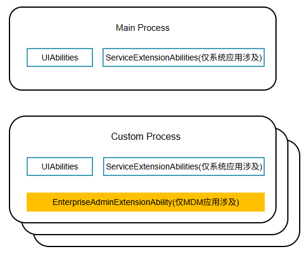
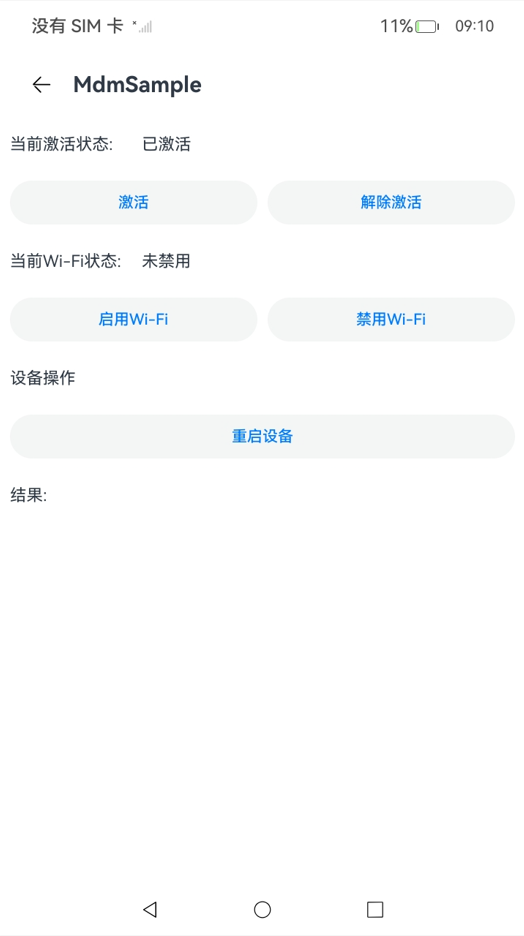
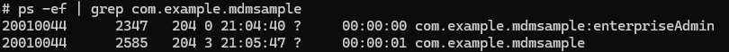
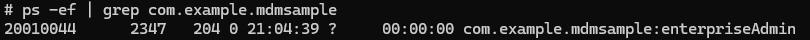
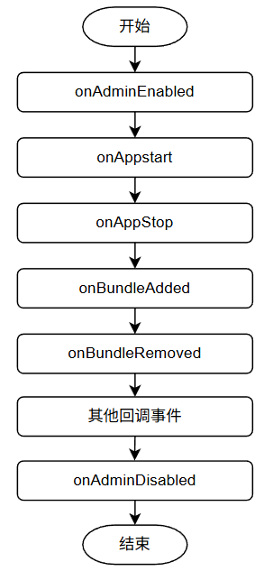

# 应用模型

更新时间：2026-05-26 06:48:54

来源：https://developer.huawei.com/consumer/cn/doc/harmonyos-guides/mdm-kit-application-model

##### 概述

应用模型是系统为开发者提供的应用程序所需能力的抽象提炼，它提供了应用程序必需的组件和运行机制。借助应用模型，开发者可以基于一套统一的模型进行应用开发，使应用开发更简单、高效。

##### Admin组件的基础概念

[企业设备管理扩展组件](https://developer.huawei.com/consumer/cn/doc/harmonyos-guides/mdm-kit-term#企业设备管理扩展能力)，是[MDM应用](https://developer.huawei.com/consumer/cn/doc/harmonyos-guides/mdm-kit-term#mdm应用设备管理应用)的必备组件。开发MDM应用时，需要定义一个[EnterpriseAdminExtensionAbility](https://developer.huawei.com/consumer/cn/doc/harmonyos-references/js-apis-enterpriseadminextensionability)类型的[ExtensionAbility](https://developer.huawei.com/consumer/cn/doc/harmonyos-references/js-apis-app-ability-extensionability)组件用于激活MDM应用，该组件被激活后将作为独立的后台进程存在。

##### 进程模型

MDM应用进程模型继承于普通应用[进程模型](https://developer.huawei.com/consumer/cn/doc/harmonyos-guides/process-model-stage#进程模型-1)，在普通应用模型基础上MDM应用会多一个独立的EnterpriseAdmin进程，MDM应用的Admin组件被激活后，EnterpriseAdmin进程会被创建，EnterpriseAdmin进程作为设备管理应用的后台进程，用于接收MDM应用的激活、取消激活等事件的回调。EnterpriseAdmin进程的生命周期不受到主进程的影响，由系统管理其生命周期。Admin组件的激活方式不同，EnterpriseAdmin进程的生命周期的[管理方式](#admin组件激活规格的差异)也不同。

**图1** MDM应用进程模型

##### EnterpriseAdmin进程的生命周期

Admin组件被激活后有独立的进程，支持系统状态变更回调。与应用的主进程分属不同的进程，进程的启停由[EDM](https://developer.huawei.com/consumer/cn/doc/harmonyos-guides/mdm-kit-term#edm)服务管理，应用处于后台时Admin进程也可以运行。

**图2** MDM应用处于前台并且已经激活时

**图3** 存在MDM应用的前台进程和EnterpriseAdmin进程

**图4** 应用主进程停止时，EnterpriseAdmin进程仍然运行

**图5** EnterpriseAdmin进程支持系统事件回调

 - onAdminEnabled：当MDM应用的Admin组件被激活时的事件回调。
 - onAdminDisabled：当MDM应用的Admin组件被取消激活时的事件回调。
 - onAppStart：应用启动的事件回调，回调的参数中包含应用包名。需要通过[adminManager.subscribeManagedEventSync](https://developer.huawei.com/consumer/cn/doc/harmonyos-references/js-apis-enterprise-adminmanager#adminmanagersubscribemanagedeventsync)接口注册MANAGED_EVENT_APP_START事件才能收到此回调。
 - onAppStop：应用停止的事件回调，回调的参数中包含应用包名。需要通过[adminManager.subscribeManagedEventSync](https://developer.huawei.com/consumer/cn/doc/harmonyos-references/js-apis-enterprise-adminmanager#adminmanagersubscribemanagedeventsync)接口注册MANAGED_EVENT_APP_STOP事件才能收到此回调。
 - onBundleAdded：应用安装事件回调，回调的参数中包含应用包名和用户ID。需要通过[adminManager.subscribeManagedEventSync](https://developer.huawei.com/consumer/cn/doc/harmonyos-references/js-apis-enterprise-adminmanager#adminmanagersubscribemanagedeventsync)接口注册MANAGED_EVENT_BUNDLE_ADDED事件才能收到此回调。
 - onBundleRemoved：应用卸载事件回调，回调的参数中包含应用包名和用户ID。需要通过[adminManager.subscribeManagedEventSync](https://developer.huawei.com/consumer/cn/doc/harmonyos-references/js-apis-enterprise-adminmanager#adminmanagersubscribemanagedeventsync)接口注册MANAGED_EVENT_BUNDLE_REMOVED事件才能收到此回调。
 - 更多事件回调请参考[ManagedEvent](https://developer.huawei.com/consumer/cn/doc/harmonyos-references/js-apis-enterprise-adminmanager#managedevent)。

##### Admin组件激活规格的差异

Admin组件有不同的激活方式，可以通过不同的接口，例如[adminManager.enableDeviceAdmin](https://developer.huawei.com/consumer/cn/doc/harmonyos-references/js-apis-enterprise-adminmanager#adminmanagerenabledeviceadmin23)，[adminManager.startAdminProvision](https://developer.huawei.com/consumer/cn/doc/harmonyos-references/js-apis-enterprise-adminmanager#adminmanagerstartadminprovision15)，激活后所具备的能力也有不同。详情如下表所示：

| 特性 | SDA | DA | BDA |
| --- | --- | --- | --- |
| 防卸载能力 | 禁止用户卸载 | 默认情况下用户可以卸载 | 禁止卸载 |
| MDM管控接口调用权限 | 支持所有public管控接口 | 支持所有public管控接口 | 支持申请ohos.permission.PERSONAL_MANAGE_RESTRICTIONS权限可调用的接口 |
| 角色支持数量 | 最多1个 | 最多10个 | 无数量限制 |

> [!NOTE]
> 1.BDA与其他 admin角色 不能同时存在。 2.SDA和DA同时存在的数量加起来最多10个。SDA具备管理其他DA应用的能力（激活/去激活），而DA仅能对设备进行管控，无法管理其他DA应用。当MDM应用激活为SDA时，具备管控其他DA的能力，可以通过调用 adminManager.enableDeviceAdmin 接口激活其他DA应用，或调用 adminManager.disableDeviceAdmin 接口去激活其他DA应用。

##### 管控接口授权原理

MDM应用的Admin组件需经企业授权方可生效。具体而言，企业需要通过调用MDM Kit接口进行Admin组件的激活。在此操作之前，该组件仅处于声明状态，不具备实际能力，Admin组件激活之后，在MDM应用的任意进程，都可以调用MDM管控接口。

##### 管控接口权限校验机制

MDM管控接口使用[ACL授权](https://developer.huawei.com/consumer/cn/doc/harmonyos-guides/app-permission-mgmt-overview#权限机制中的基本概念)进行访问权限校验，同时会校验Admin组件的激活状态与激活类型。MDM应用调用MDM管控接口时须同时具备上述三个条件，否则调用会报错[9200001](https://developer.huawei.com/consumer/cn/doc/harmonyos-references/errorcode-enterprisedevicemanager#section9200001-应用没有激活成设备管理器)、[201](https://developer.huawei.com/consumer/cn/doc/harmonyos-references/errorcode-universal#section201-权限校验失败)或[9200002](https://developer.huawei.com/consumer/cn/doc/harmonyos-references/errorcode-enterprisedevicemanager#section9200002-设备管理器权限不够)。

**图6** EDM服务校验逻辑

