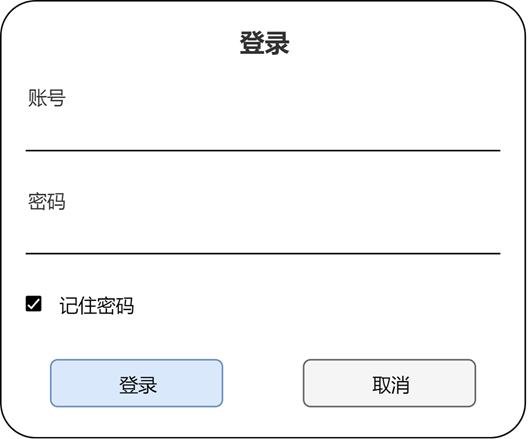
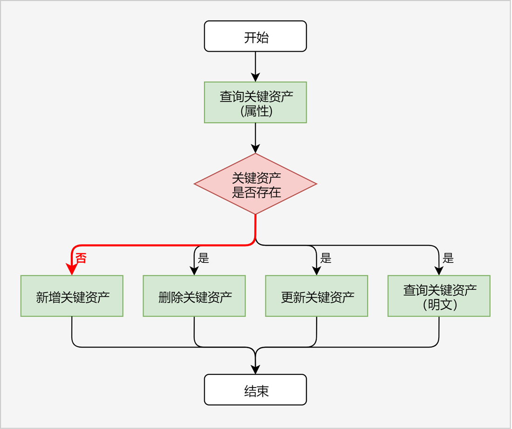

# 保护密码类数据

更新时间：2026-03-09 02:50:43

来源：https://developer.huawei.com/consumer/cn/doc/harmonyos-guides/asset-scenario1

> [!NOTE]
> 密码类数据可以是密码、登录令牌、信用卡号等用户敏感数据。

## 场景描述

用户在应用/浏览器中登录账号时，可以选择“记住密码”（如图）。针对此种场景，应用/浏览器可以将用户密码存储在ASSET中，由ASSET保证用户密码的安全性。 用户再次打开登录界面时，应用/浏览器可以从ASSET中查询用户密码，并将其自动填充到密码输入框，用户只需点击“登录”按钮即可完成账号登录，极大地提升了用户体验。

## 关键流程

业务调用ASSET保护密码类数据（后文统称为“关键资产”），可以参照以下流程进行开发。

业务查询符合条件的关键资产属性，根据查询成功/失败，判断关键资产是否存在。  开发步骤参考[查询关键资产(ArkTS)](https://developer.huawei.com/consumer/cn/doc/harmonyos-guides/asset-js-query) / [查询关键资产(C/C++)](https://developer.huawei.com/consumer/cn/doc/harmonyos-guides/asset-native-query)，代码示例参考[查询单条关键资产属性(ArkTS)](https://developer.huawei.com/consumer/cn/doc/harmonyos-guides/asset-js-query#查询单条关键资产属性) / [查询单条关键资产属性(C/C++)](https://developer.huawei.com/consumer/cn/doc/harmonyos-guides/asset-native-query#查询单条关键资产属性)。  如果关键资产不存在，业务可选择：  新增关键资产，开发步骤参考[新增关键资产(ArkTS)](https://developer.huawei.com/consumer/cn/doc/harmonyos-guides/asset-js-add) / [新增关键资产(C/C++)](https://developer.huawei.com/consumer/cn/doc/harmonyos-guides/asset-native-add)。  如果关键资产存在，业务可选择：  删除关键资产，开发步骤参考[删除关键资产(ArkTS)](https://developer.huawei.com/consumer/cn/doc/harmonyos-guides/asset-js-remove) / [删除关键资产(C/C++)](https://developer.huawei.com/consumer/cn/doc/harmonyos-guides/asset-native-remove)。更新关键资产，开发步骤参考[更新关键资产(ArkTS)](https://developer.huawei.com/consumer/cn/doc/harmonyos-guides/asset-js-update) / [更新关键资产(C/C++)](https://developer.huawei.com/consumer/cn/doc/harmonyos-guides/asset-native-update)。查询关键资产明文，开发步骤参考[查询关键资产(ArkTS)](https://developer.huawei.com/consumer/cn/doc/harmonyos-guides/asset-js-query) / [查询关键资产(C/C++)](https://developer.huawei.com/consumer/cn/doc/harmonyos-guides/asset-native-query)，代码示例参考[查询单条关键资产明文(ArkTS)](https://developer.huawei.com/consumer/cn/doc/harmonyos-guides/asset-js-query#查询单条关键资产明文) / [查询单条关键资产明文(C/C++)](https://developer.huawei.com/consumer/cn/doc/harmonyos-guides/asset-native-query#查询单条关键资产明文)。
