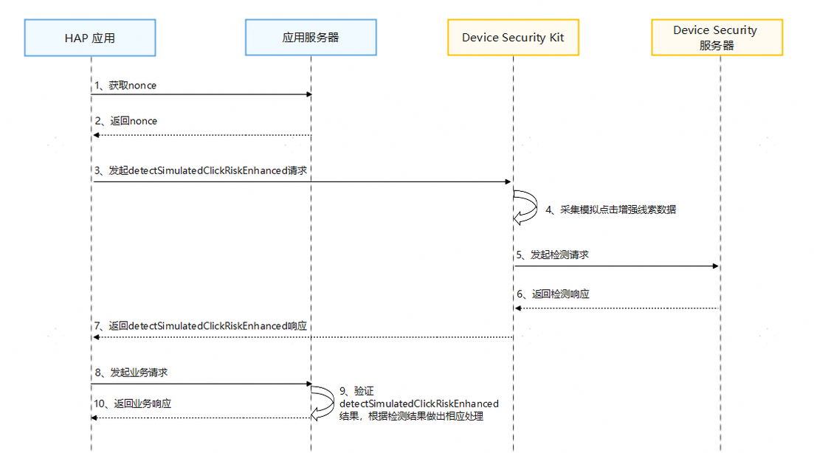

# 模拟点击增强检测

更新时间：2026-04-20 06:34:33

来源：https://developer.huawei.com/consumer/cn/doc/harmonyos-guides/devicesecurity-detectsimulatedclickriskenhanced

## 场景介绍

从6.0.2(22) 版本开始，新增支持模拟点击增强检测。 应用通过调用Device Security Kit的detectSimulatedClickRiskEnhanced接口，获取模拟点击增强检测结果，用于自动化点击、设备墙等作弊行为检测。 应用可以根据检测结果评估如何进行业务操作。

## 约束与限制

每30秒最多可以调用10次，每个应用在每个设备上每天最多可以调用20次。

## 业务流程


**流程说明：** 开发者应用获取nonce。 在调用detectSimulatedClickRiskEnhanced接口时，开发者必须传入一个随机生成的nonce值。在检测结果中会包含这个nonce值，您可以通过校验这个nonce值来确定返回结果能够对应您的请求，并且没有被重放攻击。
> [!NOTE]
> nonce值必须为24至80字节之间。 建议每次请求都从服务器随机生成新的nonce值。

开发者应用调用detectSimulatedClickRiskEnhanced接口，发起模拟点击增强检测请求。 Device Security Kit收到请求后，首先采集当前设备模拟点击线索数据，然后将线索数据和nonce一起发送到Device Security服务器做检测，最后通过detectSimulatedClickRiskEnhanced接口的返回值将检测结果传递给开发者应用。 当开发者应用发起业务请求时，在应用服务器中验证模拟点击增强检测结果完整性。

## 接口说明

以下是模拟点击增强检测相关接口，更多接口及使用方法请参见[API参考](https://developer.huawei.com/consumer/cn/doc/harmonyos-references/devicesecurity-brid-api)。
| 接口名 | 描述 |
| --- | --- |
| detectSimulatedClickRiskEnhanced(params:SimulatedClickDetectionEnhancedRequest):Promise | 模拟点击增强检测 |


## 开发步骤

导入Device Security Kit模块及相关公共模块。
```text
import { businessRiskIntelligentDetection } from '@kit.DeviceSecurityKit';
import { BusinessError } from '@kit.BasicServicesKit';
import { hilog } from '@kit.PerformanceAnalysisKit';
import { cryptoFramework } from '@kit.CryptoArchitectureKit'
```

调用detectSimulatedClickRiskEnhanced接口获取模拟点击增强检测结果。
```text
const TAG = "BusinessRiskIntelligentDetectionJsTest";

let nonceLength = 48;
let nonceBlob = cryptoFramework.createRandom().generateRandomSync(nonceLength);
let params = {
  version: 1,
  nonce: nonceBlob.data,
  algorithm: businessRiskIntelligentDetection.SigningAlgorithm.ES256
} as businessRiskIntelligentDetection.SimulatedClickDetectionEnhancedRequest;
try {
  hilog.info(0x0000, TAG, 'Detect simulated click risk enhanced begin.');
  businessRiskIntelligentDetection.detectSimulatedClickRiskEnhanced(params).then((result: string) => {
    hilog.info(0x0000, TAG, 'Detect simulated click risk enhanced success: %{public}s', result);
  }).catch((error: Error) => {
    let e: BusinessError = error as BusinessError;
    hilog.error(0x0000, TAG, 'Detect simulated click risk enhanced failed: %{public}d %{public}s', e.code, e.message);
  });
} catch (error) {
  let e: BusinessError = error as BusinessError;
  hilog.error(0x0000, TAG, 'Detect simulated click risk enhanced failed: %{public}d %{public}s', e.code, e.message);
}
```

在开发者应用服务器中验证模拟点击增强检测结果。 模拟点击增强检测接口响应结果，格式为JSON WEB签名（JWS）。验证检测结果完整示例可参考[java示例代码](https://gitcode.com/HarmonyOS_Samples/device-security-kit-sample-code-business-risk-intelligent-detection-server-demo-java)，具体步骤如下： 解析JWS，获取header、payload、signature。 从header中获取证书链，使用[Huawei CBG Device Attestation Root CA](https://pki.consumer.huawei.com/ca/cer/Huawei_CBG_ECC_Device_Attestation_Root_CA.cer)证书对其进行验证。 校验证书链中x5c[0]证书的Common Name是否为Harmony OS Device Attestation Service。 从signature中获取签名，校验其签名。 从payload中获取模拟点击增强检测结果，格式和样例摘录如下： **Header字段**
```text
{
  "alg": "ES256",
  "x5c": ["",""],
  "nonce": "R2Rra24fVm5xa2Mg",
  "appId": "xxxxxxxxx",
  "typ": "JWT"
}
```


> [!NOTE]
> "alg"：数字签名算法，ES256表示为SHA256withECDSA。 "x5c"：华为签名服务器对JWS签名的证书链，x5c[0]为给JWS签名的证书，x5c[1]为签名证书链二级CA。 "nonce"：请求参数SimulatedClickDetectionEnhancedRequest中传入的nonce值的Base64编码。 "appId"：您在华为开发者联盟网站上申请的APP ID。 "typ"：结果为JWT格式。

**Payload字段**：
```text
{
  "timestampMs": 9860437986543,
  "version": 1,
  "riskDecision": "fake",
  "tags": ["AbnormalTap"]
}
```


> [!NOTE]
> timestampMs：华为签名服务器生成的时间戳。 riskDecision：风险检测结果。 version：检测结果消息格式的版本。默认值为1，当前只支持1。 tags：模拟点击关键特征。如果tags列表为空，表示未发现关键特征。如果tags列表不为空，表示发现关键特征。


| tags值 | 含义 |
| --- | --- |
| AbnormalDeviceIntegrity | 设备完整性遭到破坏。 |
| AbnormalDeviceBehavior | 设备行为异常，例如，设备连接状态、传感器状态等行为异常。 |
| AbnormalTap | 存在异常点击行为，例如，点击事件注入，自动化点击等。 |


| riskDecision值 | 含义 |
| --- | --- |
| fake | 当前设备存在作弊风险行为。存在自动化操控行为或设备墙作弊行为，详情见tags。 |
| likelyReal | 当前操作设备的是真人用户的可能性较高。 |
| unknown | 未知。未检测到明显特征，无法识别。 |
