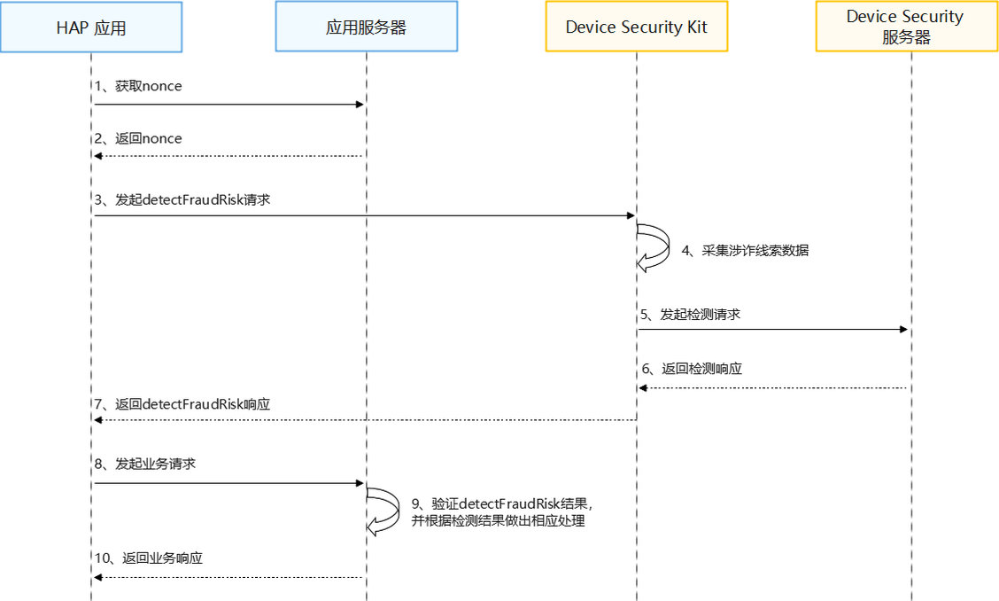

# 涉诈剧本检测

更新时间：2026-04-20 06:34:33

来源：https://developer.huawei.com/consumer/cn/doc/harmonyos-guides/devicesecurity-fraudriskdetection

## 场景介绍

从5.0.0(12) 版本开始，新增支持涉诈剧本检测。 金融支付类应用在用户转账、支付前，通过调用Device Security Kit的detectFraudRisk接口，检测用户是否受到欺诈威胁。该接口返回一个风险分，以及涉诈行为的线索，例如，接收到涉诈引导信息、设备有被操控风险等，应用可以根据风险分及线索，进行有效提示或拦截。

## 约束与限制

每个应用在每个设备上每天最多可以调用10次。

## 业务流程


**流程说明：** 开发者应用获取nonce。 在调用detectFraudRisk接口时，开发者必须传入一个随机生成的nonce值。在检测结果中会包含这个nonce值，您可以通过校验这个nonce值来确定返回结果能够对应您的请求，并且没有被重放攻击。
> [!NOTE]
> nonce值必须为24至80字节之间。 建议每次请求都从服务器随机生成新的nonce值。

开发者应用调用detectFraudRisk接口，发起涉诈剧本检测请求。 Device Security Kit收到请求后，首先采集当前设备涉诈风险线索数据，然后将线索数据与nonce一起发送到Device Security服务器做检测，最后通过detectFraudRisk接口的返回值将检测结果传递给开发者应用。 当开发者应用发起业务请求时，在应用服务器中验证检测结果完整性。

## 接口说明

以下是涉诈剧本检测相关接口，包括ArkTS API，更多接口及使用方法请参见[API参考](https://developer.huawei.com/consumer/cn/doc/harmonyos-references/devicesecurity-brid-api)。
| 接口名 | 描述 |
| --- | --- |
| detectFraudRisk(params: FraudDetectionRequest): Promise | 涉诈剧本检测。 |


## 开发步骤


> [!NOTE]
> 请确保已打开“涉诈剧本检测”开关并申请Profile。

导入Device Security Kit模块及相关公共模块。
```text
import { hilog } from '@kit.PerformanceAnalysisKit';
import { cryptoFramework } from '@kit.CryptoArchitectureKit';
import { businessRiskIntelligentDetection } from '@kit.DeviceSecurityKit';
import { BusinessError } from '@kit.BasicServicesKit';
```

调用detectFraudRisk接口获取涉诈剧本检测结果。
```text
const TAG = "BusinessRiskIntelligentDetectionJsTest";

let rand = cryptoFramework.createRandom();
let len = 48;
let randData = rand.generateRandomSync(len);
let params = {
  nonce: randData.data,
  algorithm: businessRiskIntelligentDetection.SigningAlgorithm.ES256
} as businessRiskIntelligentDetection.FraudDetectionRequest;
try {
  hilog.info(0x0000, TAG, 'Detect fraud risk begin.');
  businessRiskIntelligentDetection.detectFraudRisk(params).then((result: string) => {
    hilog.info(0x0000, TAG, 'Detect fraud risk success: %{public}s', result);
  }).catch((error: Error) => {
    let e: BusinessError = error as BusinessError;
    hilog.error(0x0000, TAG, 'Detect fraud risk failed: %{public}d %{public}s', e.code, e.message);
  });
} catch (error) {
  let e: BusinessError = error as BusinessError;
  hilog.error(0x0000, TAG, 'Detect fraud risk failed: %{public}d %{public}s', e.code, e.message);
}
```

在开发者应用服务器中验证检测结果。 涉诈剧本检测接口响应结果，格式为JSON WEB签名（JWS）。验证检测结果完整示例可参考[java示例代码](https://gitcode.com/HarmonyOS_Samples/device-security-kit-sample-code-business-risk-intelligent-detection-server-demo-java)，具体步骤如下： 解析JWS，获取header、payload、signature。 从header中获取证书链，使用[Huawei CBG Root CA](https://pki.consumer.huawei.com/ca/cer/RootCaG2Ecdsa.cer)证书对其进行验证。 校验证书链中的叶证书域名，域名：riskopenapi.platform.hicloud.com。 从signature中获取签名，校验其签名。 从payload中获取涉诈剧本检测结果，格式和样例摘录如下： **Header字段如下：**
```text
{
  "alg": "ES256",
  "x5c": ["",""]
}
```


> [!NOTE]
> "alg"：数字签名算法，ES256表示为SHA256withECDSA。 "x5c"：华为签名服务器对JWS签名的证书链，x5c[0]为给JWS签名的证书，x5c[1]为华为设备CA。

**Payload字段如下：** 当请求参数FraudDetectionRequest中的version为1，Payload样例：
```text
{
  "timestampMs": 9xxxxxxxxx,
  "nonce": "Rxxxxxxxxx",
  "appId": "xxxxxxxxx",
  "version": 1,
  "riskScore": 90,
  "tags": [
    "phishing",
    "malware",
    "interdiction",
    "control"
  ]
}
```

当请求参数FraudDetectionRequest中的version为2，Payload样例：
```text
{
  "timestampMs": 9xxxxxxxxx,
  "nonce": "Rxxxxxxxxx",
  "appId": "xxxxxxxxx",
  "version": 2,
  "riskScore": 90,
  "tags": [
    {"tag": "phishing", "level": "high", "lastTime": 9876543216548},
    {"tag": "malware", "level": "low", "lastTime": 965432198756},
    {"tag": "interdiction", "level": "medium", "lastTime": 965432198756},
    {"tag": "control", "level": "medium", "lastTime": 965432198123}
  ]
}
```


> [!NOTE]
> nonce：调用detectFraudRisk接口时传入的nonce值Base64编码。 timestampMs：华为签名服务器生成的时间戳。 appId：签名信息中的appId。 riskScore：当前设备上涉诈风险评分，分数范围0~100，分数越高，则风险越大。 version：检测结果消息格式的版本。 tags：涉诈风险线索。如果tags列表为空，表示未发现涉诈风险。


| tags值 | 含义 |
| --- | --- |
| phishing | 过去一段时间设备上发生了涉诈信息引导行为。命中一个或多个下面的风险因子：              近期接听过涉诈电话              近期接收到诈骗短信              近期访问涉诈网址 |
| malware | 过去一段时间设备上安装/运行的应用可能成为诈骗分子使用的工具。命中一个或多个下面的风险因子：              近期安装过/正在运行小众聊天类APP              近期安装过/正在运行投资理财类APP              近期安装过/正在运行视频会议类APP |
| interdiction | 当前设备上存在阻碍用户接听电话的行为。命中一个或多个下面的风险因子：              当前已开启呼叫转移              当前已开启飞行模式              当前处于在电话语音中 |
| control | 当前设备上是否存在被操控的风险。命中一个或多个下面的风险因子：              当前启用了共享屏幕 |


| level值 | 含义 |
| --- | --- |
| low | 当前风险标签对应的风险等级为低 |
| medium | 当前风险标签对应的风险等级为中 |
| high | 当前风险标签对应的风险等级为高 |
