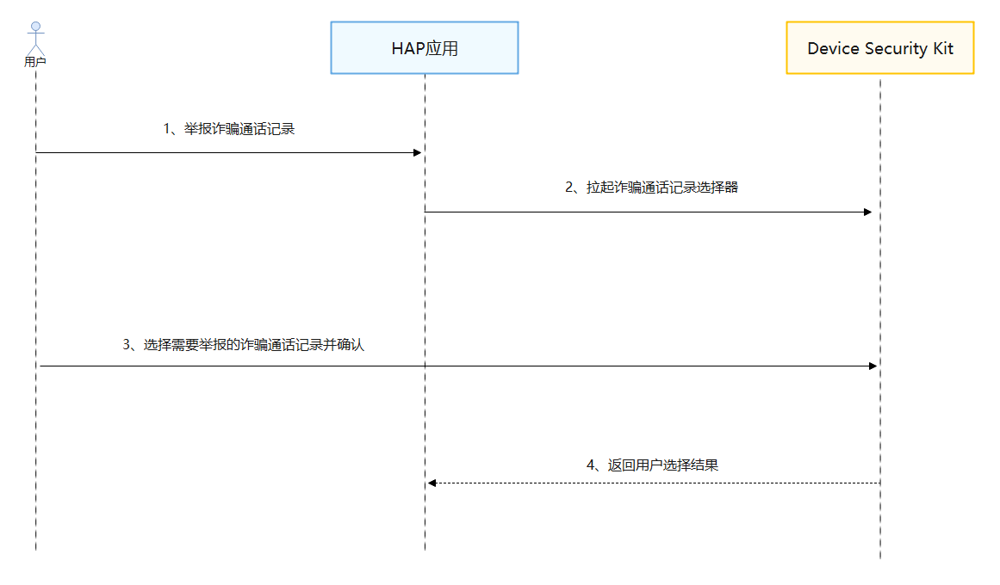

# 获取诈骗通话记录

更新时间：2026-04-20 06:34:33

来源：https://developer.huawei.com/consumer/cn/doc/harmonyos-guides/devicesecurity-selectfraudcalllog

## 场景介绍

应用通过调用Device Security Kit的接口获取诈骗通话记录，用于反诈业务，比如对诈骗通话记录进行举报。

## 约束与限制

当前能力仅支持手机、平板设备。仅提供给反诈类应用使用。

## 业务流程


**流程说明：** 用户在开发者应用上选择举报诈骗通话记录功能。 开发者应用调用Device Security Kit的接口拉起诈骗通话记录选择器。 用户在诈骗通话记录选择器中选择诈骗通话记录。 Device Security Kit调用回调函数通知开发者应用，开发者应用根据诈骗通话记录信息进行业务处理。

## 接口说明

以下是获取诈骗通话记录相关接口，更多接口及使用方法请参见[API参考](https://developer.huawei.com/consumer/cn/doc/harmonyos-references/devicesecurity-antifraudpicker-api)。
| 接口名 | 描述 |
| --- | --- |
| selectFraudCallLog(context: common.Context, options?: AntifraudCallLogOptions): Promise | 获取诈骗通话记录信息。 |


## 开发步骤


> [!NOTE]
> 在开发准备过程中，需要申请权限：ohos.permission.USE_FRAUD_CALL_LOG_PICKER。 只允许清单内的应用申请该权限，申请方式请参考：申请使用受限权限 开发者需向用户说明数据使用的目的、方式和范围。

导入Device Security Kit模块及相关公共模块。
```text
import { securityAudit } from '@kit.DeviceSecurityKit';
import { BusinessError} from '@kit.BasicServicesKit';
import { hilog } from '@kit.PerformanceAnalysisKit';
import { common} from '@kit.AbilityKit';
```

调用selectFraudCallLog接口获取诈骗通话记录信息。
```text
const TAG = "AntifraudPickerJsTest";

// 请求获取诈骗通话记录信息，并进行业务处理
let options: antifraudPicker.AntifraudCallLogOptions = {
  maxSelectNumber: 5
};
try {
  hilog.info(0x0000, TAG, 'SelectFraudCallLog begin.');
  let context = this.getUIContext().getHostContext();
  const result: antifraudPicker.AntifraudCallLogResult = await antifraudPicker.selectFraudCallLog(context, options);
} catch (err) {
  let e: BusinessError = err as BusinessError;
  hilog.error(0x0000, TAG, 'SelectFraudCallLog failed: %{public}d %{public}s', e.code, e.message);
}
```
