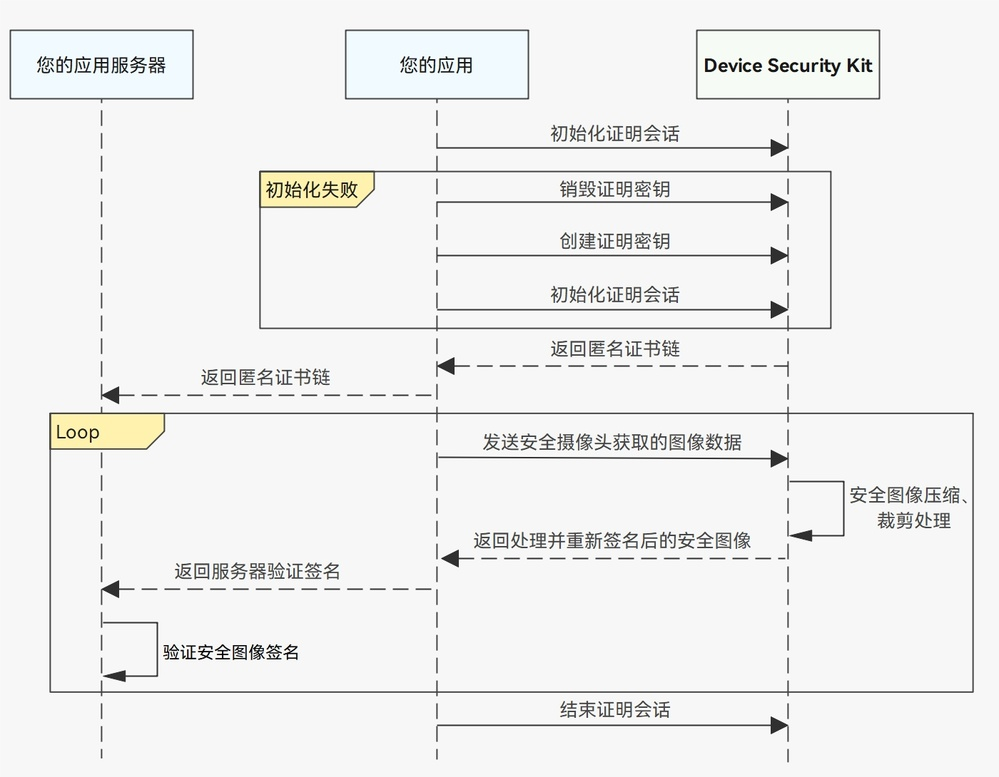

# 安全图像压缩、裁剪场景

更新时间：2026-04-20 06:34:33

来源：https://developer.huawei.com/consumer/cn/doc/harmonyos-guides/devicesecurity-taas-secimage-process

##### 场景介绍

在安全图像支持压缩、裁剪场景中，通过创建证明密钥、打开证明会话的方式，对从[安全摄像头](https://developer.huawei.com/consumer/cn/doc/harmonyos-guides/devicesecurity-taas-securecamera)获取的图像数据进行压缩、裁剪处理并重新签名，降低安全摄像头的原始图像大小，同时也能确保图像数据的真实性和完整性。


##### 约束与限制

该特性需要设备支持安全摄像头功能，其支持的设备范围与安全摄像头场景保持一致。开发者可以参考安全摄像头场景的[约束与限制](https://developer.huawei.com/consumer/cn/doc/harmonyos-guides/devicesecurity-taas-securecamera#约束与限制)，判断设备是否支持安全摄像头。


##### 业务流程





##### 接口说明

接口及使用方法请参见[API参考](https://developer.huawei.com/consumer/cn/doc/harmonyos-references/devicesecurity-taas-api)。

| 接口名 | 描述 |
| --- | --- |
| createAttestKey(options: AttestOptions): Promise&lt;void&gt; | 创建证明密钥。 |
| initializeAttestContext(userData: string, options: AttestOptions): Promise&lt;AttestReturnResult&gt; | 初始化证明会话。 |
| finalizeAttestContext(options: AttestOptions): Promise&lt;void&gt; | 结束证明会话。 |
| destroyAttestKey(): Promise&lt;void&gt; | 销毁证明密钥。 |
| procSecImageTransform(srcSecImage: ArrayBuffer, Options: SecImageProcOptions): Promise&lt;SecImageBuffer&gt; | 处理安全图像压缩、裁剪操作。 |


##### 开发步骤
1. 参考[安全摄像头开发指导](https://developer.huawei.com/consumer/cn/doc/harmonyos-guides/devicesecurity-taas-securecamera)，获取安全图像。
2. 创建证明密钥和初始化证明会话。

  
> [!NOTE]
> 只有创建证明密钥成功后，才能初始化证明会话。 证明密钥的有效期为7天，为了避免反复创建证明密钥，建议先调用初始化证明会话，如果初始化失败，再去销毁、创建证明密钥，然后重新初始化证明密钥。 调用initializeAttestContext初始化证明会话时，userData的长度必须在16到127 Bytes之间。


  
```text
// 创建证明密钥的参数
const createProperties: Array<trustedAppService.AttestParam> = [
  {
    tag: trustedAppService.AttestTag.ATTEST_TAG_ALGORITHM,
    value: trustedAppService.AttestKeyAlg.ATTEST_ALG_ECC
  },
  {
    tag: trustedAppService.AttestTag.ATTEST_TAG_KEY_SIZE,
    value: trustedAppService.AttestKeySize.ATTEST_ECC_KEY_SIZE_256
  }
];
const createOptions: trustedAppService.AttestOptions = {
  properties: createProperties
};
// 初始化证明会话的参数
const userData = "trusted_app_service_demo"; // 示例值，实际值请自行生成，长度在16到127 Bytes之间
const initProperties: Array<trustedAppService.AttestParam> = [
  {
    tag: trustedAppService.AttestTag.ATTEST_TAG_DEVICE_TYPE,
    value: trustedAppService.AttestType.ATTEST_TYPE_SECIMAGE_PROCESS
  },
  {
    tag: trustedAppService.AttestTag.ATTEST_TAG_DEVICE_ID,
    value: BigInt(0) // 此参数在安全图像压缩、裁剪场景下不生效
  }
];
const initOptions: trustedAppService.AttestOptions = {
  properties: initProperties
};

let certChainList: Array<string>;
try {
  // 创建证明密钥
  await trustedAppService.createAttestKey(createOptions);
  // 初始化证明会话
  const result = await trustedAppService.initializeAttestContext(userData, initOptions);
  certChainList = result.certChains;
} catch (err) {
  const error = err as BusinessError;
  console.error(`Failed to initialize attest context, message:${error.message}, code:${error.code}`);
}
```

3. 请求对安全图像进行压缩、裁剪处理

  
以压缩场景为例：

  
```text
const srcSecImageBuffer = new  ArrayBuffer(461844);// 实际使用请替换为Camera Kit获取到的安全图像buffer

let properties: Array<trustedAppService.SecImageProcParams> = [
  {
    tag: trustedAppService.SecImageProcTag.SECIMAGE_TAG_PROC_OPERATION,
    value: trustedAppService.SecImageProcOperation.SECIMAGE_COMPRESSION,
  },
  {
    tag: trustedAppService.SecImageProcTag.SECIMAGE_TAG_SRC_IMAGE_FORMAT,
    value: trustedAppService.SecImageProcFormat.SECIMAGE_FORMAT_YUV_NV21, // 安全图像压缩、裁剪命令输入的原始图像格式都为：YUV420 NV21 格式
  },
  {
    tag: trustedAppService.SecImageProcTag.SECIMAGE_TAG_DEST_IMAGE_FORMAT,
    value: trustedAppService.SecImageProcFormat.SECIMAGE_FORMAT_JPEG, // 安全图像压缩命令返回的图像格式为：JPEG 格式
  },
  {
    tag: trustedAppService.SecImageProcTag.SECIMAGE_TAG_COMPRESSION_QUALITY,
    value: 90, // 实际使用请替换为业务场景需要的压缩质量
  },
];
let procParams: trustedAppService.SecImageProcParamsArray = {
  properties: properties,
};
await trustedAppService.procSecImageTransform(srcSecImageBuffer, procParams).then(
  (returnResult: trustedAppService.SecImageBuffer): void => {
    let returnSecImageBuffer = returnResult.secImage;
  }
).catch(
  (error: BusinessError): void => {
    let err = error as BusinessError;
    hilog.error(0x0000, 'testTag', `Failed to process secureImage cropping, code:${err.code}, message:${err.message}`);
  }
);
```

4. 以裁剪场景为例：

  
```text
const srcSecImageBuffer = new  ArrayBuffer(461844);// 实际使用请替换为Camera Kit获取到的安全图像buffer

let properties: Array<trustedAppService.SecImageProcParams> = [
  {
    tag: trustedAppService.SecImageProcTag.SECIMAGE_TAG_PROC_OPERATION,
    value: trustedAppService.SecImageProcOperation.SECIMAGE_CROPPING,
  },
  {
    tag: trustedAppService.SecImageProcTag.SECIMAGE_TAG_SRC_IMAGE_FORMAT,
    value: trustedAppService.SecImageProcFormat.SECIMAGE_FORMAT_YUV_NV21, // 安全图像压缩、裁剪命令输入的原始图像格式都为：YUV420 NV21 格式
  },
  {
    tag: trustedAppService.SecImageProcTag.SECIMAGE_TAG_DEST_IMAGE_FORMAT,
    value: trustedAppService.SecImageProcFormat.SECIMAGE_FORMAT_YUV_NV21, // 安全图像裁剪命令返回的图像格式为：YUV420 NV21 格式
  },
  {
    tag: trustedAppService.SecImageProcTag.SECIMAGE_TAG_CROP_REGION,
    value: { x : 0, y ： 0, width : 320, height : 240 }, // 实际使用请替换为业务场景需要的裁剪区域范围
  },
];
let procParams: trustedAppService.SecImageProcParamsArray = {
  properties: properties,
};
await trustedAppService.procSecImageTransform(srcSecImageBuffer, procParams).then(
  (returnResult: trustedAppService.SecImageBuffer): void => {
    let returnSecImageBuffer = returnResult.secImage;
  }
).catch(
  (error: BusinessError): void => {
    let err = error as BusinessError;
    hilog.error(0x0000, 'testTag', `Failed to process secureImage cropping, code:${err.code}, message:${err.message}`);
  }
);
```

5. 结束证明会话。

  
```text
// 结束证明会话的参数
const finalProperties: Array<trustedAppService.AttestParam> = [
  {
    tag: trustedAppService.AttestTag.ATTEST_TAG_DEVICE_TYPE,
    value: trustedAppService.AttestType.ATTEST_TYPE_SECIMAGE_PROCESS
  }
];
const finalOptions: trustedAppService.AttestOptions = {
  properties: finalProperties,
};
// 结束证明会话
try {
  await trustedAppService.finalizeAttestContext(finalOptions);
} catch (err) {
  const error = err as BusinessError;
  console.error(`Failed to finalize attest context, message:${error.message}, code:${error.code}`);
}
```
如果需要销毁证明密钥，请在结束证明会话后，调用[destroyAttestKey](https://developer.huawei.com/consumer/cn/doc/harmonyos-references/devicesecurity-taas-api#destroyattestkey)接口。由于安全摄像头、安全地理位置和安全图像压缩、裁剪共用同一个证明密钥，销毁前需要保证其余场景功能未在使用该证明密钥。
