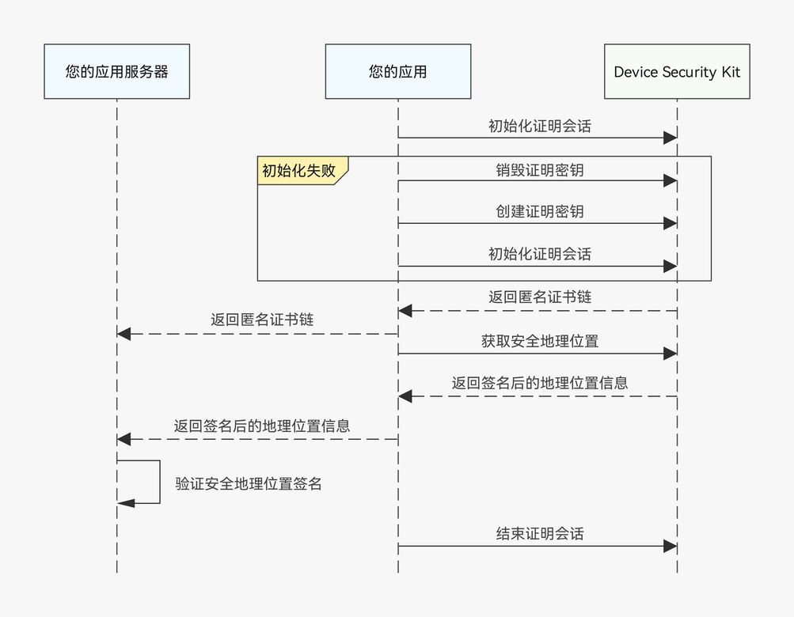

# 安全地理位置场景

更新时间：2026-07-28 11:23:46

来源：https://developer.huawei.com/consumer/cn/doc/harmonyos-guides/devicesecurity-taas-securelocation

#### 场景介绍

在安全地理位置场景中，通过创建证明密钥、打开证明会话的方式，对从GPS硬件或网络位置获取到的地理位置信息进行签名，确保地理位置信息的真实性和完整性。


#### 约束与限制

该特性需要设备支持安全地理位置功能。

开发者在调用[initializeAttestContext](https://developer.huawei.com/consumer/cn/doc/harmonyos-references/devicesecurity-taas-api#initializeattestcontext)接口成功初始化安全地理位置的证明会话后，通过调用[getCurrentSecureLocation](https://developer.huawei.com/consumer/cn/doc/harmonyos-references/devicesecurity-taas-api#getcurrentsecurelocation)接口尝试获取安全地理位置，当接口异常并返回[ATTEST_ERROR_LOCATION_SERVICE_UNAVAILABLE](https://developer.huawei.com/consumer/cn/doc/harmonyos-references/errorcode-devicesecurity-taas#section1011500014-位置服务不可用)时，当前设备不支持安全地理位置。具体判断方法参考如下示例：

```text
// 初始化安全地理位置证明会话后，获取安全地理位置信息，以速度优先为例
const timeout = 5000; // 获取安全地理位置的超时时间，单位为毫秒
const priority = trustedAppService.LocatingPriority.PRIORITY_LOCATING_SPEED; // 采用速度优先策略
try {
  return await trustedAppService.getCurrentSecureLocation(timeout, priority);
} catch (err) {
  const error = err as BusinessError;
  if (error.code == trustedAppService.AttestExceptionErrCode.ATTEST_ERROR_LOCATION_SERVICE_UNAVAILABLE) {
    hilog.error(0x0000, 'TrustedAppService', 'current device not support secure location');
  } else {
    hilog.error(0x0000, 'TrustedAppService',
      `Failed to get location by PRIORITY_LOCATING_SPEED. Code: ${error.code}, Message: ${error.message}`);
  }
  throw new Error(error.message);
}
```


#### 业务流程





应用获取安全地理位置的优先级策略有两种，分别是精度优先和速度优先。如果选择精度优先策略，可信应用服务会优先返回GPS的结果，GPS获取超时后返回网络地理位置；而如果选择速度优先策略，可信应用服务会返回从二者中最先获取到的结果。


#### 接口说明

接口及使用方法请参见[API参考](https://developer.huawei.com/consumer/cn/doc/harmonyos-references/devicesecurity-taas-api)。

| 接口名 | 描述 |
| --- | --- |
| createAttestKey(options: AttestOptions): Promise&lt;void&gt; | 创建证明密钥。 |
| initializeAttestContext(userData: string, options: AttestOptions): Promise&lt;AttestReturnResult&gt; | 初始化证明会话。 |
| finalizeAttestContext(options: AttestOptions): Promise&lt;void&gt; | 结束证明会话。 |
| destroyAttestKey(): Promise&lt;void&gt; | 销毁证明密钥。 |
| getCurrentSecureLocation(timeout: number, priority: LocatingPriority): Promise&lt;SecureLocation&gt; | 获取安全地理位置信息。 |


#### 开发步骤
1. 申请位置权限，权限名称为“[ohos.permission.APPROXIMATELY_LOCATION](https://developer.huawei.com/consumer/cn/doc/harmonyos-guides/permissions-for-all-user#ohospermissionapproximately_location)”和“[ohos.permission.LOCATION](https://developer.huawei.com/consumer/cn/doc/harmonyos-guides/permissions-for-all-user#ohospermissionlocation)”，具体请参考[向用户申请授权](https://developer.huawei.com/consumer/cn/doc/harmonyos-guides/request-user-authorization)。
2. 导入trustedAppService模块和相关依赖模块。

  
```text
import { trustedAppService } from '@kit.DeviceSecurityKit';
import { BusinessError } from '@kit.BasicServicesKit';
import { util } from '@kit.ArkTS';
import { cryptoFramework } from '@kit.CryptoArchitectureKit';
import { cert } from '@kit.DeviceCertificateKit';
import hilog from '@ohos.hilog';
```

3. 创建证明密钥并初始化证明会话。

  
创建安全地理位置场景的证明密钥：          
```text
private async creatSecureLocationAttestKey(): Promise<void> {
  // 创建证明密钥的参数
  const createProperties: Array<trustedAppService.AttestParam> = [
    {
      tag: trustedAppService.AttestTag.ATTEST_TAG_ALGORITHM,
      value: trustedAppService.AttestKeyAlg.ATTEST_ALG_ECC
    },
    {
      tag: trustedAppService.AttestTag.ATTEST_TAG_KEY_SIZE,
      value: trustedAppService.AttestKeySize.ATTEST_ECC_KEY_SIZE_256
    }
  ];
  const createOptions: trustedAppService.AttestOptions = {
    properties: createProperties
  };
  // 创建证明会话
  try {
    await trustedAppService.createAttestKey(createOptions);
    hilog.info(0x0000, 'TrustedAppService', 'createAttestKey successfully');
  } catch (error) {
    const err = error as BusinessError;
    hilog.error(0x0000, 'trustedappservice', `createattestkey failed, errCode: ${err.code}, errMsg: ${err.message}`);
    throw new Error(err.message);
  }
}
```

4. 初始化安全地理位置场景的证明会话：          
```text
private async initSecureLocationAttestContext(): Promise<number> {
  try {
    // 初始化证明会话的参数
    const deviceId = 0;
    const initProperties: Array<trustedAppService.AttestParam> = [
      {
        tag: trustedAppService.AttestTag.ATTEST_TAG_DEVICE_TYPE,
        value: trustedAppService.AttestType.ATTEST_TYPE_LOCATION
      },
      {
        tag: trustedAppService.AttestTag.ATTEST_TAG_DEVICE_ID,
        value: BigInt(deviceId) // 此参数在安全地理位置场景下不生效
      }
    ];
    const initOptions: trustedAppService.AttestOptions = {
      properties: initProperties
    };
    let userData = 'trusted_app_service_default_userdata'; // 示例值，实际值请自行生成，长度在16到127 Bytes之间
    // 初始化话证明会话
    const certChainResult = await trustedAppService.initializeAttestContext(userData, initOptions);
    if (certChainResult.certChains.length < 1) {
      throw new Error('empty returned cert chain');
    }
    // [StartExclude init_secure_location_attestContext]
    this.certChainObj = new CertChain(certChainResult.certChains[0]);
    await this.certChainObj.validate();
    // [EndExclude init_secure_location_attestContext]
    return 0;
  } catch (err) {
    const businessError = err as BusinessError;
    hilog.error(0x0000, 'TrustedAppService',
      `initializeAttestContext failed. errCode: ${businessError.code}, errMsg: ${businessError.message}`);
    const finalNumericCode = Number(String(businessError.code ?? '').replace('n', '').trim());
    return Number.isNaN(finalNumericCode) ? -1 : finalNumericCode;
  }
}
```

5. 获取安全地理位置信息，以精度优先为例。

  
```text
private async getSecureLocationByAccuracy(): Promise<trustedAppService.SecureLocation> {
  const timeout = 5000; // 获取安全地理位置的超时时间，单位为毫秒
  const priority = trustedAppService.LocatingPriority.PRIORITY_ACCURACY; // 采用精度优先策略
  // 获取当前安全地理位置信息
  try {
    return await trustedAppService.getCurrentSecureLocation(timeout, priority);
  } catch (err) {
    const error = err as BusinessError;
    hilog.error(0x0000, 'TrustedAppService',
      `Failed to get location by PRIORITY_ACCURACY. Code: ${error.code}, Message: ${error.message}`);
    throw new Error(error.message);
  }
}
```

6. 结束证明会话。

  
```text
private async finalizeSecureLocationAttestContext(): Promise<void> {
  // 结束证明会话的参数
  const finalProperties: Array<trustedAppService.AttestParam> = [
    {
      tag: trustedAppService.AttestTag.ATTEST_TAG_DEVICE_TYPE,
      value: trustedAppService.AttestType.ATTEST_TYPE_LOCATION
    }
  ];
  const finalOptions: trustedAppService.AttestOptions = {
    properties: finalProperties,
  };
  // 结束证明会话
  try {
    await trustedAppService.finalizeAttestContext(finalOptions);
  } catch (err) {
    const error = err as BusinessError;
    hilog.error(0x0000, 'TrustedAppService',
      'Failed to finalize attest context, code: ${error.code}, message: ${error.message}');
  }
}
```
如果需要销毁证明密钥，请在结束证明会话后，调用[destroyAttestKey](https://developer.huawei.com/consumer/cn/doc/harmonyos-references/devicesecurity-taas-api#destroyattestkey)接口。由于安全摄像头、安全地理位置和安全图像压缩、裁剪共用同一个证明密钥，销毁前需要保证其余功能未在使用该证明密钥。
