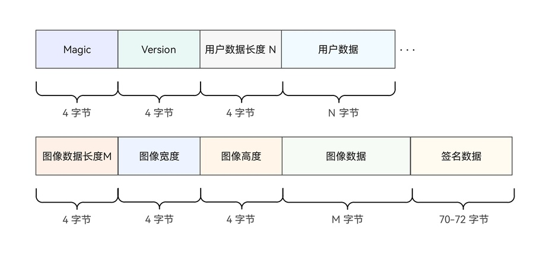

# 验证签名

更新时间：2026-07-28 11:23:46

来源：https://developer.huawei.com/consumer/cn/doc/harmonyos-guides/devicesecurity-taas-verifysignature

如果需要在端侧校验安全图像数据或安全地理位置数据签名的有效性，可以使用[Crypto Architecture Kit](https://developer.huawei.com/consumer/cn/doc/harmonyos-guides/crypto-architecture-kit-intro)，使用方法请参考“[使用ECDSA密钥对签名验签](https://developer.huawei.com/consumer/cn/doc/harmonyos-guides/crypto-ecdsa-sign-sig-verify)”章节。

> [!NOTE]
> 推荐开发者在服务器端完成安全图像或安全地理位置的签名验证，请参考“ Device Certificate Kit 设备真实性证明服务器端开发 ”。


#### 导入相关依赖模块

```text
import { trustedAppService } from '@kit.DeviceSecurityKit';
import { cert } from '@kit.DeviceCertificateKit';
import { util } from '@kit.ArkTS';
import { BusinessError } from '@kit.BasicServicesKit';
import { cryptoFramework } from '@kit.CryptoArchitectureKit';
```


#### 获取签名数据


#### 安全摄像头图像数据格式

安全图像数据的结构如下所示：





其中，用户数据和图像数据为被签名的原始数据，图像数据长度固定为460800字节，签名数据是Base64编码的签名结果，开发者需要解析出这些数据用来验证安全图像数据签名。参考代码如下：

```text
// 获取被签名的原始数据
const view = new DataView(secureImageBuffer); // secureImageBuffer: 实际使用时请替换为Camera Kit获取到的安全图像buffer
const imageBufferLength = 460800; // 安全图像buffer长度固定为460800
const userDataLength = view.getUint32(0, true); // 获取用户数据长度
const originData = secureImageBuffer.slice(4, 4 + userDataLength + imageBufferLength);
// 获取签名结果
const maxSignatureLength = 512;
const signatureBuffer = secureImageBuffer.slice(4 + userDataLength + imageBufferLength,
  4 + userDataLength + imageBufferLength + maxSignatureLength);
const signatureString = String.fromCharCode(...new Uint8Array(signatureBuffer).filter(code => code !== 0));
const base64Helper = new util.Base64Helper();
const signature = base64Helper.decodeSync(signatureString);
```


#### 压缩、裁剪后安全图像数据格式

压缩、裁剪处理后返回的安全图像数据的结构如下所示：


返回的处理后安全图像数据具体包含：
1. 魔数Magic，其值当前默认为 0x53494D47，开发者可以通过检查Magic字段来验证返回的图像数据的正确性。
2. 版本Version，其值当前默认为 1，开发者可以通过检查Version字段来验证返回的图像数据的正确性。
3. 用户数据长度（16到127 Bytes之间）和用户数据。其中，用户数据是开发者在调用initializeAttestContext初始化证明会话时，传入的相关数据。
4. 图像数据长度，图像宽度（单位为：pixel，取值范围在0到640之间），图像高度（单位为：pixel，取值范围在0到480之间）和图像数据。
5. 签名数据，是Base64编码的签名结果。

其中，签名的原始数据由用户数据和图像数据组成，开发者需要解析出这些数据用来验证安全图像数据签名。参考代码如下：

```text
const view = new DataView(secureImageBuffer); // secureImageBuffer: 实际使用时请替换为Camera Kit获取到的安全图像buffer
let offset = 0;
const magic = view.getUint32(offset, true); // 获取安全图像的Magic字段，该值默认为 0x53494D47
if (magic != 0x53494D47) {
  throw new Error('invalid magic of processed secure image');
}
offset += 4;
const version = view.getUint32(offset, true); // 获取安全图像的Version字段，该值默认为 1
if (version != 1) {
  throw new Error('invalid version of processed secure image');
}
offset += 4;
const userDataLength = view.getUint32(offset, true); // 获取用户数据长度
offset += 4;
const userdata = secureImageBuffer.slice(offset, offset + userDataLength);
offset += userDataLength;
const imageLen = view.getUint32(offset, true); // 获取压缩、裁剪处理后的图像数据长度
offset += 4;
const imageWidth = view.getUint32(offset, true); // 获取图像的宽度，单位为像素
offset += 4;
const imageHeight = view.getUint32(offset, true); // 获取图像的高度，单位为像素
offset += 4;
const imageBuffer = secureImageBuffer.slice(offset, offset + imageLen);
offset += imageLen;
const totalLength = userdata.byteLength + imageBuffer.byteLength;
// 获取被签名的原始数据
const originData = new Uint8Array(new ArrayBuffer(totalLength));
originData.set(new Uint8Array(userdata), 0);
originData.set(new Uint8Array(imageBuffer), userdata.byteLength);
// 获取签名结果
const maxSignatureLength = 512;
const signatureBuffer = secureImageBuffer.slice(offset, offset + maxSignatureLength);
const signatureString = String.fromCharCode(...new Uint8Array(signatureBuffer).filter(code => code !== 0));
const base64Helper = new util.Base64Helper();
const signature = base64Helper.decodeSync(signatureString);
```


#### 安全地理位置数据格式

安全地理位置数据的结构请参考[TrustedAppService（可信应用服务）](https://developer.huawei.com/consumer/cn/doc/harmonyos-references/devicesecurity-taas-api)。

对安全地理位置数据验签时，需要将返回的结构体中的数据拼接成字符串形式，格式要求如下：
1. 数据排列顺序为：纬度、经度、高度、精确度、时间戳和用户数据。
2. 纬度、经度和高度类型为浮点型，精度为小数点后保留15位；精确度为浮点型，精度为小数点后保留6位；时间戳类型为64位正整数；用户数据类型为字符串。
3. 数据之间的分隔符使用英文逗号。

签名数据是Base64编码后的签名结果。获取签名和签名原始数据的参考代码（不含异常处理逻辑，由开发者根据业务场景实现）如下：

```text
// 以下均为示例值，仅用于展示如何获取原始签名数据和签名结果
const location: trustedAppService.Location = {
  latitude: 40.053903635898685,
  longitude: 116.17356591910897,
  altitude: 0,
  accuracy: 11.160304069519043,
  timestamp: 1722151680187
};
const userData = 'trusted_app_service_default_userdata';
const secureLocation: trustedAppService.SecureLocation = {
  originalLocation: location,
  userData: userData,
  signature: "MEQCIEAcJHgaU8aAoMqD1wgoxiXR5I4jmwVG6ncgSKkW4uBHAiBnfv96T+gt1ef83kNZ+U0gBLsq9byuBLP1RBx30hByuQ=="
};
// 获取原始数据
const originString = secureLocation.originalLocation.latitude.toFixed(15) + ',' +
  secureLocation.originalLocation.longitude.toFixed(15) + ',' +
  secureLocation.originalLocation.altitude.toFixed(15) + ',' +
  secureLocation.originalLocation.accuracy.toFixed(6) + ',' +
  secureLocation.originalLocation.timestamp + ',' + secureLocation.userData.toString();
const textEncoder = new util.TextEncoder();
const originData = textEncoder.encodeInto(originString);
// 获取签名结果
const base64Helper = new util.Base64Helper();
const signature = base64Helper.decodeSync(secureLocation.signature.toString());
```


#### 验证签名

在安全摄像头场景和安全地理位置场景中，由于使用的是相同的证明密钥，因此签名验证的流程是一致的。结合“[安全摄像头场景](https://developer.huawei.com/consumer/cn/doc/harmonyos-guides/devicesecurity-taas-securecamera)”和“[安全地理位置场景](https://developer.huawei.com/consumer/cn/doc/harmonyos-guides/devicesecurity-taas-securelocation)”中获取到的原始数据和签名结果，验证签名的参考代码（不含异常处理逻辑，由开发者根据业务场景实现）如下：
1. 从匿名证书链中获取公钥。

  
```text
// returnResult是initializeAttestContext返回结果
public async getPubKeyFromCertChain(returnResult: trustedAppService.AttestReturnResult): Promise<cryptoFramework.PubKey> {
  try {
    // 解析匿名证书链数据，获取三级证书
    const certChain: Array<string> = returnResult.certChains;
    // certArray[0]: 空字符串；certArray[1]：叶子证书实体；certArray[2]：中间证书主体；certArray[3]：根证书主体
    const certList: Array<string> = certChain[0].split('-----BEGIN CERTIFICATE-----');
    const thirdCert = '-----BEGIN CERTIFICATE-----' + certList[1];
    // 获取公钥
    const textEncoder = new util.TextEncoder();
    const encodingBlob: cert.EncodingBlob = {
      data: textEncoder.encodeInto(thirdCert),
      encodingFormat: cert.EncodingFormat.FORMAT_PEM
    };
    const x509Cert = await cert.createX509Cert(encodingBlob);
    const asyKeyGenerator = cryptoFramework.createAsyKeyGenerator('ECC256'); // 算法规格需要跟CreateAttestKey函数的KeySize入参保持一致
    const keyPair = asyKeyGenerator.convertKeySync(x509Cert.getPublicKey().getEncoded(), null);
    const pubKey = keyPair.pubKey; // 证书中的公钥需要转换成cryptoFramework能够接收的格式
    return pubKey;
  } catch (err) {
    throw new Error((err as BusinessError).message);
  }
}
```

2. 创建非对称密钥类型为ECC256、摘要算法为SHA256的verify实例，并使用步骤1中获取到的公钥进行初始化。

  
```text
const verifier = cryptoFramework.createVerify('ECC256|SHA256'); // 算法规格需要跟CreateAttestKey函数的KeySize入参保持一致
verifier.initSync(pubKey);
```

3. 使用原始数据和签名结果进行验证签名。

  
```text
const inputData: cryptoFramework.DataBlob = {
  data: new Uint8Array(originData) // originData：请使用获取到的安全图像或者安全地理位置的原始数据
};
const signatureData: cryptoFramework.DataBlob = {
  data: new Uint8Array(signature) // signature：请使用获取到的签名结果
}
// 验证签名结果
const result = verifier.verifySync(inputData, signatureData);
```
