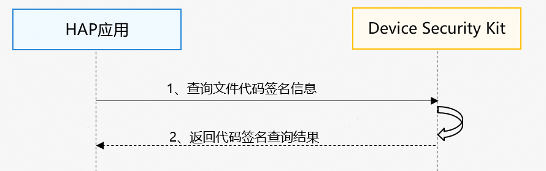

# 代码签名信息查询场景（C/C++）

更新时间：2026-04-30 02:41:24

来源：https://developer.huawei.com/consumer/cn/doc/harmonyos-guides/devicesecurity-audit-acquirecodesign-c

从6.1.1(24)开始，新增提供文件代码签名信息查询接口，可以获取设备上已签名的文件签名信息。


##### 场景介绍

签名信息包括：应用ID、签发组织证书链、签名摘要、签名时间戳、签名使用的Hash算法。通过[HMS_SecurityAudit_AcquireCodeSign](https://developer.huawei.com/consumer/cn/doc/harmonyos-references/devicesecurity-capi-securityaudit#hms_securityaudit_acquirecodesign)接口，应用可以获取代码签名信息，辅助应用判断运行代码的完整性和安全性，从而有效防止恶意软件的运行，提升设备安全防护能力。


##### 约束和限制
1. 当前能力仅支持2in1设备。
2. 调用[HMS_SecurityAudit_AcquireCodeSign](https://developer.huawei.com/consumer/cn/doc/harmonyos-references/devicesecurity-capi-securityaudit#hms_securityaudit_acquirecodesign)接口的应用程序需要具备读取目标代码签名文件的权限。


##### 业务流程





**流程说明：**
1. 用户在hap应用上调用获取文件代码签名信息接口[HMS_SecurityAudit_AcquireCodeSign](https://developer.huawei.com/consumer/cn/doc/harmonyos-references/devicesecurity-capi-securityaudit#hms_securityaudit_acquirecodesign)。
2. [HMS_SecurityAudit_AcquireCodeSign](https://developer.huawei.com/consumer/cn/doc/harmonyos-references/devicesecurity-capi-securityaudit#hms_securityaudit_acquirecodesign)接口同步返回应用所传入的文件对应的代码签名信息。


##### 接口说明

接口如下表，更多接口及使用方法请参见[API参考](https://developer.huawei.com/consumer/cn/doc/harmonyos-references/devicesecurity-capi-securityaudit#hms_securityaudit_acquirecodesign)。

| 接口名 | 描述 |
| --- | --- |
| int32_t HMS_SecurityAudit_AcquireCodeSign(char* path, char** outOwnedResult) | 获取输入的文件路径的代码签名信息。 |


##### 开发步骤

在开发准备过程中，需要申请权限：ohos.permission.QUERY_AUDIT_EVENT，只允许清单内的企业类应用申请该权限，申请方式请参考：[申请使用企业类应用可用权限](https://developer.huawei.com/consumer/cn/doc/harmonyos-guides/permissions-for-enterprise-apps)。
1. 在CMakeLists.txt中导入安全审计共享库，并链接该库。

  
```text
find_library(dsm-lib libsecurityaudit_ndk.z.so)
target_link_libraries(entry PUBLIC libace_napi.z.so ${dsm-lib})
```

2. 导入安全审计的头文件。

  
```text
#include <DeviceSecurityKit/security_audit.h>
#include <cstdio>
```

3. 开发者调用[HMS_SecurityAudit_AcquireCodeSign](https://developer.huawei.com/consumer/cn/doc/harmonyos-references/devicesecurity-capi-securityaudit#hms_securityaudit_acquirecodesign)接口，获取所传入的文件对应的代码签名信息，并在处理完接口返回的代码签名信息后释放出入参内存。

  
```text
void AcquireCodeSignTest()
{
    char *result = nullptr;
    char *path = "test";
    int32_t ret = HMS_SecurityAudit_AcquireCodeSign(path, &result);
    if (ret == 0 && result != nullptr) {
        printf("HMS_SecurityAudit_AcquireCodeSign result: %s\n", result);
    } else {
        printf("HMS_SecurityAudit_AcquireCodeSign failed with error: %d\n", ret);
    }
    if (result != nullptr) {
        delete[] result;
        result = nullptr;
    }
}
```
