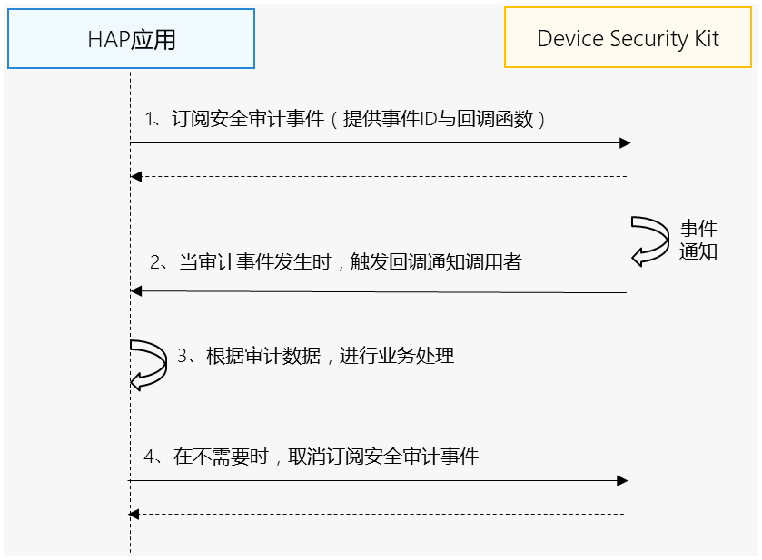

# 单客户端订阅场景

更新时间：2026-07-28 11:23:46

来源：https://developer.huawei.com/consumer/cn/doc/harmonyos-guides/devicesecurity-audit-subscribe-arkts-suevent

#### 场景介绍

从5.0.0(12)开始，新增提供统一的安全审计数据单客户端订阅与取消订阅接口，应用可以获取设备上的安全审计数据（详见[API参考](https://developer.huawei.com/consumer/cn/doc/harmonyos-references/devicesecurity-securityaudit-api#notifyevent)），以支撑审计相关业务。


#### 约束与限制

当前能力仅支持PC/2in1设备。


#### 业务流程





**流程说明：**
1. 开发者应用订阅安全审计数据。
2. Device Security Kit调用回调函数通知开发者应用，开发者应用根据审计数据进行业务处理。
3. 当开发者应用不需要使用该审计数据时，取消订阅安全审计数据。


#### 接口说明

以下是安全审计数据订阅与取消订阅接口，更多接口及使用方法请参见[API参考](https://developer.huawei.com/consumer/cn/doc/harmonyos-references/devicesecurity-securityaudit-api#onauditeventoccur)。

| 接口名 | 描述 |
| --- | --- |
| on(type: 'auditEventOccur', auditEventInfo: AuditEventInfo, callback: Callback&lt;AuditEvent&gt;): void | 订阅安全审计数据。 |
| off(type: 'auditEventOccur', auditEventInfo: AuditEventInfo, callback?: Callback&lt;AuditEvent&gt;): void | 取消订阅安全审计数据。 |


#### 开发步骤

> [!NOTE]
> 在开发准备过程中，需要申请权限：ohos.permission.QUERY_AUDIT_EVENT。 只允许清单内的企业类应用申请该权限，申请方式请参考： 企业类应用可用权限 。

1. 导入Device Security Kit模块及相关公共模块。

  
```text
import { securityAudit } from '@kit.DeviceSecurityKit';
import { BusinessError } from '@kit.BasicServicesKit';
import { hilog } from '@kit.PerformanceAnalysisKit';
```

2. 订阅安全审计事件。

  
```text
const TAG: string = 'SecurityAuditJsTest';
const callback = (event: securityAudit.AuditEvent): void => {
  hilog.info(0x0000, TAG, '%{public}s', 'Security_SecurityAudit_JsApi_Func eventId= ' + event.eventId);
  hilog.info(0x0000, TAG, '%{public}s', 'Security_SecurityAudit_JsApi_Func version= ' + event.version);
  hilog.info(0x0000, TAG, '%{public}s', 'Security_SecurityAudit_JsApi_Func content= ' + event.content);
  hilog.info(0x0000, TAG, '%{public}s', 'Security_SecurityAudit_JsApi_Func timestamp= ' + event.timestamp);
  hilog.info(0x0000, TAG, '%{public}s', 'Security_SecurityAudit_JsApi_Func userId= ' + event.userId);
  hilog.info(0x0000, TAG, '%{public}s', 'Security_SecurityAudit_JsApi_Func deviceId= ' + event.deviceId);
};
let auditEventInfo: securityAudit.AuditEventInfo = {
  eventId: 0x810800800
};

try {
  hilog.info(0x0000, TAG, 'on begin.');
  securityAudit.on('auditEventOccur', auditEventInfo, callback);
  hilog.info(0x0000, TAG, 'Succeeded in on.');
} catch (err) {
  let e: BusinessError = err as BusinessError;
  hilog.error(0x0000, TAG, 'on failed: %{public}d %{public}s', e.code, e.message);
}
```

3. 取消订阅安全审计事件。

  
```text
try {
  hilog.info(0x0000, TAG, 'off begin.');
  securityAudit.off('auditEventOccur', auditEventInfo, callback);
  hilog.info(0x0000, TAG, 'Succeeded in off.');
} catch (err) {
  let e: BusinessError = err as BusinessError;
  hilog.error(0x0000, TAG, 'off failed: %{public}d %{public}s', e.code, e.message);
}
```
