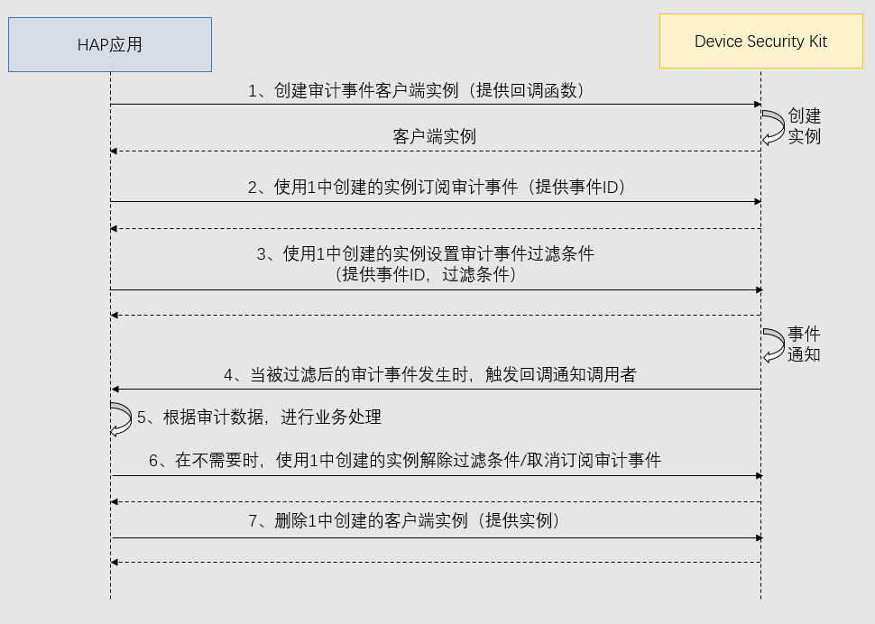

# 订阅通知类事件

更新时间：2026-06-12 06:54:11

来源：https://developer.huawei.com/consumer/cn/doc/harmonyos-guides/devicesecurity-audit-subscribe-c-filterevent

#### 场景介绍

从6.0.0(20)开始，新增提供统一的安全审计数据多客户端订阅/取消订阅与添加/删除过滤条件接口，应用可以获取设备上的安全审计数据（详见[API参考](https://developer.huawei.com/consumer/cn/doc/harmonyos-references/devicesecurity-capi-securityaudit#securityaudit_notify_event)），并按需进行过滤，以支撑审计相关业务。


#### 约束与限制
1. 当前能力仅支持2in1设备。
2. 一个进程最大只允许创建2个客户端实例，当前设备最多只允许创建16个客户端实例。
3. 一个客户端实例最大只允许设置256个Filter，每个Filter限制10条过滤value。


#### 业务流程





**流程说明：**
1. 开发者创建审计通知类事件(以下统称为事件)订阅客户端实例，需要提供CallBack。
2. 开发者使用1中创建的实例订阅事件，需要提供想要订阅的事件id。
3. 开发者使用1中创建的实例设置事件过滤条件，需要提供事件id和过滤条件信息。
4. 当事件发生时，审计服务先根据事件过滤条件过滤事件，当事件满足过滤条件时，触发回调通知订阅当前事件的客户端。
5. 开发者根据审计数据处理业务。
6. 当开发者应用不需要过滤/使用该审计数据时，开发者可以使用1中创建的实例解除过滤条件，取消对应的订阅事件。
7. 当开发者应用不需要使用当前实例时，开发者可以删除实例。

  
> [!NOTE]
> 支持先设置过滤条件再订阅事件。 删除实例后，被删除的实例所有的订阅以及过滤条件将被全部解除。


#### 接口说明

接口如下表，更多接口及使用方法请参见[API参考](https://developer.huawei.com/consumer/cn/doc/harmonyos-references/devicesecurity-capi-securityaudit#hms_securityaudit_newclient)。

| 接口名 | 描述 |
| --- | --- |
| int32_t HMS_SecurityAudit_NewClient(SecurityAudit_Client** client, SecurityAudit_Handler handler) | 创建通知类事件管理对象Client，Client提供订阅、解订阅、增加事件过滤、移除事件过滤功能。 |
| int32_t HMS_SecurityAudit_DeleteClient(SecurityAudit_Client* client) | 删除审计通知类事件管理对象。 |
| int32_t HMS_SecurityAudit_Subscribe(const SecurityAudit_Client* client, const SecurityAudit_Notify_Event *events, uint64_t count) | 订阅审计通知类事件。 |
| int32_t HMS_SecurityAudit_Unsubscribe(const SecurityAudit_Client* client, const SecurityAudit_Notify_Event *events, uint64_t count) | 解订阅审计通知类事件。 |
| int32_t HMS_SecurityAudit_AddFilter(const SecurityAudit_Client* client, SecurityAudit_Notify_Event event, const SecurityAudit_Filter *filter) | 添加审计通知类事件过滤条件。 |
| int32_t HMS_SecurityAudit_RemoveFilter(const SecurityAudit_Client* client, SecurityAudit_Notify_Event event, const SecurityAudit_Filter *filter) | 移除审计通知类事件过滤条件。 |


#### 开发步骤

> [!NOTE]
> 在开发准备过程中，需要申请权限：ohos.permission.QUERY_AUDIT_EVENT。 只允许清单内的企业类应用申请该权限，申请方式请参考： 申请使用企业类应用可用权限 。

1. 在CMakeLists.txt中导入安全审计共享库，并链接该库。

  
```text
find_library(dsm-lib libsecurityaudit_ndk.z.so)
target_link_libraries(entry PUBLIC libace_napi.z.so ${dsm-lib})
```

2. 导入安全审计的头文件。

  
```text
#include <DeviceSecurityKit/security_audit.h>
#include <cstdio>
```

3. 全局范围定义通知类事件的回调函数。

  
```text
void Notify(const SecurityAudit_Event *events, uint64_t count)
{
    if (events == nullptr) {
        printf("events nullptr");
        return;
    }
    for (uint64_t i = 0; i < count; i++) {
        printf("event content = %s", events[i].content);
        printf("event id = %ld", events[i].eventId);
    }
}
```

4. 创建审计通知类事件客户端实例。

  
```text
SecurityAudit_Client *client = NULL;
SecurityAudit_Handler handler = Notify;
HMS_SecurityAudit_NewClient(&client, handler);
if (client == nullptr) {
    printf("client is null");
    return 0;
}
```

5. 订阅审计通知类事件。

  
```text
SecurityAudit_Notify_Event event[1] = {};
event[0] = SECURITY_AUDIT_NOTIFY_EVENT_KIA_READ;
int ret = HMS_SecurityAudit_Subscribe(client, event, 1);
if (ret != 0) {
    printf("subscribe fail");
    return;
}
```

6. 设置审计通知类事件过滤条件。

  
```text
SecurityAudit_Filter filter = {};
filter.type = PROCESS_NAME_PREFIX;
const char* filterStr[1] = {};
filterStr[0] = "1";
filter.value = filterStr;
filter.valueCount = 1;
ret = HMS_SecurityAudit_AddFilter(client, SECURITY_AUDIT_NOTIFY_EVENT_KIA_READ, &filter);
if (ret != 0) {
    printf("addfilter fail");
    return;
}
```

7. 解除审计通知类事件订阅。

  
```text
ret = HMS_SecurityAudit_Unsubscribe(client, event, 1);
if (ret != 0) {
    printf("unsubscribe fail");
    return;
}
```

8. 解除审计通知类事件过滤条件。

  
```text
ret = HMS_SecurityAudit_RemoveFilter(client, SECURITY_AUDIT_NOTIFY_EVENT_KIA_READ, &filter);
if (ret != 0) {
    printf("removefilter fail");
    return;
}
```

9. 删除审计通知类事件客户端实例。

  
```text
ret = HMS_SecurityAudit_DeleteClient(client);
if (ret != 0) {
    printf("deleteclient fail");
    return;
}
```
