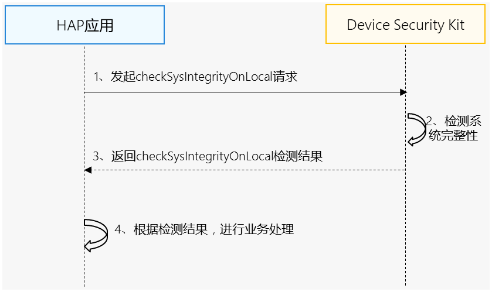

# 本地系统完整性检测

更新时间：2026-04-20 06:34:33

来源：https://developer.huawei.com/consumer/cn/doc/harmonyos-guides/devicesecurity-sysintegrity-check-onlocal

## 场景介绍

在不接入服务端的场景下，应用通过调用Device Security Kit的checkSysIntegrityOnLocal接口获取系统完整性检测结果，用于判断设备环境是否安全，比如是否被越狱、非真实设备等。 应用可以根据检测结果评估如何进行业务操作。
> [!NOTE]
> 系统完整性检测结果可以用作系统整体安全的一个环节，需要考虑检测结果误报带来的风险以及给用户带来的影响，不建议将系统完整性检测结果作为判断当前设备是否安全的唯一依据，更好的做法是通过额外的步骤降低风险。 该功能仅在无法接入服务端的场景下使用。


## 约束与限制

本地系统完整性检测能力支持Phone、Tablet、PC/2in1、Wearable设备。

## 业务流程


**流程说明：** 开发者应用调用checkSysIntegrityOnLocal接口，发起本地系统完整性检测请求。 Device Security Kit收到请求后，采集系统完整性检测数据，检测系统完整性。 通过checkSysIntegrityOnLocal接口将检测结果返回给开发者应用。 开发者应用可以根据检测结果进行业务处理。当本地系统完整性检测结果为false时，请进一步判断detail中的具体风险分类，您可以根据风险分类以及自身功能对安全的要求决定是否提醒用户。
> [!NOTE]
> 本地系统完整性检测结果可以用作系统整体安全的一个环节，需要考虑检测结果误报带来的风险以及给用户带来的影响，不建议将本地系统完整性检测结果作为判断当前设备是否安全的唯一依据，更好的做法是通过额外的步骤降低风险。 如果需要在应用中提醒用户，为了提升用户体验，建议采用友好的提示语，可参考： 您的设备疑似存在风险或运行在不安全环境中，请谨慎使用xxx功能。


## 接口说明

以下是系统完整性检测相关接口，包括ArkTS API，更多接口及使用方法请参见[API参考](https://developer.huawei.com/consumer/cn/doc/harmonyos-references/devicesecurity-safetydetectenhanced-api#checksysintegrityonlocal)。
| 接口名 | 描述 |
| --- | --- |
| [checkSysIntegrityOnLocal](https://developer.huawei.com/consumer/cn/doc/harmonyos-references/devicesecurity-safetydetectenhanced-api#checksysintegrityonlocal)(): Promise | 检测系统完整性 |


## 开发步骤


> [!NOTE]
> 请确保已打开“安全检测服务”开关并申请Profile。

导入Device Security Kit模块及相关公共模块。
```text
import { safetyDetect } from '@kit.DeviceSecurityKit';
import { BusinessError } from '@ohos.base';
import { hilog } from '@kit.PerformanceAnalysisKit';
```

调用接口获取系统完整性检测结果。
```text
const TAG = "SafetyDetectJsTest";

// 请求本地系统完整性检测，并处理结果
try {
  hilog.info(0x0000, TAG, 'CheckSysIntegrityOnLocal begin.');
  const result: string = await safetyDetect.checkSysIntegrityOnLocal();
  hilog.info(0x0000, TAG, 'Succeeded in checkSysIntegrityOnLocal: %{public}s', result);
} catch (err) {
  let e: BusinessError = err as BusinessError;
  hilog.error(0x0000, TAG, 'CheckSysIntegrityOnLocal failed: %{public}d %{public}s', e.code, e.message);
}
```

开发者应用可以根据检测结果进行业务处理，当本地系统完整性检测结果为false时，您可以根据自身功能对安全的要求决定是否提醒用户。 本地系统完整性检测结果是一个格式为JSON格式的字符串，内容示例如下：
```text
{
  "basicIntegrity": false,
  "detail": [
    "attack",
    "jailbreak",
    "emulator"
  ]
}
```


> [!NOTE]
> basicIntegrity：系统完整性检测的结果，true表示检测结果完整，false表示存在风险。 detail：可选字段，当basicIntegrity结果为false时，该字段将提供存在风险的原因，App开发者可以根据不同风险做出不同的决策，详情如下： jailbreak：设备被越狱。 emulator：非真实设备。 attack：设备被攻击。 unlock：设备被解锁。
