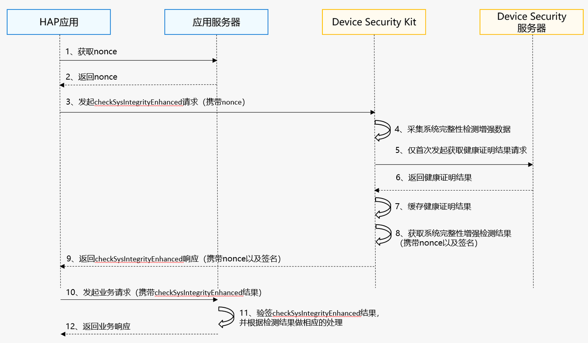

# 系统完整性增强检测

更新时间：2026-04-20 06:34:33

来源：https://developer.huawei.com/consumer/cn/doc/harmonyos-guides/devicesecurity-sysintegrityenhanced-check

##### 场景介绍

应用通过调用Device Security Kit的checkSysIntegrityEnhanced接口获取系统完整性增强检测结果，用于判断设备环境是否安全，比如是否被越狱、非真实设备等。

应用可以根据检测结果评估如何进行业务操作。


##### 约束与限制

 - 系统完整性增强检测能力支持Phone、Tablet、PC/2in1、Wearable设备。
 - 每个应用在每个设备上每天最多可以调用1万次接口、每分钟最多可以调用5次接口；每个设备上最多支持5个并发调用。


##### 业务流程





**流程说明：**
1. 开发者应用获取nonce。

  在调用checkSysIntegrityEnhanced接口时，您必须传入一个随机生成的nonce值。在检测结果中会包含这个nonce值，您可以通过校验这个nonce值来确定返回结果能够对应您的请求，并且没有被重放攻击。

  
> [!NOTE]
> nonce值必须为16至66字节之间，有效值为base64编码范围。 推荐的做法是，每次请求都从服务器随机生成新的nonce值。

2. 开发者应用调用checkSysIntegrityEnhanced接口，发起系统完整性增强检测请求。

  Device Security Kit收到请求后，首先采集系统完整性增强检测数据，然后将检测数据与nonce一起发送到Device Security服务器做检测，最后通过checkSysIntegrityEnhanced接口的返回值将检测结果传递给开发者应用。
3. 当开发者应用发起业务请求时，在您的应用服务器中验证系统完整性增强检测结果。

  当系统完整性增强检测结果为false时，请进一步判断detail中的具体风险分类，您可以根据风险分类以及自身功能对安全的要求决定是否提醒用户。

  
> [!NOTE]
> 当前方案已经通过服务端与客户端相结合等措施进行安全风险消减，但系统完整性增强检测API无法消减所有的安全风险。 系统完整性增强检测结果可以用作系统整体安全的一个环节，需要考虑检测结果误报带来的风险以及给用户带来的影响，不建议将系统完整性增强检测结果作为判断当前设备是否安全的唯一依据，更好的做法是通过额外的步骤降低风险。 如果需要在应用中提醒用户，为了提升用户体验，建议采用友好的提示语，可参考： 您的设备疑似存在风险或运行在不安全环境中，请谨慎使用xxx功能。


##### 接口说明

以下是系统完整性增强检测相关接口，包括ArkTS API，更多接口及使用方法请参见[API参考](https://developer.huawei.com/consumer/cn/doc/harmonyos-references/devicesecurity-safetydetectenhanced-api#checksysintegrityenhanced)。

| 接口名 | 描述 |
| --- | --- |
| checkSysIntegrityEnhanced(req: SysIntegrityRequest): Promise&lt;SysIntegrityResponse&gt; | 增强检测系统完整性 |


##### 开发步骤

> [!NOTE]
> 请确保已打开“ 安全检测服务 ”开关并 申请Profile 。

1. 导入Device Security Kit模块及相关公共模块。

  
```text
import { safetyDetect } from '@kit.DeviceSecurityKit';
import { BusinessError } from '@ohos.base';
import { hilog } from '@kit.PerformanceAnalysisKit';
```

2. 调用接口获取系统完整性检测结果。

  

 

  该接口涉及端云协同，需要联网等耗时操作，因此不要在UI线程中执行，避免阻塞UI线程。

  
```text
const TAG = "SafetyDetectJsTest";

// 请求系统完整性增强检测，并处理结果
let req : safetyDetect.SysIntegrityRequest = {
  nonce : 'imEe1PCRcjGkBCAhOCh6ImADztOZ8ygxlWRs' // 从服务器生成的随机的nonce值
};
try {
  hilog.info(0x0000, TAG, 'CheckSysIntegrity begin.');
  const data: safetyDetect.SysIntegrityResponse = await safetyDetect.checkSysIntegrityEnhanced(req);
  hilog.info(0x0000, TAG, 'Succeeded in checkSysIntegrityEnhanced: %{public}s', data.result);
} catch (err) {
  let e: BusinessError = err as BusinessError;
  hilog.error(0x0000, TAG, 'CheckSysIntegrityEnhanced failed: %{public}d %{public}s', e.code, e.message);
}
```

3. 在您的应用服务器中验证检测结果。

  系统完整性检测结果是一个格式为JSON WEB Signature（JWS）的字符串。包括三个部分：

  
 - Header（头部）

4. Payload（负载）

5. Signature（签名）

6. 解析JWS，获取header、payload、signature。

7. 从header中获取证书链，使用[Root CA](https://pki.consumer.huawei.com/ca/cer/Huawei_CBG_ECC_Device_Attestation_Root_CA.cer)证书对其进行验证。

8. 校验证书链中是否包含3级证书；校验证书链中x5c[0]证书的Common Name是否为Harmony OS Device Attestation Service。

9. 从signature中获取签名，校验其签名。

10. 校验hapBundleName或appId，检查其是否正确。

11. 从payload中获取完整性验证结果，当检测结果中basicIntegrity为false，detail字段会列出检测结果为false的原因，您可以根据自身功能对安全的要求决定是否提醒用户。

  

 

  请按照上述步骤校验证书与签名，确保检测结果的完整性，防止检测结果被篡改。
