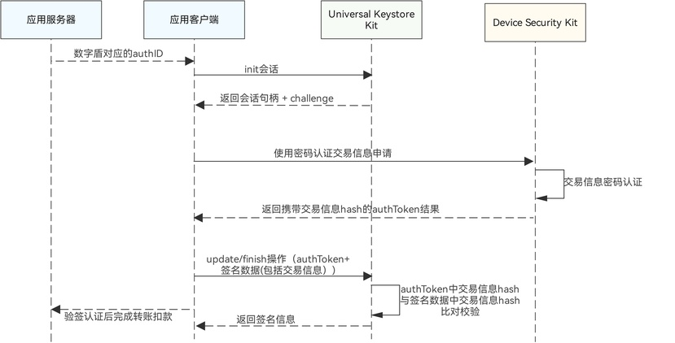
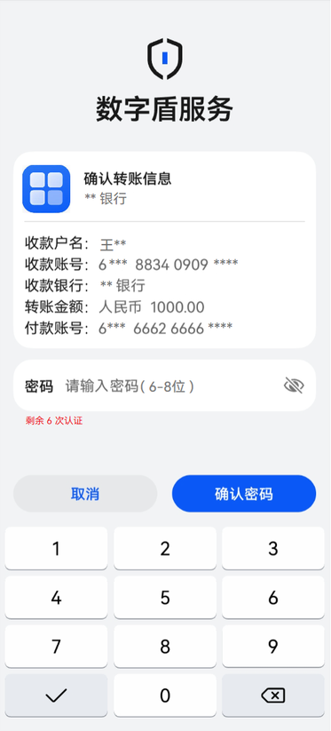
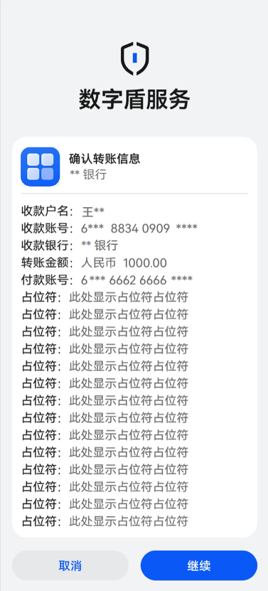
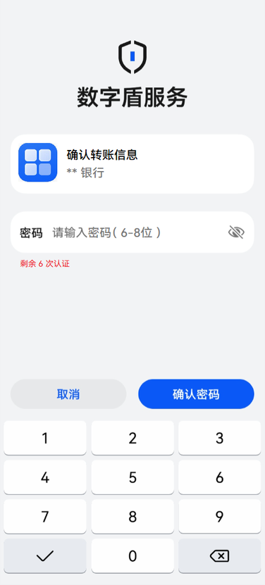

# 交易信息密码认证

更新时间：2026-05-26 06:48:54

来源：https://developer.huawei.com/consumer/cn/doc/harmonyos-guides/devicesecurity-trustedauth-verifybypwd

##### 场景介绍

在交易信息密码认证场景中，可以利用创建的数字盾密码对交易信息进行认证，可通过密钥管理服务提供的签名认证功能来确认交易内容是否被篡改，以确保整个交易过程的安全性。


##### 约束与限制

本功能在API 24之前版本仅支持Phone；API24及之后版本，新增支持具备TUI能力的PC/2in1、具备TUI能力的Tablet。可通过接口[checkConfirmUITextFormat](https://developer.huawei.com/consumer/cn/doc/harmonyos-references/devicesecurity-trusted-auth-api#checkconfirmuitextformat)查询设备是否具备TUI能力。不支持的设备在调用数字盾服务相关业务接口时，返回错误码1019100016。


##### 业务流程





##### 接口说明

接口及使用方法请参见[API参考](https://developer.huawei.com/consumer/cn/doc/harmonyos-references/devicesecurity-arktsapi-errcode-trusted-auth)。

| 接口名 | 描述 |
| --- | --- |
| procContentAuthentication(challenge: Uint8Array, authID: bigint, authMsg: AuthReqParams, label: TUILable): Promise&lt;AuthToken&gt; | 交易信息处理接口 |


##### 交易信息密码认证界面介绍

如图1、图2、图3为手机端使用数字盾密码进行交易认证时对应的TUI界面示例，其中交易信息密码认证分为两种场景：
1. 当用户交易信息不超过6行时，则以下图1中无翻页形式进行密码认证。
2. 当用户交易信息超过6行时，则以下图2-3中翻页形式进行密码认证，且当交易信息超过19行时，则Device Security Kit拒绝拉起TUI界面。

**图1** 无翻页密码认证





**图2** 翻页密码认证-1





**图3** 翻页密码认证-2





交易信息格式说明如下：
1. **带标记格式**，以key:value|flag形式，flag取值如下：

  
0：表示不展示该行内容。
2. 1：单行截断展示（若内容超出一行则截断）。
3. 2：自动换行展示（若内容超出一行则换行）。
4. **无标记格式**，直接输入内容（无“|”符号）。

  
系统将完整展示所有内容，超出一行时自动换行。
5. **文本显示规格**。

  
输入字体要求utf-8。
6. 当输入字符为生僻字时，显示*。

如图为PC端使用数字盾密码进行交易认证时对应的TUI界面示例。


PC场景数字盾规格说明如下：
1. **界面布局与显示**。

  
TUI界面显示在屏幕中央，背景透明区域为富执行环境（Rich Execution Environment，REE）。
2. **交互方式**。

  
鼠标操作：当TUI界面拉起后，鼠标仅可点击REE侧界面，无法操作TUI界面。
3. 触控操作：当TUI界面拉起后，设备仅响应TUI区域内的触控操作。
4. 键盘操作：当TUI界面拉起后，用户仅可通过内置键盘输入，为确保用户使用安全性，暂不支持外置键盘输入。
5. **数字盾服务键盘使用场景规格说明**

  
TUI界面支持数字、大小写字母及 !、@ 等特殊符号输入，同样具备Backspace键删除、ESC键退出和Enter键换行或确认功能。
6. TUI运行于可信执行环境（TEE），内置键盘处于安全状态，无法对TUI界面之外的区域进行输入操作，确保敏感数据在可信执行环境中得到保护。


##### 开发步骤
1. 导入huks 、trustedAuthentication 和相关依赖模块。

  
```text
import { resourceManager } from '@kit.LocalizationKit'
import { huks } from '@kit.UniversalKeystoreKit';
import { BusinessError } from '@kit.BasicServicesKit';
import { trustedAuthentication } from '@kit.DeviceSecurityKit';
import { cryptoFramework } from '@kit.CryptoArchitectureKit';
import { hilog } from '@kit.PerformanceAnalysisKit';
import { common } from '@kit.AbilityKit';
import { util } from '@kit.ArkTS';
```

2. 发起交易认证前，需从服务器获取当前账号在[设置数字盾密码](https://developer.huawei.com/consumer/cn/doc/harmonyos-guides/devicesecurity-trustedauth-setpwd)时获取的authID。
3. 参考密钥管理服务提供的[签名/验签指导](https://developer.huawei.com/consumer/cn/doc/harmonyos-guides/huks-signing-signature-verification-arkts)，初始化签名会话。

  
> [!NOTE]
> 设置签名密钥时密钥属性集合中需要指定tag: huks.HuksTag.HUKS_TAG_KEY_SECURE_SIGN_TYPE值为huks.HuksSecureSignType.HUKS_SECURE_SIGN_WITH_AUTHINFO，即可对附加的交易信息做签名认证。


  
```text
// 设置签名密钥属性示例
  let properties: Array<huks.HuksParam> = [{
    tag: huks.HuksTag.HUKS_TAG_ALGORITHM,
    value: huks.HuksKeyAlg.HUKS_ALG_ECC
  }, {
    tag: huks.HuksTag.HUKS_TAG_KEY_SIZE,
    value: huks.HuksKeySize.HUKS_AES_KEY_SIZE_256
  }, {
    tag: huks.HuksTag.HUKS_TAG_PURPOSE,
    value: huks.HuksKeyPurpose.HUKS_KEY_PURPOSE_SIGN
  }, {
    tag: huks.HuksTag.HUKS_TAG_DIGEST,
    value: huks.HuksKeyDigest.HUKS_DIGEST_SHA256
  },
  // 表示对附加的交易信息做签名认证
  {
    tag: huks.HuksTag.HUKS_TAG_KEY_SECURE_SIGN_TYPE,
    value: huks.HuksSecureSignType.HUKS_SECURE_SIGN_WITH_AUTHINFO
  }];
```

4. 调用交易认证接口，发起密码认证交易申请，当用户密码认证通过后，即可获得携带交易信息hash的authToken。

  
```text
async function ContentVerifyByPwd(challenge: Uint8Array, context: common.UIAbilityContext):Promise<trustedAuthentication.AuthToken> {
  try {
    const authID: bigint = 11842183505170721246n; // 实际填充为从服务器获取到的账号对应的authID值
    const resourceMgr: resourceManager.ResourceManager = context.resourceManager;
    const fileData : Uint8Array = await resourceMgr.getRawFileContent('test_logo_rgba.png'); // 实际使用时请替换为应用要在TUI界面展示的logo图片名称
    const reqParams:trustedAuthentication.AuthReqParams = {
      reqType: trustedAuthentication.AuthType.AUTH_TYPE_TUI_PIN,
      authContent: ["用户：王xx", "账号：95588180804408xxxx", "交易金额：1000000000"], // 实际使用时填充为交易信息，每一行交易信息为其中的一个字符串成员
    }
    const buffer = fileData.buffer;
    const label:trustedAuthentication.TUILable = {
      image: buffer as ArrayBuffer,
      title: "密码交易认证",
    }
    const result = await trustedAuthentication.procContentAuthentication(challenge, authID, reqParams, label);
    return result;
  } catch (err) {
   hilog.error(0x0000, 'testTag', `Failed to procContentAuthentication, code:${err.code}, message:${err.message}`);
   throw new Error('Content verify by password failed:' + (err as BusinessError).message);
 }
}
const rand = cryptoFramework.createRandom();
const len: number = 32;
const challenge: Uint8Array = rand?.generateRandomSync(len)?.data; // 实际使用时请替换为通过UniversalKeystoreKit初始化会话获取的challenge
let context = this.getUIContext().getHostContext() as common.UIAbilityContext;
const authToken: trustedAuthentication.AuthToken = await ContentVerifyByPwd(challenge, context);
```

5. 参考密钥管理服务提供的[针对携带认证信息的签名/验签指导](https://developer.huawei.com/consumer/cn/doc/harmonyos-guides/huks-signing-signature-verification-arkts#eccsha256携带认证信息的签名类型), 对交易信息authToken数据进行签名验证，并结束会话。

  
> [!WARNING]
> 需要注意的是，在交易认证过程中输入的交易信息格式如下： CODE3 而密钥管理服务验签时的inputData信息为Uint8Array，需要将所有信息按照\n拼接，并将UTF-8信息转换为Uint8Array CODE4

6. 参考密钥管理服务提供的[签名/验签指导](https://developer.huawei.com/consumer/cn/doc/harmonyos-guides/huks-signing-signature-verification-arkts), 对签名数据进行验签操作，验签通过后可完成对应账户的转账扣款。
