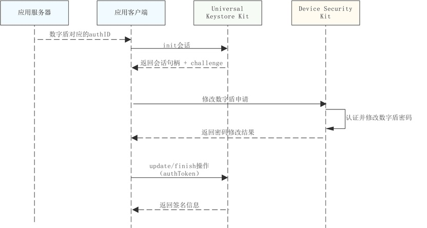
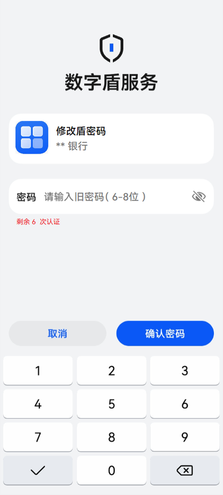
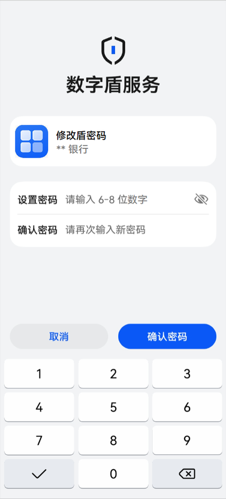

# 修改数字盾密码

更新时间：2026-07-28 11:23:46

来源：https://developer.huawei.com/consumer/cn/doc/harmonyos-guides/devicesecurity-trustedauth-modifypwd

#### 场景介绍

激活数字盾后，用户可在完成旧密码认证后，修改数字盾密码信息。


#### 约束与限制

本功能在6.1.1(24)之前版本仅支持Phone；6.1.1(24)及之后版本，新增支持具备TUI能力的PC/2in1、具备TUI能力的Tablet。可通过接口[checkConfirmUITextFormat](https://developer.huawei.com/consumer/cn/doc/harmonyos-references/devicesecurity-trusted-auth-api#checkconfirmuitextformat)查询设备是否具备TUI能力。不支持的设备在调用数字盾服务相关业务接口时，返回错误码1019100016。


#### 业务流程





#### 接口说明

接口及使用方法请参见[API参考](https://developer.huawei.com/consumer/cn/doc/harmonyos-references/devicesecurity-trusted-auth-api)。

| 接口名 | 描述 |
| --- | --- |
| modifyTrustedAuthenticationPwd(challenge: Uint8Array, pwdInfo: PasswordInfo, authID: bigint, label: TUILable): Promise&lt;AuthToken&gt; | 修改数字盾密码 |


#### 修改数字盾密码界面介绍

如图1、图2为修改数字盾密码时对应的TUI界面示例，用户需使用旧密码认证通过后，方可设置新密码。密码认证失败时，剩余认证次数减1，当剩余认证次数为0时，则锁定数字盾服务。新密码长度、对应TUI应用图标以及当前企业开发者应用场景说明均由开发者调用接口时传入。

**图1** 旧密码认证





**图2** 新密码设置





#### 开发步骤
1. 导入huks 、trustedAuthentication 和相关依赖模块。

  
```text
import { resourceManager } from '@kit.LocalizationKit'
import { huks } from '@kit.UniversalKeystoreKit';
import { BusinessError } from '@kit.BasicServicesKit';
import { trustedAuthentication } from '@kit.DeviceSecurityKit';
import { cryptoFramework } from '@kit.CryptoArchitectureKit';
import { hilog } from '@kit.PerformanceAnalysisKit';
import { common } from '@kit.AbilityKit';
```

2. 修改密码前，需从服务器获取当前账号在[设置数字盾密码](https://developer.huawei.com/consumer/cn/doc/harmonyos-guides/devicesecurity-trustedauth-setpwd)时获取的authID。
3. 参考密钥管理服务提供的[签名/验签指导](https://developer.huawei.com/consumer/cn/doc/harmonyos-guides/huks-signing-signature-verification-arkts)，初始化签名会话。
4. 调用数字盾服务修改密码接口，发起数字盾密码修改申请。

  
```text
async ModifyPwd(challenge: Uint8Array, assetName: string): Promise<trustedAuthentication.AuthToken> {
  try {
    const passwordInfo: trustedAuthentication.PasswordInfo = {
      pwdType: trustedAuthentication.PasswordType.PASSWORD_TYPE_DIGITAL,
      pwdMaxLength: 10,
      pwdMinLength: 6,
      maxAuthFailCount: 6
    };
    let resArray: Uint8Array = await AssetUtils.QueryDataFromAssetStore(assetName);
    let credentialID: bigint = CryptoUtils.uint8ArrayToBigInt(resArray); // 实际填充为从服务器获取到的账号对应的credentialID值
    const context = AppStorage.get('context') as Context;
    const buffer: ArrayBuffer = await CryptoUtils.ImportImage(); // 获取应用要在TUI界面展示的logo图片
    const label: trustedAuthentication.TUILable = {
      image: buffer,
      title: context.resourceManager.getStringSync($r('app.string.ModifyShield').id)
    }
    const authInfo =
      await trustedAuthentication.modifyTrustedAuthenticationPwd(challenge, passwordInfo, credentialID, label);
    hilog.info(0x0000, 'testTag', 'Modify Shield Success：', authInfo.authToken);
    return authInfo;
  } catch (error) {
    hilog.error(0x0000, 'testTag', 'Modify Shield Fail：', error);
    throw new Error('Modify Shield Fail：' + (error as BusinessError).message);
  }
}
```

5. 参考密钥管理服务提供的[签名/验签指导](https://developer.huawei.com/consumer/cn/doc/harmonyos-guides/huks-signing-signature-verification-arkts), 对通过修改密码获取到的authToken数据进行签名，并结束会话。
