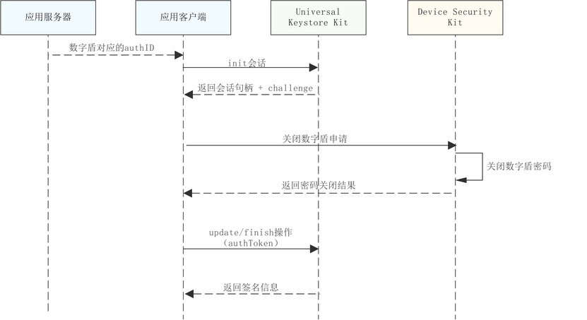
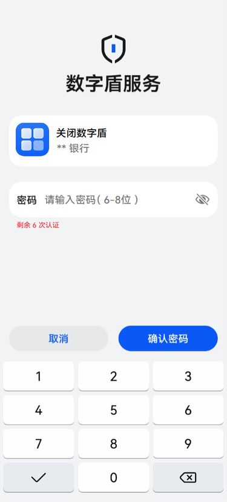

# 关闭数字盾服务

更新时间：2026-08-03 11:34:29

来源：https://developer.huawei.com/consumer/cn/doc/harmonyos-guides/devicesecurity-trustedauth-disablepwd

#### 场景介绍

当用户不再使用数字盾时，可以通过密码认证主动发起关闭数字盾的操作；若用户忘记密码或连续密码认证失败次数达到最大限制导致数字盾密码锁定，当企业开发者应用将在重新激活数字盾时，无需进行密码认证直接关闭最初激活的数字盾，并通过[设置数字盾密码](https://developer.huawei.com/consumer/cn/doc/harmonyos-guides/devicesecurity-trustedauth-setpwd)重新创建新的数字盾密码。


#### 约束与限制

本功能在6.1.1(24)之前版本仅支持Phone；6.1.1(24)及之后版本，新增支持具备TUI能力的PC/2in1、具备TUI能力的Tablet。可通过接口[checkConfirmUITextFormat](https://developer.huawei.com/consumer/cn/doc/harmonyos-references/devicesecurity-trusted-auth-api#trustedauthenticationcheckconfirmuitextformat)查询设备是否具备TUI能力。不支持的设备在调用数字盾服务相关业务接口时，返回错误码1019100016。


#### 业务流程





当不需要密码认证进行关闭数字盾申请时，则无需和Universal Keystore Kit交互，使用随机生成的challenge完成关闭数字盾操作。


#### 接口说明

接口及使用方法请参见[API参考](https://developer.huawei.com/consumer/cn/doc/harmonyos-references/devicesecurity-trusted-auth-api)。

| 接口名 | 描述 |
| --- | --- |
| disableTrustedAuthentication(challenge: Uint8Array, needAuth: boolean, authID: bigint, label: TUILable): Promise&lt;AuthToken&gt; | 关闭数字盾服务。 |


#### 关闭数字盾服务界面介绍

如图为需要进行密码认证的方式关闭数字盾服务时对应的TUI界面示例。





#### 开发步骤


#### 密码认证方式关闭数字盾服务
1. 导入huks 、trustedAuthentication 和相关依赖模块。

  
```text
import { resourceManager } from '@kit.LocalizationKit'
import { huks } from '@kit.UniversalKeystoreKit';
import { BusinessError } from '@kit.BasicServicesKit';
import { trustedAuthentication } from '@kit.DeviceSecurityKit';
import { cryptoFramework } from '@kit.CryptoArchitectureKit';
import { hilog } from '@kit.PerformanceAnalysisKit';
import { common } from '@kit.AbilityKit';
```

2. 关闭数字盾前，需从服务器获取当前账号在[设置数字盾密码](https://developer.huawei.com/consumer/cn/doc/harmonyos-guides/devicesecurity-trustedauth-setpwd)时获取的authID。
3. 参考密钥管理服务提供的[签名/验签指导](https://developer.huawei.com/consumer/cn/doc/harmonyos-guides/huks-signing-signature-verification-arkts)，初始化签名会话。
4. 调用关闭数字盾服务接口，发起数字盾服务关闭申请。

  
```text
async DisablePwd(challenge: Uint8Array, assetName: string): Promise<trustedAuthentication.AuthToken> {
  try {
    let resArray: Uint8Array = await AssetUtils.QueryDataFromAssetStore(assetName);
    let credentialID: bigint = CryptoUtils.uint8ArrayToBigInt(resArray);
    const context = AppStorage.get('context') as Context;
    const buffer: ArrayBuffer = await CryptoUtils.ImportImage();
    const label: trustedAuthentication.TUILable = {
      image: buffer,
      title: context.resourceManager.getStringSync($r('app.string.CloseShield').id)
    }
    const authInfo = await trustedAuthentication.disableTrustedAuthentication(challenge, true, credentialID, label);
    AssetUtils.DeleteDataFromAssetStore('pin_label1');
    AssetUtils.DeleteDataFromAssetStore('credentialID');
    AssetUtils.DeleteDataFromAssetStore('face_credentialID');
    AssetUtils.DeleteDataFromAssetStore('finger_credentialID');
    hilog.info(DOMAIN, 'testTag', 'Close Shield Success：', authInfo.authToken);
    return authInfo;
  } catch (error) {
    hilog.error(DOMAIN, 'testTag', 'Close Shield Fail：', error);
    throw new Error('Close Shield Fail：' + (error as BusinessError).message);
  }
}
```

5. 参考密钥管理服务提供的[签名/验签指导](https://developer.huawei.com/consumer/cn/doc/harmonyos-guides/huks-signing-signature-verification-arkts), 对通过关闭数字盾获取到的authToken数据进行签名，并结束会话。


#### 无需密码认证方式关闭数字盾服务

使用cryptoFramework生成的32字节随机数作为challenge，直接调用关闭数字盾服务接口即可，生成的authToken信息未经过密码认证，不可进行签名校验。


```text
async disablePwdWithoutAuth(challenge: Uint8Array, assetName: string): Promise<ArrayBuffer> {
  try {
    let resArray: Uint8Array = await AssetUtils.QueryDataFromAssetStore(assetName);
    let credentialID: bigint = CryptoUtils.uint8ArrayToBigInt(resArray); // 实际填充为从服务器获取到的账号对应的credentialID值
    let emptyBuffer = new ArrayBuffer(0);
    const label: trustedAuthentication.TUILable = {
      image: emptyBuffer,
      title: ''
    }
    const authInfo = await trustedAuthentication.disableTrustedAuthentication(challenge, false, credentialID, label);
    // 实际使用时请替换为删除服务器侧数字盾流程
    AssetUtils.DeleteDataFromAssetStore('pin_label1');
    AssetUtils.DeleteDataFromAssetStore('credentialID');
    AssetUtils.DeleteDataFromAssetStore('face_credentialID');
    AssetUtils.DeleteDataFromAssetStore('finger_credentialID');
    hilog.info(DOMAIN, 'testTag', 'Close Shield Success：', authInfo.authToken);
    return authInfo.authToken;
  } catch (error) {
    hilog.error(DOMAIN, 'testTag', 'Close Shield Fail：', error);
    throw new Error('Close Shield Fail：' + (error as BusinessError).message);
  }
}
```
