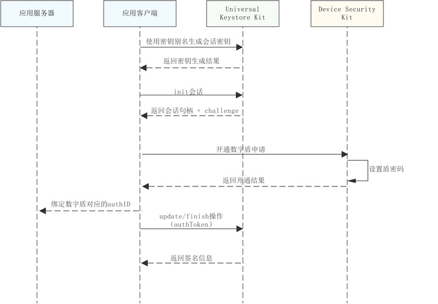
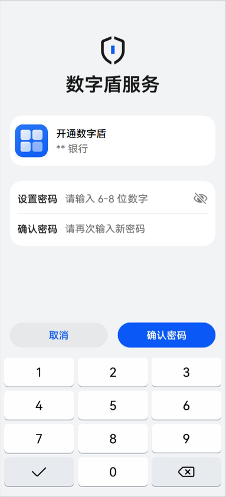

# 设置数字盾密码

更新时间：2026-04-30 02:41:24

来源：https://developer.huawei.com/consumer/cn/doc/harmonyos-guides/devicesecurity-trustedauth-setpwd

## 场景介绍

用户首次激活数字盾时，需通过可信用户交互（全称Trusted User Interface，下文简称TUI）安全界面设置专用密码，后续进行交易认证时，将通过该密码完成安全验证。

## 约束与限制

本功能在API 24之前版本仅支持Phone；API24及之后版本，新增支持具备TUI能力的PC/2in1、具备TUI能力的Tablet。可通过接口[checkConfirmUITextFormat](https://developer.huawei.com/consumer/cn/doc/harmonyos-references/devicesecurity-trusted-auth-api#checkconfirmuitextformat)查询设备是否具备TUI能力。不支持的设备在调用数字盾服务相关业务接口时，返回错误码1019100016。

## 业务流程



## 接口说明

接口及使用方法请参见[API参考](https://developer.huawei.com/consumer/cn/doc/harmonyos-references/devicesecurity-trusted-auth-api)。
| 接口名 | 描述 |
| --- | --- |
| [enableTrustedAuthentication](https://developer.huawei.com/consumer/cn/doc/harmonyos-references/devicesecurity-trusted-auth-api#enabletrustedauthentication)(challenge: Uint8Array, pwdInfo: PasswordInfo, label: TUILable): Promise | 创建数字盾密码 |


## 开通数字盾界面介绍

如图为开通数字盾服务时对应的TUI（Trusted User Interface）界面示例，其中密码长度、对应TUI应用图标以及当前应用场景说明均由开发者调用接口时传入，当设置盾密码长度不符合要求、密码强度低、两次密码设置不一致时，均会有对应失败报错提醒。


## 开发步骤

导入huks 、trustedAuthentication 和相关依赖模块。
```text
import { resourceManager } from '@kit.LocalizationKit'
import { huks } from '@kit.UniversalKeystoreKit';
import { BusinessError } from '@kit.BasicServicesKit';
import { trustedAuthentication } from '@kit.DeviceSecurityKit';
import { cryptoFramework } from '@kit.CryptoArchitectureKit';
import { hilog } from '@kit.PerformanceAnalysisKit';
import { common } from '@kit.AbilityKit';
```

确认设备是否具备TUI能力。
```text
async function isSupportTUI():Promise {
   if (canIUse('SystemCapability.Security.TrustedAuthentication')) {
     let text = 'a'; // 任意短字符串。
     try {
       const result = await trustedAuthentication.checkConfirmUITextFormat(text);
       if (result.result == 0) {
         return true;
       }
     } catch (error) {
       hilog.error(0x0000, TAG, 'The trusted authentication feature is not enabled.');
       return false;
     }
   }
   return false;
 }
 let supportFlag:boolean = await isSupportTUI();
```

参考密钥管理服务提供的[密钥生成开发指导](https://developer.huawei.com/consumer/cn/doc/harmonyos-guides/huks-key-generation-arkts)，使用指定的会话密钥别名及指定密钥属性集合完成密钥生成。
> [!NOTE]
> 创建密钥时指定密钥属性集合中身份认证类型tag: huks.HuksTag.HUKS_TAG_USER_AUTH_TYPE时，必须要包括huks.HuksUserAuthType.HUKS_USER_AUTH_TYPE_TUI_PIN认证方式，其余认证类型可以根据业务需要进行定制配置。


```text
// 密钥属性集示例
let properties: Array = [{
  tag: huks.HuksTag.HUKS_TAG_ALGORITHM,
  value: huks.HuksKeyAlg.HUKS_ALG_ECC
}, {
  tag: huks.HuksTag.HUKS_TAG_PURPOSE,
  value: huks.HuksKeyPurpose.HUKS_KEY_PURPOSE_SIGN | huks.HuksKeyPurpose.HUKS_KEY_PURPOSE_VERIFY
}, {
  tag: huks.HuksTag.HUKS_TAG_KEY_SIZE,
  value: huks.HuksKeySize.HUKS_ECC_KEY_SIZE_256,
}, {
  tag: huks.HuksTag.HUKS_TAG_DIGEST,
  value: huks.HuksKeyDigest.HUKS_DIGEST_SHA256
},
{
  tag: huks.HuksTag.HUKS_TAG_KEY_AUTH_PURPOSE,
  value: huks.HuksKeyPurpose.HUKS_KEY_PURPOSE_SIGN
},
// 指定密钥身份认证的类型：TUI_PIN/指纹/人脸
{
  tag: huks.HuksTag.HUKS_TAG_USER_AUTH_TYPE,
  value: huks.HuksUserAuthType.HUKS_USER_AUTH_TYPE_TUI_PIN | huks.HuksUserAuthType.HUKS_USER_AUTH_TYPE_FINGERPRINT | huks.HuksUserAuthType.HUKS_USER_AUTH_TYPE_FACE
},
// 指定密钥安全授权的类型（失效类型）：新录入生物特征（如指纹）后无效
{
  tag: huks.HuksTag.HUKS_TAG_KEY_AUTH_ACCESS_TYPE,
  value: huks.HuksAuthAccessType.HUKS_AUTH_ACCESS_ALWAYS_VALID
},
// 指定挑战值的类型：默认类型
{
  tag: huks.HuksTag.HUKS_TAG_CHALLENGE_TYPE,
  value: huks.HuksChallengeType.HUKS_CHALLENGE_TYPE_NORMAL
}];
```

参考密钥管理服务提供的[签名/验签指导](https://developer.huawei.com/consumer/cn/doc/harmonyos-guides/huks-signing-signature-verification-arkts)，初始化签名会话。 调用设置密码接口，发起数字盾密码创建申请。
```text
// 设置数字盾密码
async function SetPwd(challenge: Uint8Array, context: common.UIAbilityContext):Promise {
  try {
   // 数字盾密码定制属性参数
   const passwordInfo: trustedAuthentication.PasswordInfo = {
     pwdType: trustedAuthentication.PasswordType.PASSWORD_TYPE_DIGITAL,
     pwdMaxLength: 10,
     pwdMinLength: 6,
     maxAuthFailCount: 6
   };

   const resourceMgr: resourceManager.ResourceManager = context.resourceManager;
   const fileData : Uint8Array = await resourceMgr.getRawFileContent('test_logo_rgba.png');//实际使用时请替换为应用要在TUI界面展示的logo图片名称
   const buffer = fileData.buffer;
   const label:trustedAuthentication.TUILable = {
     image: buffer as ArrayBuffer,
     title: "开通数字盾",
   }
   const authInfo = await trustedAuthentication.enableTrustedAuthentication(challenge, passwordInfo, label);
   return authInfo;
  } catch (err) {
   hilog.error(0x0000, 'testTag', `Failed to enableTrustedAuthentication, code:${err.code}, message:${err.message}`);
   throw new Error('Enable trusted authentication failed:' + (err as BusinessError).message);
  }
}
const rand = cryptoFramework.createRandom();
const len: number = 32;
const challenge: Uint8Array = rand?.generateRandomSync(len)?.data;//实际使用时请替换为通过UniversalKeystoreKit初始化会话获取的challenge
let context = this.getUIContext().getHostContext() as common.UIAbilityContext;
let authInfo: trustedAuthentication.AuthInfo = await SetPwd(challenge, context);
```

参考密钥管理服务提供的[签名/验签指导](https://developer.huawei.com/consumer/cn/doc/harmonyos-guides/huks-signing-signature-verification-arkts), 对通过密码设置获取到的authToken数据进行签名，并结束会话。
