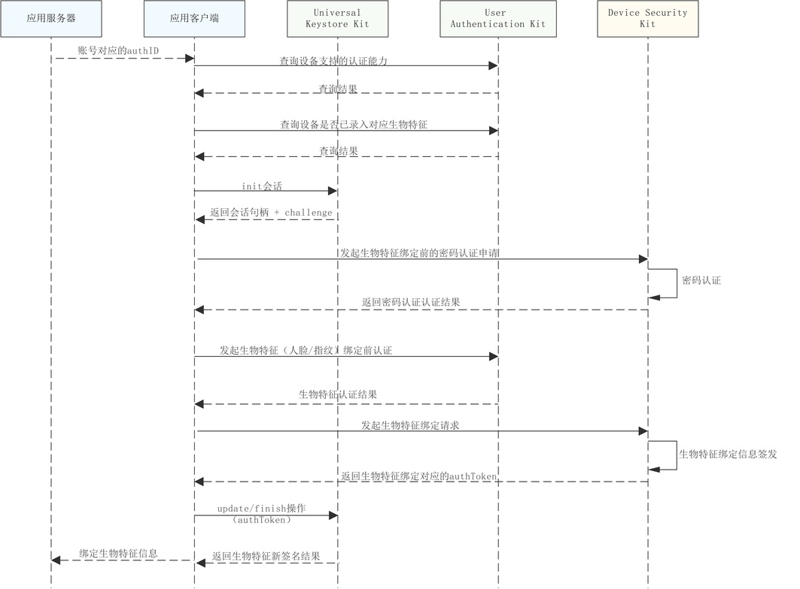
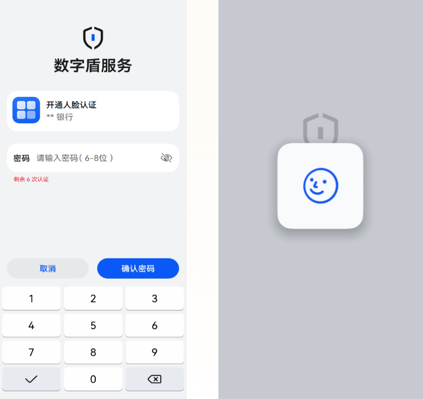

# 开通生物特征认证能力

更新时间：2026-04-30 02:41:24

来源：https://developer.huawei.com/consumer/cn/doc/harmonyos-guides/devicesecurity-trustedauth-enablebio

#### 场景介绍
1. 本功能在API 24之前版本仅支持Phone；API24及之后版本，新增支持具备TUI能力的PC/2in1、具备TUI能力的Tablet。可通过接口[checkConfirmUITextFormat](https://developer.huawei.com/consumer/cn/doc/harmonyos-references/devicesecurity-trusted-auth-api#checkconfirmuitextformat)查询设备是否具备TUI能力。不支持的设备在调用数字盾服务相关业务接口时，返回错误码1019100016。
2. 人脸认证功能需设备具备**3D人脸识别能力**，可通过调用[查询支持的认证能力](https://developer.huawei.com/consumer/cn/doc/harmonyos-guides/obtain-supported-authentication-capabilities)确认设备是否支持3D人脸识别。当前仅支持绑定一个指纹或人脸用于支付认证。
3. 本功能需应用服务器端完成接口接入，以配合端云协同认证流程。


#### 约束与限制

本功能在API24之前版本仅在手机设备支持。对于API24及之后版本，本功能在手机设备、部分PC/2in1、部分Tablet设备支持。人脸认证功能仅支持具备**3D人脸识别能力**的设备，目前仅支持绑定一个指纹/人脸用于支付认证，且需应用服务器端同步接入配合端云协同认证。通过用户认证服务提供的接口[查询支持的认证能力](https://developer.huawei.com/consumer/cn/doc/harmonyos-guides/obtain-supported-authentication-capabilities)，可确认设备是否支持3D人脸。


#### 业务流程





#### 接口说明

接口及使用方法请参见[API参考](https://developer.huawei.com/consumer/cn/doc/harmonyos-references/devicesecurity-trusted-auth-api)。

| 接口名 | 描述 |
| --- | --- |
| trustedAuthentication(challenge: Uint8Array, authID: bigint, label: TUILable): Promise&lt;AuthToken&gt; | 数字盾密码认证 |
| getBiometricAuthToken(operType: OperateType, tuiAuthToken: Uint8Array, bioAuthToken: Uint8Array): Promise&lt;AuthToken&gt; | 获取生物特征绑定完成后生成的authToken信息 |


#### 开通生物特征认证能力界面介绍

如图表示开通人脸认证时对应的UI界面示例，当密码认证通过后，则会拉起系统人脸认证界面进行人脸信息绑定。





#### 开发步骤
1. 导入huks 、userAuth 、trustedAuthentication和相关依赖模块。

  
```text
import { resourceManager } from '@kit.LocalizationKit'
import { huks } from '@kit.UniversalKeystoreKit';
import { userAuth } from '@kit.UserAuthenticationKit';
import { BusinessError } from '@kit.BasicServicesKit';
import { trustedAuthentication } from '@kit.DeviceSecurityKit';
import { cryptoFramework } from '@kit.CryptoArchitectureKit';
import { hilog } from '@kit.PerformanceAnalysisKit';
import { common } from '@kit.AbilityKit';
```

2. 通过用户认证服务提供的接口[查询设备是否已录入相关凭证](https://developer.huawei.com/consumer/cn/doc/harmonyos-references/js-apis-useriam-userauth#userauthgetenrolledstate12)。
3. 参考密钥管理服务提供的[签名/验签指导](https://developer.huawei.com/consumer/cn/doc/harmonyos-guides/huks-signing-signature-verification-arkts)，初始化签名会话。
4. 调用数字盾密码认证接口[trustedAuthentication](https://developer.huawei.com/consumer/cn/doc/harmonyos-references/devicesecurity-trusted-auth-api#trustedauthentication)发起生物特征认证前的密码认证申请。

  
```text
async function PwdVerify(challenge: Uint8Array, context: common.UIAbilityContext):Promise<trustedAuthentication.AuthToken> {
  try {
    const authID: bigint = 11842183505170721246n;//实际填充为从服务器获取到的账号对应的authID值
    const resourceMgr: resourceManager.ResourceManager = context.resourceManager;
    const fileData : Uint8Array = await resourceMgr.getRawFileContent('test_logo_rgba.png'); //实际使用时请替换为应用要在TUI界面展示的logo图片名称
    const buffer = fileData.buffer;
    const label:trustedAuthentication.TUILable = {
      image: buffer as ArrayBuffer,
      title: "数字盾密码认证",
    }
    const result = await trustedAuthentication.trustedAuthentication(challenge, authID, label);
    return result;
  } catch (err) {
    hilog.error(0x0000, 'testTag', `Failed to trustedAuthentication, code:${err.code}, message:${err.message}`);
    throw new Error('Password verify failed:' + (err as BusinessError).message);
  }
}
const rand = cryptoFramework.createRandom();
const len: number = 32;
const challenge: Uint8Array = rand?.generateRandomSync(len)?.data;//实际使用时请替换为通过UniversalKeystoreKit初始化会话获取的challenge
let context = this.getUIContext().getHostContext() as common.UIAbilityContext;
const authToken: trustedAuthentication.AuthToken = await PwdVerify(challenge, context);
```

5. 通过用户认证服务提供的接口，拉起生物特征认证控件并[发起认证](https://developer.huawei.com/consumer/cn/doc/harmonyos-guides/start-authentication)。
6. 当订阅的生物认证结果获取到后，将数字盾密码认证结果和生物特征认证结果统一整合，发起生物特征绑定请求。

  
```text
let tuiAuthToken = new Uint8Array(1024);//实际使用时请替换为步骤6密码认证获取的authToken
let bioAuthToken = new Uint8Array(1024);//实际使用时请替换为步骤7生物特征认证获取的authToken
let operType = trustedAuthentication.OperateType.OPERATE_TYPE_BIOMETRIC_AUTH;
trustedAuthentication.getBiometricAuthToken(operType, tuiAuthToken, bioAuthToken).then((newBioAuthToken) => {
  let authToken = newBioAuthToken.authToken as Uint8Array;
});
```

7. 参考密钥管理服务提供的[签名/验签指导](https://developer.huawei.com/consumer/cn/doc/harmonyos-guides/huks-signing-signature-verification-arkts), 对返回生物特征绑定对应的authToken数据进行签名，并结束会话。
8. 应用可将签名获取的生物特征进行验签校验，并将生物特征credential信息与账号信息在服务器端绑定。
