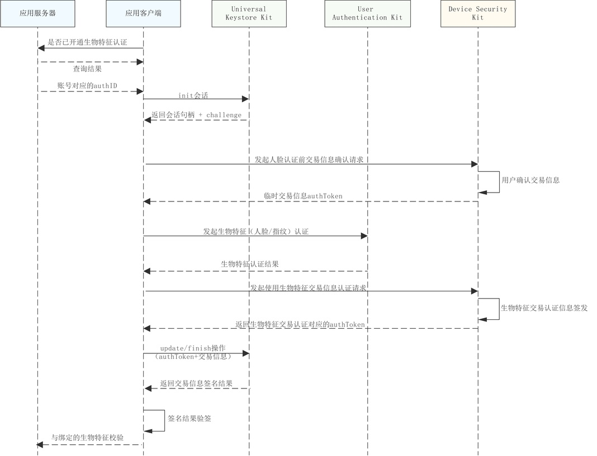
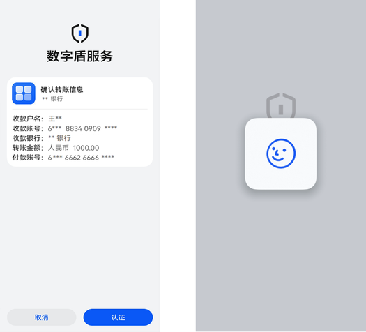

# 生物特征认证交易

更新时间：2026-04-30 02:41:24

来源：https://developer.huawei.com/consumer/cn/doc/harmonyos-guides/devicesecurity-trustedauth-verifybybio

## 场景介绍

在完成对应生物特征认证能力开通后，用户即可通过已绑定的生物特征（人脸或指纹）完成认证交易。

## 约束与限制

本功能在API 24之前版本仅支持Phone；API24及之后版本，新增支持具备TUI能力的PC/2in1、具备TUI能力的Tablet。可通过接口[checkConfirmUITextFormat](https://developer.huawei.com/consumer/cn/doc/harmonyos-references/devicesecurity-trusted-auth-api#checkconfirmuitextformat)查询设备是否具备TUI能力。不支持的设备在调用数字盾服务相关业务接口时，返回错误码1019100016。 当前仅支持绑定一个指纹或人脸用于支付认证。 本功能需应用服务器端完成接口接入，以配合端云协同认证流程。

## 业务流程



## 接口说明

接口及使用方法请参见[API参考](https://developer.huawei.com/consumer/cn/doc/harmonyos-references/devicesecurity-arktsapi-errcode-trusted-auth)。
| 接口名 | 描述 |
| --- | --- |
| [procContentAuthentication](https://developer.huawei.com/consumer/cn/doc/harmonyos-references/devicesecurity-trusted-auth-api#proccontentauthentication)(challenge: Uint8Array, authID: bigint, authMsg: AuthReqParams, label: TUILable): Promise | 交易信息处理接口 |
| [getBiometricAuthToken](https://developer.huawei.com/consumer/cn/doc/harmonyos-references/devicesecurity-trusted-auth-api#getbiometricauthtoken)(operType: OperateType, tuiAuthToken: Uint8Array, bioAuthToken: Uint8Array): Promise | 获取生物特征交易认证的authToken信息 |


## 生物特征认证交易界面介绍

如图表示使用人脸进行交易认证对应的UI界面示例，当用户确认交易信息内容后，则会拉起系统人脸认证界面完成对应生物特征认证交易。


## 开发步骤

导入huks 、userAuth 、trustedAuthentication 和相关依赖模块。
```text
import { resourceManager } from '@kit.LocalizationKit'
import { huks } from '@kit.UniversalKeystoreKit';
import { userAuth } from '@kit.UserAuthenticationKit';
import { BusinessError } from '@kit.BasicServicesKit';
import { trustedAuthentication } from '@kit.DeviceSecurityKit';
import { cryptoFramework } from '@kit.CryptoArchitectureKit';
import { hilog } from '@kit.PerformanceAnalysisKit';
import { common } from '@kit.AbilityKit';
```

首先开发者需要在服务器查询对应账户是否已开通对应生物特征认证能力，在确认开通后方可发起生物特征认证交易。 发起生物特征认证交易前，需从服务器获取当前账号在[设置数字盾密码](https://developer.huawei.com/consumer/cn/doc/harmonyos-guides/devicesecurity-trustedauth-setpwd)时获取的authID。 参考密钥管理服务提供的[签名/验签指导](https://developer.huawei.com/consumer/cn/doc/harmonyos-guides/huks-signing-signature-verification-arkts)，初始化签名会话。 调用数字盾交易信息处理接口[procContentAuthentication](https://developer.huawei.com/consumer/cn/doc/harmonyos-references/devicesecurity-trusted-auth-api#proccontentauthentication)发起生物特征认证前的交易信息确认申请。
```text
async function FaceAuthContent(challenge: Uint8Array, context: common.UIAbilityContext):Promise {
  try {
    const authID: bigint = 11842183505170721246n; //实际填充为从服务器获取到的账号对应的authID值
    const resourceMgr: resourceManager.ResourceManager = context.resourceManager;
    const fileData : Uint8Array = await resourceMgr.getRawFileContent('test_logo_rgba.png'); //实际使用时请替换为应用要在TUI界面展示的logo图片名称
    const reqParams:trustedAuthentication.AuthReqParams = {
      reqType: trustedAuthentication.AuthType.AUTH_TYPE_FACE,
      authContent: ["用户：王xx", "账号：95588180804408xxxx", "交易金额：1000000000"], //实际使用时填充为交易信息，每一行交易信息为其中的一个字符串成员
    }
    const buffer = fileData.buffer;
    const label:trustedAuthentication.TUILable = {
      image: buffer as ArrayBuffer,
      title: "人脸交易认证",
    }
    const result = await trustedAuthentication.procContentAuthentication(challenge, authID, reqParams, label);
    return result;
  } catch (err) {
    hilog.error(0x0000, 'testTag', `Failed to procContentAuthentication, code:${err.code}, message:${err.message}`);
    throw new Error('Content verify by face failed:' + (err as BusinessError).message);
  }
}
const rand = cryptoFramework.createRandom();
const len: number = 32;
const challenge: Uint8Array = rand?.generateRandomSync(len)?.data; //实际使用时请替换为通过UniversalKeystoreKit初始化会话获取的challenge
let context = this.getUIContext().getHostContext() as common.UIAbilityContext;
const authToken: trustedAuthentication.AuthToken = await FaceAuthContent(challenge, context);
```

通过用户认证服务提供的接口，拉起生物特征认证控件并[发起认证](https://developer.huawei.com/consumer/cn/doc/harmonyos-guides/start-authentication)。 当订阅的生物认证结果获取到后，将数字盾交易信息确认结果和生物特征认证结果统一整合，发起生物特征认证交易请求。
```text
let tuiAuthToken = new Uint8Array(1024);//实际使用时请替换为步骤5获取的交易信息确认authToken
let bioAuthToken = new Uint8Array(1024);//实际使用时请替换为步骤6获取的生物特征认证authToken
let operType = trustedAuthentication.OperateType.OPERATE_TYPE_CONTENT_AUTH;
trustedAuthentication.getBiometricAuthToken(operType, tuiAuthToken, bioAuthToken).then((newBioAuthToken) => {
  let authToken = newBioAuthToken.authToken as Uint8Array;
});
```

参考密钥管理服务提供的[签名/验签指导](https://developer.huawei.com/consumer/cn/doc/harmonyos-guides/huks-signing-signature-verification-arkts), 对返回的authToken数据和交易信息明文进行签名，并结束签名会话。 应用在交易信息验签通过后，可在应用对应服务器比对已绑定的生物特征凭证（credential）与当前交易认证采集的生物特征标识符（credential ID），确保账号绑定的生物特征信息与交易请求认证使用的生物特征信息的一致性。
