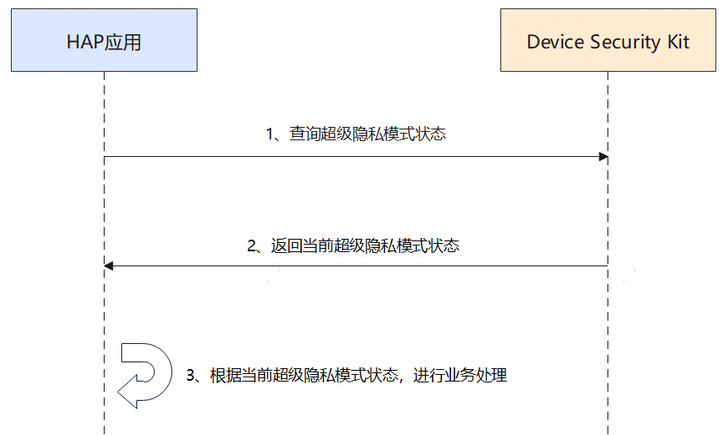

# 查询当前状态场景

更新时间：2026-04-20 06:34:33

来源：https://developer.huawei.com/consumer/cn/doc/harmonyos-guides/devicesecurity-getsuperprivacymode

## 场景介绍

从6.0.2(22)开始，新增了查询设备当前超级隐私模式状态的功能。 超级隐私模式为用户提供一键关闭敏感器件的能力，管控范围包括位置、相机和麦克风，且随着版本演进，超级隐私模式管控的敏感器件范围会相应调整。应用可通过Device Security Kit提供的接口查询当前超级隐私模式开关状态。

## 约束与限制

本特性需要设备上存在超级隐私模式选项。开发者可通过在设备上选择“设置 > 隐私和安全 > 超级隐私模式”查看超级隐私模式选项。

## 业务流程


**流程说明：** 开发者应用查询当前超级隐私模式状态。 Device Security Kit接口同步返回当前超级隐私模式状态给HAP应用。 应用根据返回的超级隐私模式状态进行业务处理。

## 接口说明

以下是超级隐私模式状态查询接口，更多接口及使用方法请参见[API参考](https://developer.huawei.com/consumer/cn/doc/harmonyos-references/devicesecurity-superprivacymode-api)。
| 接口名 | 描述 |
| --- | --- |
| [getSuperPrivacyMode](https://developer.huawei.com/consumer/cn/doc/harmonyos-references/devicesecurity-superprivacymode-api#getsuperprivacymode)() : Promise | 查询当前超级隐私模式状态 |


## 开发步骤

导入超级隐私模块及相关公共模块。
```text
import { superPrivacyMode } from '@kit.DeviceSecurityKit';
import { hilog } from '@kit.PerformanceAnalysisKit';
```

查询超级隐私模式状态改变事件。
```text
const DOMAIN = 0x0000;
const TAG = "SuperPrivacyModeTest";

let mode: superPrivacyMode.SuperPrivacyMode = superPrivacyMode.SuperPrivacyMode.OFF;
try {
  mode = await superPrivacyMode.getSuperPrivacyMode();
  hilog.info(DOMAIN, TAG, `Super privacy mode = ${mode}`);
} catch (err) {
  hilog.error(DOMAIN, TAG, `call getSuperPrivacyMode interface failed, errCode:${err?.code}, errMessage:${err?.message}`);
}
```
