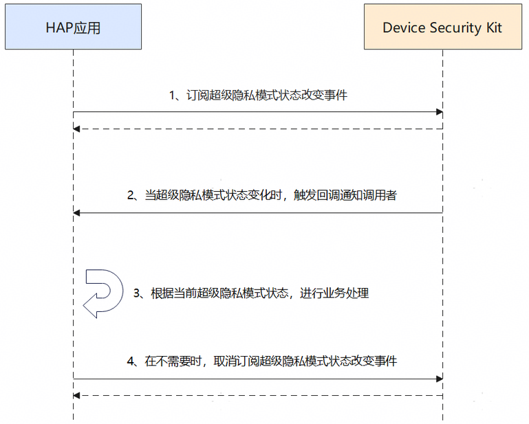

# 订阅状态改变事件场景

更新时间：2026-04-24 08:10:21

来源：https://developer.huawei.com/consumer/cn/doc/harmonyos-guides/devicesecurity-subscribe-superprivacymode

## 场景介绍

从6.0.2(22)开始，新增订阅超级隐私模式状态改变事件。 超级隐私模式为用户提供一键关闭敏感器件的能力，管控范围包括位置、相机和麦克风，且随着版本演进，超级隐私模式管控的敏感器件范围会相应调整。应用可通过Device Security Kit提供的接口监听当前超级隐私模式开关状态。

## 约束与限制

本特性需要设备上存在超级隐私模式选项。开发者可通过在设备上选择“设置 > 隐私和安全 > 超级隐私模式”查看超级隐私模式选项。

## 业务流程


**流程说明：** 开发者应用订阅超级隐私模式状态改变事件。 Device Security Kit调用回调函数通知开发者应用， 开发者应用根据当前超级隐私模式的状态进行业务处理。 当开发者应用不需要使用超级隐私模式状态时，取消订阅超级隐私模式状态改变事件。

## 接口说明

以下是超级隐私模式状态改变订阅与取消订阅接口，更多接口及使用方法请参见[API参考](https://developer.huawei.com/consumer/cn/doc/harmonyos-references/devicesecurity-superprivacymode-api)。
| 接口名 | 描述 |
| --- | --- |
| on(type: 'superPrivacyModeChange', callback: Callback): void | 订阅超级隐私模式状态改变事件 |
| off(type: 'superPrivacyModeChange', callback?: Callback): void | 取消订阅超级隐私模式状态改变事件 |


## 开发步骤

导入超级隐私模块及相关公共模块。
```text
import { superPrivacyMode } from '@kit.DeviceSecurityKit';
import { hilog } from '@kit.PerformanceAnalysisKit';
```

订阅超级隐私模式状态改变事件。
```text
const DOMAIN = 0x0000;
const TAG = "SuperPrivacyModeTest";

const superPrivacyChangedCallback = (superPrivacyMode: superPrivacyMode.SuperPrivacyMode): void => {
  hilog.info(DOMAIN, TAG, `super privcy mode changed, mode = ${superPrivacyMode}`);
}
hilog.info(DOMAIN, TAG, 'start register super privacy mode changed listener');
try {
  superPrivacyMode.on('superPrivacyModeChange', superPrivacyChangedCallback);
  hilog.info(DOMAIN, TAG, 'register super privacy mode change listener success');
} catch (err) {
  hilog.error(DOMAIN, TAG, `register super privacy changed listener failed, errCode:${err?.code}, errMessage:${err?.message}`);
}
```

取消订阅超级隐私模式状态改变事件。
```text
hilog.info(DOMAIN, TAG, 'start unregister super privacy mode changed listener');
try {
  superPrivacyMode.off('superPrivacyModeChange', superPrivacyChangedCallback);
} catch (err) {
  hilog.error(DOMAIN, TAG, `unregister super privacy changed listener failed, errCode:${err?.code}, errMessage:${err?.message}`);
}
```
