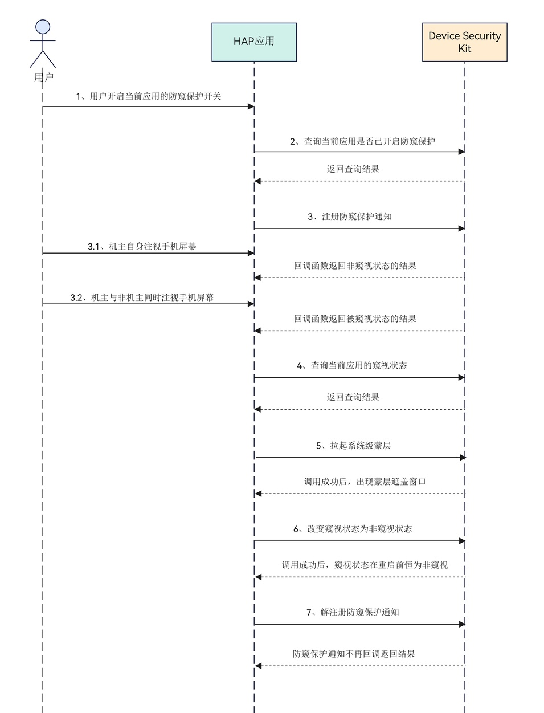

# 防窥保护

更新时间：2026-07-28 11:23:46

来源：https://developer.huawei.com/consumer/cn/doc/harmonyos-guides/devicesecurity-dlpantipeep

#### 场景介绍

支持应用根据屏幕窥视状态保护机主隐私，如拉起系统级蒙层遮盖窗口，非机主状态下不进行个性化推荐，隐藏浏览记录、支付记录、收藏记录等敏感信息。其中系统使用智能判断将长期通过人脸解锁手机的人作为防窥保护的机主。若防窥保护开关未打开，可以拉起设置弹窗或提醒用户进入设置页开启。


#### 开发前置条件
1. 需要在设备开启人脸识别。
2. 在设备上选择“设置 > 隐私与安全 > 防窥保护”，开启防窥保护开关。通过人脸验证后，打开需要加入保护的应用开关。


#### 约束与限制

满足以下所有条件：
1. 本特性需要设备上存在防窥保护选项。开发者可通过在设备上选择“设置 > 隐私与安全 > 防窥保护”查看防窥保护选项。
2. HarmonyOS系统：HarmonyOS 6.0.0 Beta1及以上。
3. DevEco Studio版本：DevEco Studio 6.0.0 Beta1及以上。
4. HarmonyOS SDK版本: HarmonyOS 6.0.0 Beta1 SDK及以上。
5. 防窥保护功能使用智能判断，通过传感器判断您周边环境给您风险提醒。判断因素包括人脸距离设备是否在一定的范围内、人脸是否有遮挡、周围环境是否有充足的光线。当距离较近或较远、人脸被遮挡、周围环境较暗时，可能会引起识别误差，从而导致系统未提醒或者误提醒。如果您认为智能判断可能有误，您可以尝试调整位置和光线，重新使用人脸解锁手机等操作，并再次使用该功能帮助您防窥。


#### 业务流程





**流程说明：**
1. 用户在“设置 > 隐私与安全 > 防窥保护”中开启当前应用的功能开关，或应用提供设置入口，用户点击后通过调用[requestAntiPeepOptions](https://developer.huawei.com/consumer/cn/doc/harmonyos-references/devicesecurity-dlpantipeep-api#requestantipeepoptions)接口拉起设置弹窗进行设置。
2. 调用[isDlpAntiPeepSwitchOn](https://developer.huawei.com/consumer/cn/doc/harmonyos-references/devicesecurity-dlpantipeep-api#isdlpantipeepswitchon)接口查询当前应用开关的状态。
3. 调用[on](https://developer.huawei.com/consumer/cn/doc/harmonyos-references/devicesecurity-dlpantipeep-api#ondlpantipeep)接口注册防窥保护通知，根据检测结果返回不同的状态：机主自身注视屏幕时返回非窥视状态；机主与非机主同时注视屏幕时返回被窥视状态；没有机主使用手机或机主分享场景，返回非窥视状态。
4. 手动调用[getDlpAntiPeepInfo](https://developer.huawei.com/consumer/cn/doc/harmonyos-references/devicesecurity-dlpantipeep-api#getdlpantipeepinfo)接口返回当前应用的窥视状态。
5. 调用[setAntiPeepMaskLayer](https://developer.huawei.com/consumer/cn/doc/harmonyos-references/devicesecurity-dlpantipeep-api#setantipeepmasklayer)接口，拉起系统级蒙层。
6. 调用[passDlpAntiPeepInfo](https://developer.huawei.com/consumer/cn/doc/harmonyos-references/devicesecurity-dlpantipeep-api#passdlpantipeepinfo)接口修改窥视状态，直到手机锁屏或应用退出前一直会返回非窥视状态。
7. 调用[off](https://developer.huawei.com/consumer/cn/doc/harmonyos-references/devicesecurity-dlpantipeep-api#offdlpantipeep)接口解除注册防窥保护通知。


#### 接口说明

以下是获取防窥状态信息相关接口，更多接口及使用方法请参见[API参考](https://developer.huawei.com/consumer/cn/doc/harmonyos-references/devicesecurity-dlpantipeep-api)。

| 接口名 | 描述 |
| --- | --- |
| isDlpAntiPeepSwitchOn(): Promise&lt;boolean&gt; | 检查是否打开防窥保护。 |
| on(type: 'dlpAntiPeep', callback: Callback&lt;DlpAntiPeepStatus&gt;): void | 订阅防窥保护状态通知。 |
| off(type: 'dlpAntiPeep', callback?: Callback&lt;DlpAntiPeepStatus&gt;): void | 解除订阅防窥保护状态通知。 |
| getDlpAntiPeepInfo(): DlpAntiPeepStatus | 获取当前应用的窥视状态。 |
| passDlpAntiPeepInfo(): void | 直到手机锁屏或应用退出前一直会返回非窥视状态。 |
| setAntiPeepMaskLayer(windowId: number): Promise&lt;void&gt; | 拉起系统级窗口蒙层遮盖。 |
| requestAntiPeepOptions(context: Context): Promise&lt;AntiPeepOptionsResult&gt; | 拉起设置弹框请求用户打开防窥保护开关。 |
| publishAntiPeepInformation(): Promise&lt;void&gt; | 发布防窥保护提示信息。 |


#### 开发步骤

> [!TIP]
> 在开发准备过程中，需要申请权限：ohos.permission.DLP_GET_HIDE_STATUS，用于获取当前应用使用过程中被非机主本人窥视屏幕相关状态信息。申请方式请参考： 申请使用受限权限 开发者需向用户说明数据使用的目的、方式和范围。

1. 防窥保护接口封装导入防窥保护模块及相关公共模块。

  
```json
import { dlpAntiPeep } from '@kit.DeviceSecurityKit';
import { JSON } from '@kit.ArkTS';
import { hilog } from '@kit.PerformanceAnalysisKit';
import { BusinessError } from '@kit.BasicServicesKit';
import { common } from '@kit.AbilityKit';
```

2. 防窥保护接口封装。

  
```json
/**
 * 防窥状态变化回调，status即防窥状态
 * */
export interface AntiPeepCallback {
  onStatusChanged: (status: dlpAntiPeep.DlpAntiPeepStatus) => Promise<void>;
}

/**
 * 当前设备是否支持使用防窥保护接口
 * */
export function canUseAntiPeep(): boolean {
  return canIUse('SystemCapability.Security.DlpAntiPeep');
}

/**
 * 检查当前应用防窥保护开关
 * */
export async function isAntiPeepOn(): Promise<boolean> {
  try {
    let result: boolean = await dlpAntiPeep.isDlpAntiPeepSwitchOn();
    hilog.info(0x0000, 'AntiPeepUtils', `[isAntiPeepOn] isDlpAntiPeepSwitchOn success. ${result}`);
    return result;
  } catch (err) {
    hilog.error(0x0000, 'AntiPeepUtils', `[isAntiPeepOn] isDlpAntiPeepSwitchOn failed.${JSON.stringify(err)}`);
    return false;
  }
}

/**
 * get current screen privacy status
 * */
export function getAntiPeepInfo(): dlpAntiPeep.DlpAntiPeepStatus {
  try {
    // 获取防窥状态
    let dlpAntiPeepStatus = dlpAntiPeep.getDlpAntiPeepInfo();
    hilog.info(0x0000, 'AntiPeepUtils', `getDlpHideInfo success. ${JSON.stringify(dlpAntiPeepStatus)}`);
    return dlpAntiPeepStatus;
  } catch (err) {
    hilog.info(0x0000, 'AntiPeepUtils', `getDlpHideInfo failed. ${JSON.stringify(err)}`);
    return -1;
  }
}

/**
 * 订阅防窥保护通知
 * */
export function listenOnAntiPeepStatus(antiPeepCB: AntiPeepCallback): boolean {
  try {
    hilog.info(0x0000, 'AntiPeepUtils', `start on('dlpAntiPeep')`);
    dlpAntiPeep.on('dlpAntiPeep', (dlpAntiPeepStatus: dlpAntiPeep.DlpAntiPeepStatus) => {
      hilog.info(0x0000, 'AntiPeepUtils', `dlpAntiPeep callback: ${JSON.stringify(dlpAntiPeepStatus)}`);
      if (antiPeepCB) {
        antiPeepCB.onStatusChanged(dlpAntiPeepStatus);
      } else {
        hilog.warn(0x0000, 'AntiPeepUtils', `antiPeepCB is empty`);
      }
    });
    hilog.info(0x0000, 'AntiPeepUtils', `on('dlpAntiPeep') ok`);
    return true;
  } catch (err) {
    hilog.error(0x0000, 'AntiPeepUtils', `dlpAntiPeep.on failed. ${JSON.stringify(err)}`);
    return false;
  }
}

/**
 * 取消订阅防窥保护通知
 * */
export function listenOffAntiPeepStatus() {
  try {
    hilog.info(0x0000, 'AntiPeepUtils', `start off('dlpAntiPeep')`);
    dlpAntiPeep.off('dlpAntiPeep');
    hilog.info(0x0000, 'AntiPeepUtils', `off('dlpAntiPeep') ok`);
  } catch (err) {
    hilog.error(0x0000, 'AntiPeepUtils', `dlpAntiPeep.off failed. ${JSON.stringify(err)}`);
  }
}

/**
 * 拉起系统蒙层
 * */
export function showSystemMaskLayer(windowId: number): Promise<boolean> {
  return new Promise((resolve) => {
    try {
      dlpAntiPeep.setAntiPeepMaskLayer(windowId).catch((err: BusinessError) => {
        hilog.error(0x0000, 'AntiPeepUtils', `Execute setAntiPeepMaskLayer failed. error code:${err.code},
      error message:${err.message}`);
        resolve(false);
      }).then(() => {
        hilog.info(0x0000, 'AntiPeepUtils', `setAntiPeepMaskLayer success`);
        resolve(true);
      })
    } catch (err) {
      hilog.error(0x0000, 'AntiPeepUtils', `Call setAntiPeepMaskLayer failed. ${JSON.stringify(err)}`);
      resolve(false);
    }
  });
}

/**
 * 引导用户打开当前应用防窥开关
 * */
export async function requestAntiPeepOptions(
  context: common.UIAbilityContext): Promise<dlpAntiPeep.AntiPeepOptionsResult> {
  try {
    const result = await dlpAntiPeep.requestAntiPeepOptions(context);
    hilog.info(0x0000, 'AntiPeepUtils', `[requestAntiPeepOptions] requestAntiPeepOptions success. ${result}`);
    return result;
  } catch (err) {
    hilog.error(0x0000,
      'AntiPeepUtils', `[requestAntiPeepOptions] requestAntiPeepOptions failed.${JSON.stringify(err)}`);
    return dlpAntiPeep.AntiPeepOptionsResult.FAIL;
  }
}
```

3. 导入防窥保护封装模块及相关公共模块。

  
```json
import { dlpAntiPeep } from '@kit.DeviceSecurityKit';
// ...
import { hilog } from '@kit.PerformanceAnalysisKit';
// ...
import { JSON } from '@kit.ArkTS';
import { window } from '@kit.ArkUI';
import { common } from '@kit.AbilityKit';
// ...
import {
  AntiPeepCallback,
  canUseAntiPeep,
  getAntiPeepInfo,
  isAntiPeepOn,
  listenOffAntiPeepStatus,
  listenOnAntiPeepStatus,
  showSystemMaskLayer,
  requestAntiPeepOptions,
} from '../common/utils/AntiPeepUtils';
```

4. 调用检查接口确认当前应用是否开启防窥保护，开启防窥保护时调用防窥保护订阅接口获取窥视状态信息。

  
```json
@Entry
@Component
struct Index {
  // ...
  private isSystemLayerTriggered: boolean = false;
  // ...
  private isListenOn: boolean = false;
  private antiPeepCB: AntiPeepCallback = {
    onStatusChanged: async (status: dlpAntiPeep.DlpAntiPeepStatus): Promise<void> => {
      await this.handleAntiPeepStatus(status);
    }
  };

  // ...

  /**
   * 处理防窥保护状态
   * */
  private async handleAntiPeepStatus(status: dlpAntiPeep.DlpAntiPeepStatus) {
    hilog.info(0x0000, 'IndexPage', `[handleAntiPeepStatus] ${status}`);
    switch (status) {
      // 表示当前状态为无人窥视
      case dlpAntiPeep.DlpAntiPeepStatus.PASS:
        // ...
        break;
      // 表示有人在窥屏，应用可以进行隐私保护操作。
      case dlpAntiPeep.DlpAntiPeepStatus.HIDE:
        // ...
              const context = this.getUIContext().getHostContext() as common.UIAbilityContext;
              const windowClass = await window.getLastWindow(context);
              const windowId = windowClass.getWindowProperties().id;
              // 拉起系统蒙层
              this.isSystemLayerTriggered = await showSystemMaskLayer(windowId);
              // ...
        break;
      default:
        // ...
        break;
    }
  }

  // 检查当前应用是否开启防窥保护，未开启时引导用户开启防窥，开启后获取防窥状态并订阅防窥监听。
  private initAntiPeepStatus() {
    if (canUseAntiPeep()) {
      isAntiPeepOn().then((opened) => {
        if (opened) {
          let info = getAntiPeepInfo();
          this.handleAntiPeepStatus(info);
          // 订阅防窥状态监听
          this.isListenOn = listenOnAntiPeepStatus(this.antiPeepCB);
        } else {
          // 开关未开启，引导用户设置
          const context = this.getUIContext().getHostContext() as common.UIAbilityContext;
          requestAntiPeepOptions(context).then((result) => {
            if (result === dlpAntiPeep.AntiPeepOptionsResult.SUCCESS ||
              result === dlpAntiPeep.AntiPeepOptionsResult.ALREADY_ON) { // 表示防窥保护开关开启成功或已开启
              let info = getAntiPeepInfo();
              this.handleAntiPeepStatus(info);
              this.isListenOn = listenOnAntiPeepStatus(this.antiPeepCB);
            } else {
              try {
                this.getUIContext().getPromptAction().showToast({
                  message: $r('app.string.anti_peep_not_enable')
                });
              } catch (error) {
                hilog.info(0x0000, 'IndexPage', `show toast error:${JSON.parse(error)}}`);
              }
            }
          })
        }
      })
    } else {
      try {
        this.getUIContext().getPromptAction().showToast({
          message: $r('app.string.device_not_supported')
        });
      } catch (error) {
        hilog.info(0x0000, 'IndexPage', `show toast error:${JSON.parse(error)}}`);
      }
    }
  }

  // ...

  // 初始化防窥状态
  private initData() {
    // ...
    this.initAntiPeepStatus();
    // ...
  }

  onPageShow(): void {
    this.initData();
  }

  onPageHide(): void {
    this.isSystemLayerTriggered = false;
    // ...
  }

  // 取消订阅防窥保护通知
  aboutToDisappear(): void {
    if (this.isListenOn) {
      listenOffAntiPeepStatus();
      this.isListenOn = false;
    }
  }

  build() {
    Scroll() {
    // ...
    }
    .height('100%')
    .width('100%')
    .backgroundColor($r('app.color.bg_main'))
    .expandSafeArea([SafeAreaType.SYSTEM], [SafeAreaEdge.TOP, SafeAreaEdge.BOTTOM])
  }
}
```
