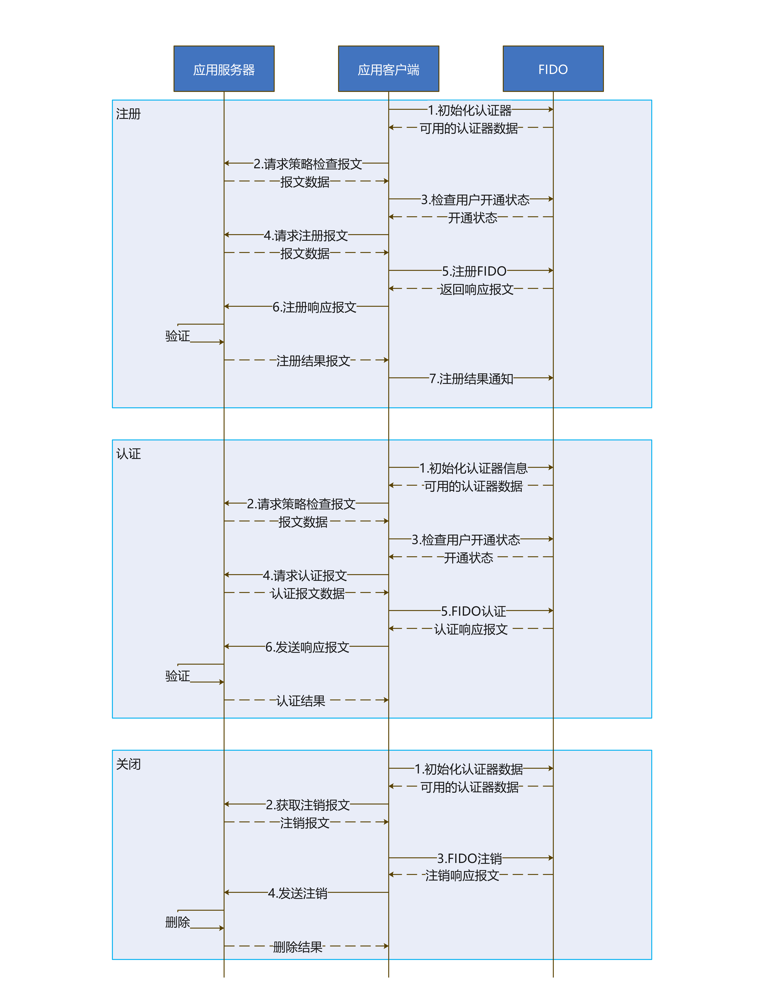

# FIDO免密身份认证

更新时间：2026-05-07 09:37:20

来源：https://developer.huawei.com/consumer/cn/doc/harmonyos-guides/onlineauthentication-fido

## 场景介绍

开通FIDO免密身份认证功能，使用用户已有的生物特征开通FIDO免密身份认证能力。 使用FIDO免密身份认证功能，使用用户已开通的生物特征进行FIDO免密身份认证。 关闭FIDO免密身份认证功能，使用用户已开通的生物特征注销FIDO免密身份认证能力。

## 基本概念

在开发FIDO免密身份认证功能前，开发者应了解以下基本概念： FIDO协议 FIDO（Fast Identity Online）是一套身份认证框架协议，它由FIDO联盟推出并持续维护。FIDO规范定义了一套在线身份认证的技术架构。 UAF身份认证框架 UAF（Universal Authentication Framework）意为通用身份认证框架，目的是通过生物识别（如指纹识别）和加密技术方式，为用户提供无密码的身份认证体验。

## 相关权限

获取生物识别权限：ohos.permission.ACCESS_BIOMETRIC。

## 约束与限制

需满足以下条件，才能使用该功能。 移动端设备需要支持生物特征（指纹/3D人脸），查询当前移动端设备是否支持ATL4级别的认证可信等级。
```text
import { BusinessError } from '@kit.BasicServicesKit';
import { userAuth } from '@kit.UserAuthenticationKit';

try {
  // 示例，查询设备人脸识别是否支持ATL4级别的认证可信等级
  userAuth.getAvailableStatus(userAuth.UserAuthType.FACE, userAuth.AuthTrustLevel.ATL4);
  console.info('current auth trust level is supported');
} catch (error) {
  const err: BusinessError = error as BusinessError;
  console.error(`current auth trust level is not supported. Code is ${err?.code}, message is ${err?.message}`);
}
```

FIDO服务需要联网，以便提供完整的在线身份校验服务。应用在调用本服务API前，需将FIDO服务联网行为向用户明示，并且取得用户同意。

## 业务流程



## 接口说明

业务进行FIDO免密身份认证功能的开通、使用和关闭。 **表1** FIDO免密身份认证接口功能介绍
| 接口名 | 描述 |
| --- | --- |
| [discover](https://developer.huawei.com/consumer/cn/doc/harmonyos-references/onlineauthentication-fido-api#discover)(context: common.Context): Promise | 发现设备的认证能力，返回当前设备软件支持的认证器数据。 |
| [checkPolicy](https://developer.huawei.com/consumer/cn/doc/harmonyos-references/onlineauthentication-fido-api#checkpolicy)(context: common.Context, uafRequest: [UAFMessage](https://developer.huawei.com/consumer/cn/doc/harmonyos-references/onlineauthentication-fido-api#uafmessage)): Promise | 检测用户策略的开启状态。 |
| [processUAFOperation](https://developer.huawei.com/consumer/cn/doc/harmonyos-references/onlineauthentication-fido-api#processuafoperation)(context: common.Context, uafRequest: [UAFMessage](https://developer.huawei.com/consumer/cn/doc/harmonyos-references/onlineauthentication-fido-api#uafmessage), channelBindings?: [ChannelBinding](https://developer.huawei.com/consumer/cn/doc/harmonyos-references/onlineauthentication-fido-api#channelbinding)): Promise | 用户UAF操作接口，处理UAF协议消息。 |
| [notifyUAFResult](https://developer.huawei.com/consumer/cn/doc/harmonyos-references/onlineauthentication-fido-api#notifyuafresult)(context: common.Context, uafResponse: [UAFMessage](https://developer.huawei.com/consumer/cn/doc/harmonyos-references/onlineauthentication-fido-api#uafmessage)): Promise | 开通结果通知接口。 |


## 开发步骤

需要业务方自行根据FIDO标准协议部署FIDO服务器。 导入相关模块。
```text
import { fido } from '@kit.OnlineAuthenticationKit';
import { BusinessError } from '@kit.BasicServicesKit';
```

开通FIDO免密身份认证。 初始化认证器信息。
```text
@Entry
@Component
struct FidoInvokePage {
  private uiContext = this.getUIContext().getHostContext();

  private async invokeDiscover() {
    try {
      // 初始化认证器信息
      let discoverData = await fido.discover(this.uiContext);
      // 业务处理discoverData
    } catch (error) {
      const err: BusinessError = error as BusinessError;
      console.error(`Failed to call discover. Code is ${err.code}, message is ${err.message}`);
      // 业务根据错误码判断异常类型，进行相应处理，详见错误码参考
    }
  }

  build() {
    // 业务UI界面
  }
}
```

访问FIDO服务端，获取策略检查报文，检查用户开通状态。
```text
// uafMessage为FIDO服务端获取的策略检查报文
let uafAuthMessage: fido.UAFMessage = {
  /*
   * 策略检查报文格式: [{"header":{"upv":{"major":1,"minor":0},"op":"Auth","appID":"","serverData":"test server data"},"challenge":"test challenge","policy":{"accepted":[[{"aaid":["001B#1001"],"keyIDs":["test keyIDs"],"authenticationAlgorithms":[1]}]]}}]
   */
  uafProtocolMessage: uafMessage, // 从服务端获取的检查策略报文
  additionalData: '' // 附加信息（可选）
};
let isRegistered: boolean = true;
try {
  // 检查是否已经开启FIDO认证
  await fido.checkPolicy(this.uiContext, uafAuthMessage);
} catch (error) {
  isRegistered = false;
  const err: BusinessError = error as BusinessError;
  console.error(`Failed to call checkPolicy. Code is ${err.code}, message is ${err.message}`);
  // 业务根据错误码判断状态，进行相应处理
}
if (isRegistered) {
  console.info('has registered, no need to register again.');
  // 已注册，业务根据需要执行后续流程
}
```

访问FIDO服务端，获取注册报文，调用processUAFOperation接口进行FIDO注册。
```text
// regMessage为从FIDO服务端获取的注册报文
let uafRegMessage: fido.UAFMessage = {
 /*
  * 注册报文格式: [{"header":{"upv":{"major":1,"minor":0},"op":"Reg","appID":"","serverData":"test server data"},"challenge":"test challenge","username":"test user name","policy":{"accepted":[[{"aaid":["001B#1001"],"attachmentHint":1,"authenticationAlgorithms":[1],"authenticatorVersion":1}]]}}]
  */
  uafProtocolMessage: regMessage, // 从服务端获取的注册报文
  additionalData: '' // 附加信息（可选）
};
// 传递通道绑定参数（可选）
let channelBinding: fido.ChannelBinding = {};
try {
  // 调用processUAFOperation接口进行FIDO注册
  let messageResp = await fido.processUAFOperation(this.uiContext, uafRegMessage, channelBinding);
} catch (error) {
  const err: BusinessError = error as BusinessError;
  console.error(`Failed to call processUAFOperation. Code is ${err.code}, message is ${err.message}`);
  // 业务根据错误码判断异常类型，进行相应处理
}
```

发送注册响应报文至FIDO服务端进行验证并获取注册结果报文。
```text
// notifyMessage为从FIDO服务端获取的注册结果报文
let notifyMessage: string = '';
let notifyUafMessage: fido.UAFMessage = {
  /*
   * 响应报文格式: {"authenticatorsSucceeded":[{"description":"Attention completed successfully.","aaid":"001B#1001","keyID":"test keyID"}]}
   */
  uafProtocolMessage: notifyMessage, // 从服务端获取的注册结果报文
  additionalData: '' // 附加信息（可选）
};
```

调用notifyUAFResult进行注册结果通知。
```text
try {
  // 调用notifyUAFResult进行注册结果通知
  fido.notifyUAFResult(this.uiContext, notifyUafMessage).then(notify => {
    console.info('Succeeded in doing notifyUAFResult.');
  });
} catch (error) {
  const err: BusinessError = error as BusinessError;
  console.error(`Failed to call notifyUAFResult. Code is ${err.code}, message is ${err.message}`);
  // 业务根据错误码判断异常类型，进行相应处理
}
```

使用FIDO免密身份认证。 初始化认证器信息（如果已执行过初始化操作，则无需重复执行）。
```text
// 获取当前界面的context
try {
  // 调用discover方法初始化认证器信息
  let discoverData = await fido.discover(this.uiContext);
} catch (error) {
  const err: BusinessError = error as BusinessError;
  console.error(`Failed to call discover. Code is ${err.code}, message is ${err.message}`);
  // 业务根据错误码判断异常类型，进行相应处理
}
```

访问FIDO服务端，获取策略检查报文，检查用户开启状态。
```text
// uafMessage为从FIDO服务器获取的策略检查报文
let uafAuthMessage: fido.UAFMessage = {
  /*
   * 策略检查报文格式: [{"header":{"upv":{"major":1,"minor":0},"op":"Auth","appID":"","serverData":"test server data"},"challenge":"test challenge","policy":{"accepted":[[{"aaid":["001B#1001"],"keyIDs":["test keyIDs"],"authenticationAlgorithms":[1]}]]}}]
   */
  uafProtocolMessage: uafMessage, // 从服务端获取的检查策略报文
  additionalData: '' // 附加信息（可选）
};
let isRegistered: boolean = true;
try {
  // 检查是否已经开启FIDO认证
  await fido.checkPolicy(this.uiContext, uafAuthMessage);
} catch (error) {
  isRegistered = false;
  const err: BusinessError = error as BusinessError;
  console.error(`Failed to call checkPolicy. Code is ${err.code}, message is ${err.message}`);
  // 业务根据错误码判断状态，进行相应处理
}
if (isRegistered) {
  console.info('has registered, no need to register again.');
  // 已注册，业务根据需要执行后续流程
}
```

访问FIDO服务端，获取认证报文，调用processUAFOperation接口进行FIDO认证。
```text
// regMessage为从FIDO服务器获取的认证报文
let uafRegMessage: fido.UAFMessage = {
  /*
   * 认证报文格式: [{"header":{"upv":{"major":1,"minor":0},"op":"Auth","appID":"","serverData":"test server data"},"challenge":"test challenge","policy":{"accepted":[[{"aaid":["001B#1001"],"keyIDs":["test keyIDs"],"authenticationAlgorithms":[1]}]]}}]
   */
  uafProtocolMessage: regMessage, // 从服务端获取的认证报文
  additionalData: '' // 附加信息（可选）
};
// 传递通道绑定参数（可选）
let channelBinding: fido.ChannelBinding = {};
try {
  // 调用processUAFOperation接口进行FIDO认证
  let messageResp = await fido.processUAFOperation(this.uiContext, uafRegMessage, channelBinding);
} catch (error) {
  const err: BusinessError = error as BusinessError;
  console.error(`Failed to call processUAFOperation. Code is ${err.code}, message is ${err.message}`);
  // 业务根据错误码判断异常类型，进行相应处理
}
 // 发送认证响应报文至FIDO服务端进行验证并返回认证结果
```

关闭FIDO免密身份认证。 初始化认证器信息（如果已执行过初始化操作，则无需重复执行）。
```text
try {
  // 调用discover方法初始化认证器信息
  let discoverData = await fido.discover(this.uiContext);
} catch (error) {
  const err: BusinessError = error as BusinessError;
  console.error(`Failed to call discover. Code is ${err.code}, message is ${err.message}`);
  // 业务根据错误码判断异常类型，进行相应处理
}
```

访问FIDO服务端，获取注销报文，调用processUAFOperation接口进行FIDO注销。
```text
// deregMessage为从FIDO服务器获取的注销报文
let uafRegMessage: fido.UAFMessage = {
  /*
   * 注销报文格式:  [{"header":{"upv":{"major":1,"minor":0},"op":"Dereg","appID":""},"authenticators":[{"aaid":"001B#1001","keyID":"test keyID"}]}]
   */
  uafProtocolMessage: deregMessage, // 从服务端获取的注销报文
  additionalData: '' // 附加信息（可选）
};
// 传递通道绑定参数（可选）
let channelBinding: fido.ChannelBinding = {};
try {
  // 调用processUAFOperation接口进行FIDO注销
  let messageResp = await fido.processUAFOperation(this.uiContext, uafRegMessage, channelBinding);
} catch (error) {
  const err: BusinessError = error as BusinessError;
  console.error(`Failed to call processUAFOperation. Code is ${err.code}, message is ${err.message}`);
  // 业务根据错误码判断异常类型，进行相应处理
}
 // 发送认证响应报文至FIDO服务端进行验证并返回认证结果
```
