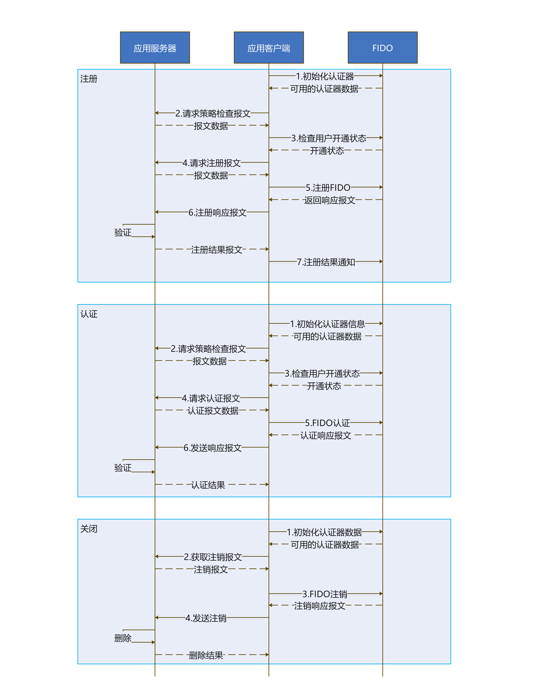

# FIDO免密身份认证

更新时间：2026-07-28 11:23:46

来源：https://developer.huawei.com/consumer/cn/doc/harmonyos-guides/onlineauthentication-fido

#### 场景介绍

 - 开通FIDO免密身份认证功能，使用用户已有的生物特征开通FIDO免密身份认证能力。
 - 使用FIDO免密身份认证功能，使用用户已开通的生物特征进行FIDO免密身份认证。
 - 关闭FIDO免密身份认证功能，使用用户已开通的生物特征注销FIDO免密身份认证能力。


#### 相关权限

获取生物识别权限：ohos.permission.ACCESS_BIOMETRIC。


#### 约束与限制

需满足以下条件，才能使用该功能。

 - 移动端设备需要支持生物特征（指纹/3D人脸），查询当前移动端设备是否支持ATL4级别的认证可信等级。

  
```text
import { BusinessError } from '@kit.BasicServicesKit';
import { userAuth } from '@kit.UserAuthenticationKit';
// ...
function getAvailableStatus(){
  try {
    // 示例，查询设备人脸识别是否支持ATL4级别的认证可信等级
    userAuth.getAvailableStatus(userAuth.UserAuthType.FACE, userAuth.AuthTrustLevel.ATL4);
    console.info('current auth trust level is supported');
  } catch (error) {
    const err: BusinessError = error as BusinessError;
    console.error(`current auth trust level is not supported. Code is ${err?.code}, message is ${err?.message}`);
  }
}
```

 - FIDO服务需要联网，以便提供完整的在线身份校验服务。应用在调用本服务API前，需将FIDO服务联网行为向用户明示，并且取得用户同意。
 - FIDO服务会将匿名化的指纹ID和面容ID等个人信息返回至三方应用，以提供绑定具体生物特征的免密认证能力。应用将个人信息上云前，需要向用户明示并且取得同意，详细请参考[个人数据处理说明](https://developer.huawei.com/consumer/cn/doc/harmonyos-guides/onlineauthentication-personal-data-processing-description)。


#### 业务流程





#### 接口说明

业务进行FIDO免密身份认证功能的开通、使用和关闭。

**表1** FIDO免密身份认证接口功能介绍

| 接口名 | 描述 |
| --- | --- |
| discover(context: common.Context): Promise&lt;DiscoveryData&gt; | 发现设备的认证能力，返回当前设备软件支持的认证器数据。 |
| checkPolicy(context: common.Context, uafRequest: UAFMessage): Promise&lt;void&gt; | 检测用户策略的开启状态。 |
| processUAFOperation(context: common.Context, uafRequest: UAFMessage, channelBindings?: ChannelBinding): Promise&lt;UAFMessage&gt; | 用户UAF操作接口，处理UAF协议消息。 |
| notifyUAFResult(context: common.Context, uafResponse: UAFMessage): Promise&lt;void&gt; | 开通结果通知接口。 |


#### 开发步骤
1. 需要业务方自行根据FIDO标准协议部署FIDO服务器。
2. 导入相关模块。

  
```text
import { fido } from '@kit.OnlineAuthenticationKit';
import { common } from '@kit.AbilityKit';
import { BusinessError } from '@kit.BasicServicesKit';
```

3. 开通FIDO免密身份认证。

  
 - 初始化认证器信息。          
```text
@Entry
@Component
struct Index {
  private uiContext: common.UIAbilityContext = this.getUIContext().getHostContext() as common.UIAbilityContext;
  // ...
  private async discover() {
    try {
      // 初始化认证器信息
      let discoverData = await fido.discover(this.uiContext);
      // 业务处理discoverData
      // ...
    } catch (error) {
      const err: BusinessError = error as BusinessError;
      console.error(`Failed to call discover. Code is ${err.code}, message is ${err.message}`);
      // 业务根据错误码判断异常类型，进行相应处理，详见错误码参考
      // ...
    }
  }
  // ...
  build() {
    // ...
  }
}
```


4. 访问FIDO服务端，获取策略检查报文，检查用户开通状态。          
```text
private async checkPolicy(policyMessage: string) {
  let policyUafMessage: fido.UAFMessage = {
    /*
     * 策略检查报文policyMessage格式: [{"header":{"upv":{"major":1,"minor":0},"op":"Auth","appID":"",
     * "serverData":"test server data"},"challenge":"test challenge","policy":{"accepted":[[{"aaid":["001B#1001"],
     * "keyIDs":["test keyIDs"],"authenticationAlgorithms":[1]}]]}}]
     */
    uafProtocolMessage: policyMessage, // 从FIDO服务端获取的检查策略报文
    additionalData: '' // 附加信息（可选）
  };
  try {
    // 检查是否已经开启FIDO认证
    await fido.checkPolicy(this.uiContext, policyUafMessage).then(() => {
      console.info('Succeeded in doing checkPolicy.');
      // ...
    })
  } catch (error) {
    const err: BusinessError = error as BusinessError;
    console.error(`Failed to call checkPolicy. Code is ${err.code}, message is ${err.message}`);
    // 业务根据错误码判断状态，进行相应处理
    // ...
  }
}
```


5. 访问FIDO服务端，获取注册报文，调用processUAFOperation接口进行FIDO注册。          
```text
private async register(regMessage: string) {
  try {
    let regUafMessage: fido.UAFMessage = {
      /*
       * 注册报文regMessage格式: [{"header":{"upv":{"major":1,"minor":0},"op":"Reg","appID":"",
       * "serverData":"test server data"},"challenge":"test challenge","username":"test user name",
       * "policy":{"accepted":[[{"aaid":["001B#1001"],"attachmentHint":1,"authenticationAlgorithms":[1],
       * "authenticatorVersion":1}]]}}]
       */
      uafProtocolMessage: regMessage, // 从FIDO服务端获取的注册报文
      additionalData: '' // 附加信息（可选）
    };
    // 传连接通道参数（可选）
    let channelBinding: fido.ChannelBinding = {};
    // 调用processUAFOperation接口进行FIDO注册
    let messageResp: fido.UAFMessage =
      await fido.processUAFOperation(this.uiContext, regUafMessage, channelBinding);
    // ...
  } catch (error) {
    const err: BusinessError = error as BusinessError;
    console.error(`Failed to register. Code is ${err.code}, message is ${err.message}`);
    // 业务根据错误码判断异常类型，进行相应处理
    // ...
  }
}
```


6. 发送注册响应报文至FIDO服务端进行验证并获取注册结果报文。          
```text
let notifyUafMessage: fido.UAFMessage = {
  /*
   * 响应报文notifyMessage格式: {"authenticatorsSucceeded":[{"description":"Attention completed successfully.",
   * "aaid":"001B#1001","keyID":"test keyID"}]}
   */
  uafProtocolMessage: notifyMessage, // 从FIDO服务端获取的注册结果报文
  additionalData: '' // 附加信息（可选）
};
```


7. 调用notifyUAFResult进行注册结果通知。          
```text
try {
  // 调用notifyUAFResult进行结果通知
  await fido.notifyUAFResult(this.uiContext, notifyUafMessage).then(() => {
    console.info('Succeeded in doing notifyUAFResult.');
  });
} catch (error) {
  const err: BusinessError = error as BusinessError;
  console.error(`Failed to call notifyUAFResult. Code is ${err.code}, message is ${err.message}`);
  // 业务根据错误码判断异常类型，进行相应处理
}
```

 - 使用FIDO免密身份认证。

1. 初始化认证器信息（如果已执行过初始化操作，则无需重复执行）。          
```text
@Entry
@Component
struct Index {
  private uiContext: common.UIAbilityContext = this.getUIContext().getHostContext() as common.UIAbilityContext;
  // ...
  private async discover() {
    try {
      // 初始化认证器信息
      let discoverData = await fido.discover(this.uiContext);
      // 业务处理discoverData
      // ...
    } catch (error) {
      const err: BusinessError = error as BusinessError;
      console.error(`Failed to call discover. Code is ${err.code}, message is ${err.message}`);
      // 业务根据错误码判断异常类型，进行相应处理，详见错误码参考
      // ...
    }
  }
  // ...
  build() {
    // ...
  }
}
```


2. 访问FIDO服务端，获取策略检查报文，检查用户开启状态。          
```text
private async checkPolicy(policyMessage: string) {
  let policyUafMessage: fido.UAFMessage = {
    /*
     * 策略检查报文policyMessage格式: [{"header":{"upv":{"major":1,"minor":0},"op":"Auth","appID":"",
     * "serverData":"test server data"},"challenge":"test challenge","policy":{"accepted":[[{"aaid":["001B#1001"],
     * "keyIDs":["test keyIDs"],"authenticationAlgorithms":[1]}]]}}]
     */
    uafProtocolMessage: policyMessage, // 从FIDO服务端获取的检查策略报文
    additionalData: '' // 附加信息（可选）
  };
  try {
    // 检查是否已经开启FIDO认证
    await fido.checkPolicy(this.uiContext, policyUafMessage).then(() => {
      console.info('Succeeded in doing checkPolicy.');
      // ...
    })
  } catch (error) {
    const err: BusinessError = error as BusinessError;
    console.error(`Failed to call checkPolicy. Code is ${err.code}, message is ${err.message}`);
    // 业务根据错误码判断状态，进行相应处理
    // ...
  }
}
```


3. 访问FIDO服务端，获取认证报文，调用processUAFOperation接口进行FIDO认证。          
```text
private async authenticate(authMessage: string) {
  try {
    let authUafMessage: fido.UAFMessage = {
      /*
       * 认证报文authMessage格式: [{"header":{"upv":{"major":1,"minor":0},"op":"Auth","appID":"",
       * "serverData":"test server data"},"challenge":"test challenge","policy":{"accepted":[[{"aaid":["001B#1001"],
       * "keyIDs":["test keyIDs"],"authenticationAlgorithms":[1]}]]}}]
       */
      uafProtocolMessage: authMessage, // 从FIDO服务端获取的认证报文
      additionalData: '' // 附加信息（可选）
    };
    // 传递通道绑定参数（可选）
    let channelBinding: fido.ChannelBinding = {};
    let messageResp: fido.UAFMessage = await fido.processUAFOperation(this.uiContext, authUafMessage, channelBinding);
    // ...
  } catch (error) {
    const err: BusinessError = error as BusinessError;
    console.error(`Failed to authenticate. Code is ${err.code}, message is ${err.message}`);
    // 业务根据错误码判断状态，进行相应处理
    // ...
  }
  // 发送认证响应报文至FIDO服务端进行验证并返回认证结果
}
```

 - 关闭FIDO免密身份认证。

1. 初始化认证器信息（如果已执行过初始化操作，则无需重复执行）。          
```text
@Entry
@Component
struct Index {
  private uiContext: common.UIAbilityContext = this.getUIContext().getHostContext() as common.UIAbilityContext;
  // ...
  private async discover() {
    try {
      // 初始化认证器信息
      let discoverData = await fido.discover(this.uiContext);
      // 业务处理discoverData
      // ...
    } catch (error) {
      const err: BusinessError = error as BusinessError;
      console.error(`Failed to call discover. Code is ${err.code}, message is ${err.message}`);
      // 业务根据错误码判断异常类型，进行相应处理，详见错误码参考
      // ...
    }
  }
  // ...
  build() {
    // ...
  }
}
```


2. 访问FIDO服务端，获取注销报文，调用processUAFOperation接口进行FIDO注销。          
```text
private async deRegister(deRegMessage: string) {
  try {
    let deRegUafMessage: fido.UAFMessage = {
      /*
       * 注销报文deRegmessage格式:  [{"header":{"upv":{"major":1,"minor":0},"op":"Dereg","appID":""},
       * "authenticators":[{"aaid":"001B#1001","keyID":"test keyID"}]}]
       */
      uafProtocolMessage: deRegMessage, // 从FIDO服务端获取的注销报文
      additionalData: '' // 附加信息（可选）
    };
    // 传递通道绑定参数（可选）
    let channelBinding: fido.ChannelBinding = {};
    let messageResp: fido.UAFMessage =
      await fido.processUAFOperation(this.uiContext, deRegUafMessage, channelBinding);
    // ...
  } catch (error) {
    // ...
    const err: BusinessError = error as BusinessError;
    console.error(`Failed to call processUAFOperation. Code is ${err.code}, message is ${err.message}`);
    // 业务根据错误码判断异常类型，进行相应处理
  }
  // 发送认证响应报文至FIDO服务端进行验证并返回认证结果
}
```
