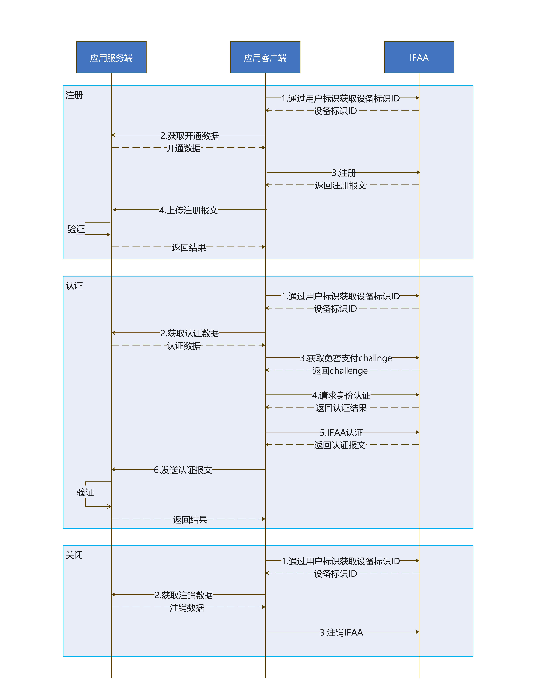

# IFAA免密身份认证

更新时间：2026-05-07 09:37:20

来源：https://developer.huawei.com/consumer/cn/doc/harmonyos-guides/onlineauthentication-ifaa

## 场景介绍

开通：提供移动端开通生物特征（指纹/3D人脸）IFAA免密身份认证的能力。使用用户已有的生物特征类型进行开通，会开通移动端对应生物特征类型的IFAA免密身份认证能力。 认证：提供移动端认证生物特征（指纹/3D人脸）IFAA免密身份认证的能力。使用用户已开通的生物特征进行认证，认证成功；使用未开通的生物特征进行认证，认证失败。 注销：提供移动端注销生物特征（指纹/3D人脸）IFAA免密身份认证的能力。使用用户已开通的生物特征类型进行注销，会注销移动端对应生物特征类型的IFAA免密身份认证能力。

## 基本概念

互联网金融身份认证联盟（IIFAA），全称为International Internet Finance Authentication Alliance，是一个生物识别框架，它由IIFAA联盟推出并持续维护。

## 相关权限

获取生物识别权限：ohos.permission.ACCESS_BIOMETRIC。

## 约束与限制

开发者应用已接入IIFAA联盟，可以从IIFAA中心服务器获取签名数据。 移动端设备需要支持生物特征（指纹/3D人脸），查询当前移动端设备是否支持ATL4级别的认证可信等级。
```text
import { BusinessError } from '@kit.BasicServicesKit';
import { userAuth } from '@kit.UserAuthenticationKit';

try {
  // 示例，查询设备人脸识别是否支持ATL4级别的认证可信等级
  userAuth.getAvailableStatus(userAuth.UserAuthType.FACE, userAuth.AuthTrustLevel.ATL4);
  console.info('current auth trust level is supported');
} catch (error) {
  const err: BusinessError = error as BusinessError;
  console.error(`current auth trust level is not supported. Code is ${err?.code}, message is ${err?.message}`);
}
```

移动端设备使用此服务时需要处于联网状态。

## 业务流程



## 接口说明

**表1** 开通、认证、注销的所需要的接口
| 接口名 | 描述 |
| --- | --- |
| [register](https://developer.huawei.com/consumer/cn/doc/harmonyos-references/onlineauthentication-ifaa-api#register)(registerData: Uint8Array): Promise | 开通指定用户的指定生物信息类型（指纹/3D人脸）的IFAA免密身份认证能力。 |
| [auth](https://developer.huawei.com/consumer/cn/doc/harmonyos-references/onlineauthentication-ifaa-api#auth)(authToken: Uint8Array, authData: Uint8Array): Promise | 使用指定用户的生物信息类型进行IFAA免密身份认证。 |
| [deregisterSync](https://developer.huawei.com/consumer/cn/doc/harmonyos-references/onlineauthentication-ifaa-api#deregistersync)(deregisterData: Uint8Array): void | 注销指定用户指定生物信息类型（指纹/3D人脸）的IFAA免密身份认证能力。 |
| [getAnonymousIdSync](https://developer.huawei.com/consumer/cn/doc/harmonyos-references/onlineauthentication-ifaa-api#getanonymousidsync)(userToken: Uint8Array): Uint8Array | 获取移动端设备标识ID。 |


## 开发步骤

注册IFAA免密身份认证。
```text
import { ifaa } from '@kit.OnlineAuthenticationKit';
import { BusinessError } from '@kit.BasicServicesKit';

// 开发者根据IIFAA协议构造TLV入参，转换为Uint8Array, 再使用ifaa.getAnonymousIdSync接口。此处new Uint8Array([0])需要替换为开发者定义的用户标识。
let arg = new Uint8Array([0]);
let getAnonIdResult: Uint8Array;
try {
  getAnonIdResult = ifaa.getAnonymousIdSync(arg);
} catch (error) {
  const err = error as BusinessError;
  console.error(`Failed to get anonymous id. Code is ${err.code}, message is ${err.message}`);
}


// 开发者需使用getAnonIdResult从服务端获取签名后的开通数据
// 开发者将开通数据（IIFAA协议的TLV格式）转换为Uint8Array, 再使用ifaa.register接口。此处new Uint8Array([0])需要替换为有效数据。
let registerTlvFp = new Uint8Array([0]);
try {
  let registerPromise: Promise = ifaa.register(registerTlvFp);
  registerPromise.then(registerResult => {
    console.info('Succeeded in doing register.');
    // 开通成功，开发者获取ifaa.register结果并处理。
  }).catch((err: BusinessError) =>{
    console.error(`Failed to call register. Code: ${err.code}, message: ${err.message}`);
    // 开通失败，开发者获取ifaa.register错误并处理。
  });
} catch (error) {
  const err = error as BusinessError;
  console.error(`Failed to register. Code is ${err.code}, message is ${err.message}`);
}
```

使用IFAA免密身份认证进行认证。
```text
import { ifaa } from '@kit.OnlineAuthenticationKit';
import { userAuth } from '@kit.UserAuthenticationKit';
import { BusinessError } from '@kit.BasicServicesKit';

// 开发者根据IIFAA协议构造TLV入参，转换为Uint8Array, 再使用ifaa.getAnonymousIdSync接口。arg需要替换开发者自定义数据。
let arg = new Uint8Array([0]);
let getAnonIdResult: Uint8Array;
try {
  getAnonIdResult = ifaa.getAnonymousIdSync(arg);
} catch (error) {
  const err = error as BusinessError;
  console.error(`Failed to get anonymous id. Code is ${err.code}, message is ${err.message}`);
}

// 开发者需使用getAnonIdResult从服务端获取签名后的认证数据

// 获取此次免密支付的challenge
let ifaaChallenge: Uint8Array = new Uint8Array([0]);
try {
  ifaaChallenge = ifaa.preAuthSync();
} catch (error) {
  const err = error as BusinessError;
  console.error(`Failed to pre auth. Code is ${err.code}, message is ${err.message}`);
}
let authParam: userAuth.AuthParam = {
  challenge: ifaaChallenge,
  authType: [userAuth.UserAuthType.FINGERPRINT],
  authTrustLevel: userAuth.AuthTrustLevel.ATL4
};
// 使用preAuthResult请求身份认证
try {
  let userAuthInstance = userAuth.getUserAuthInstance(authParam, {title: ' '});
  userAuthInstance.on('result', {
    onResult(result) {
      let authToken = result.token;
      try {
        // 生物特征认证成功后，调用IFAA认证
        console.info('IFAA auth start');
        // 开发者将认证数据（IIFAA协议的TLV格式）转换为Uint8Array, 再使用ifaa.auth接口。此处new Uint8Array([0])需要替换为有效数据。
        let authTlvFp = new Uint8Array([0]);
        // 开发者根据业务需求选择同步/异步接口
        let authResult: Uint8Array = ifaa.authSync(authToken, authTlvFp);
        console.info('authSyn authResult' + authResult);
        // 开发者处理authResult
      } catch (error) {
        const err: BusinessError = error as BusinessError;
        console.error(`Failed to call auth. Code is ${err.code}, message is ${err.message}`);
      }
    }
  });
  userAuthInstance.start();
} catch (error) {
  const err = error as BusinessError;
  console.error(`Failed to user auth. Code is ${err.code}, message is ${err.message}`);
}
```

注销IFAA免密身份认证。
```text
import { ifaa } from '@kit.OnlineAuthenticationKit';

// 开发者根据IIFAA协议构造TLV入参，转换为Uint8Array, 再使用ifaa.getAnonymousIdSync接口。此处new Uint8Array([0])需要替换为开发者定义的用户标识。
let arg = new Uint8Array([0]);
try {
  let getAnonIdResult: Uint8Array = ifaa.getAnonymousIdSync(arg);
} catch (error) {
  const err = error as BusinessError;
  console.error(`Failed to get anonymous id. Code is ${err.code}, message is ${err.message}`);
}


// 开发者需使用getAnonymousId的结果从服务端获取签名后的注销数据
// 开发者将注销数据（IIFAA协议的TLV格式）转换为Uint8Array, 再使用ifaa.deregisterSync接口。此处new Uint8Array([0])需要替换为有效数据。
let deregisterTlvFp = new Uint8Array([0]);
try {
  ifaa.deregisterSync(deregisterTlvFp);
} catch (error) {
  const err = error as BusinessError;
  console.error(`Failed to deregister. Code is ${err.code}, message is ${err.message}`);
}
```


## 常见问题

现象描述：开通IFAA免密身份认证失败。 可能原因：移动端设备没有联网。 处理步骤：移动端设备连接WIFI或热点，再次尝试。
