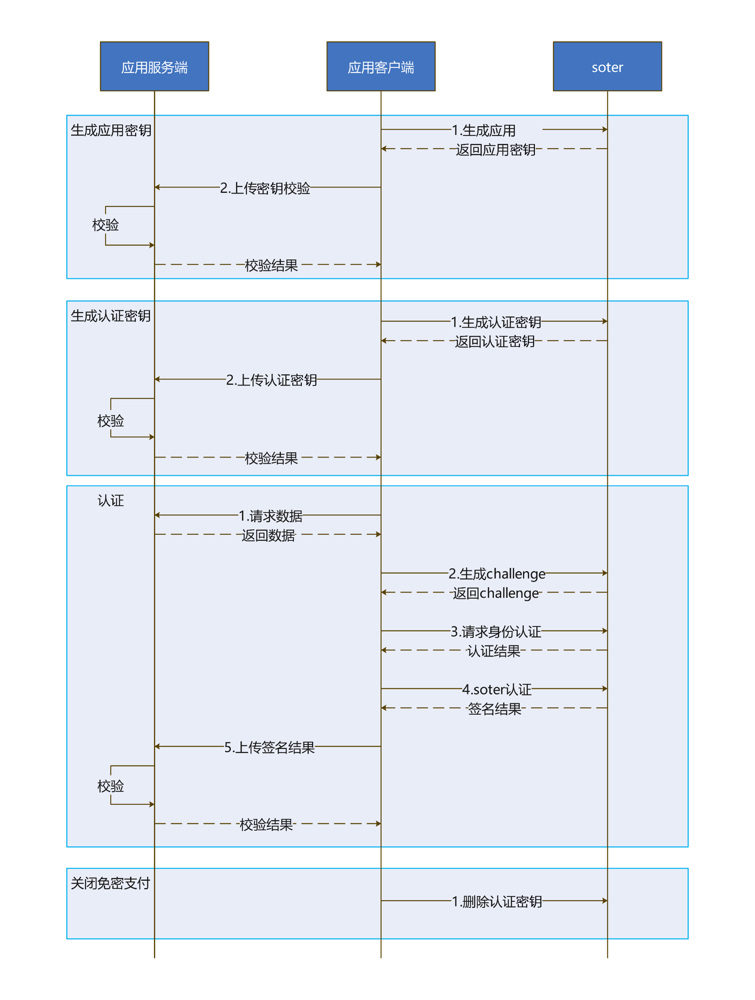

# SOTER免密身份认证

更新时间：2026-05-07 09:37:20

来源：https://developer.huawei.com/consumer/cn/doc/harmonyos-guides/onlineauthentication-soter

#### 场景介绍

用户可以利用生物特征来代替传统的密码验证，实现免密身份认证。

 - 开通：提供移动端开通SOTER生物特征（指纹/3D人脸）免密身份认证的能力。
 - 认证：提供移动端采用生物特征（指纹/3D人脸）进行SOTER免密身份认证的能力。
 - 注销：提供移动端注销SOTER生物特征（指纹/3D人脸）免密身份认证的能力。


#### 基本概念

SOTER旨在提供一套生物认证平台和标准，使得业务可以采用设备上的传感器（如人脸传感器/指纹传感器）进行安全、高效的免密登录、免密支付等操作，当前已广泛应用于微信小程序/公众号、指纹支付等业务场景。


#### 相关权限

 - 获取网络权限：ohos.permission.INTERNET。
 - 获取振动权限：ohos.permission.VIBRATE。
 - 获取生物识别权限：ohos.permission.ACCESS_BIOMETRIC。


#### 约束与限制

 - 开发者应用需要部署SOTER服务器。
 - 移动端设备需要支持生物特征（指纹/3D人脸），查询当前移动端设备是否支持ATL4级别的认证可信等级。

  
```text
import { BusinessError } from '@kit.BasicServicesKit';
import { userAuth } from '@kit.UserAuthenticationKit';

try {
  // 示例，查询设备人脸识别是否支持ATL4级别的认证可信等级
  userAuth.getAvailableStatus(userAuth.UserAuthType.FACE, userAuth.AuthTrustLevel.ATL4);
  console.info('current auth trust level is supported');
} catch (error) {
  const err: BusinessError = error as BusinessError;
  console.error(`current auth trust level is not supported. Code is ${err?.code}, message is ${err?.message}`);
}
```

 - 移动端设备使用此服务时需要处于联网状态。


#### 业务流程





#### 接口说明

**表1** 开通、认证、注销的所需要的接口

| 接口名 | 描述 |
| --- | --- |
| generateAppSecureKey(keyType: KeyType): Promise&lt;Uint8Array&gt; | 生成应用密钥。 |
| generateAuthKey(keyAlias: string, keyType: KeyType): Promise&lt;SignedResult&gt; | 生成认证密钥。 |
| generateChallengeSync(keyAlias: string): Uint8Array | 生成Challenge。 |
| signWithAuthKeySync(keyAlias: string, authToken: Uint8Array, info: string): SignedResult | 使用认证密钥对业务数据签名。 |
| deleteAuthKey(keyAlias: string): Promise&lt;void&gt; | 删除认证密钥。 |


#### 开发步骤
1. 导入SOTER模块。

  
```text
import { soter } from '@kit.OnlineAuthenticationKit';
import { userAuth } from '@kit.UserAuthenticationKit';
```

2. 生成应用密钥和认证密钥用于后续的开通、认证流程。

  
```text
let keyType: soter.KeyType = soter.KeyType.ECC_P256; // 加密类型，只支持ECC_P256
let keyAlias: string = 'keyAlias'; // 开发者自定义密钥别名

// 生成应用密钥
try {
  let appSecureKey: Promise<Uint8Array> = soter.generateAppSecureKey(keyType);
} catch (error) {
  const err = error as BusinessError;
  console.error(`Failed to generate app secure key. Code is ${err.code}, message is ${err.message}`);
}
// 生成AuthKey
try {
  let authKey: Promise<soter.SignedResult> = soter.generateAuthKey(keyAlias, keyType);
} catch (error) {
  const err = error as BusinessError;
  console.error(`Failed to generate auth key. Code is ${err.code}, message is ${err.message}`);
}
```

3. 使用认证密钥签名，实现SOTER免密认证。

  
```text
let keyType: soter.KeyType = soter.KeyType.ECC_P256; // 加密类型，只支持ECC_P256
let keyAlias: string = 'keyAlias'; // 开发者自定义密钥别名
let info: string = 'Message to be signed.'; // info需要开发者的三方应用服务器下发，SOTER服务完成签名后需要重新上传给三方应用服务器

// 获取此次免密支付的challenge
let soterChallenge: Uint8Array = new Uint8Array([0]);
try {
  soterChallenge = soter.generateChallengeSync(keyAlias);
} catch (error) {
  const err = error as BusinessError;
  console.error(`Failed to generate challenge. Code is ${err.code}, message is ${err.message}`);
}
let authParam: userAuth.AuthParam = {
  challenge: soterChallenge,
  authType: [userAuth.UserAuthType.FINGERPRINT],
  authTrustLevel: userAuth.AuthTrustLevel.ATL4
};
// 使用preAuthResult请求身份认证
try {
  let userAuthInstance = userAuth.getUserAuthInstance(authParam, {title: ' '});
  // 未获取到authToken则会返回错误码1。
  userAuthInstance.on('result', {
    onResult(result) {
      let authToken = result.token;
      try {
        // 生物特征认证成功后，调用soter认证
        console.info('soter auth start');
        // 使用soter.signWithAuthKeySync接口为待认证数据签名。开发者根据业务需求选择同步/异步接口。
        let authResult: soter.SignedResult = soter.signWithAuthKeySync(keyAlias, authToken, info);
        console.info('Succeeded in doing authSyn authResult');
        // 开发者处理authResult
      } catch (err) {
        console.error(`Failed to signWithAuthKeySync. Code: ${err.code}, message: ${err.message}`);
      }
    }
  });
  userAuthInstance.start();
} catch (error) {
  const err = error as BusinessError;
  console.error(`Failed to user auth. Code is ${err.code}, message is ${err.message}`);
}
```

4. 关闭免密认证时，删除认证密钥。

  
```text
// 删除AuthKey
let keyAlias: string = 'keyAlias'; // 开发者自定义密钥别名
try {
  soter.deleteAuthKey(keyAlias);
} catch (error) {
  const err = error as BusinessError;
  console.error(`Failed to delete auth key. Code is ${err.code}, message is ${err.message}`);
}
```
