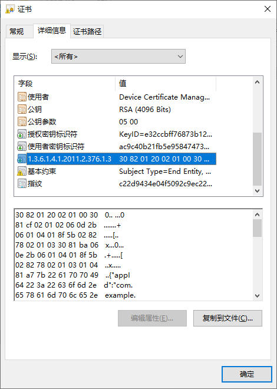
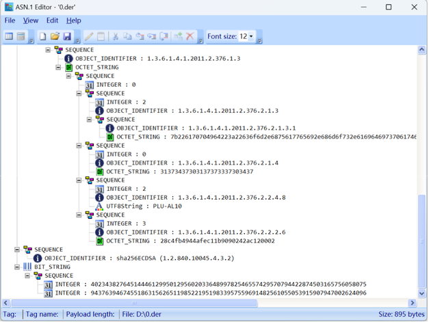

# 服务器端开发

更新时间：2026-04-20 06:34:33

来源：https://developer.huawei.com/consumer/cn/doc/harmonyos-guides/device-attestation-servers

## 校验密钥证明证书链

您的应用服务器接收到来自应用的请求，其中包含的密钥证明证书链采用X509标准格式，证书链（证书数组）中的第一本证书为**密钥证明证书**，最后一本证书为根CA证书，中间的为子CA证书。 应用服务器对密钥证明证书链的校验步骤如下： 使用官网提供的可信的根CA证书对证书链合法性进行校验。（[根CA证书下载地址](https://pki.consumer.huawei.com/ca/cer/Huawei_CBG_ECC_Device_Attestation_Root_CA.cer)）
> [!NOTE]
> 请勿在应用服务器中使用子CA证书对密钥证明证书链进行校验，子CA证书可能会因为有效期结束、证书被吊销等发生变化。

解析**密钥证明证书**获取应用公钥、挑战值Challenge、应用ID、密钥管理部件ID。  其中应用公钥直接从密钥证明证书的subjectPublicKeyInfo字段获取；其他字段从密钥证明证书的扩展域段（Extensions）中获取，扩展域段的OID为1.3.6.1.4.1.2011.2.376.1.3（密钥证明扩展域段）。  校验挑战值Challenge是否与“创建密钥确立可信凭证流程”步骤3中应用服务器缓存的挑战值Challenge一致。  校验应用ID是否与预期的取值一致。根据应用ID判断请求是否来自预期的HarmonyOS应用。  校验密钥来源是否与预期的取值一致。   **密钥证明证书格式说明：**


密钥证明扩展域段为Asn.1 DER标准编码格式，数据结构定义如下：
```text
HuaweiAttestation ::= SEQUENCE {
 version             AttestationVersion DEFAULT v1,
 claim1             AttestationClaim,
 claim2             AttestationClaim,
 claim3             AttestationClaim,
 ... ...
}

AttestationVersion ::= INTEGER { v1(0) }

AttestationClaim ::= SEQUENCE {
   securityLevel       SecurityLevel,
   type             AttestationType,
   value            AttestationValue
}

SecurityLevel ::= INTEGER
AttestationType ::= OBJECT IDENTIFIER
AttestationValue ::= ANY -- DEFINED BY AttestationType

ApplicationIDType ::= SEQUENCE {
   type                         OBJECT IDENTIFIER,
   value                        OCT_STR
}
```

 **AttestationClaim类型取值说明：**
| 序号 | type（OID）取值 | value的数据类型 | securityLevel | Claim说明 |
| --- | --- | --- | --- | --- |
| 1 | 1.3.6.1.4.1.2011.2.376.2.1.4 | OCT_STR | 保留字段，暂不使用 | 应用输入的挑战值Challenge。 |
| 2 | 1.3.6.1.4.1.2011.2.376.2.1.3 | ApplicationIDType | 保留字段，暂不使用 | 应用ID。 |
| 3 | 1.3.6.1.4.1.2011.2.376.2.2.2.6 | OCT_STR | 保留字段，暂不使用 | 密钥管理部件ID。取值固定为：0x28c4fb4944afec11b9090242ac120002（Universal Keystore Kit的部件ID）。 |
| 4 | 1.3.6.1.4.1.2011.2.376.2.2.4.8 | UTF8String | 2 | 设备产品型号，从API version 20开始支持。设备产品型号一般应用在设备风控场景，识别黑灰产设备的行为，请勿使用该字段对设备身份进行认证。 |

**securityLevel类型取值说明：**
| securityLevel | 说明 |
| --- | --- |
| 2 | REE（Rich Execution Environment），数据来源于HarmonyOS系统层。 |
| 3 | TEE（Trusted Execution Environment），数据通过TEE进行保护。 |

**ApplicationIDType类型取值说明：**
| type（OID）取值 | value取值说明 |
| --- | --- |
| 1.3.6.1.4.1.2011.2.376.2.1.3.1 | HarmonyOS Hap应用信息，包含如下字段： 1. appId：包含Hap应用的bundleName和签名证书公钥的hash； 2. bundleName：Hap应用的包名； 3. appIdentifier：AppGallery Connect网站上为Hap应用分配的统一APP ID字段，从API version 20开始支持； 4. appMode：Hap应用的状态，取值：debug或release，从API version 20开始支持。 value为json字符串，样例如下： { "appId":"com.example.attesthcts_BDmjsOezxRmguzlYRVhQavW22Eswi5sX61wOAysWPOGS8TZ5tY1u1A9EcvarzyrfOEj5zT8BCGkfFkVjn0m5wzo=", "bundleName":"com.example.attesthcts", "appIdentifier":"5765880207853009781", "appMode":"release" } |
| 1.3.6.1.4.1.2011.2.376.2.1.3.2 | 系统服务（Service Ability）的ID，样例： {processName: "huawei_share"} |

**示例：**
```text
import org.bouncycastle.asn1.*;
import org.bouncycastle.jce.provider.BouncyCastleProvider;

import java.io.ByteArrayInputStream;
import java.io.FileOutputStream;
import java.security.PublicKey;
import java.security.Security;
import java.security.cert.CertPath;
import java.security.cert.CertPathValidator;
import java.security.cert.CertificateFactory;
import java.security.cert.PKIXCertPathValidatorResult;
import java.security.cert.PKIXParameters;
import java.security.cert.TrustAnchor;
import java.security.cert.X509Certificate;
import java.util.ArrayList;
import java.util.Date;
import java.util.HashSet;
import java.util.List;

import com.alibaba.fastjson.JSON;

public class ParseAttestation {
    static {
        Security.addProvider(new BouncyCastleProvider());
    }

    //HarmonyOS Hap应用通过anonAttestKeyItem接口获取到的 “密钥证明证书链”数据
    static String[] g_attestCertStr = new String[]{"-----BEGIN CERTIFICATE-----\nMIIEUDCCA/WgAwIBAgIOCfv5Xf9hjA2u32gjpG8wCgYIKoZIzj0EAwIwXTE5MDcGA1UEAwwwSHVhd2VpIENCRyBFQ0MgRGV2aWNlIEFub255bW91cyBBdHRlc3RhdGlvbiBDQSAxMRMwEQYDVQQKDApIdWF3ZWkgQ0JHMQswCQYDVQQGEwJDTjAeFw0yNTA1MTMwNjI3NDlaFw0yNTA1MjAwNjI3NDlaMCwxKjAoBgNVBAMMIURldmljZSBDZXJ0aWZpY2F0ZSBNYW5hZ2VtZW50IEtleTCCASIwDQYJKoZIhvcNAQEBBQADggEPADCCAQoCggEBALd0wgFgvDF5uPq2hh69LdRHnIX3+mzdAzf10L9Jk6bWPZqqTvz88ZX7e12Su1Myf5iyT3TMKjZ+Y2SnsWpHG/7Dpx990u7/CxeeRY0qziIqMTEbrLFaSHY++///9SxmEiM7a3z2Ged2FzDSvOTj1JVmm2hk+bUcceTVuHAmRwidFIQrL5h/lxaO3uPFqbTdiW6ocz06pEbi8mg6LAafik1pfsO30a3yIGiH1f4uZhCEFjHQxQdSFsRPh04Ehclx6lQ196tO0d3RHR8dxL7ghGNxs9rB1Sq/0TH2mK1vKAY/YgvBs5nypOnDY+0MXN7j5NucvJ32wssGI7CbmMxVeZMCAwEAAaOCAf0wggH5MB0GA1UdDgQWBBQA6HLpfdJvtiqPqQXenry8b6qjYzAMBgNVHRMBAf8EAjAAMAkGA1UdOAQCBQAwHwYDVR0jBBgwFoAU4yzL/3aHOxL7QyI/P/sCBoHfJ6cwggGcBgwrBgEEAY9bAoJ4AQMEggGKMIIBhgIBADCB/AIBAgYNKwYBBAGPWwKCeAIBAzCB5wYOKwYBBAGPWwKCeAIBAwEEgdR7ImFwcElkIjoiY29tLmV4YW1wbGUubXlhcHBsaWNhdGlvbl9CS3BOWWR2UU0yYkNLYklwRERuWmdkdGNYdEtnZUg5M2FwVm1aOWdpcTFoeUt2elNzVVNFZTFsT3VsK3N2bXhZS2ltb0dNWnF0U0o3eGxpRkVZd2NRK0E9IiwiYnVuZGxlTmFtZSI6ImNvbS5leGFtcGxlLm15YXBwbGljYXRpb24iLCJhcHBJZGVudGlmaWVyIjoiMTU3MzU0NjgiLCJhcHBNb2RlIjoiZGVidWcifTAiAgEABg0rBgEEAY9bAoJ4AgEEBA5jaGFsbGVuZ2VfZGF0YTAYAgEDBg0rBgEEAY9bAoJ4AgEFBAQCAAAAMB0CAQIGDisGAQQBj1sCgngCAgQIDAhDTFMtQUwwMDAlAgEDBg4rBgEEAY9bAoJ4AgICBgQQKMT7SUSv7BG5CQJCrBIAAjAKBggqhkjOPQQDAgNJADBGAiEAko1y6sf7Fg48oWZC8FoP5WtmzKiVk5AOOvuhwaK0CQcCIQD8HymOzkzmOOjUuz/rdVrTM4191dpGr3jfU1u5rBpNIw==\n-----END CERTIFICATE-----", "-----BEGIN CERTIFICATE-----\nMIICyjCCAlCgAwIBAgIREj5jzbLehL8yzkDm5uwcSJUwCgYIKoZIzj0EAwMwSzETMBEGA1UEChMKSHVhd2VpIENCRzE0MDIGA1UEAxMrSHVhd2VpIENCRyBFQ0MgRGV2aWNlIEF0dGVzdGF0aW9uIFJvb3QgQ0EgMTAeFw0yMzEyMDUwMzE4MDRaFw0zMzEyMDUwMzE4MDRaMF0xOTA3BgNVBAMMMEh1YXdlaSBDQkcgRUNDIERldmljZSBBbm9ueW1vdXMgQXR0ZXN0YXRpb24gQ0EgMTETMBEGA1UECgwKSHVhd2VpIENCRzELMAkGA1UEBhMCQ04wWTATBgcqhkjOPQIBBggqhkjOPQMBBwNCAATYjeQrfijuZ/9HJPLlsfJ4/wnXbQXaxy5f5fEcMN+pTZ5RekpY7PnDp2zEdibvkSzjv1MuRs8JzORyGatSOrYFo4IBATCB/jAfBgNVHSMEGDAWgBTaRGLD5yvof1E6XEuPQ3w5JMPOrDAdBgNVHQ4EFgQU4yzL/3aHOxL7QyI/P/sCBoHfJ6cwRgYDVR0gBD8wPTA7BgRVHSAAMDMwMQYIKwYBBQUHAgEWJWh0dHA6Ly9wa2kuY29uc3VtZXIuaHVhd2VpLmNvbS9jYS9jcHMwEgYDVR0TAQH/BAgwBgEB/wIBATAOBgNVHQ8BAf8EBAMCAQYwUAYDVR0fBEkwRzBFoEOgQYY/aHR0cDovL3BraS5jb25zdW1lci5odWF3ZWkuY29tL2NhL2NybC9yb290X2RldmljZUF0dGVzdF9jcmwuY3JsMAoGCCqGSM49BAMDA2gAMGUCMQCE9qqNREq3AvCuznKeBl8biwC5GpV/Z1B0rsU4RqeTqNJ0Gvyz3g8Noaf4SpWzsLUCMBm5nr39UEOq89kx7QQjgYWLEWKcuSsgw2/6MckKP/6zrxjVld2SMtqiphKnrv1EkA==\n-----END CERTIFICATE-----","-----BEGIN CERTIFICATE-----\nMIICCTCCAY6gAwIBAgIDVxAsMAoGCCqGSM49BAMDMEsxEzARBgNVBAoTCkh1YXdlaSBDQkcxNDAyBgNVBAMTK0h1YXdlaSBDQkcgRUNDIERldmljZSBBdHRlc3RhdGlvbiBSb290IENBIDEwIBcNMjMxMTMwMDIwNjU1WhgPMjA3MzExMzAwMjA2NTVaMEsxEzARBgNVBAoTCkh1YXdlaSBDQkcxNDAyBgNVBAMTK0h1YXdlaSBDQkcgRUNDIERldmljZSBBdHRlc3RhdGlvbiBSb290IENBIDEwdjAQBgcqhkjOPQIBBgUrgQQAIgNiAATDJzRdruaBeMoQBbdqCe51ezvkQn3OPYBoRmpL5KPktdFtD0b97FRp8jGLiUhPKyo8M15fxW5Ams4s80E8I1BSXoovDnkKllFfUadD8URgwEfOk5qttYNKzJcULavOhbijQjBAMA4GA1UdDwEB/wQEAwIBBjAPBgNVHRMBAf8EBTADAQH/MB0GA1UdDgQWBBTaRGLD5yvof1E6XEuPQ3w5JMPOrDAKBggqhkjOPQQDAwNpADBmAjEA2zDQREvORPqcZyjwKDltu0T9zN8Cd3/hi4DQZvuRJdJOY57yIIO/LKxezzEcGiMMAjEAkX7r0U4Mcaw4uURMh+7tLMyvyxnlW8yJqBEOnZfqS8I8t0bQIY2r/5TQAPC0JhBm\n-----END CERTIFICATE-----"};

    //从HarmonyOS官网下载的根CA证书
    static String g_rootCertStr = "-----BEGIN CERTIFICATE-----\n" +
            "MIICCTCCAY6gAwIBAgIDVxAsMAoGCCqGSM49BAMDMEsxEzARBgNVBAoTCkh1YXdl\n" +
            "aSBDQkcxNDAyBgNVBAMTK0h1YXdlaSBDQkcgRUNDIERldmljZSBBdHRlc3RhdGlv\n" +
            "biBSb290IENBIDEwIBcNMjMxMTMwMDIwNjU1WhgPMjA3MzExMzAwMjA2NTVaMEsx\n" +
            "EzARBgNVBAoTCkh1YXdlaSBDQkcxNDAyBgNVBAMTK0h1YXdlaSBDQkcgRUNDIERl\n" +
            "dmljZSBBdHRlc3RhdGlvbiBSb290IENBIDEwdjAQBgcqhkjOPQIBBgUrgQQAIgNi\n" +
            "AATDJzRdruaBeMoQBbdqCe51ezvkQn3OPYBoRmpL5KPktdFtD0b97FRp8jGLiUhP\n" +
            "Kyo8M15fxW5Ams4s80E8I1BSXoovDnkKllFfUadD8URgwEfOk5qttYNKzJcULavO\n" +
            "hbijQjBAMA4GA1UdDwEB/wQEAwIBBjAPBgNVHRMBAf8EBTADAQH/MB0GA1UdDgQW\n" +
            "BBTaRGLD5yvof1E6XEuPQ3w5JMPOrDAKBggqhkjOPQQDAwNpADBmAjEA2zDQREvO\n" +
            "RPqcZyjwKDltu0T9zN8Cd3/hi4DQZvuRJdJOY57yIIO/LKxezzEcGiMMAjEAkX7r\n" +
            "0U4Mcaw4uURMh+7tLMyvyxnlW8yJqBEOnZfqS8I8t0bQIY2r/5TQAPC0JhBm\n" +
            "-----END CERTIFICATE-----\n";

    //保存HarmonyOS Hap应用生成的应用公钥的文件名
    static String g_publicKeyFileName = "d:\\attestPublicKey.pem";

    public static void main(String[] args) {
        ParseAttestation parseAttestation = new ParseAttestation();
        parseAttestation.parseAndValidateAttestCertChain(g_attestCertStr, g_rootCertStr, g_publicKeyFileName);
    }

    void parseAndValidateAttestCertChain(String[] attestCertStr, String rootCertStr, String publicKeyFileName) {
        try {
            //解析密钥证明证书链
            List attestCerts = parseAttestationCerts(attestCertStr);
            //校验密钥证明证书链
            Date curDate = new Date();
            validateAttestationCertChain(attestCerts, rootCertStr, curDate);
            //解析密钥证明证书
            AttestationInfo attestInfo = extractAttestaionField(attestCerts.get(0));
            //校验密钥证明信息是否正确
            if (!checkAttestInfo(attestInfo)) {
                //todo： 进行异常处理
            }
            //保存HarmonyOS Hap应用生成的应用公钥
            saveAttestPublicKey(attestInfo.publicKey, publicKeyFileName);
        } catch (Exception e) {
            System.out.println(e);
        }
    }

    List parseAttestationCerts(String[] certStr) throws Exception {
        List certificateList = new ArrayList(certStr.length);
        CertificateFactory certificateFactory = CertificateFactory.getInstance("X.509", "BC");
        for (int i = 0; i  certs, String trustCAStr, Date date) throws Exception {
        //构造证书链
        CertificateFactory factory = CertificateFactory.getInstance("X.509", "BC");
        CertPath certPath = factory.generateCertPath(certs);

        //读取信任根证书和构建trustAnchor对象
        X509Certificate trustCA = (X509Certificate) factory.generateCertificate(
                new ByteArrayInputStream(trustCAStr.getBytes()));

        TrustAnchor trustAnchor = new TrustAnchor(trustCA, null);
        HashSet trustAnchorSet = new HashSet();
        trustAnchorSet.add(trustAnchor);

        //构建validator和对应的参数
        PKIXParameters params = new PKIXParameters(trustAnchorSet);
        params.setDate(date);
        //密钥证明证书有效期比较短，不需要进行证书的吊销验证。
        params.setRevocationEnabled(false);

        CertPathValidator validator = CertPathValidator.getInstance("PKIX", "BC");
        try {
            PKIXCertPathValidatorResult result = (PKIXCertPathValidatorResult) validator.validate(certPath, params);
            System.out.println("Cert Chain validate success!");
        } catch (Exception e) {
            System.out.println("Cert Chain validate fail!" + e.getMessage());
        }
    }

    int getInteger(ASN1Encodable value) {
        if (value instanceof ASN1Integer) {
            return ((ASN1Integer) value).getValue().intValue();
        } else if (value instanceof ASN1Enumerated) {
            return ((ASN1Enumerated) value).getValue().intValue();
        } else {
            throw new IllegalArgumentException(
                    "expected Integer value ; found " + value.getClass().getName() + " instead.");
        }
    }

    byte[] getOctetString(ASN1Encodable value) {
        if (value instanceof ASN1OctetString) {
            return ((ASN1OctetString) value).getOctets();
        } else {
            throw new RuntimeException(
                    "expected OctetString value ; found " + value.getClass().getName() + " instead.");
        }
    }

    void printBytes(byte[] byteArray) {
 if (byteArray == null) {
     System.out.println("null");
        }
        for (int i = 0; i

## 保存应用公钥

您的应用服务器对密钥证明证书链校验通过后，把密钥证明证书中的应用公钥保存到服务器中（“对密钥证明证书链进行校验”的样例代码中已包含公钥保存的示例代码），以便对后续的业务请求进行验证。在保存应用公钥前应确保公钥的唯一性，应用服务器中不应该存在多个相同的应用公钥。
> [!NOTE]
> 安全建议：为了提高安全性，建议为终端设备中登录的每个用户生成唯一的密钥对，并在应用服务器对用户与应用公钥进行关联。

 **实现提示：** 对业务请求进行签名验签时需要先查找到应用公钥，建议为应用公钥生成一个唯一的应用公钥ID（如：对应用公钥计算Hash），并保存应用公钥ID与应用公钥的关系，通过应用公钥ID来查找应用公钥。 同时，应用服务器应该返回应用公钥ID给应用，并由应用存储应用ID。
