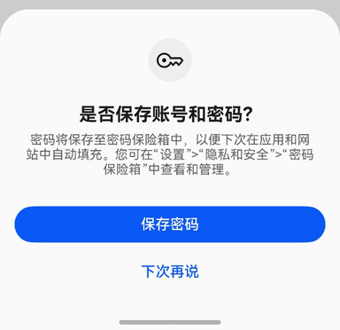
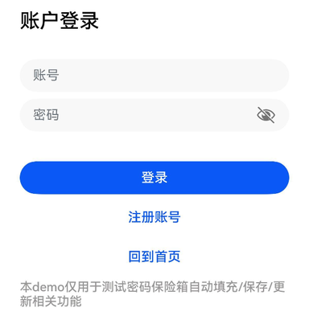
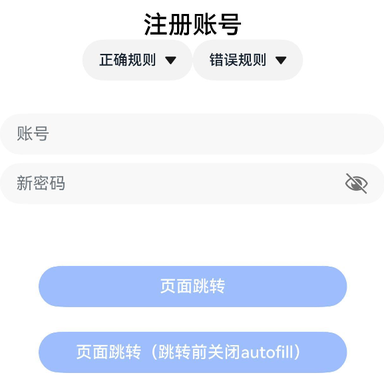

# 账号密码保存

更新时间：2026-03-20 09:49:50

来源：https://developer.huawei.com/consumer/cn/doc/harmonyos-guides/passwordvault-save-acc-password

密码保险箱在应用的登录、注册、修改密码等场景中具备自动保存用户名和密码的能力。

 保存后的用户名和密码可以在下次登录、修改密码时自动填充到界面上的对应输入框，用户可以在密码保险箱内对已保存的用户名和密码进行查看，修改，添加备注，删除。

 当应用界面触发账号密码自动保存时，若密码保险箱中不存在同应用下的相同账号，系统将弹出账号密码保存提示框，用户点击“保存密码”按钮后，本次使用的账号和密码将被保存至密码保险箱。

 

 当应用触发账号登录或注册时，均可触发保存功能，以下分别介绍两种布局的标准适配场景。

 **触发条件及注意事项：**


## 账号密码登录


示例代码如下：
```text
@Entry
@Component
struct LoginExample {
  pathInfos: NavPathStack = new NavPathStack();
  @State ReserveAccount: string = '';
  @State ReservePassword: string = '';

  @Builder
  PageMap(name: string) {
    if (name === 'home_page') {
      HomePage()
    }
  }

  build() {
    Navigation(this.pathInfos) {
      Column({ space: 16 }) {
        Text("账户登录").commonTitleStyles()

        TextInput({ placeholder: '用户名' })
          .commonInputStyles()
          .type(InputType.USER_NAME) // 账号框使用USER_NAME属性
          .onChange((value: string) => {
            this.ReserveAccount = value;
          })

        TextInput({ placeholder: '密码' })
          .showPasswordIcon(true)
          .commonInputStyles()
          .type(InputType.Password) // 密码框使用Password属性
          .onChange((value: string) => {
            this.ReservePassword = value;
          })

        Button('登录')
          .width('100%')
          .enabled((this.ReserveAccount !== '') && (this.ReservePassword !== ''))
          .onClick(() => {
            this.pathInfos.pushPathByName('home_page', null)
          })
      }
      .padding(16)
    }
    .navDestination(this.PageMap)
    .height('100%')
    .width('100%')
  }
}

@Component
struct HomePage {
  pathInfos: NavPathStack = new NavPathStack();

  build() {
    NavDestination() {
      Column() {
        Text("Home Page").commonTitleStyles()
      }.width('100%').height('100%')
    }.title("Home Page")
    .onReady((context: NavDestinationContext) => {
      this.pathInfos = context.pathStack;
    })
  }
}

@Extend(Text)
function commonTitleStyles() {
  .fontSize(24)
  .fontColor('#000000')
  .fontWeight(FontWeight.Medium)
  .margin({ top: 24, bottom: 16 })
}

@Extend(TextInput)
function commonInputStyles() {
  .placeholderColor(0x182431)
  .width('100%')
  .opacity(0.6)
  .placeholderFont({ size: 16, weight: FontWeight.Regular })
  .margin({ top: 16 })
}

@Extend(Button)
function commonButtonStyles() {
  .width('100%')
  .height(40)
  .borderRadius(20)
  .margin({ top: 24 })
}
```


## 账号密码注册


示例代码如下：
```text
@Entry
@Component
struct RegisterExample {
  pathInfos: NavPathStack = new NavPathStack();
  @State ReserveAccount: string = '';
  @State ReservePassword: string = '';
  @State enableAutoFill: boolean = true;

  onBackPress() {
    // 当非成功登录、返回等页面跳转时，将enableAutoFill设置为false，密码保险箱将不启用自动填充功能
    this.enableAutoFill = false;
    return false;
  }

  @Builder
  PageMap(name: string) {
    if (name === 'register_result_page') {
      RegisterResultPage()
    }
  }

  build() {
    Navigation(this.pathInfos) {
      Column() {
        Text("注册账号")
          .commonTitleStyles()

        TextInput({ placeholder: '用户名' })
          .commonInputStyles()
          .type(InputType.USER_NAME) // 账号框使用USER_NAME属性
          .onChange((value: string) => {
            this.ReserveAccount = value;
          })

        TextInput({ placeholder: '新密码' })
          .showPasswordIcon(true)
          .commonInputStyles()
          .type(InputType.NEW_PASSWORD) // 密码框使用NEW_PASSWORD属性，可以触发生成强密码。
          .enableAutoFill(this.enableAutoFill)
          .passwordRules('begin:[upper],special:[yes],len:[maxlen:32,minlen:12]')
          .onChange((value: string) => {
            this.ReservePassword = value;
          })

        Button('页面跳转')
          .commonButtonStyles()
          .enabled((this.ReserveAccount !== '') && (this.ReservePassword !== ''))
          .onClick(() => {
            this.pathInfos.pushPathByName('register_result_page', null)
          })

        Button('页面跳转（跳转前关闭autofill）')
          .commonButtonStyles()
          .enabled((this.ReserveAccount !== '') && (this.ReservePassword !== ''))
          .onClick(() => {
            this.enableAutoFill = false;
            this.pathInfos.pushPathByName('register_result_page', null)
          })
      }
    }
    .navDestination(this.PageMap)
    .height('100%')
    .width('100%')
  }
}

@Component
struct RegisterResultPage {
  pathInfos: NavPathStack = new NavPathStack();

  build() {
    NavDestination() {
      Column() {
        Text("Result Page").commonTitleStyles()
      }.width('100%').height('100%')
    }.title("Result Page")
    .onReady((context: NavDestinationContext) => {
      this.pathInfos = context.pathStack;
    })
  }
}

@Extend(Text)
function commonTitleStyles() {
  .fontSize(24)
  .fontColor('#000000')
  .fontWeight(FontWeight.Medium)
  .margin({ top: 24, bottom: 16 })
}

@Extend(TextInput)
function commonInputStyles() {
  .placeholderColor(0x182431)
  .width('100%')
  .opacity(0.6)
  .placeholderFont({ size: 16, weight: FontWeight.Regular })
  .margin({ top: 16 })
}

@Extend(Button)
function commonButtonStyles() {
  .width('100%')
  .height(40)
  .borderRadius(20)
  .margin({ top: 24 })
}
```
