# 网页接入密码保险箱

更新时间：2026-03-09 02:50:43

来源：https://developer.huawei.com/consumer/cn/doc/harmonyos-guides/arkweb-access-password-safe

网页中的登录表单，登录成功后，用户可将用户名和密码保存到系统密码保险箱中。再次打开该网页时，密码保险箱可以提供用户名、密码的自动填充。


## 手机使用场景

以下以[https://developer.huawei.com/](https://developer.huawei.com/)网站为例： 在网站中输入用户名、密码，登录成功后，ArkWeb会提示将用户名和密码保存到密码保险箱中。
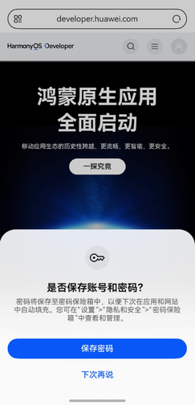
再次打开相同的网站，点击用户名或者密码框中时，会弹出密码保险箱的填充提示。
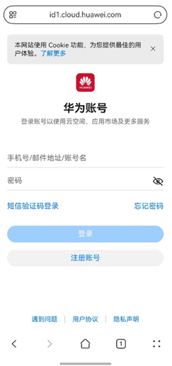
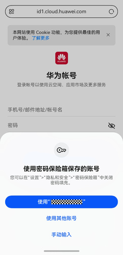
可以选择提示框中的用户名，通过认证，就能直接在网页中填入之前保存的用户名、密码。
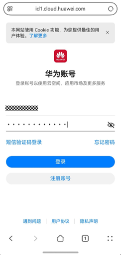
点击“使用其他账号”，选择密码保险箱中保存的其他账号。认证后在网页中填入选择的用户名、密码。
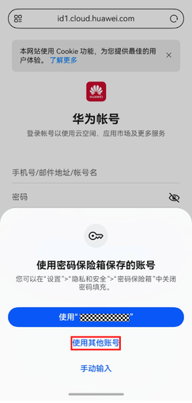
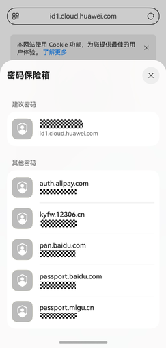
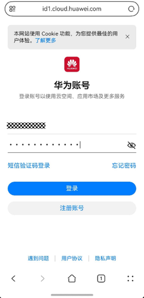
点击“手动输入”或者提示框之外的地方，会弹出小艺输入法，会提示可用于密码填充的用户名和钥匙图标。 点击用户名可触发在网页中填入用户名、密码；点击钥匙图标，进入选择账号的界面。
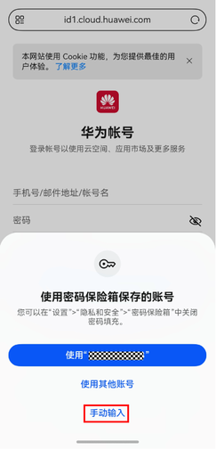
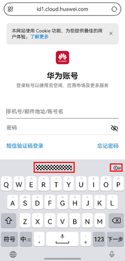


## 2in1使用场景

以下以[https://developer.huawei.com/](https://developer.huawei.com/)网站为例： 在网站中输入用户名、密码，登陆成功后，ArkWeb会提示将用户名和密码保存到密码保险箱中。
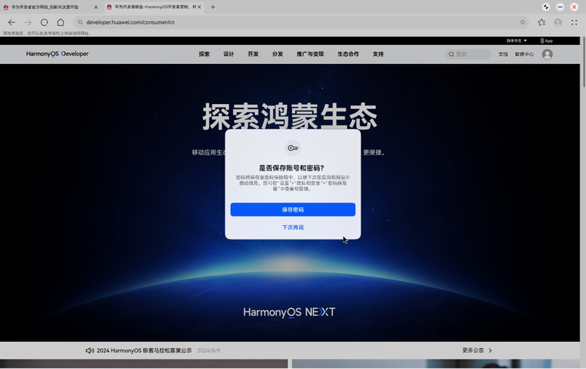
再次打开相同的网站，点击用户名或者密码框中时，会弹出密码保险箱的下拉框。
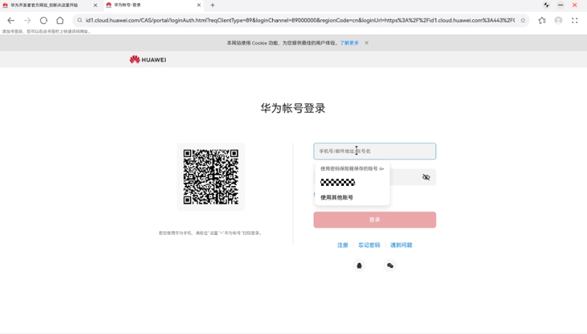
选择下拉框中的用户名，通过认证，就能直接在网页中填入之前保存的用户名、密码。
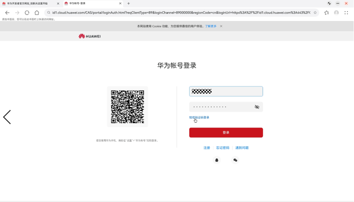
也可以点击下拉框中的“使用其他账号”，选择密码保险箱中保存的其他账号。认证后在网页中填入选择的用户名、密码。
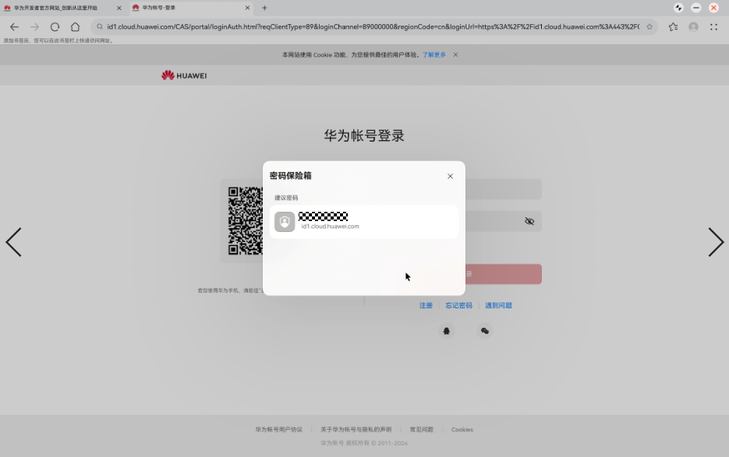

## 网页密码保存规格

1、ArkWeb依赖密码表单提交成功后，触发页面跳转到其他页面，才能触发密码保存。 2、Native应用通过ArkWeb实现H5登入，登录成功后请勿立即销毁ArkWeb实例，否则将无法提示密码保存。

## 网页密码表单规格

ArkWeb使用Chromium智能算法，自动识别网页中的用户名、密码元素。算法对用户名、密码表单的设计，有一定的约束。

## 推荐的密码登录表单

使用静态的登录页面或登录表单元素，而不是通过js脚本在页面中动态插入、等表单元素。  用户名密码输入框均使用元素实现，并集成在同一个内，默认可编辑，登录场景有且最多有一个type="password"类型的元素。  点击按钮触发登录，登录成功后，应当触发跳转到新的页面。  用户名框携带autocomplete=“username”，携带id或name属性，并采用如下建议的值，便于算法推断用户名元素：
```text
const char* const kUsernameLatin[] = {
    "gatti",      "uzantonomo",   "solonanarana",    "nombredeusuario",
    "olumulo",    "nomenusoris",  "enwdefnyddiwr",   "nomdutilisateur",
    "lolowera",   "notandanafn",  "nomedeusuario",   "vartotojovardas",
    "username",   "ahanjirimara", "gebruikersnaam",  "numedeutilizator",
    "brugernavn", "benotzernumm", "jinalamtumiaji",  "erabiltzaileizena",
    "brukernavn", "benutzername", "sunanmaiamfani",  "foydalanuvchinomi",
    "mosebedisi", "kasutajanimi", "ainmcleachdaidh", "igamalomsebenzisi",
    "nomdusuari", "lomsebenzisi", "jenengpanganggo", "ingoakaiwhakamahi",
    "nomeutente", "namapengguna"};

const char* const kUserLatin[] = {
    "user",   "wosuta",   "gebruiker",  "utilizator",
    "usor",   "notandi",  "gumagamit",  "vartotojas",
    "fammi",  "olumulo",  "maiamfani",  "cleachdaidh",
    "utent",  "pemakai",  "mpampiasa",  "umsebenzisi",
    "bruger", "usuario",  "panganggo",  "utilisateur",
    "bruker", "benotzer", "uporabnik",  "doutilizador",
    "numake", "benutzer", "covneegsiv", "erabiltzaile",
    "usuari", "kasutaja", "defnyddiwr", "kaiwhakamahi",
    "utente", "korisnik", "mosebedisi", "foydalanuvchi",
    "uzanto", "pengguna", "mushandisi"};

const char* const kUsernameNonLatin[] = {
 "用户名", "کاتيجونالو", "用戶名", "የተጠቃሚስም",
 "логин", "اسمالمستخدم", "נאמען", "کاصارفکانام",
 "ユーザ名", "όνομα χρήστη", "brûkersnamme", "корисничкоиме",
 "nonitilizatè", "корисничкоиме", "ngaranpamaké", "ຊື່ຜູ້ໃຊ້",
 "användarnamn", "యూజర్పేరు", "korisničkoime", "пайдаланушыаты",
 "שםמשתמש", "ім'якористувача", "کارننوم", "хэрэглэгчийннэр",
 "nomedeusuário", "имяпользователя", "têntruynhập", "பயனர்பெயர்",
 "ainmúsáideora", "ชื่อผู้ใช้", "사용자이름", "імякарыстальніка", "lietotājvārds",
 "потребителскоиме", "uporabniškoime", "колдонуучунунаты", "kullanıcıadı",
 "පරිශීලකනාමය", "istifadəçiadı", "օգտագործողիանունը", "navêbikarhêner", "ಬಳಕೆದಾರಹೆಸರು",
 "emriipërdoruesit", "वापरकर्तानाव", "käyttäjätunnus", "વપરાશકર્તાનામ", "felhasználónév",
 "उपयोगकर्तानाम", "nazwaużytkownika", "ഉപയോക്തൃനാമം", "სახელი", "အသုံးပြုသူအမည်",
 "نامکاربری", "प्रयोगकर्तानाम", "uživatelskéjméno", "ব্যবহারকারীরনাম",
 "užívateľskémeno", "ឈ្មោះអ្នកប្រើប្រាស់"};

const char* const kUserNonLatin[] = {
 "用户", "użytkownik", "tagatafaʻaaogā", "دکارونکيعکس",
 "用戶", "užívateľ", "корисник", "карыстальнік",
 "brûker", "kullanıcı", "истифода", "អ្នកប្រើ",
 "ọrụ", "ተጠቃሚ", "באַניצער", "хэрэглэгчийн",
 "يوزر", "istifadəçi", "ຜູ້ໃຊ້", "пользователь",
 "صارف", "meahoʻohana", "потребител", "वापरकर्ता",
 "uživatel", "ユーザー", "מִשׁתַמֵשׁ", "ผู้ใช้งาน",
 "사용자", "bikaranîvan", "колдонуучу", "વપરાશકર્તા",
 "përdorues", "ngườidùng", "корисникот", "उपयोगकर्ता",
 "itilizatè", "χρήστης", "користувач", "օգտվողիանձնագիրը",
 "használó", "faoiúsáideoir", "შესახებ", "ব্যবহারকারী",
 "lietotājs", "பயனர்", "ಬಳಕೆದಾರ", "ഉപയോക്താവ്",
 "کاربر", "యూజర్", "පරිශීලක", "प्रयोगकर्ता", "användare",
 "المستعمل", "пайдаланушы", "အသုံးပြုသူကို", "käyttäjä"};

const char* const kTechnicalWords[] = {
    "uid",         "newtel",     "uaccount",   "regaccount",  "ureg",
    "loginid",     "laddress",   "accountreg", "regid",       "regname",
    "loginname",   "membername", "uname",      "ucreate",     "loginmail",
    "accountname", "umail",      "loginreg",   "accountid",   "loginaccount",
    "ulogin",      "regemail",   "newmobile",  "accountlogin"};

const char* const kWeakWords[] = {"id", "login", "mail"};
```

登录场景，密码框携带autocomplete=“current-password”。  用户名框下面紧挨密码框，中间不要插入其他元素（包括不可见的）。  静态页面中的用户名密码框不可见，则需要确保在静态页面中就存在，而不是跳转页面时插入密码表单。   【案例1】：
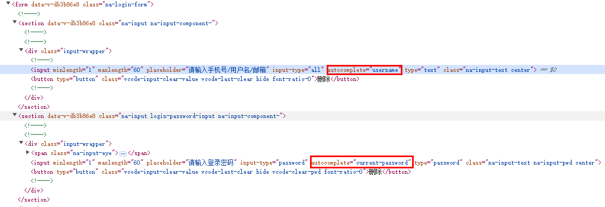
【案例2】：
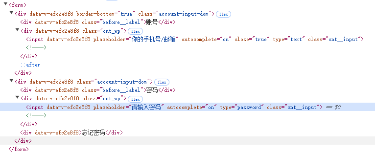

## 不支持自动填充的密码登录表单类型

初始页面内无用户名密码表单元素，点击登录跳转页面后，新增非类型的用户名密码表单。  密码输入框携带了autocomplete=“new-password”属性。  用户名输入框type="number"，验证码输入框type="number"，无密码输入框。  用户名和密码元素中间存在其他元素，算法推断出的用户名元素，不符合用户预期。  网页通过javascript脚本，变更了元素的焦点或者修改元素的value。  用户名元素上id、name、label内容中匹配到如下密码类型标识：
```text
const char* const kNegativeLatin[] = {
    "pin",    "parola",   "wagwoord",   "wachtwoord",
    "fake",   "parole",   "givenname",  "achinsinsi",
    "token",  "parool",   "firstname",  "facalfaire",
    "fname",  "lozinka",  "pasahitza",  "focalfaire",
    "lname",  "passord",  "pasiwedhi",  "iphasiwedi",
    "geslo",  "huahuna",  "passwuert",  "katalaluan",
    "heslo",  "fullname", "phasewete",  "adgangskode",
    "parol",  "optional", "wachtwurd",  "contrasenya",
    "sandi",  "lastname", "cyfrinair",  "contrasinal",
    "senha",  "kupuhipa", "katasandi",  "kalmarsirri",
    "password", "loluszais",  "tenimiafina",
    "second", "passwort", "middlename", "paroladordine",
    "codice", "pasvorto", "familyname", "inomboloyokuvula",
    "modpas", "salasana", "motdepasse", "numeraeleiloaesesi",
    "captcha"};

const char* const kNegativeNonLatin[] = {
    "fjalëkalim", "የይለፍቃል", "كلمهالسر", "գաղտնաբառ",
    "пароль", "পাসওয়ার্ড", "парола", "密码", "密碼",
    "დაგავიწყდათ", "κωδικόςπρόσβασης", "પાસવર્ડ", "סיסמה",
    "पासवर्ड", "jelszó", "lykilorð", "paswọọdụ",
    "パスワード", "ಪಾಸ್ವರ್ಡ್", "пароль", "ការពាក្យសម្ងាត់",
    "암호", "şîfre", "купуясөз", "ລະຫັດຜ່ານ",
    "slaptažodis", "лозинка", "पासवर्ड", "нууцүг",
    "စကားဝှက်ကို", "पासवर्ड", "رمز", "کلمهعبور",
    "hasło", "пароль", "лозинка", "پاسورڊ",
    "මුරපදය", "contraseña", "lösenord", "гузарвожа",
    "கடவுச்சொல்", "పాస్వర్డ్", "รหัสผ่าน", "пароль",
    "پاسورڈ", "mậtkhẩu", "פּאַראָל", "ọrọigbaniwọle"};
```

用户名元素的autocomplete="one-time-code"或者"cc-*"，或者id、name属性上能正则匹配到如下one-time-code或者信用卡标识：
```text
inline constexpr char16_t kOneTimePwdRe[] =
    u"one.?time|sms.?(code|token|password|pwd|pass)";

inline constexpr char16_t kCardCvcRe[] =
    u"verification|card.?identification|security.?code|card.?code"
    u"|security.?value"
    u"|security.?number|card.?pin|c-v-v"
    u"|código de segurança"  // pt-BR
    u"|código de seguridad"  // es-MX
    u"|karten.?prüfn"        // de-DE
    u"|(?:cvn|cvv|cvc|csc|cvd|ccv)"
    // We used to match "cid", but it is a substring of "cidade" (Portuguese for
    // "city") and needs to be handled carefully.
    u"|\\bcid\\b|cccid";
```

页面加载完成，的type属性不是"password"，点击登录才变成"password"类型。
