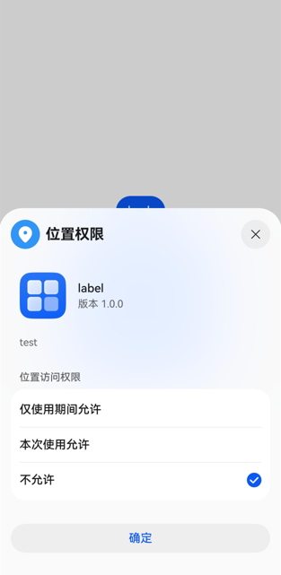

# 再次向用户申请授权

更新时间：2026-04-30 02:41:24

来源：https://developer.huawei.com/consumer/cn/doc/harmonyos-guides/request-user-authorization-second

当应用通过[requestPermissionsFromUser()](https://developer.huawei.com/consumer/cn/doc/harmonyos-references/js-apis-abilityaccessctrl#requestpermissionsfromuser9)拉起弹框[请求用户授权](https://developer.huawei.com/consumer/cn/doc/harmonyos-guides/request-user-authorization)时，如果用户拒绝授权，应用将无法再次通过requestPermissionsFromUser()拉起弹框。用户需要在系统设置中手动授权。

在“设置”应用中的路径如下：


- 路径一：设置 > 隐私与安全 > 权限类型（如位置信息） > 具体应用
- 路径二：设置 > 应用和元服务 > 某个应用

应用也可以通过调用[requestPermissionOnSetting()](https://developer.huawei.com/consumer/cn/doc/harmonyos-references/js-apis-abilityaccessctrl#requestpermissiononsetting12)，直接拉起权限设置弹框，引导用户授权。

效果展示：



以下示例代码展示了如何再次拉起弹框申请ohos.permission.APPROXIMATELY_LOCATION权限。


```text
import { abilityAccessCtrl, Context, common } from '@kit.AbilityKit';
import { BusinessError } from '@kit.BasicServicesKit';

// ···
          let atManager: abilityAccessCtrl.AtManager = abilityAccessCtrl.createAtManager();
          let context: Context = this.getUIContext().getHostContext() as common.UIAbilityContext;
          atManager.requestPermissionOnSetting(context, ['ohos.permission.APPROXIMATELY_LOCATION']).then((data: Array) => {
            console.info(`requestPermissionOnSetting success, result: ${data}`);
          }).catch((err: BusinessError) => {
            console.error(`requestPermissionOnSetting fail, code: ${err.code}, message: ${err.message}`);
          });
```
