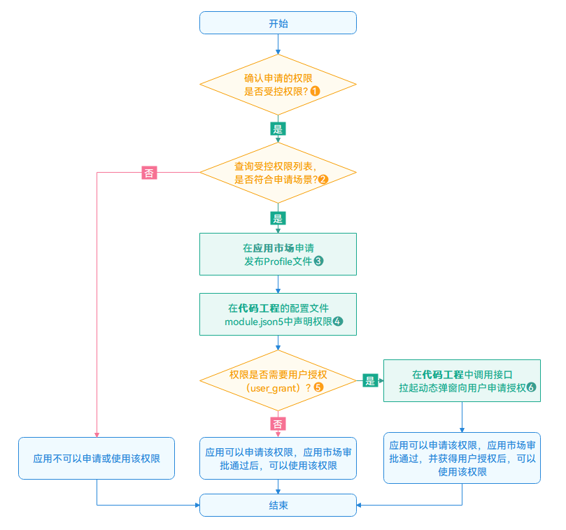

# 申请受限权限

更新时间：2026-04-28 03:31:56

来源：https://developer.huawei.com/consumer/cn/doc/harmonyos-guides/declare-permissions-in-acl

受限开放的权限通常是不允许三方应用申请的。如果有特殊场景需要使用，请提供相关申请材料到AppGallery Connect（简称为AGC）申请相应权限证书。
 
在申请前，请审视是否符合受限权限的使用场景。为避免应用的上架申请被驳回，开发者应优先使用Picker/控件等替代方案，仅少量符合特殊场景的应用被允许申请受限权限。
 

 
 
在应用上架时，AGC将根据应用的使用场景审核是否可以使用对应的受限权限。如检测到应用软件包涉及获取受限权限，应用开发者需为每个受限权限项填写相应的权限说明，并上传视频说明使用场景，详情请见[发布HarmonyOS应用](https://developer.huawei.com/consumer/cn/doc/app/agc-help-release-app-guide-0000002287176372)。
  

 
如果应用未申请相应的权限证书，却试图在配置文件中声明此类权限，将会导致应用安装失败。
  

#### 申请步骤

 
针对上图中的数字标注，补充说明如下：
 1. 开发者可根据[受限开放权限列表](https://developer.huawei.com/consumer/cn/doc/harmonyos-guides/restricted-permissions)，确认自己准备申请的权限，是否受限开放，仅受限开放权限需要经过AGC审核。

  受限开放权限申请将在限定的审核时长内处理，每个权限的审核时长可查询[受限开放权限列表](https://developer.huawei.com/consumer/cn/doc/harmonyos-guides/restricted-permissions)。

  审核结果将通过互动中心消息和邮件发送给您，请耐心等待。
2. 每个受限开放权限的介绍、可用场景及其建议方案均可参考[受限开放权限列表](https://developer.huawei.com/consumer/cn/doc/harmonyos-guides/restricted-permissions)。

  
> [!NOTE]
> 开发者 必须查询 受限开放权限列表 确认开发的应用是否符合使用场景，如果不符合要求，应用的上架申请将被驳回 。

3. 在[AGC](https://developer.huawei.com/consumer/cn/service/josp/agc/index.html)侧申请Profile文件并同步申请使用相应受限权限。

  申请的Profile文件，将用于后续的应用签名信息配置。申请Profile的操作需在AGC完成，详细步骤请参阅[申请发布Profile](https://developer.huawei.com/consumer/cn/doc/app/agc-help-release-profile-0000002248341090)。

  应用因特殊场景要求使用受限开放权限，请务必在申请发布Profile“添加Profile页面”时，申请使用相应权限，否则应用将在审核时被驳回。

  

 

  
请确保应用申请受限开放权限时提供的场景和功能信息准确。
4. 如果应用内使用的受限开放权限超出您申请的范围，或申请权限后使用的功能和场景超出可使用的范围，将影响您的应用上架。
5. 在配置文件中[声明权限](https://developer.huawei.com/consumer/cn/doc/harmonyos-guides/declare-permissions)。
6. 通过[权限列表](https://developer.huawei.com/consumer/cn/doc/harmonyos-guides/restricted-permissions)中的“**授权方式**”字段，判断是否需要用户授权。
7. （可选）如果权限的授权方式为user_grant（用户授权）时，还需要通过弹窗[向用户申请权限](https://developer.huawei.com/consumer/cn/doc/harmonyos-guides/request-user-authorization)。
