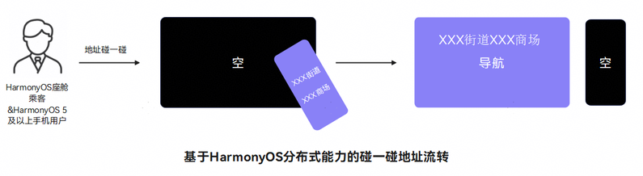

# 地址流转至车机

更新时间：2026-04-30 09:02:20

来源：https://developer.huawei.com/consumer/cn/doc/harmonyos-guides/car-address-hop

将手机应用的地址文本流转至车机指定地图应用的能力。
  

#### 场景介绍

碰一碰地址流转：用户在手机地址文本页面与车机中控屏指定区域碰一碰后，将手机上的地址数据流转至车机的地图应用，发起地址搜索。
 



 
  

#### 接口说明
 
| 接口名 | 描述 |
| --- | --- |
| accessibilityTextHint(value: string): T | 设置辅助功能文本提示。 |
 
 
  

#### 参数value说明

value是一个Json格式的字符串，具体属性说明如下：
  
| 属性 | 描述 |
| --- | --- |
| type | 文本类型，必须是“location”。 |
| groupId | 地址编组ID，用于多个Text文本分组，同一组的地址文本流转到车机后会自动拼接到一起。 |
| index | 地址索引，用来标识同一组地址文本的顺序。同一组的地址文本流转到车机后会按照index由小到大拼接成一个完整地址。 例如：'XXX街道' + 'XXX商场' = 'XXX街道XXX商场' |
 
 
给手机地址文本（Text）设置accessibilityTextHint属性后即可使用地址流转能力。
 
  

#### 开发步骤
1. 能力配置。

  碰一碰地址流转场景下，metadata的name取值为carHopCapability，value取值应为**carHopAddress**，具体配置请参考[配置能力](https://developer.huawei.com/consumer/cn/doc/harmonyos-guides/car-preparations#配置能力)。示例代码如下所示：

  
```text
"metadata": [
  {
    "name": "carHopCapability",
    "value": "carHopAddress"
  }
]
```

2. 定义accessibilityTextHint的value值。

  
```json
const hintContentValue = JSON.stringify({
   type: 'location', // 类型，必须是 'location'
   groupId: 1, // 分组id
   index: 2 // 索引
 });
```

3. 给地址文本设置accessibilityTextHint属性。

  
```json
Text('xxx一路')
   .fontSize(20)
   .fontWeight(FontWeight.Bold)
   .accessibilityTextHint(hintContentValue)

// 单地址场景
Text('xxx二路')
   .accessibilityTextHint(JSON.stringify({ type: 'location' }))
 
// 多地址场景
Text('xxx商场')
   .accessibilityTextHint(JSON.stringify({ type: 'location', groupId: 1, index: 1, }))
 Text('xxx街')
   .accessibilityTextHint(JSON.stringify({ type: 'location', groupId: 1, index: 0, }))
```
