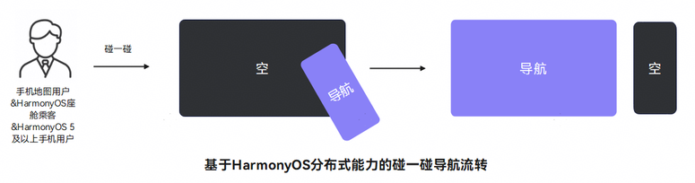
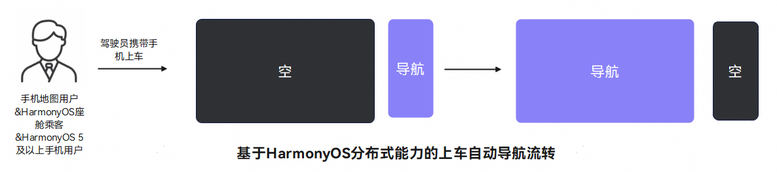
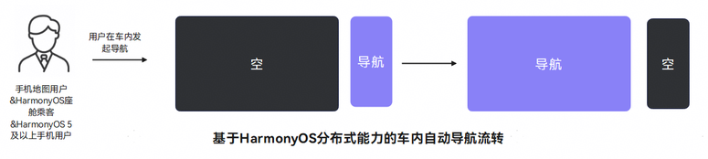
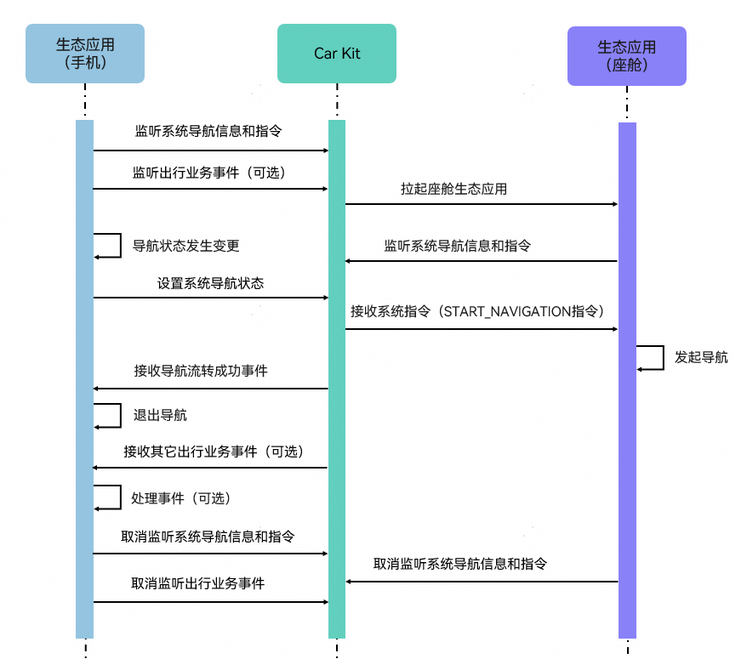

# 导航流转至车机

更新时间：2026-04-30 09:02:20

来源：https://developer.huawei.com/consumer/cn/doc/harmonyos-guides/car-navi-hop

## 场景介绍

导航流转至车机包含如下几个常见使用场景： 碰一碰导航流转：用户在手机地图的指定页面中（地图选点页面、规划路线页面、驾车导航页面），与车机中控屏指定区域碰一碰后，将手机上的导航数据流转至车机。

上车导航自动流转：用户使用手机地图应用发起驾车导航后上车，手机上的导航数据会自动流转至车机。

车内导航自动流转：用户在车内，使用手机地图应用发起驾车导航，手机上的导航数据会自动流转至车机。


## 接口说明

导航流转至车机使用接口如下：
| 接口名 | 描述 |
| --- | --- |
| [registerSystemNavigationListener](https://developer.huawei.com/consumer/cn/doc/harmonyos-references/car-navigationinfomgr#registersystemnavigationlistener) | 注册监听系统导航信息和指令。 |
| [on('smartMobilityEvent')](https://developer.huawei.com/consumer/cn/doc/harmonyos-references/car-smartmobilitycommon#onsmartmobilityevent) | 注册智慧出行业务的事件监听。 |
| [updateNavigationStatus](https://developer.huawei.com/consumer/cn/doc/harmonyos-references/car-navigationinfomgr#updatenavigationstatus) | 设置导航状态，包含地图状态、导航类型、导航目的地、导航途经点、路线和主题等。 |
| [unregisterSystemNavigationListener](https://developer.huawei.com/consumer/cn/doc/harmonyos-references/car-navigationinfomgr#unregistersystemnavigationlistener) | 取消注册监听系统导航信息和指令。 |
| [off('smartMobilityEvent')](https://developer.huawei.com/consumer/cn/doc/harmonyos-references/car-smartmobilitycommon#offsmartmobilityevent) | 取消注册智慧出行业务的事件监听。 |


## SmartMobilityEvent事件名说明

SmartMobilityEvent事件名（eventName）取值如下：
| 事件名 | 描述 |
| --- | --- |
| hopSucceeded | 流转成功事件。 |


## 开发流程



## 开发步骤

能力配置。 请参考[配置能力](https://developer.huawei.com/consumer/cn/doc/harmonyos-guides/car-preparations#配置能力)进行配置。导航流转至车机场景下，metadata的name取值为carHopCapability。对应的value值根据不同的使用场景取值如下： 碰一碰导航流转场景下，value取值为**carHopNavi**。 上车导航自动流转场景下，value取值为**getOnCarNavi**。 车内导航自动流转场景下，value取值为**insideCarNavi**。 导入相关模块。
```text
import { navigationInfoMgr, smartMobilityCommon } from '@kit.CarKit';
import { hilog } from '@kit.PerformanceAnalysisKit';
```

监听系统导航信息和指令。 从5.1.0(18)开始，新增searchPOI指令，用于搜索POI信息。 在打开地图应用时，地图应用需要注册监听系统导航信息和指令，方便地图接收系统指令（如：停止导航）用于对应的业务逻辑处理。
```text
// 实现SystemNavigationListener接口
class Listener implements navigationInfoMgr.SystemNavigationListener {
  // 实现onQueryNavigationInfo方法
  onQueryNavigationInfo(query: navigationInfoMgr.QueryType,
    args: Record): Promise {
    // 返回导航信息给系统
    return new Promise(resolve => {
      let ret: navigationInfoMgr.ResultData = {
        code: 1001,
        message: 'message test1',
        data: args
      };
      resolve(ret);
    });
  }

  // 实现onReceiveNavigationCmd方法
  onReceiveNavigationCmd(command: navigationInfoMgr.CommandType,
    args: Record): Promise {
    // 接收并处理系统导航指令
    return new Promise(resolve => {
      let ret: navigationInfoMgr.ResultData = {
        code: 1002,
        message: 'message test2',
        data: args
      };
      resolve(ret);
    });
  }
}

try {
  // 获取NavigationController实例
  let navInfoController: navigationInfoMgr.NavigationController = navigationInfoMgr.getNavigationController();
  // 注册监听系统导航信息和指令
  navInfoController.registerSystemNavigationListener(new Listener());
} catch (e) {
  // 捕获接口调用异常时的错误码并做相应处理
  hilog.error(0x0000, 'testTag', `register system navigation listener error, error code: ${e?.code}`);
}
```

（可选）监听智慧出行业务事件。 地图应用在监听系统导航信息和指令的同时，还可以注册智慧出行业务的事件监听，方便地图应用接收智慧出行业务发送的事件通知（如：流转成功事件），用于对应的业务逻辑处理。
```text
// 智慧出行业务的事件回调函数
const callBack = (event: smartMobilityCommon.SmartMobilityEvent) => {
  hilog.info(0x0000, 'testTag', 'Received smart mobility event: ', JSON.stringify(event));
  if (event.eventName === 'hopSucceeded' && event.type === smartMobilityCommon.SmartMobilityType.CAR_HOP) {
    // 地图应用处理流转成功事件（如退出导航等）
    // ...
  }
};

try {
  // 业务类型
  let types: smartMobilityCommon.SmartMobilityType[] = [smartMobilityCommon.SmartMobilityType.CAR_HOP];
  // 获取SmartMobilityAwareness实例
  let awareness: smartMobilityCommon.SmartMobilityAwareness = smartMobilityCommon.getSmartMobilityAwareness();
  // 注册智慧出行业务的事件监听
  awareness.on('smartMobilityEvent', types, callBack);
} catch (e) {
  // 捕获接口调用异常时的错误码并做相应处理
  hilog.error(0x0000, 'testTag', `register smart mobility event listener error, error code: ${e?.code}`);
}
```

设置系统导航状态。 用户在地图上每次选择目的地、途经点或者变更导航信息时，地图应用都需要设置导航状态，将当前最新的导航状态保存到Car Kit中，系统会将最新的导航状态数据流转到车机上。
```text
// 设置目的地
let location: navigationInfoMgr.Location = {
  name: 'location',
  coordType: navigationInfoMgr.LocationCoordType.GCJ02,
  longitude: 0.000000000000001,
  latitude: 1.000000000000001,
  altitude: 2.000000000000001
};
// 设置途经点（可选）
let passPoint0: navigationInfoMgr.Location = {
  name: 'passPoint0',
  coordType: navigationInfoMgr.LocationCoordType.GCJ02,
  longitude: 29.53851890563965,
  latitude: 16.50643920898438,
  altitude: 3.00015949516846
};
let passPoint1: navigationInfoMgr.Location = {
  name: 'passPoint1',
  coordType: navigationInfoMgr.LocationCoordType.WGS84,
  longitude: 4.4445874651238,
  latitude: 5.55565329843751,
  altitude: 6.66641578943265
};
// 设置导航状态属性
let navigationStatus: navigationInfoMgr.NavigationStatus = {
  status: navigationInfoMgr.MapStatus.NAVIGATION,
  naviType: navigationInfoMgr.NaviType.DRIVING,
  destLocation: location,
  passPoint: [passPoint0, passPoint1],
  routeIndex: 101,
  customData: 'customData',
  routePreference: [
    navigationInfoMgr.RoutePreference.TIME_FIRST,
    navigationInfoMgr.RoutePreference.MAIN_ROAD_FIRST
  ],
  theme: navigationInfoMgr.ThemeType.LIGHT
};

try {
  // 获取 NavigationController
  let navInfoController: navigationInfoMgr.NavigationController = navigationInfoMgr.getNavigationController();
  navInfoController.updateNavigationStatus(navigationStatus);
} catch (e) {
  // 捕获接口调用异常时的错误码并做相应处理
  hilog.error(0x0000, 'testTag', `update navigation status error, error code: ${e?.code}`);
}
```

取消监听。 在地图应用退出时，需要取消之前注册的监听，减少系统不必要的资源消耗。 取消注册监听系统导航信息和指令：
```text
try {
  // 获取NavigationController实例
  let navInfoController: navigationInfoMgr.NavigationController = navigationInfoMgr.getNavigationController();
  // 取消注册监听系统导航信息和指令
  navInfoController.unregisterSystemNavigationListener();
} catch (e) {
  // 捕获接口调用异常时的错误码并做相应处理
  hilog.error(0x0000, 'testTag', `unregister system navigation listener error, error code: ${e?.code}`);
}
```

取消注册智慧出行业务的事件监听，可以选择下面2种方法中的一种： **方法1**：**不传入callback（可选参数），会取消该type下的所有监听。** 示例代码：
```text
try {
  // 业务类型
  let types: smartMobilityCommon.SmartMobilityType[] = [smartMobilityCommon.SmartMobilityType.CAR_HOP];
  // 获取SmartMobilityAwareness实例
  let awareness: smartMobilityCommon.SmartMobilityAwareness = smartMobilityCommon.getSmartMobilityAwareness();
  // 解注册智慧出行业务的事件监听
  awareness.off('smartMobilityEvent', types);
} catch (e) {
  // 捕获接口调用异常时的错误码并做相应处理
  hilog.error(0x0000, 'testTag', `unregister smart mobility event listener error, error code: ${e?.code}`);
}
```

**方法2：传入callback（可选参数），会取消指定的监听。** 示例代码：
```text
try {
  // 业务类型
  let types: smartMobilityCommon.SmartMobilityType[] = [smartMobilityCommon.SmartMobilityType.CAR_HOP];
  // 获取SmartMobilityAwareness实例
  let awareness: smartMobilityCommon.SmartMobilityAwareness = smartMobilityCommon.getSmartMobilityAwareness();
  // 解注册智慧出行业务的事件监听，callback为步骤4中定义的callback
  awareness.off('smartMobilityEvent', types, callBack);
} catch (e) {
  // 捕获接口调用异常时的错误码并做相应处理
  hilog.error(0x0000, 'testTag', `unregister smart mobility event listener error, error code: ${e?.code}`);
}
```
