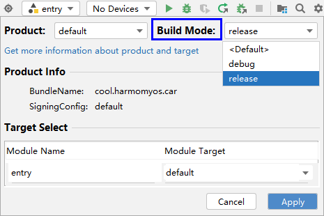

# 开发准备

更新时间：2026-04-20 06:34:33

来源：https://developer.huawei.com/consumer/cn/doc/harmonyos-guides/car-preparations

应用在使用Car Kit能力前，开发者需要完成的配置：配置编译模式、配置权限、配置能力。


## 配置编译模式

在打包应用时，请在DevEco Studio中，点击右上角

图标，将编译模式修改为“release”，然后点击右下角的“Apply”即可。


## 配置权限

Car Kit为开发者提供了两类接口：导航类接口和出行互联类接口，使用对应接口需要分别配置相应的权限。 使用导航类接口需要配置ohos.permission.ACCESS_SERVICE_NAVIGATION_INFO权限。 使用出行互联类接口需要配置ohos.permission.ACCESS_CAR_DISTRIBUTED_ENGINE权限。 开发者需要在entry/src/main路径下的应用配置文件module.json5中配置所需权限。示例代码如下所示：
```text
{
  "module": {
    "requestPermissions": [
      {
        "name": "ohos.permission.ACCESS_CAR_DISTRIBUTED_ENGINE"
      },
      {
        "name": "ohos.permission.ACCESS_SERVICE_NAVIGATION_INFO"
      }
    ]
  }
}
```


## 配置能力

开发者需要在entry/src/main路径下的应用配置文件module.json5的abilities数组中配置导航流转能力或HiCar能力，具体步骤如下： 在[skills](https://developer.huawei.com/consumer/cn/doc/harmonyos-guides/module-configuration-file#skills标签)中配置导航信息服务的actions。
> [!NOTE]
> 生态应用如有其它skills配置，请避免直接修改现有的配置，需在skills数组内追加。


```text
"skills": [
  {
    "entities": [
      "entity.system.default"
    ],
    "actions": [
      "action.navigation.infoservice"
    ]
  },
  // 其它 skills 配置
  {
    // ...
  }
]
```

在元数据信息metadata中配置导航流转能力或HiCar能力。具体示例代码如下所示：
```text
{
  "module": {
    "abilities": [
     {
        "name": "xxxx",
        "srcEntry": "xxxx",
        "description": "xxxx",
        "skills": [
          {
            "entities": [
              "entity.system.home"
            ],
            "actions": [
              "action.system.home"
            ]
          },
          {
            "entities": [
              "entity.system.default"
            ],
            "actions": [
              "action.navigation.infoservice"
            ]
          }
        ],
        "metadata": [
          {
            "name" : "carHopCapability",
            "value" : "carHopNavi,getOnCarNavi,insideCarNavi,getOffCarNavi"
          },
          {
            "name" : "hiCarCapability",
            "value" :"basicNavi,shortcutOper,multiScreenUI,mapUIOper,updateNaviStatus,searchPOI"
          }
        ]
      }
    ]
  }
}
```

metadata的name可选值：carHopCapability、hiCarCapability。 name取值为carHopCapability时，代表适配了导航流转的能力。对应的value值根据不同的业务场景取值如下：
| value | 场景 |
| --- | --- |
| carHopNavi | 碰一碰导航流转，不可与碰一碰地址流转并存。 |
| carHopAddress | 碰一碰地址流转，不可与碰一碰导航流转并存。 |
| getOnCarNavi | 上车导航自动流转。 |
| insideCarNavi | 车内导航自动流转。 |
| getOffCarNavi | 下车步行导航流转。 |

name取值为hiCarCapability时，代表适配了HiCar的能力。对应的value值根据不同的业务场景取值如下：
| value | 场景 |
| --- | --- |
| basicNavi | 适配基础导航功能，对应指令：            1. START_NAVIGATION            2. STOP_NAVIGATION |
| shortcutOper | 适配快捷操作功能，对应指令：            1. GO_HOME            2. GO_TO_COMPANY |
| multiScreenUI | 多屏显示适配功能，对应指令：            1. START_MAP_LAYER            2. STOP_MAP_LAYER |
| mapUIOper | 地图UI控制功能，对应指令：            1. ZOOM_IN_MAP            2. ZOOM_OUT_MAP            3. CHANGE_THEME |
| updateNaviStatus | 适配地图状态和地图元数据，对应指令：            1. START_UPDATE_NAVIGATION_STATUS            2. STOP_UPDATE_NAVIGATION_STATUS |
| searchPOI | 适配地址搜索功能，对应指令：            SEARCH_POI |

关于指令的更多详情请查阅[CommandType](https://developer.huawei.com/consumer/cn/doc/harmonyos-references/car-navigationinfomgr#commandtype)。
