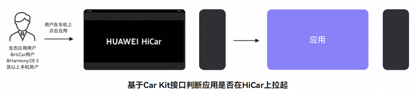

# 主动获取HiCar的连接状态

更新时间：2026-04-20 06:34:33

来源：https://developer.huawei.com/consumer/cn/doc/harmonyos-guides/car-check-application-start

#### 场景介绍

生态应用可以通过主动获取智慧出行连接状态接口来获取HiCar的连接状态（如：判断应用是否在HiCar上拉起）。





#### 接口说明

获取HiCar连接状态的接口如下：

| 接口名 | 描述 |
| --- | --- |
| getSmartMobilityStatus | 获取智慧出行连接状态。 |


#### SmartMobilityInfo事件名说明

SmartMobilityInfo状态（status）取值如下：

| 编号 | 状态 | 描述 |
| --- | --- | --- |
| 0 | IDLE | 空闲态。 |
| 1 | RUNNING | 运行态。 |


SmartMobilityInfo业务类型（type）取值如下：

| 编号 | 业务类型 | 描述 |
| --- | --- | --- |
| 0 | HICAR | HiCar。 |
| 1 | SUPER_LAUNCHER | 超级桌面。 |
| 2 | CAR_HOP | 流转。 |


SmartMobilityInfo业务数据（data）参数如下：

| 编号 | 参数 | 描述 |
| --- | --- | --- |
| 0 | DEVICE_TYPE | 设备类型。 |
| 1 | DISPLAY_ID | 业务所在的虚拟屏ID。 |
| 2 | IS_PHONE_DESKTOP | 当前是否在HiCar上显示手机桌面（仅在HiCar业务中展示）。 |


#### 开发步骤
1. 导入相关模块。

  
```text
import { smartMobilityCommon } from '@kit.CarKit';
import { UIAbility } from '@kit.AbilityKit';
import { hilog } from '@kit.PerformanceAnalysisKit';
```

2. 查询智慧出行连接状态。

  应用在适配HiCar时，可以实时查询接口来获取智慧出行连接状态（如：判断应用是否在HiCar上）。

  
```text
export default class EntryAbility extends UIAbility {
  isAppOnHiCar(): boolean {
    try {
      // 应用所在的屏幕id
      const currentDisplayId = this.context.config.displayId;
      // 获取SmartMobilityAwareness实例
      let awareness: smartMobilityCommon.SmartMobilityAwareness = smartMobilityCommon.getSmartMobilityAwareness();
      // 获取当前智慧出行连接状态
      let info: smartMobilityCommon.SmartMobilityInfo =
        awareness.getSmartMobilityStatus(smartMobilityCommon.SmartMobilityType.HICAR);
      const deviceDisplayId = Number(info.data["DISPLAY_ID"]);
      if (currentDisplayId === deviceDisplayId) {
        // 表示应用在对应的设备屏幕上
        hilog.info(0x0000, 'testTag', 'app in on device screen');
        return true;
      }
    } catch (e) {
      // 捕获接口调用异常时的错误码并做相应处理
      hilog.error(0x0000, 'testTag', `get smart mobility status error, error code: ${e?.code}`);
    }
    return false;
  }
}
```
